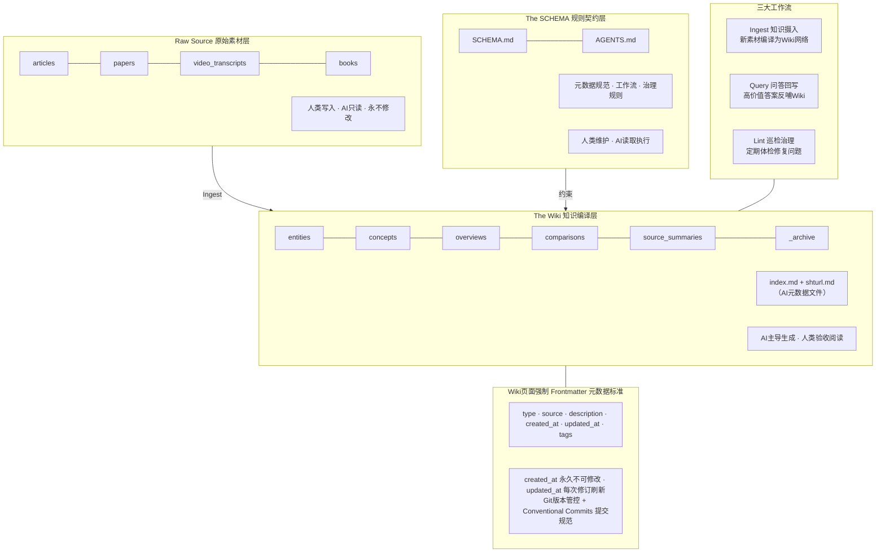

# LLM-Wiki 个人AI知识库

基于 Karpathy 提出的 LLM-Wiki 框架，结合 Obsidian 落地实践的个人编译型知识库。

## 核心理念

不是让AI无脑生成一堆笔记，而是建立「原始素材 - AI加工库 - 协作规则」三层体系，配合 Ingest / Query / Lint 三个固定动作，构建自己可阅读、可用于决策的个人Wiki知识库。

## 三层架构

| 层级 | 目录 | 说明 |
|---|---|---|
| Raw Source | `raw/` | 原始资料，人类写入，AI只读，永不修改 |
| The Wiki | `wiki/` | AI提炼的结构化知识网络，日常查阅问答的核心 |
| The SCHEMA | `SCHEMA.md` | AI协作规则，定义结构、流程、输出规范 |

### 整体架构



## 三大工作流

- **Ingest**：喂资料给AI，自动更新10-15个相关页面
- **Query**：提问得答案，好答案直接回写成Wiki
- **Lint**：定期体检，找矛盾、过时内容、孤立页面

## 快速开始

1. 用 Obsidian 打开本目录作为 Vault
2. 阅读 `SCHEMA.md` 了解完整规则
3. 将学习资料放入 `raw/` 对应目录
4. 复制 `templates/ingest-prompt.md` 指令，连同素材发给AI，执行第一次 Ingest
5. 人工验收AI生成的Wiki页面
6. 每周执行一次 Lint 巡检

## 目录结构

```
llm-wiki-vault/
├─ AGENTS.md             # Agent自动读取入口
├─ SCHEMA.md             # 主规则文件
├─ README.md             # 本文件
├─ .gitignore
├─ .git/hooks/commit-msg # Commit校验钩子
│
├─ raw/                  # 原始素材库
│   ├─ articles/
│   ├─ papers/
│   └─ video_transcripts/
│
├─ wiki/                 # AI编译知识库
│   ├─ _archive/         # 归档目录
│   ├─ entities/
│   ├─ concepts/
│   ├─ overviews/
│   ├─ comparisons/
│   ├─ source_summaries/
│   ├─ index.md          # 全局索引
│   └─ shturl.md         # 变更日志
│
└─ templates/            # 指令与页面模板
    ├─ ingest-prompt.md
    ├─ query-prompt.md
    ├─ lint-prompt.md
    └─ wiki-note-template.md
```

## Git 版本管控

```bash
# 初始化仓库
git init

# 安装 commit 校验钩子
cp .git/hooks/commit-msg .git/hooks/commit-msg.bak 2>/dev/null
cp templates/../.git/hooks/commit-msg .git/hooks/commit-msg
chmod +x .git/hooks/commit-msg

# 首次提交
git add .
git commit -m "docs: initialize llm-wiki vault"
```

Commit 规范详见 `SCHEMA.md` 第八章。

## 避坑提醒

> ⚠️ 最大陷阱：让AI生成了一堆精美Wiki，自己从不读、不用来决策，那再精致也只是"结构化垃圾场"。

- 新领域先读原始素材，Wiki用于复盘检索
- AI生成内容必须人工抽样验收
- 不是所有资料都要Ingest，碎片化资讯只存raw
- 坚持每周Lint、每月治理
