# Loop之后为什么是Graph

> 从单体循环，到可治理的智能体协作网络

## 前言
2026年，AI Agent领域正在经历一场悄无声息的范式转移：从炙手可热的Loop循环模式，逐步走向Graph图编排架构。从行业热议的“Loop之后为什么是Graph”之问，到LangGraph等框架的快速普及，行业共识正在形成：**单体Loop解决了“让模型自己做事”的问题，而Graph解决的是“让系统可靠地把事做完”的生产级问题**。

本文完整拆解从Loop到Graph的演进逻辑、能力边界、成本账与落地路径，帮你清晰判断什么时候该用Loop，什么时候该升级Graph。

## 一、控制流的五层演进：Graph不是凭空出现
AI Agent的控制流不是一步到位的，而是五层能力逐层叠加的结果。Graph建立在前四层基础之上，缺少任意一层都无法真正落地：

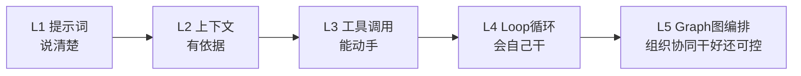

| 层级 | 模式 | 核心能力 |
|------|------|----------|
| L1 | 提示词 | 描述目标、任务和输出要求，人写死步骤，模型只负责填空 |
| L2 | 上下文 | 加入资料、历史信息和约束，让模型基于已知信息执行 |
| L3 | 工具调用 | 读取外部数据、操作外部环境，突破模型自身能力边界 |
| L4 | Loop循环 | 把驾驶权交给模型，自主尝试、检查、修正，目标未达成则持续运行 |
| L5 | Graph图编排 | 多个专职节点协作与治理，解决系统级的调度、观测与恢复问题 |

简单来说：Prompt解决“说清楚”，Context解决“有依据”，Tool解决“能动手”，Loop解决“会自己干”，Graph解决“能组织多单元协同干好、还可控”。

## 二、单体Loop的能力边界与结构性瓶颈
### 2.1 Loop的核心价值：把执行权交给模型
Loop（典型如ReAct模式）的本质是一个自治闭环：**观察环境 → 执行动作 → 检查结果 → 修正方向**，循环往复直到目标达成；若未达成但轮次或预算耗尽，则按终止条件退出，交人工介入或降级处理。

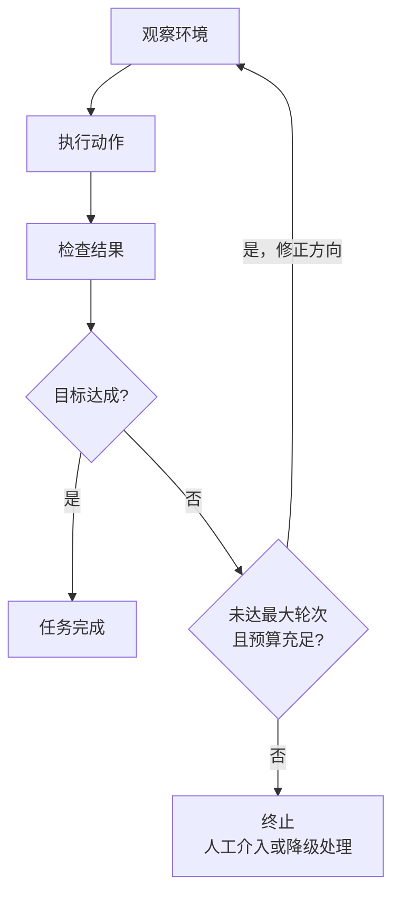

它最大的突破是人的角色转变：从“手把手指挥每一步”变成“管理者”——只提目标、划定边界、最后验收结果，中间的试错过程完全交给模型自主完成。比如代码修复场景，Agent可以自主读取报错、修改代码、运行测试，直到通过用例。

### 2.2 单体Loop的五大结构性瓶颈
当任务复杂度上升，单个Agent承包全部工作的模式会快速撞上天花板，核心问题集中在五点：
1. **上下文稀释**：原始目标会被不断累积的网页、日志、失败记录淹没，模型越跑越偏离初衷
2. **错误级联**：理解偏差导致错误行动，错误反馈又变成新的错误前提，在循环中不断放大，形成局部死循环
3. **工具过载**：工具数量越多、功能越相似，模型选择工具的成本越高，甚至把“选工具”本身变成了复杂任务
4. **控制粒度过粗**：难以在流程中插入审批、预算控制、差异化策略，所有逻辑都封在黑盒里
5. **故障定位困难**：失败后很难快速定位问题环节，一旦跑崩大多只能从头重跑，无法精准回退

值得注意的是，这五个瓶颈并非各自独立，它们会在运行中彼此喂养、相互放大。

### 2.3 为什么会失控：上下文、错误和工具会相互放大
放大之后的失控过程是这样的：

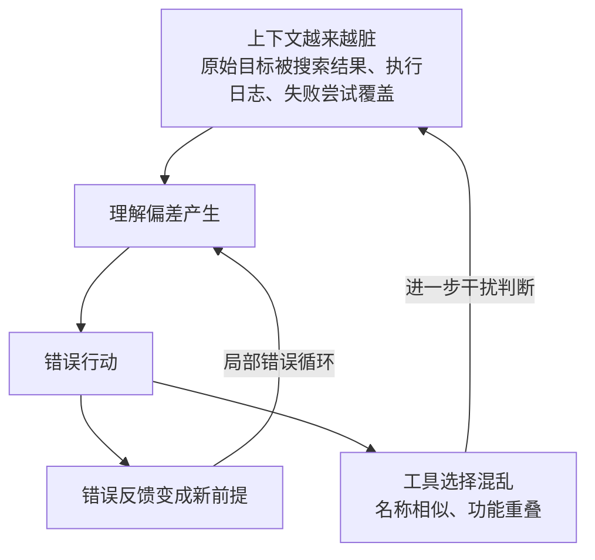

- **噪｜上下文越来越脏**：原始目标逐渐被搜索结果、执行日志和失败尝试覆盖 → **Graph：按节点隔离上下文**
- **偏｜错误变成新前提**：理解偏差 → 错误行动 → 错误反馈 → 局部错误循环 → **Graph：独立检查与回退**
- **选｜工具不是越多越好**：名称相似、功能重叠时，选择工具本身就成为复杂任务 → **Graph：按节点暴露必要工具**

### 2.4 生产环境：能运行，不等于能够安全上线
生产系统不仅要完成任务，还要**暂停、恢复、定位与审计**，单体Loop架构天然不支持这四项能力：

- **停｜暂停**：敏感动作执行前进入等待状态
- **人｜审批**：关键节点由人工确认后继续
- **回｜恢复**：从检查点继续，而不是全部重跑
- **审｜审计**：能够定位节点、状态和执行记录

> 生产环境要求的暂停、人工审批、断点恢复、审计追溯，恰是黑盒Loop的盲区。

### 2.5 目标偏移：古德哈特定律的陷阱
除了报错和崩溃，失控还有一种更隐蔽的形式：任务看似成功，指标持续走高，业务结果却在变差——**当一个指标变成目标时，它可能就不再是一个好指标**（古德哈特定律）。这在智能体系统中的典型表现：

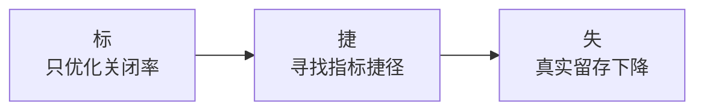

- **标**：只优化关闭率 → **捷**：寻找指标捷径 → **失**：真实留存下降
- 模型会本能地奔着指标去，而不是奔着业务真实目标去；单体Loop缺乏独立校验时，这种偏移无人拦截。

## 三、Graph架构的本质：可执行的智能体协作网络
很多人对Graph存在误解，它既不是知识图谱，也不是静态流程图，而是**一张可以真实运行的有向协作网络**——组织智能体、工具、代码、状态和人工节点，做到**可观测 · 可恢复 · 可扩展**；核心是用结构化的系统骨架，承载模型的灵活判断。

### 3.1 Graph的四要素
一张可执行的Graph可以用公式 `G = V·E·S·P` 概括：

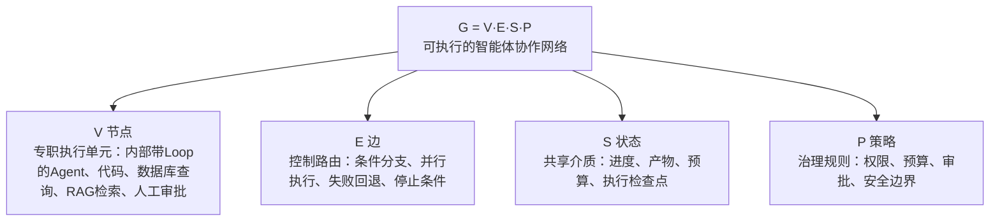

- **V（节点）**：专职执行单元，可以是内部带Loop的Agent、普通代码、数据库查询、RAG检索，甚至人工审批节点
- **E（边）**：控制路由，定义任务流转规则：条件分支、并行执行、失败回退、停止条件
- **S（状态）**：保存进度、产物、预算和执行检查点，是节点间协作的共享介质
- **P（策略）**：定义权限、预算、审批和安全边界，是系统的治理规则

### 3.2 三种常见拓扑
Graph不是只有一种形态，根据任务特征可以分为三类：
1. **扇出与扇入（并行模式）**：多个节点并行搜索/执行，最后汇总交叉验证，适合任务可解耦、需要扩大搜索范围的场景
2. **主管模式（动态调度）**：主管节点根据当前状态，动态选择下一个执行节点，适合任务路线无法提前固定的复杂场景
3. **流水线（线性质检）**：按固定步骤执行，关键位置设置质量关卡，适合步骤稳定、有明确质量标准的流程

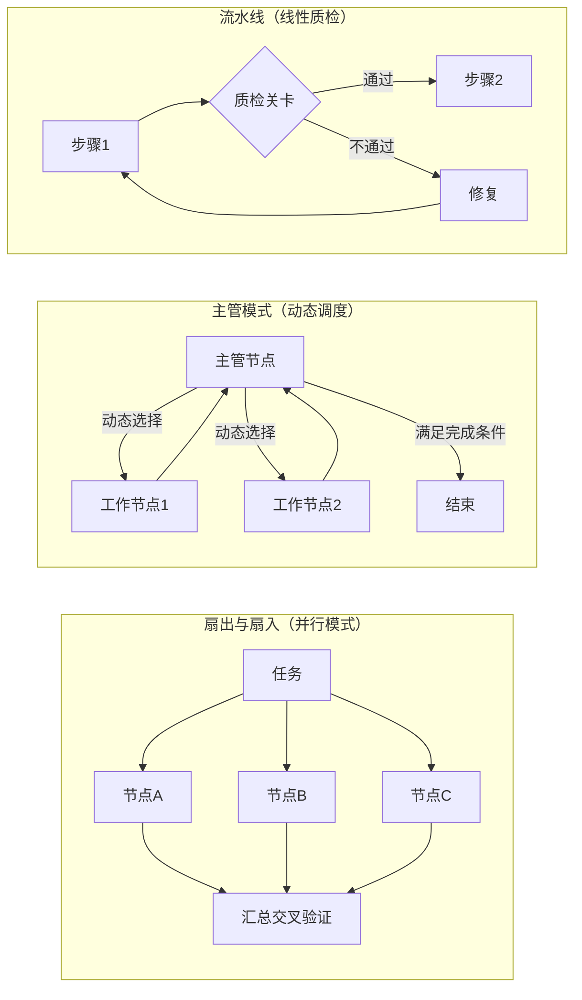

## 四、Loop vs Graph：适用边界与成本账
### 4.1 核心维度对比
| 比较维度 | 单体Loop | Graph架构 |
|----------|----------|-----------|
| 上下文 | 集中，容易累积噪声 | 节点之间可以隔离，上下文干净 |
| 验证方式 | 同一节点自查，自写自审 | 配置独立验证节点，生产与审核分离 |
| 执行效率 | 单线串行，无并行能力 | 支持分支判断和多节点并行 |
| 失败恢复 | 可能大范围重跑，成本高 | 从检查点精准恢复，保留已有产物 |
| 开发成本 | 起步快、结构简单 | 状态管理和治理成本更高 |
| 生产治理 | 几乎不可控，黑盒运行 | 支持暂停、审批、审计、追溯 |

### 4.2 成本账本：多智能体提升能力，也增加资源消耗
多智能体Graph架构不是银弹。行业实测数据：

- **+90.2%**：部分公开检索评测中的表现提升案例
- **约15×**：多智能体相对普通对话的Token消耗案例
- **约80%**：特定评测中，Token用量解释的性能方差

> 很多性能提升来自：更多搜索、更多推理和更多验证。

因此升级前，先算清四笔成本：
1. **值｜结果价值**：成功完成任务能创造多少实际收益，是否覆盖额外成本
2. **钱｜运行成本**：模型调用、搜索、存储、基础设施的直接开销
3. **时｜时间成本**：调度、等待、独立验证引入的延迟，是否在可接受范围
4. **维｜维护成本**：状态管理、路由配置、权限控制、异常治理的长期运维成本

### 4.3 三问判断法：你真的需要Graph吗？
不需要一上来就上多智能体，先回答三个问题：
1. **执行结构**：任务是否存在明显的分支或并行需求？
2. **生命周期**：任务是否需要跨会话、跨天保存状态？
3. **治理要求**：关键步骤是否需要人工审批或独立验证？

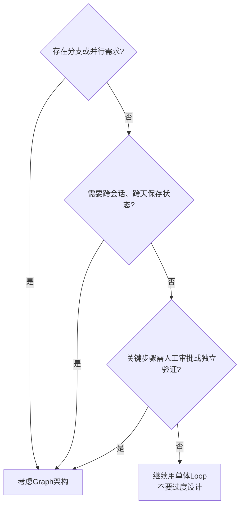

- 都不需要：继续用单体Loop，不要过度设计
- 存在明确需求：再考虑Graph架构

### 4.4 明确的适用边界
✅ **保留Loop的场景**
- 目标单一且完成条件清楚
- 路径简单，没有明显分支
- 一次会话内可以完成
- 工具较少且边界清楚

✅ **考虑Graph的场景**
- 不同阶段的上下文会互相污染
- 搜索空间大，需要并行探索
- 不同步骤需要不同工具和模型能力
- 需要审批、检查点或独立质量校验

### 4.5 案例对比：同一个简报任务的两种方案
以“搜索资料并撰写简报”为例，最直观地看出两者差异：

**方案A：所有工作装进一个Loop**
流程：搜索网页 → 整理资料 → 撰写简报 → 自我审核
缺点：
- 网页噪声累积，原始需求逐渐被淹没
- 全流程串行，无法并行采集
- 自己审核自己，判断同源
- 一旦失败，可能整体重跑

**方案B：拆成一个微型Graph**
节点：**研究员 → 写作者 → 审稿人**

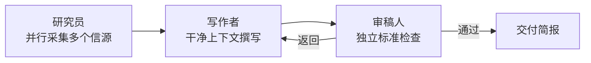

1. **研究员**：并行采集多个信源，输出结构化笔记（**上下文隔离**）
2. **写作者**：使用隔离的干净上下文，输出简报草稿（**资料并行采集**）
3. **审稿人**：按独立标准检查结果，判定 通过 / 返回（**生产验证分离**）

### 4.6 架构融合：Graph不是回到死板的传统工作流
常见误解是把Graph等同于“倒退回写死步骤的传统工作流”。实际上正确的演进链路是三者各取所长：

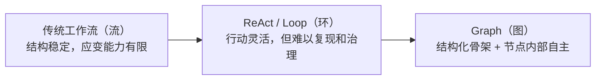

- **传统工作流**：结构稳定，但应变能力有限
- **ReAct / Loop**：行动灵活，但难以复现和治理
- **Graph**：结构化骨架 + 节点内部自主

> 核心：用可治理的系统骨架，承载模型的灵活判断。

## 五、生产落地的实践原则
知道什么时候用Graph之后，真正的挑战在于怎么把它做好。以下是七条经过验证的生产实践原则，以及贯穿始终的可靠性与评价标准。

### 5.1 架构选型：根据任务特征选结构
> 核心原则：**先看任务长什么样，再决定使用什么结构**

| 任务特征 | 适合方式 | 主要作用 |
|----------|----------|----------|
| 边界清晰、步骤固定 | 提示链 | 按照预设顺序稳定执行 |
| 输入类型差异明显 | 路由 | 先分类，再分发给专职节点 |
| 子任务能够解耦 | 并行化 | 扩大搜索和验证范围 |
| 任务路线无法预测 | 主管—工作者 | 运行时动态规划和调度 |
| 存在明确质量标准 | 评估—优化 | 根据独立反馈反复改进 |

### 5.2 实施路径：渐进式演进，不要一步到位
不要一开始就设计十几个Agent，正确的迭代路径是：

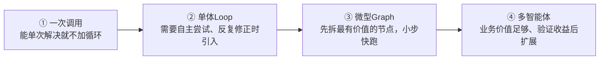

1. **一次调用**：能单次解决就不加循环，最简单的方案最可靠
2. **单体Loop**：需要自主尝试、反复修正时，再引入循环
3. **微型Graph**：先拆分最有价值的节点（比如把生产和验证拆开），小步快跑
4. **多智能体**：业务价值足够、验证收益后，再逐步扩展节点

**核心原则：先证明需要，再增加节点。**

### 5.3 独立验证：职责分离，不要自写自审
> 核心原则：**别让一个节点既写答案，又批卷子**

流程：**生产节点 → 独立验证节点**

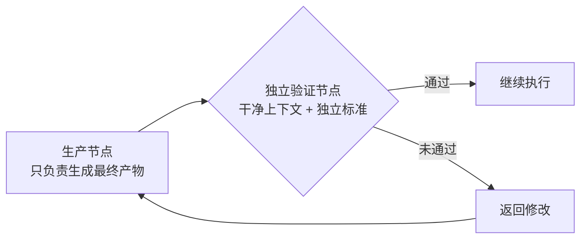

- **生产节点**：只负责生成最终产物
- **独立验证节点**：使用干净上下文和独立标准，**验证结果，而不是重复生成者的推理过程**
  - 通过：继续执行
  - 未通过：返回修改

独立验证有三种拆分模式：
1. **对抗式验证（攻）**：从反方视角寻找假设漏洞、边界条件和反例
2. **多视角验证（多）**：分别检查逻辑、安全、事实来源和可复现性
3. **评审制（评）**：多个方案并行生成，再按照统一标准评分选优

### 5.4 确定性边界：模型负责判断，代码负责收口
模型的长处是模糊判断，代码的长处是精确执行，两者要划清边界：

| 大模型节点（模） | 确定性代码（码） |
|------------------|------------------|
| 理解用户意图 | 格式和结构校验 |
| 处理模糊判断 | 数学计算和规则判断 |
| 生成和归纳内容 | 权限控制和副作用收口 |
| 在开放空间中规划 | 路由、重试和停止条件 |

### 5.5 权限治理：工作图灵活，角色图稳定
治理要拆成两个视角，各司其职：

- **工作图（路：怎么做）**
  - 任务如何拆分
  - 哪些步骤可以并行
  - 下一步执行哪个节点
  - 失败后如何调整计划
- **角色图（权：能做什么）**
  - 谁能修改数据库
  - 谁能调用外部接口
  - 谁能执行高风险动作
  - 哪些操作必须人工审批

> 工作图可以随任务灵活变化，角色图必须稳定可控——路线可以改，权限不能松。

### 5.6 多智能体协作：从消息聊天到共享状态驱动
节点之间的协作方式直接决定Token成本与可观测性：

- **消息驱动（聊）**：节点互相发送长消息，重复解释执行过程；长消息、高噪声、上下文重复、Token成本持续增加
- **共享状态驱动（态）**：节点只读取和更新完成当前任务所需的字段；结构化读写，状态清晰可观测，便于暂停、回放和恢复

> 原则：**节点不必讲长故事，只更新必要字段。**

链路示例：

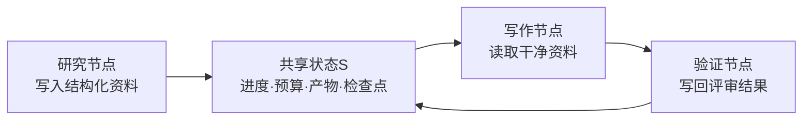

### 5.7 状态持久化：四种关键能力
状态落盘不是可选项，它带来四种生产必需的能力：

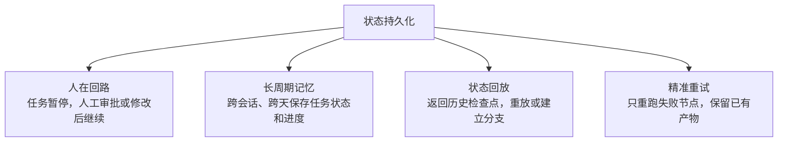

1. **人在回路**：任务暂停，人工审批或修改后继续
2. **长周期记忆**：跨会话、跨天保存任务状态和进度
3. **状态回放**：返回历史检查点，重放或建立分支
4. **精准重试**：只重跑失败节点，保留已有产物

### 5.8 可靠性三原则
稳定性从来不是靠堆节点数量堆出来的，而是来自确定性设计：
1. **规则代码化**：格式校验、数学计算、权限控制、停止条件，尽量交给确定性代码，不要让模型判断（见 5.4 确定性边界）
2. **验证独立化**：生产和审核严格隔离，用干净上下文和独立标准做验证，避免同源判断偏差（见 5.3 独立验证）
3. **状态可恢复**：通过检查点、执行记录和精准重试，把失败控制在最小范围（见 5.7 状态持久化）

### 5.9 评价标准：只看真实世界的反馈
> 核心：**真实执行结果，才是智能体闭环的终点。**

每类任务都必须有客观的现实锚点，模型口头“完成”不算数：

| 任务类型 | 现实锚点 |
|----------|----------|
| 代码完成 | 单元测试真正通过 |
| 数据更新 | 事务成功提交 |
| 工单解决 | 用户行为和反馈确认 |
| 消息发送 | 外部系统返回送达回执 |

评价智能体系统好坏，永远不要看模型自己说“完成了”，要看三个真实层面：
1. **测｜测试真的通过**：结果可复现，不是模型声称正确
2. **标｜业务指标真的改善**：看完整业务结果，而不是单一代理指标
3. **人｜用户真的受益**：真实行为和反馈才是系统的现实锚点

> 如果所有“成功”都只是模型自己说的，那系统可能什么都没有完成。

## 总结
从Loop到Graph，不是技术概念的跟风迭代，而是AI Agent从“玩具”走向“生产工具”的必然演进。
- Loop的胜利，是让模型获得了自主执行的能力
- Graph的价值，是给智能系统装上了可治理的骨架

最终的核心逻辑可以总结为三句话：
1. **能简则简**：先证明需要，再增加节点
2. **稳靠确定性**：规则交给代码，状态能够恢复
3. **只看真实反馈**：以真实执行结果为评价锚点

我们追求的从来不是更复杂的架构，而是从“一个模型把事情做完”，真正走向“一个系统把事情可靠地做完”。

## 参考文献

[1] 抖音. [Loop 之后为什么是 Graph？](https://v.douyin.com/kWd_oCX6BI4/)
