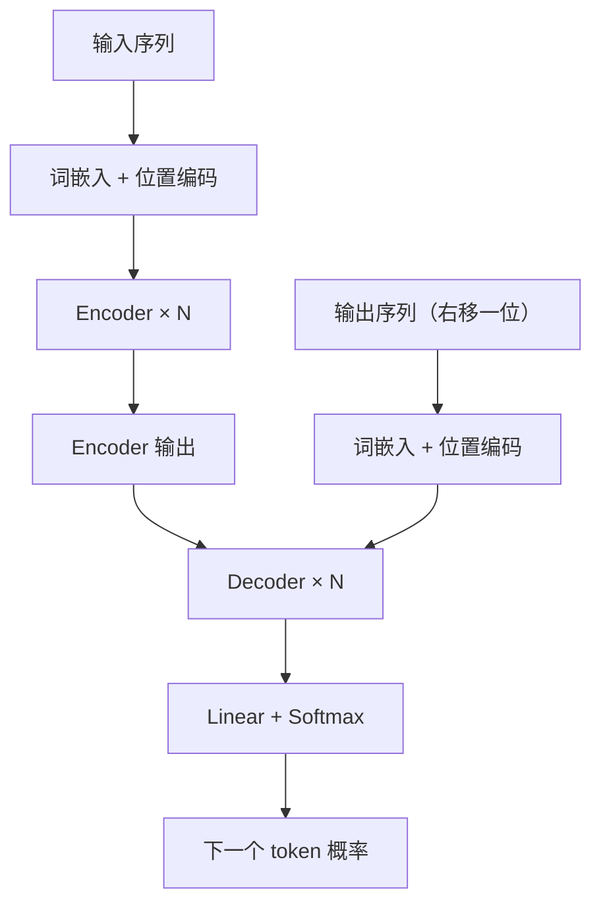
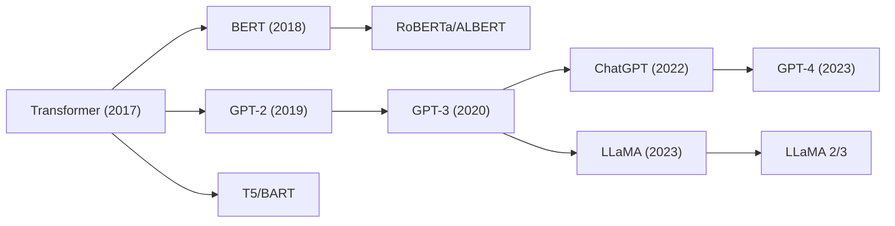

# Transformer 原理：从 Attention Is All You Need 到大语言模型基石

## 概述

本文综合豆包 AI 会话《Transformer 原理》[[12]](#ref-12) 与公开学术资料整理而成。Transformer 是 Vaswani 等人 2017 年在《Attention Is All You Need》[[1]](#ref-1) 中提出的序列到序列模型，完全基于自注意力机制，不再使用 RNN/LSTM 的时序循环结构，可以并行计算整个序列，是 GPT、BERT、LLaMA 等大语言模型的架构基石。

## 核心思想

用自注意力（Self-Attention）建模序列里每个 token 和序列中所有 token 的依赖关系，一次性读取整个输入序列，并行计算，捕捉长距离依赖。

- **RNN**：$O(N)$ 时间复杂度，必须串行逐 token 处理，长距离依赖容易梯度消失 [[2]](#ref-2)
- **Transformer**：$O(N^2)$ 时间复杂度但完全并行，自注意力直接建立任意两个 token 的关联 [[1]](#ref-1)

## 整体结构

分为两大块：编码器 Encoder（左）、解码器 Decoder（右）。原始论文用于机器翻译任务，Encoder 处理源语言句子，Decoder 生成目标语言句子 [[1]](#ref-1)。

<b>图1 Transformer 整体架构</b>

- GPT 类大模型：只用 Decoder（去掉 Cross-Attention），如 GPT-3、ChatGPT、PaLM [[3]](#ref-3)
- BERT：只用 Encoder（双向注意力），如 BERT、RoBERTa、ELECTRA [[3]](#ref-3)
- T5、BART：完整 Encoder-Decoder [[3]](#ref-3)

## 1. 词嵌入 + 位置编码

### 词嵌入

把 token 转为 $d_{model}=512$ 维向量 [[1]](#ref-1)。

### 位置编码

自注意力是排列不变的（permutation-invariant），本身不知道单词顺序，必须额外注入位置信息 [[4]](#ref-4)。原始 Transformer 使用正弦/余弦函数生成固定位置向量，加到词向量上 [[1]](#ref-1)：

$$PE_{(pos,2i)} = \sin(pos / 10000^{2i/d_{model}})$$

$$PE_{(pos,2i+1)} = \cos(pos / 10000^{2i/d_{model}})$$

**为什么用三角函数？** 正弦位置编码可以让模型通过线性变换关注相对位置，且能外推到训练时未见过的更长序列 [[1]](#ref-1)。实验表明正弦编码与可学习位置编码效果几乎一致 [[1]](#ref-1)。

**位置编码加在哪里？** 实验表明 PE 应只加到 Q 和 K 上，不加到 V 上效果更好 [[5]](#ref-5)。相对位置编码在自注意力块、绝对位置编码在交叉注意力块的组合可以提升翻译质量 [[5]](#ref-5)。

**演进：** 后续模型发展出旋转位置编码 RoPE（LLaMA、Qwen）和 ALiBi 等相对位置编码方案，更好地处理长序列 [[6]](#ref-6)。

## 2. 多头自注意力（最核心模块）

### 2.1 缩放点积注意力

输入向量分别通过线性投影得到三组向量：Query（Q）查询、Key（K）键、Value（V）值 [[1]](#ref-1)：

$$Attention(Q, K, V) = softmax\left(\frac{QK^T}{\sqrt{d_k}}\right)V$$

- $QK^T$：计算每个 token 和所有 token 的相似度（点积）
- $\sqrt{d_k}$ 缩放：当 $d_k$ 较大时，点积值方差大，softmax 输出趋向 one-hot，梯度消失；除以 $\sqrt{d_k}$ 稳定梯度 [[1]](#ref-1)
- softmax：归一化得到注意力权重
- 权重乘 V：加权求和得到输出

**计算量：** 单头注意力的复杂度为 $O(N^2 \cdot d)$，其中 $N$ 是序列长度，$d$ 是维度 [[7]](#ref-7)。

### 2.2 多头注意力

不是只用一组 QKV，而是分成 $h=8$ 个 head，每个 head 的 $d_k = d_v = d_{model}/h = 64$ [[1]](#ref-1)：

$$MultiHead(Q, K, V) = Concat(head_1, ..., head_h)W_O$$

$$head_i = Attention(QW_Q^i, KW_K^i, VW_V^i)$$

**作用：** 不同头学习不同类型依赖关系——有的关注语法结构，有的关注语义指代，有的关注局部模式 [[1]](#ref-1)[[8]](#ref-8)。多头的总计算量与单头全维度注意力相近 [[1]](#ref-1)。

**变体演进：** 后续出现 Multi-Query Attention（MQA）、Grouped-Query Attention（GQA，LLaMA 2/3 使用）、Multi-head Latent Attention（MLA，DeepSeek 使用）、Flash Attention 等高效注意力变体 [[6]](#ref-6)。

### 2.3 掩码注意力（Decoder 专用）

Decoder 中的自注意力加一个上三角掩码，把未来位置 token 的注意力分数设为 $-\infty$，softmax 后权重 = 0，生成时看不到后面还没预测的词 [[1]](#ref-1)。这是保持自回归（auto-regressive）性质的关键。

## 3. Encoder 层结构

每层由两个子模块组成，都使用残差连接 + LayerNorm [[1]](#ref-1)：

$$H' = LayerNorm(SelfAttention(X) + X)$$

$$H = LayerNorm(FFN(H') + H')$$

### 3.1 多头自注意力（双向）

Encoder 中的自注意力是双向的——每个位置可以看到整句所有 token [[1]](#ref-1)。

### 3.2 前馈神经网络 FFN

对每个 token 独立做两层全连接 [[1]](#ref-1)：

$$FFN(x) = max(0, xW_1 + b_1)W_2 + b_2$$

- 内层维度 $d_{ff} = 2048$（$d_{model}=512$ 的 4 倍）[[1]](#ref-1)
- FFN 是逐 token 独立计算，token 之间互不影响
- 本质上就是 MLP，对每个位置独立做非线性变换 [[6]](#ref-6)

## 4. Decoder 层结构

三层子模块，残差 + 层归一化 [[1]](#ref-1)：

1. **掩码多头自注意力**：只能看到当前及之前生成的 token，看不到未来
2. **交叉注意力 Cross-Attention**：Q 来自 Decoder 上一层，K、V 来自 Encoder 输出。作用：生成每个词时，去参考源句子信息 [[1]](#ref-1)
3. **FFN 前馈网络**

> **GPT 的简化：** GPT 只用 Decoder，去掉了 Cross-Attention，只保留 Masked Self-Attention + FFN [[3]](#ref-3)。

## 5. 残差连接与层归一化

$$Output = x + SubLayer(x)$$

把输入直接加到子层输出，缓解深层网络梯度消失 [[1]](#ref-1)。

### Pre-LN vs Post-LN

- **Post-LN**（原始 Transformer）：子层计算完再做 LayerNorm [[1]](#ref-1)
- **Pre-LN**（GPT、LLaMA）：先 Norm 再进子层，训练更稳定 [[9]](#ref-9)

## 6. 输出层

Decoder 最后一层输出 → Linear 映射到词表维度 → Softmax，得到每个词的概率，采样得到下一个 token，循环生成 [[1]](#ref-1)。

## 7. Transformer vs RNN/LSTM 深度对比

| 维度 | RNN/LSTM | Transformer |
|------|----------|-------------|
| 计算方式 | 串行，逐 token 处理 | 并行，序列全部送入 |
| 时间复杂度 | $O(N)$ | $O(N^2)$ |
| 空间复杂度 | $O(N)$ | $O(N)$ |
| 长距离依赖 | 理论上可以，实践中梯度消失严重 | 自注意力直接建立任意两个 token 关联 |
| 位置信息 | 时序天然有序 | 需要位置编码显式注入 |
| 归纳偏置 | 强（固有时间结构） | 弱（需从数据中学习） |
| 并行能力 | 无法并行 | 完全并行 |

**RNN/LSTM 的长记忆问题：** Zhao et al. 证明从统计角度 RNN 和 LSTM 都不具有长记忆（long memory），权重衰减是指数级而非多项式级 [[10]](#ref-10)。Transformer 的注意力机制不受此限制 [[11]](#ref-11)。

**长距离依赖的理论分析：** Ma et al. 证明 SSM/Mamba 的长距离依赖随序列长度指数衰减（与 RNN 相同），而 Transformer 的注意力机制更灵活，不受指数衰减约束 [[11]](#ref-11)。

## 8. 实验结果

在 WMT 2014 英德翻译任务上，Transformer (big) 达到 28.4 BLEU，超过此前最优模型（含集成方法）2 BLEU 以上 [[1]](#ref-1)。训练成本也显著更低。

## 9. 演进路线

<b>图2 Transformer 架构演进路线</b>

## 10. 一句话总结

Transformer 通过多头自注意力让序列中每个 token 和全部 token 计算相关性；搭配残差连接、层归一化、位置编码，堆叠多层 Encoder/Decoder；抛弃循环结构实现并行建模长文本，奠定大语言模型基础。

---

## 参考文献

[1] A. Vaswani et al. ["Attention Is All You Need."](https://arxiv.org/abs/1706.03762) *NeurIPS*, 2017.

[2] Stanford CS231N. ["RNNs and Transformers."](https://cs231n.stanford.edu/slides/2026/section_5.pdf) *Stanford University*, 2025.

[3] Princeton NLP. ["Self-attention and Transformers."](https://nlp.cs.princeton.edu/cos484-sp24/lectures/lec13.pdf) *COS 484*, 2024.

[4] CMU Deep Learning. ["Transformer and Newer Architectures."](https://deeplearning.cs.cmu.edu/S25/document/slides/lec19.transformer.pdf) *Spring 2025*.

[5] T. Miyazaki et al. ["Understanding How Positional Encodings Work in Transformer Model."](https://aclanthology.org/2024.lrec-main.1478/) *LREC-COLING*, 2024.

[6] A. Vaswani et al. ["Attention Is All You Need."](https://arxiv.org/html/1706.03762v7) *arXiv (v7)*, 2023.

[7] Z. Zhang et al. ["Efficient Transformers: A Survey."](https://arxiv.org/pdf/2106.04554) *ACM Computing Surveys*, 2022.

[8] A. Vaswani et al. ["Attention Is All You Need."](https://proceedings.neurips.cc/paper_files/paper/2017/file/3f5ee243547dee91fbd053c1c4a845aa-Paper.pdf) *NeurIPS*, 2017.

[9] P. Liu et al. ["Pre-LN Transformer."](https://arxiv.org/abs/2002.04745) *arXiv*, 2020.

[10] J. Zhao et al. ["Do RNN and LSTM have Long Memory?"](https://proceedings.mlr.press/v119/zhao20c.html) *ICML*, 2020.

[11] C. Ma et al. ["Rethinking the long-range dependency in Mamba/SSM and transformer models."](https://arxiv.org/abs/2509.04226) *arXiv*, 2025.

[12] 豆包 AI. ["Transformer 原理（会话分享）."](https://www.doubao.com/chat/38442003078933762) *豆包*, 2026.