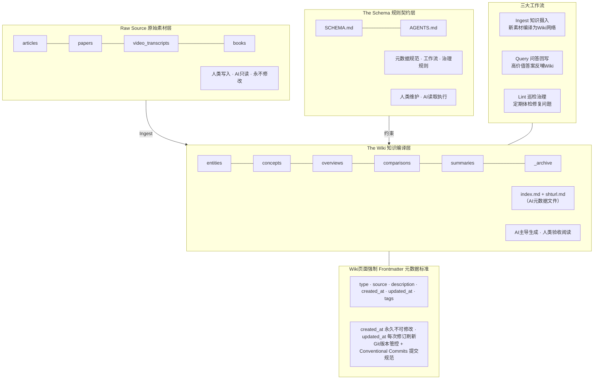
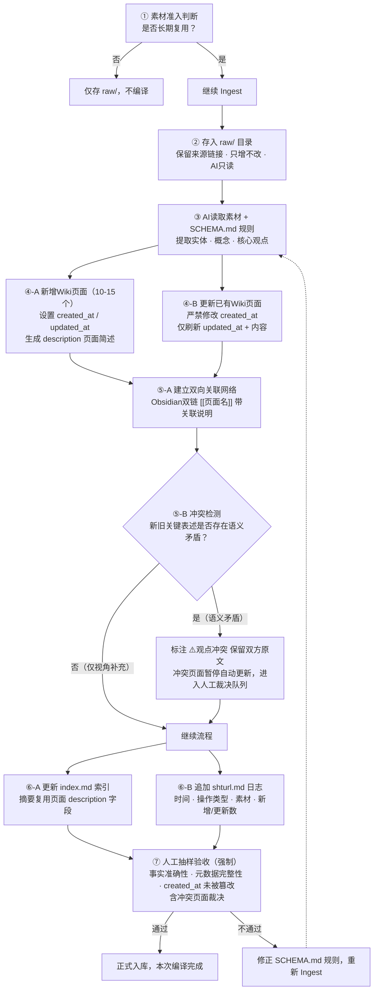
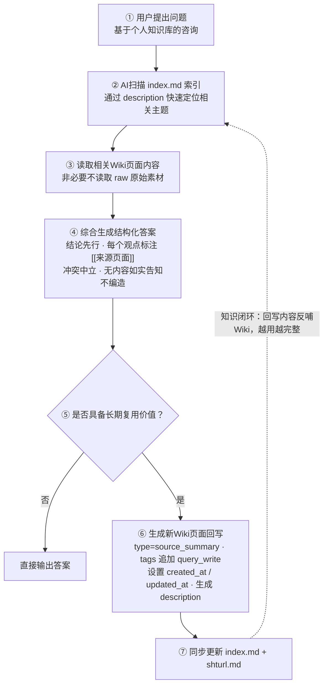
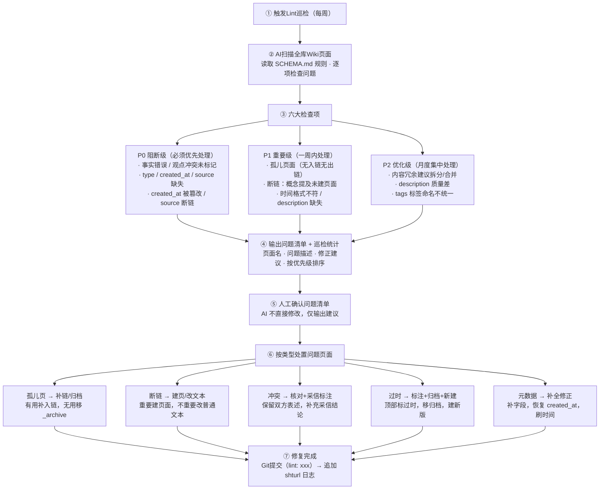
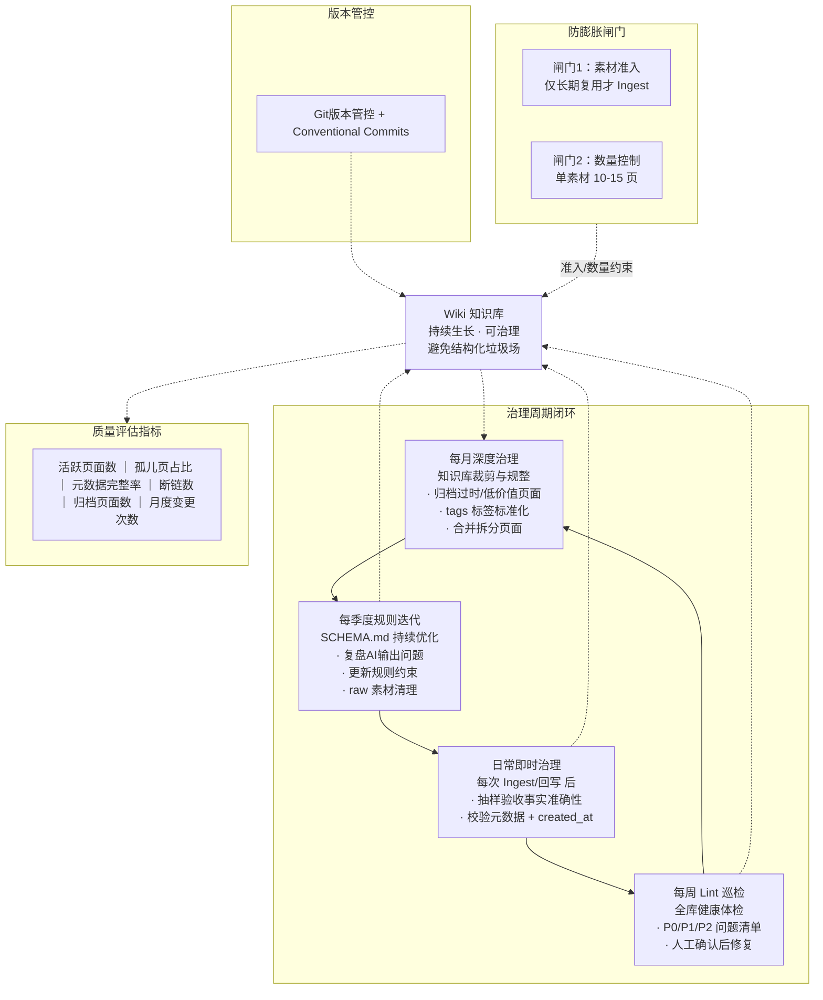

# LLM-Wiki 个人AI知识库建设可行性方案

本方案基于Karpathy提出的LLM-Wiki框架，结合Obsidian落地实践与完整治理体系，设计了一套低门槛、可迭代、可治理的个人编译型知识库方案，解决传统笔记碎片化、传统RAG复用性差、AI生成内容易沦为"结构化垃圾场"的核心痛点。

---

## 一、项目概述

### 1.1 背景与痛点

1. **传统个人笔记**：知识零散、不成体系，检索依赖关键词匹配，无法形成关联网络
2. **普通RAG方案**：每次提问临时切割原始文档，知识始终停留在素材状态，无预编译与沉淀
3. **AI生成笔记误区**：批量生成大量精美页面但无人阅读、无人校验，最终形成无价值的结构化垃圾场
4. **缺少统一规则**：AI输出风格、质量不稳定，元数据缺失，知识库越做越乱，难以长期维护

### 1.2 建设目标

构建一套「原始素材-AI编译-规则约束-闭环治理」的个人知识体系：

- **可编译**：新素材一次性编译为结构化知识网络，而非碎片化笔记
- **可追溯**：所有知识可溯源原始素材，所有变更留痕
- **可治理**：具备巡检、修复、归档、裁剪的完整治理机制
- **可复用**：知识原子化、关联化，支持高效问答与持续迭代
- **低门槛**：基于本地Markdown文件，无需复杂技术栈，人人可落地

### 1.3 适用场景

- 个人技术栈积累与知识体系搭建
- 行业研究、领域学习的系统化沉淀
- 项目资料、技术文档的结构化管理
- 个人第二大脑建设与长期知识资产管理

---

## 二、核心架构设计

采用三层文件架构，权责分离，边界清晰，是整套体系的底层逻辑。

### 2.1 整体系统架构图



### 2.2 三层核心架构

| 层级 | 名称 | 权责 | 读写权限 |
| --- | --- | --- | --- |
| 第一层 | Raw Source 原始素材层 | 存放所有原始输入，作为事实基准与溯源依据 | 人类写入，AI只读，永不修改 |
| 第二层 | The Wiki 知识编译层 | AI提炼后的结构化知识网络，是日常查阅、问答的核心载体 | AI主导生成维护，人类验收阅读 |
| 第三层 | The Schema 规则契约层 | 定义知识库结构、流程、输出规范，是AI的工作手册 | 人类维护，AI读取执行 |

配套两个元数据文件（优先面向AI读取）：

- `index.md`：全库页面目录与一句话摘要，AI快速定位主题的目录表
- `shturl.md`：知识库变更日志（Stuff Update Record Log），仅记录知识加工操作，区别于普通日志，完整留存每次Ingest、回写、修复的轨迹。当单文件超过200条记录时，按月拆分归档为`shturl-YYYY-MM.md`，当前活跃文件仅保留最近一个月的日志，历史月份置为只读

### 2.3 完整目录结构

```
llm-wiki-vault/          # Obsidian库根目录
├─ AGENTS.md             # Agent自动读取入口，引用SCHEMA.md
├─ SCHEMA.md             # 主规则文件，人类阅读与复用
├─ README.md             # 知识库说明文档
├─ .gitignore            # Git版本控制忽略配置
│
├─ raw/                  # 原始素材库
│   ├─ articles/         # 网页、文章
│   ├─ papers/           # 论文、报告
│   └─ video_transcripts/ # 视频转录稿
│
└─ wiki/                 # AI编译知识库
   ├─ _archive/          # 归档目录，存放过时/低价值页面，不进索引
   ├─ entities/          # 实体类页面（人物、项目、组织）
   ├─ concepts/          # 概念类页面（技术、方法论、模型）
   ├─ overviews/         # 总览类页面（领域全景梳理）
   ├─ comparisons/       # 对比类页面（多主题横向对比）
   ├─ source_summaries/  # 素材摘要页（单份原始素材要点）
   ├─ index.md           # 全局索引页
   └─ shturl.md          # 知识库变更日志
```

### 2.4 规则文件体系

采用「入口文件+主规则文件」双文件机制，避免重复维护：

1. **AGENTS.md**（根目录，Agent自动加载）：作为AI Agent入口引导，通过Obsidian双链引用`[[SCHEMA.md]]`，重申元数据硬约束，所有操作优先读取SCHEMA.md完整规则
2. **SCHEMA.md**（主规则文档）：完整定义元数据规范、目录权责、三大工作流、治理规则、版本规范，人类阅读、手动调用AI时直接复制使用

---

## 三、核心工作流程

围绕三层架构，通过三个固定动作完成知识的摄入、复用与迭代，形成自增长闭环。

### 3.1 Ingest：知识摄入编译

**定义**：新原始素材入库时，AI读取素材并更新整个Wiki网络的过程。

#### Ingest 完整流程图



**执行步骤**：

1. 将新素材存入`raw/`对应目录，保留完整来源信息
2. AI读取素材 + SCHEMA.md规则，提取核心实体、概念与观点
3. 联动新增/更新10~15个相关Wiki页面，建立双向关联网络
4. 冲突检测与处置：AI对比回写内容与已有页面，若发现同一实体/概念的关键表述存在语义矛盾（而非视角补充），则在冲突段落标注「⚠️观点冲突：与[[已有页面名]]存在矛盾」，保留双方原文，不直接覆盖。冲突页面暂停自动更新，进入人工裁决队列，由人工在验收环节一并处理
5. 同步更新`index.md`索引与`shturl.md`变更日志
6. 人工抽样验收后正式入库

### 3.2 Query：知识问答与回写

**定义**：基于已编译的Wiki知识库进行问答，高质量答案反哺知识库。

#### Query 问答回写闭环流程图



**执行步骤**：

1. AI先扫描`index.md`快速定位相关主题页面
2. 读取对应Wiki页面内容，综合生成结构化答案
3. 所有观点标注来源页面，支持溯源
4. 若回答具备长期复用价值，整理为新Wiki页面回写入库，元数据中`type`统一标记为`source_summary`，`tags`追加`query_write`标签，便于治理时区分Ingest产出与问答回写产出
5. 非必要不读取原始素材，保障查询效率

> Query回写页面与Ingest页面执行相同的元数据规范，但在分类与标签上保留来源标识，月度治理时优先复核query_write类页面的内容质量。

### 3.3 Lint：知识库健康巡检

**定义**：定期对全库做质量体检，排查问题并输出优化建议。

#### Lint 巡检治理流程图



按优先级分为三类检查项：

- **P0 阻断级**（必须立即处理）：事实错误、观点冲突未标记、`type`/`created_at`/`source`任一字段缺失、`created_at`被篡改、`source`指向的页面已被删除或归档（溯源链路断裂）
- **P1 重要级**（一周内处理）：孤儿页面（无入链无出链）、概念提及但未创建对应页面、时间格式不符合规范、`description`字段缺失
- **P2 优化级**（月度集中处理）：内容冗余建议拆分/合并、`description`质量差、`tags`标签命名不统一

> 
> Lint仅输出问题清单与建议，不直接修改内容，所有修改人工确认后执行。

---

## 四、元数据标准规范

所有Wiki页面强制携带Frontmatter元数据，是检索、治理、AI识别的基础。

### 4.1 Frontmatter 字段定义

```
---
type: concept|entity|overview|comparison|source_summary
source: [[来源双链]]
description: 1-3句话简述页面核心内容，用于索引预览与AI快速理解
created_at: YYYY-MM-DD hh:mm:ss
updated_at: YYYY-MM-DD hh:mm:ss
tags: []
---
```

### 4.2 字段约束规则

| 字段 | 约束规则 |
| --- | --- |
| `type` | 限定5种类型，用于分类检索与批量管理 |
| `source` | 使用Obsidian双链指向原始素材或来源页面，支持溯源 |
| `description` | 必填，1-3句话，`index.md`摘要直接复用此字段 |
| `created_at` | 页面首次创建时间，**后续任何更新永久不可修改** |
| `updated_at` | 每次Ingest、修正、回写均刷新为当前时间 |
| `tags` | 统一小写蛇形命名，避免同义标签爆炸 |

### 4.3 检索能力说明

- **原生搜索**：支持按type、标签、日期字符串匹配，不支持时间区间筛选
- **Dataview插件（推荐）**：完整识别所有元数据字段，开启时间解析后支持时间范围筛选、排序、统计，可生成动态索引与质量报表
- **AI检索**：Agent可直接读取元数据，通过`description`快速判断页面相关性，无需读取全文

---

## 五、知识库治理体系

治理是避免知识库沦为"结构化垃圾场"的核心保障，覆盖日常到周期、从问题到优化的全链路。

### 5.1 完整治理闭环与周期机制图



### 5.2 治理目标

1. wiki/只保留长期有复用价值的知识，低价值内容不进编译层
2. 元数据完整率100%，时间格式统一，`created_at`零篡改，`source`指向有效页面
3. 降低孤儿页面、断链占比，维持知识网络健康度
4. 可控膨胀，定期裁剪归档，避免无限堆积
5. 所有变更可追溯、可审计、可回滚

### 5.3 周期性治理机制

| 周期 | 任务 | 执行方式 |
| --- | --- | --- |
| 每次操作后 | 即时抽检元数据、事实、索引与日志 | 人工 |
| 每周 | 全库Lint巡检，输出问题清单 | AI + 人工确认 |
| 每月 | 处理遗留问题、归档过时页面、标签规范化、裁剪低价值页面 | 人工 + Dataview |
| 每季度 | 规则迭代、知识库复盘、raw素材清理 | 人工 |

### 5.4 问题页面处置策略

1. **孤儿页面**：有用则补充入链融入网络；无用则移入`_archive`归档
2. **断链概念**：重要则新建对应页面；不重要则改为普通文本
3. **观点冲突**：核对原始素材，补充采信结论，保留双方历史表述
4. **过时知识**：顶部标注过时提示，移入归档目录，新建新版页面
5. **低价值页面**：移入`_archive`，原始素材保留在raw，未来可重新编译

### 5.5 防膨胀管控

1. **准入控制**：仅长期学习、反复复用的知识才执行Ingest；碎片化资讯只存raw
2. **数量控制**：单份素材Ingest产出控制在10-15页，过度拆解则收紧规则
3. **定期裁剪**：月度治理将一年以上无引用、无访问的页面归档
4. **归档隔离**：`_archive`页面不纳入索引、不参与常规查询

### 5.6 索引与日志扩展策略

1. **index.md**：当活跃Wiki页面超过200页时，按`type`拆分为分域索引（如`index-concepts.md`、`index-entities.md`），根目录`index.md`仅保留分域入口与全库统计摘要
2. **shturl.md**：单文件超过200条记录时按月拆分（`shturl-YYYY-MM.md`），当前活跃文件仅保留最近一个月，历史月份置为只读
3. **触发时机**：分域索引拆分在月度治理中评估执行，不自动触发

---

## 六、Git版本管控体系

### 6.1 版本管控价值

- 防护AI篡改元数据，可一键回退历史版本
- 文件级变更记录，与`shturl.md`业务日志形成双重校验
- 批量治理操作安全兜底，避免误删误改
- 支持多端同步与备份，知识库可迁移

### 6.2 Commit规范（适配Conventional Commits）

遵循Conventional Commits标准格式，scope可选，强制单行，单行不超过50字符，一句话概括变更。

**允许type = CC标准类型 + 本库领域类型**（由commit-msg钩子强制校验）：

- **CC 标准类型**：`feat` 新功能 / `fix` 缺陷修复 / `docs` 文档改动 / `style` 格式样式 / `refactor` 重构 / `perf` 性能优化 / `test` 测试 / `build` 构建 / `ci` 持续集成 / `chore` 杂项维护 / `revert` 回退

**本库领域类型**（CC之外的自定义补充）：

- `ingest`：知识摄入，生成更新Wiki页面
- `query`：问答结果回写Wiki
- `lint`：巡检后修复知识库问题
- `governance`：知识库治理、归档、标签规整
- `rule`：修改SCHEMA.md、AGENTS.md规则

**标准示例**：

```
ingest: ingest agent permission related documents
lint: fix orphan pages and broken links
rule(schema): add description metadata field
governance: archive low-value knowledge pages
query: add GraphRAG vs LightRAG comparison
```

> 
> 详细页面清单、操作时间统一由`shturl.md`记录，不写入commit message，职责分离。

### 6.3 强制校验机制

通过`commit-msg`钩子自动校验：type合法性、格式规范、强制单行、总长度≤50字符，不符合规范直接拒绝提交。

---

## 七、分阶段落地路径

### 7.1 启动期（1-3天）

1. 搭建完整目录结构，创建基础文件
2. 编写第一版SCHEMA.md与AGENTS.md
3. 选择1-2份正在学习的素材，完成首次Ingest
4. 验证页面质量、元数据、索引与日志

### 7.2 调优期（1-2周）

1. 完成3次以上Ingest，人工验收并修正问题
2. 根据AI输出问题迭代优化SCHEMA.md规则
3. 执行首次Query问答并尝试回写
4. 完成第一次Lint巡检，处理基础问题
5. 配置Git版本控制与提交规范

### 7.3 稳定期（1-3个月）

1. 固定Ingest与Lint频率，形成稳定习惯
2. 引入Dataview实现动态索引与质量统计
3. 执行首次月度治理，完成页面归档与标签规整
4. 知识库规模达到50-100页，知识网络初步形成

### 7.4 深化期（3个月以上）

1. 逐步扩充主题领域，完善知识网络
2. 可引入本地大模型与检索工具，实现全自动化流程
3. 沉淀个人专属规则体系与治理节奏
4. 知识库成为个人核心知识资产与决策辅助工具

---

## 八、风险与避坑指南

### 8.1 核心风险：结构化垃圾场

- **成因**：盲目Ingest碎片化内容、跳过原始资料直接学Wiki、只增不剪
- **应对**：严格素材准入、先学原始素材再用Wiki复盘、坚持月度治理裁剪

### 8.2 AI输出失真风险

- **成因**：AI编造事实、篡改元数据、错误覆盖旧内容
- **应对**：人工抽样验收、`created_at`永久固化、Git版本回退、发现问题迭代规则而非只改单页

### 8.3 数据安全风险

- **成因**：云端AI上传敏感资料、公开Git仓库泄露笔记
- **应对**：敏感素材本地大模型处理、远程仓库强制私有、重要数据本地多重备份

---

## 九、投入产出评估

### 9.1 投入成本

- **工具成本**：Obsidian免费，AI工具按需选择，整体几乎零成本
- **时间成本**：启动期3天内，每周维护约30分钟，月度治理约1小时
- **技术门槛**：无需编程基础，仅需掌握Markdown与基础AI使用

### 9.2 预期收益

1. 知识从零散碎片升级为结构化网络，检索与复用效率大幅提升
2. AI承担知识加工的机械劳动，人类聚焦思考与决策
3. 知识资产可积累、可迭代、可迁移，形成长期复利
4. 具备完整治理机制，避免知识库失控与垃圾化
