# 大疆商城 AI 业务矩阵 — 面试整理文档

> 整理时间：2026-06-16  
> 基于简历 `XXX__AI应用开发工程师.pdf` + 当前仓库 `ark_demo`（灵购 AI）代码通读  
> 后续面试问答可在此文档基础上补充

---

## ⭐ 临上场背诵卡片（灵购 AI 高频题）

> 面试前扫一眼。紧张就答 **30 秒版**，正常节奏用 **1 分钟版**。

### 定心丸（心里默念）

> 我负责 **灵购 AI 从用户开口到 AI 出声** 的应用层和推理层落地。RTC、RAG 接入、回调服务、效果优化是我主做的；Milvus 入库和模型训练是协作。

### Q：你在这个智能语音客服项目里负责了哪些部分？

**30 秒版：**

> 我在灵购 AI 里主要负责四块：  
> **一是 RTC 语音交互**，前端进房、设备、字幕，以及和后端启停 Agent 的对接；  
> **二是 CustomLLM 回调服务**，ASR 出文本后，在我们服务里做 RAG 检索再调模型流式返回；  
> **三是 RAG 在线检索接入**，把 DataBus 产出的商品知识召回、过滤后拼进 prompt；  
> **四是性能优化**，包括检索耗时和首字延迟 TTFT。  
> 向量入库和模型训练是协作同学做的，我负责 **线上语音客服这条链路的打通和联调**。

**我负责（背这四行）：**

| 块 | 一句话 |
|----|--------|
| RTC 语音交互 | 进房、推流、Agent 启停、字幕、通话体验 |
| 回调服务 | `/api/chat_callback`，接 ASR 文本，SSE 流式回 RTC |
| RAG 接入 | 在线检索、过滤、拼 prompt（不是建 Milvus 集群） |
| 性能优化 | 检索延迟、TTFT、Token 成本、联调排障 |

**上场前三遍：**

1. 我负责 RTC 通话、回调服务、RAG 接入、性能优化。  
2. 数据入库和训模是协作，我负责串起来跑通线上。  
3. 我说的是灵购 AI 应用层，不是整个中台。

**三个坑别踩：** 别说全负责 · 别说只用了 RTC/RAG · 要带 CustomLLM / SSE / TTFT

### Q：你做了 RAG 检索优化，怎么做的？（五层一句话）

> **HNSW 要快，Int8 要省，元数据要准，TopK 要控，Rerank 要精。**  
> Milvus 粗召回 Top20 → 元数据四维过滤 → rerank 精排 Top5；命中率约 72%→89%，检索耗时约降到原来 1/4。  
> 详见 **第十六节** 五层详解。

**五层记忆卡：**

| 层 | 手段 | 核心 |
|----|------|------|
| ① | HNSW | **快**（省时间） |
| ② | Int8 | **省**（省空间，约 ↓75%） |
| ③ | 元数据 filter | **准**（打标签，往哪搜） |
| ④ | 召回策略 Top20 | **控**（捞多少、阈值） |
| ⑤ | Rerank | **准**（Top20→Top5，谁进 prompt） |

**补充：** 粗召回阶段可有 **稠密+稀疏混合**（见第十六节 4.5）；`dense_weight` 主要在 **召回融合** 或 **轻量 rerank 打分** 里用，精排本身 **一般不重新算稀疏向量**。

### Q：你怎么优化 TTFT？（15s→2s）

> **RAG 让 LLM 更早开跑** + **前缀缓存/KV 让首 token 更快** + **精简 prompt / 动态 Token** + **SSE 流式**。详见 **第十六节 TTFT 专节**。

### Q：FEC / Jitter Buffer 是什么？作用在哪？

> **RTC 音频传输层** 弱网优化，不是 RAG/LLM。FEC **抗丢包**，Jitter Buffer **平滑抖动**；SDK 启用 + 弱网压测。详见 **第十六节 RTC 弱网专节**。

### 灵购 AI 优化总览（面试官追问）

> **答得准 / 答得快 / 听得稳 / 研得快** — 详见 **第十七节全链路优化总表**。

### 四大项目 + 架构深挖（第十九节）

> 五项目统一数据流图 · 架构对比表 · 连环拷打 10 题 · 各项目 1 分钟口述 — 见 **第十九节**。

### 其他四大项目速查（第十八节）

| 项目 | 30秒关键词 | 详见 |
|------|------------|------|
| **DataBus** | 洗数据、9级过滤、脱敏、SFT+RAG 分流、回流 | DB-Q1～Q6 + **深度专节** |
| **ModelForge** | 本地QLoRA+云端LoRA、SFT+DPO、三段式检索 | MF-Q1～Q5 + **深度专节** |
| **LiveClip** | FFmpeg.wasm、PG任务队列、ASR+LLM切高光 | LC-Q1～Q5 + **深度专节** |
| **MultiVis** | LangGraph、Checkpointer、SSE、素材回流 | MV-Q1～Q5 + **深度专节** |

### 各项目深度专节索引（新增）

| 项目 | 深度专节内容 |
|------|----------------|
| **DataBus** | 五层架构图、GT时序、9级表、chunk模型、导出格式、回流、DB-Q7～10 |
| **ModelForge** | 双流水线、QLoRA/SFT/DPO、检索时序、评测门禁、MF-Q6～9 |
| **LiveClip** | 三层架构、任务时序、PG状态机、25min+6000token、SSE、LC-Q6～9 |
| **MultiVis** | LangGraph图、流式时序、Checkpointer、路由、配图并发、MV-Q6～9 |

---

## 一、个人画像（简历摘要）

| 项 | 内容 |
|---|---|
| 姓名 | XXX，26 岁，4 年经验 |
| 教育 | XXXXXXXXXXXXX · 软件工程（2018–2022） |
| 现任 | 深圳市XXXX科技有限公司 · AI 应用开发 / Agent 开发（2024.06–2026.04） |
| 前职 | 长沙XXXX有限公司 · 全栈开发（2022.06–2024.05） |
| 求职 | AI 应用开发工程师 |
| 核心能力 | 传统Web开发全栈开发、LLM 微调、RAG、Agent、链路优化与架构 |

---

## 二、五大项目一句话定位

| 项目 | 定位 |
|------|------|
| **DataBus** | 全域 AI 业务数据中台：汇聚全渠道数据，产出 SFT 训练集 + RAG 知识库素材 |
| **ModelForge-AI** | 电商自有化模型微调：本地验证 + 云端量产 LoRA，产出商城专属大模型 |
| **灵购 AI** | 商品知识库 + RTC 语音客服一体化平台（当前仓库 `ark_aigc_demo`） |
| **LiveClip-AI** | 直播切片智能剪辑 Agent：长直播 → AI 识别高光 → 批量短视频 |
| **MultiVis-AI** | 图文视频一体化自媒体运营 Agent：批量生成种草内容 |

**整体逻辑：** 数据底座 → 模型能力 → 多 Agent 应用 → 数据回流，形成闭环。

---

## 三、总架构图

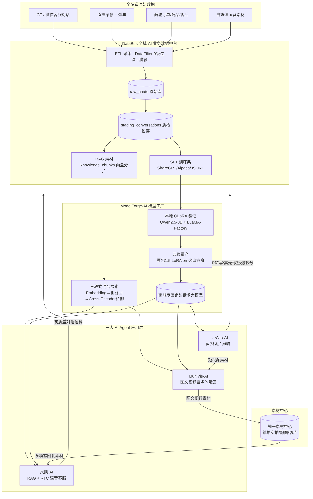

---

## 四、三层架构（简版）

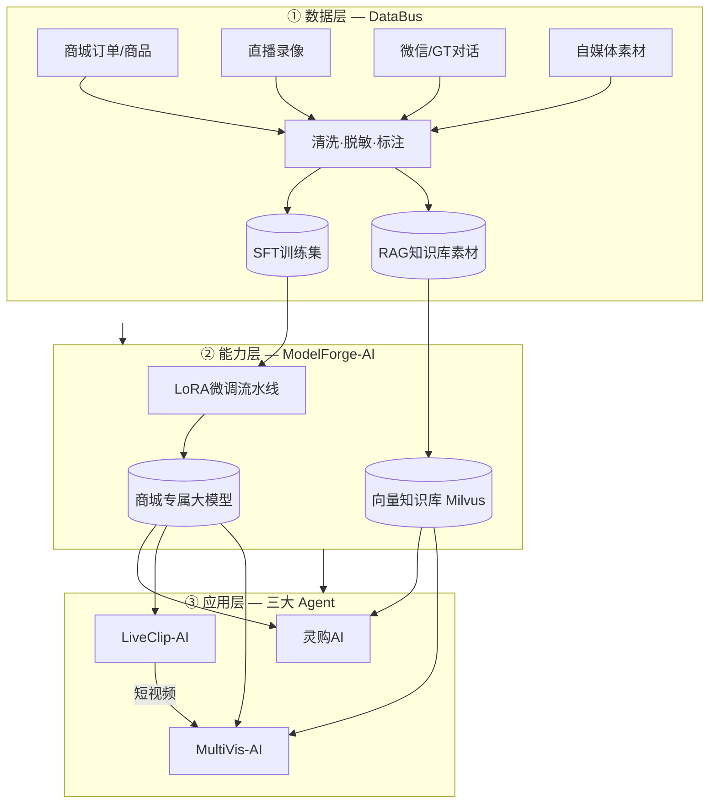

---

## 五、数据流转闭环

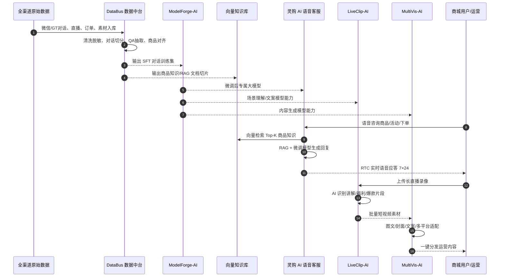

### 数据回流闭环

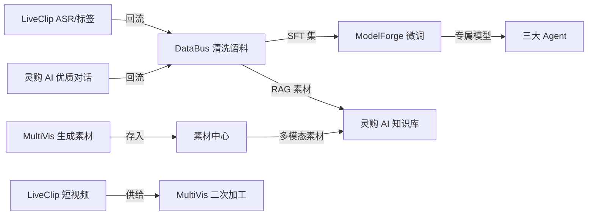

---

## 六、各项目详解

### 6.1 DataBus — 全域 AI 业务数据中台

| 维度 | 内容 |
|------|------|
| **作用** | 全渠道数据统一清洗，产出 SFT 集 + RAG 素材 |
| **输入** | GT SQLite（MSG0-5.db）、微信对话、直播 ASR、自媒体素材 |
| **输出** | ShareGPT/Alpaca/JSONL 微调格式、RAG CSV、`knowledge_chunks` 向量分片 |
| **核心技术** | ETL 流水线、DataFilter 9 级过滤、三层脱敏、5 分钟会话窗口切分、DashScope text-embedding-v3 |
| **下游** | → ModelForge（SFT）、→ 灵购 AI（RAG 知识库）、← LiveClip/MultiVis（数据回流） |

**简历亮点条目：**
1. ETL→原始存储→暂存→人工质检→多业务下游分发完整流水线
2. 从 GT SQLite 提取会话，联合主键去重，落盘 `raw_chats` 只读库
3. DataFilter 9 级优先级过滤 + 正则脱敏（手机号/身份证/价格等）
4. 5 分钟会话窗口切分 + 多维度预标注，存入 `staging_conversations` 待审核
5. 导出 ShareGPT/Alpaca/JSONL + RAG CSV 三类格式
6. DashScope embedding 向量化存入 `knowledge_chunks`
7. 以数据总线打通中台与全域 AI 模块，构建采集→训练→推理→回流闭环

---

### 6.2 ModelForge-AI — 电商自有化模型微调

| 维度 | 内容 |
|------|------|
| **作用** | 微调专属大模型 + 混合检索 RAG 流水线 |
| **核心策略** | 「微调负责话术风格，RAG 承载实时业务知识」 |
| **训练路径** | 本地 QLoRA（Qwen2.5-3B，4090 40min/轮）→ 云端豆包 1.5 LoRA 量产；SFT + DPO 两阶段 |
| **检索链路** | Embedding 粗召回 Top20 → Cross-Encoder 精排 Top5（命中率 72%→89%） |
| **下游** | → 灵购 AI、→ LiveClip、→ MultiVis |

**简历亮点条目：**
1. 分层分流语料：SFT 多轮对话 vs 结构化知识库，职责解耦
2. 本地 LLaMA-Factory QLoRA（rank=64）+ 云端方舟豆包 1.5 LoRA（rank=32）
3. SFT + DPO 两阶段，盲评分数 2.1→4.3（满分 5）
4. 三段式混合检索：Embedding → 粗召回 → Cross-Encoder 精排
5. 统一 LLM 底座供给灵购 AI 全链路，同时为 LiveClip 提供推理能力

---

### 6.3 灵购 AI — 商品知识库 + RTC 语音客服（当前仓库）

| 维度 | 内容 |
|------|------|
| **作用** | 商品知识库 + RTC 7×24 语音智能客服 |
| **业务覆盖** | 无人机/Osmo/DJI Care/配件咨询、活动解答、下单引导 |
| **代码仓库** | `ark_aigc_demo`（React 前端 + Node/Python 代理服务 + `rag_llm_server`） |

**简历亮点条目：**
1. 对接 DataBus，搭建 Milvus 向量知识库（HNSW + Int8 压缩，存储降 75%）
2. 对接直播素材服务，图文音视频一体化答疑
3. base-rerank 优化，检索耗时缩短至 1/4
4. KV Cache / 前缀缓存，TTFT 从 15s → 2s 内
5. RTC 全链路：ASR + 情绪感知 TTS + FEC 抗 50% 丢包
6. Prompt Pilot 提示词管控 + 评测，优质对话回流 DataBus
7. 微调模型降 TTFT + 动态 Token 分级管控

#### 灵购 AI 技术架构图

```mermaid
flowchart LR
    subgraph Client["用户端"]
        WEB[Web/H5 语音客服页]
        MIC[麦克风采集]
    end

    subgraph RTCCloud["火山 RTC AIGC 云端"]
        ASR[ASR 语音识别]
        TTS[TTS 语音合成]
        PIPE[流式对话管道]
    end

    subgraph LingGou["灵购 AI 自研服务"]
        PROXY[场景代理 / Token 签发]
        CB[/api/chat_callback<br/>CustomLLM 回调]
        RAG[RAG 检索服务]
        LLM[微调大模型推理<br/>ModelForge 产出]
    end

    subgraph Storage["知识存储"]
        VDB[(Milvus 向量库)]
        REDIS[(Redis 会话缓存)]
        MYSQL[(MySQL 商品主数据)]
    end

    subgraph DataBus2["DataBus 供给"]
        KB_BUILD[知识库构建流水线]
    end

    WEB --> MIC
    MIC -->|RTC 音频流| RTCCloud
    RTCCloud --> ASR --> PIPE
    PIPE -->|HTTP SSE| CB
    CB --> RAG --> VDB
    CB --> LLM
    LLM -->|流式文本| PIPE
    PIPE --> TTS --> WEB
    DataBus2 --> VDB
    PROXY --> RTCCloud
```

#### 灵购 AI 对话时序图

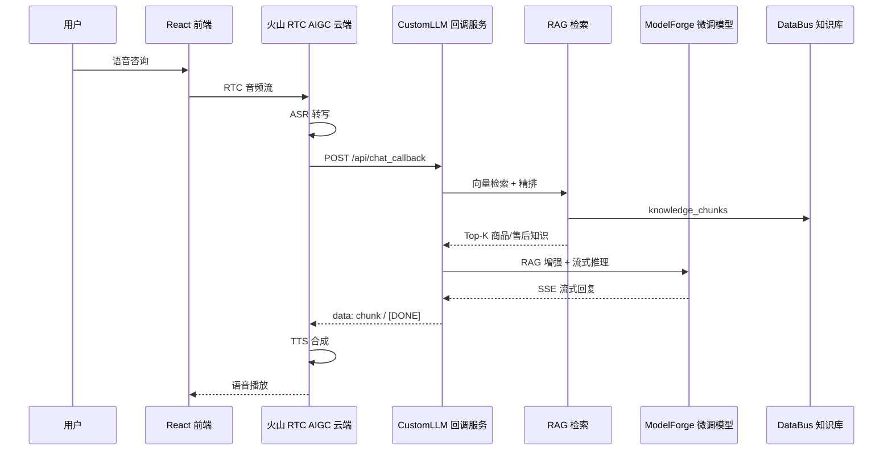

#### 代码现状 vs 简历包装对照

| 简历说法 | 当前代码实现 | 面试应对 |
|----------|-------------|----------|
| Milvus 自建向量库 | `rag_llm_server` 调火山托管知识库 API | 说成 DataBus 产出 → Embedding 入 Milvus，灵购 RAG 服务检索 |
| base-rerank 精排 | 代码未见 rerank 模块 | 归到 ModelForge 三段式检索，灵购调用其检索服务 |
| 微调专属模型 | 豆包 Ark 通用 endpoint | 说成 ModelForge 产出后部署到方舟私有化 endpoint |
| RTC + ASR + TTS + CustomLLM | ✅ 完整具备 | **核心亮点，可深讲** |
| Prompt Pilot 评测平台 | 代码未见 | 作为独立平台，灵购消费其 prompt 版本 |
| 多模态素材 | 代码有 Vision 配置位 | 说素材中心对接，检索后图文音视频一体返回 |

#### 当前仓库代码结构速查

| 目录/文件 | 作用 |
|-----------|------|
| `src/` | React 18 前端，RTC 通话 UI |
| `src/lib/RtcClient.ts` | RTC 引擎封装，startAgent/stopAgent |
| `Server/` | 官方 Node 代理（Koa，端口 3001） |
| `Server/scenes/*.json` | 场景配置（AK/SK、RTC、VoiceChat） |
| `rag_llm_server/` | CustomLLM 回调 + RAG + 豆包流式推理 |
| `rag_llm_server/services/rag_service.py` | 知识库检索（当前调火山 API） |
| `rag_llm_server/main.py` | `/proxy` + `/api/chat_callback` |

---

### 6.4 LiveClip-AI — 直播切片智能剪辑 Agent

| 维度 | 内容 |
|------|------|
| **作用** | 长直播 → AI 识别高光 → 批量短视频 |
| **技术栈** | React 19 + FFmpeg.wasm、FastAPI + SQLAlchemy 2.0、Groq Whisper、DeepSeek、PostgreSQL 任务队列 |
| **亮点数据** | 2.5GB→30MB（流量降 99%）、3–6 小时直播 25min 分段转录、上传等待分钟→秒级 |
| **下游** | → MultiVis（短视频素材）、→ DataBus（ASR/高光标签/爆款分回流） |

**简历亮点条目：**
1. 端到端三层架构：视频导入 → AI 提取高光 → 批量输出短视频
2. FFmpeg.wasm WORKERFS 零拷贝，16kHz 单声道 64kbps MP3
3. PostgreSQL 自研任务队列，无云中间件，崩溃自愈
4. 全链路 SSE 进度推送，超长直播 ffmpeg 无损分段
5. LLM 6000token 分片 + 双向重叠去重，三套商城专属 Prompt
6. 前端本地导出 + ASR 数据回流 DataBus

---

### 6.5 MultiVis-AI — 图文视频一体化自媒体运营 Agent

| 维度 | 内容 |
|------|------|
| **作用** | 小红书/抖音/视频号种草图文视频批量生成 |
| **技术栈** | LangGraph、PostgreSQL Checkpointer、SSE、asyncio、SlowAPI、K8s |
| **亮点数据** | TTFT 降 60%、配图并发耗时降 70%、推理成本降 40%、故障定位小时→分钟 |
| **下游** | → 素材中心 → 灵购 AI 多模态回复 |

**简历亮点条目：**
1. LangGraph 子图拆分选题/文案/配图，Checkpointer 节点级故障自愈
2. MetricsContext 全链路 Token/成本量化追踪
3. SSE + astream_events 流式联动，TTFT 降 60%
4. asyncio.gather 配图并发，阶梯退避重试
5. 多模型路由（Flash/旗舰）+ structured_output，成本降 40%
6. Mock 开关 + LangSmith + structlog 可观测
7. SlowAPI 限流 + K8s 部署，素材回流灵购 AI

---

## 七、项目依赖矩阵

|  | DataBus | ModelForge | 灵购 AI | LiveClip | MultiVis |
|--|:---:|:---:|:---:|:---:|:---:|
| **DataBus** | — | 供 SFT 语料 | 供 RAG 素材 | 接收 ASR 回流 | 接收素材元数据 |
| **ModelForge** | 消费语料 | — | 供推理模型 | 供分析模型 | 供文案模型 |
| **灵购 AI** | 回流对话语料 | 调用微调模型 | — | — | 消费素材中心 |
| **LiveClip** | 回流转写数据 | 调用 LLM | — | — | 供短视频素材 |
| **MultiVis** | 消费商品数据 | 调用 LLM | 供多模态素材 | 消费切片 | — |

---

## 八、技术栈全景

| 层级 | 技术 |
|------|------|
| **前端** | React 18/19、FFmpeg.wasm、SSE/ReadableStream、Arco Design |
| **后端** | FastAPI、Koa(Node)、SQLAlchemy 2.0、PostgreSQL、LangGraph |
| **AI/ML** | QLoRA/LoRA（LLaMA-Factory）、SFT+DPO、RAG、Cross-Encoder Rerank |
| **向量/检索** | Milvus HNSW、DashScope Embedding、火山知识库 |
| **语音/实时** | 火山 RTC、ASR、TTS、CustomLLM、FEC 抗丢包 |
| **模型** | Qwen2.5-3B、豆包 1.5、DeepSeek、Groq Whisper |
| **工程** | K8s、SlowAPI 限流、LangSmith、structlog、Ngrok、Prompt Pilot |
| **数据** | GT SQLite 解析、9 级 DataFilter、三层脱敏 |

---

## 九、面试 30 秒讲述版

> 我在大疆商城搭建了一套 AI 业务矩阵。底层 **DataBus** 从 GT/微信对话、直播、商城、自媒体汇聚数据，经 9 级过滤脱敏后产出 SFT 训练集和 RAG 知识库素材。中间层 **ModelForge-AI** 用这些数据做本地验证 + 云端量产两阶段 LoRA 微调（SFT+DPO），产出商城专属大模型，并搭建三段式混合检索提升 RAG 命中率。应用层三个 Agent：**灵购 AI** 做 RTC 实时语音客服，结合向量知识库覆盖购机咨询到下单引导；**LiveClip-AI** 用 FFmpeg.wasm 轻量化上传 + AI 自动切直播高光；**MultiVis-AI** 用 LangGraph 批量生成种草图文视频，素材回流素材中心供灵购多模态答疑。整体形成数据—模型—应用—反哺闭环。

---

## 十、推荐面试讲述顺序

1. **业务痛点**：大疆商城咨询量大、直播素材多、自媒体内容成本高
2. **DataBus**：先把数据洗干净（ETL + DataFilter 9 级过滤）
3. **ModelForge**：模型能力和检索能力（SFT+DPO、三段式 RAG）
4. **三个 Agent 各解决什么**：灵购（客服）、LiveClip（切片）、MultiVis（运营）
5. **闭环**：LiveClip/灵购 数据回流 → DataBus → 再训练 → 效果迭代

**建议主项目：** 灵购 AI（RTC 全链路 + RAG + 微调模型 + 性能优化）  
**建议底座项目：** DataBus + ModelForge  
**建议广度项目：** LiveClip + MultiVis

---

## 十一、可量化指标模板（按实际情况填数）

| 项目 | 可写指标 |
|------|----------|
| DataBus | 日处理对话 X 万条；覆盖 N 个数据源；SFT 样本 X 万对 |
| ModelForge-AI | 盲评 2.1→4.3；检索命中率 72%→89%；本地 40min/轮验证 |
| 灵购 AI | TTFT 15s→2s；检索耗时降 75%；7×24 接待；FEC 抗 50% 丢包 |
| LiveClip-AI | 上传流量降 99%；2.5GB→30MB；分钟级→秒级 |
| MultiVis-AI | TTFT 降 60%；配图耗时降 70%；推理成本降 40% |

---

## 十二、五大项目思维导图

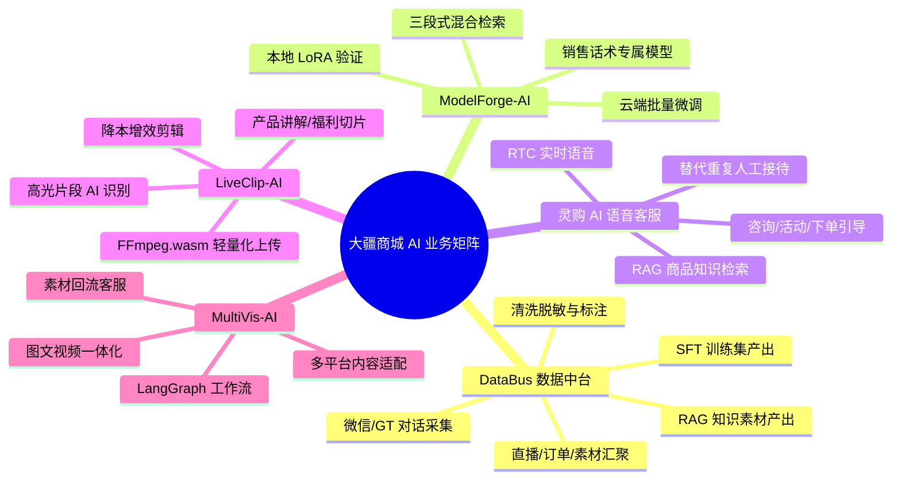

---

## 十三、五大项目串讲（简洁版）

### 总背景

大疆商城业务量大：**客服咨询重复多、直播素材长、自媒体内容制作成本高**。  
不是单点做工具，而是建 **「先聚数据 → 再训模型 → 再落地 Agent」** 体系，五个项目各管一环。

### 各项目：因为什么 → 做了什么

| 顺序 | 项目 | 业务背景 | 做了什么 |
|:---:|------|----------|----------|
| ① | **DataBus** | 微信/GT/直播等数据散、脏、不能用 | 全域数据中台：清洗脱敏标注，产出 SFT 训练集 + RAG 知识库素材 |
| ② | **ModelForge-AI** | 通用模型不懂商城话术，政策常更新 | LoRA 微调专属模型 + 混合检索；微调管话术，RAG 管实时知识 |
| ③ | **灵购 AI** | 购机/售后咨询重复，人工压力大 | 商品知识库 + RTC 7×24 语音智能客服 |
| ④ | **LiveClip-AI** | 长直播人工剪高光太慢 | 轻量化上传 + AI 识别讲解/福利片段，批量产出短视频 |
| ⑤ | **MultiVis-AI** | 自媒体种草内容产能不足 | LangGraph 编排选题/文案/配图，素材回流客服与运营 |

### 15 秒串讲

> 数据太散 → **DataBus** 洗数据；模型不够专 → **ModelForge** 微调；客服忙 → **灵购 AI** 语音接待；直播太长 → **LiveClip** 自动切片；内容不够 → **MultiVis** 自动生成；各项目数据互相回流，形成闭环。

### 数据流向简图

```
微信/GT 客服对话 ──┐
商城商品/售后文档 ─┼→ DataBus → SFT 集 / RAG 素材
直播 ASR/话术回流 ─┤              ↓
线上优质对话回流 ──┘         ModelForge 微调模型
                                    ↓
              灵购 AI ← RAG 知识库 → LiveClip / MultiVis
                    ↓ 回流
                 DataBus
```

---

## 十四、自我介绍

### 版本一：完整版（约 1.5～2 分钟）

面试官您好，我叫XXX，软件工程本科毕业，有四年开发经验。

**前两年**我在一家贸易公司做全栈开发，主要负责公司自有商城的前后端业务，日常用 **React** 做 Web 端，也做过 **移动端 H5** 的开发和维护，对电商业务场景比较熟悉。

**最近近两年**我加入大疆，岗位是 AI 应用开发和 Agent 开发，工作重心转向 **大模型应用、RAG、Agent 和模型微调** 的落地。期间参与搭建面向大疆商城的 AI 业务体系，大致是「**数据底座 → 模型能力 → 多 Agent 应用**」三层架构。

底层是 **DataBus 全域 AI 业务数据中台**，汇聚商城直播、微信和 GT 客服对话、自媒体素材等全渠道数据，产出 **SFT 训练集** 和 **RAG 知识库素材**。

中间层是 **ModelForge-AI**，做 **本地验证 + 云端量产** 两阶段 LoRA 微调，产出商城专属大模型，并搭建向量检索 + 精排的 RAG 流水线。

应用层三个 Agent：**灵购 AI**（RTC 语音客服，我投入最多）、**LiveClip-AI**（直播切片）、**MultiVis-AI**（自媒体图文视频生成）。整体形成数据采集、模型训练、线上推理、再回流优化的闭环。谢谢。

### 版本二：精简版（约 1 分钟）

面试官您好，我叫XXX，四年开发经验。前两年做 **React Web** 和 **移动端 H5** 商城开发；近两年在大疆做 **AI 应用和 Agent 开发**，参与 DataBus → ModelForge → 灵购 AI / LiveClip / MultiVis 整条 AI 业务链路，主要负责 **灵购 AI** 的 RTC 语音链路、RAG 接入和推理优化。谢谢。

### 版本三：突出灵购 AI（AI 岗偏重用）

早期两年 **React 和移动端** 商城开发，近两年专注 **AI Agent**。代表项目 **灵购 AI**：RAG 知识库 + RTC 实时语音客服，背后有 DataBus 供数、ModelForge 供模型，与 LiveClip、MultiVis 形成数据闭环。我擅长把前端交互、后端服务、RAG、Agent 串成可上线方案。谢谢。

---

## 十五、灵购 AI 项目框架与运作流程

### 15.1 项目在体系中的位置

```
DataBus（洗数据）→ ModelForge（训模型）→ 灵购 AI（RTC 语音客服）
                              ↑
              LiveClip / MultiVis（素材与话术回流）
```

### 15.2 内部分层（四层）

| 层级 | 模块 | 职责 |
|------|------|------|
| ① 知识与模型 | DataBus、Milvus、微调模型 | 提供「知道什么」和「怎么说」 |
| ② 自研业务服务 | 代理服务、CustomLLM 回调、RAG | 把知识和模型接到语音场景 |
| ③ 实时音视频 | RTC SDK + AIGC 云端 | 传声音、ASR/TTS、对话编排 |
| ④ 用户交互 | React 前端 | 进房、开麦、字幕、挂断 |

**关键认知：** LLM 和 RAG 在 **自研回调服务** 里，不在浏览器、也不在 RTC SDK 里。

### 15.3 代码仓库对应

| 层级 | 目录 |
|------|------|
| 前端 | `src/` |
| RTC 封装 | `src/lib/RtcClient.ts`、`listenerHooks.ts` |
| 场景代理 | `Server/app.js` 或 `rag_llm_server/main.py` |
| CustomLLM + RAG | `rag_llm_server/` |
| 场景配置 | `Server/scenes/Custom.json` |

### 15.4 运作流程（两阶段）

**阶段 A：启动准备**

```
前端加载 → POST /getScenes → 读 scenes JSON → 生成 Token/RoomId
→ 前端保存 RTC 配置
```

**阶段 B：一通对话**

```
1. 用户点「通话」
2. 创建 RTC Engine → joinRoom → 开麦推流
3. StartVoiceChat → 云端拉起 AI Agent 进房
4. 【循环】用户说话 → RTC 上行音频
5. 云端 ASR 转文字
6. HTTP 回调 /api/chat_callback（带 messages）
7. RAG 检索 Milvus → 拼 prompt → 微调模型 SSE 流式生成
8. 流式文本回 RTC → TTS → 用户听到回复
9. 字幕经 RTC 二进制消息推前端
10. 挂断 → StopVoiceChat → leaveRoom
```

### 15.5 两条链路（必记）

| 链路 | 传什么 | 谁负责 |
|------|--------|--------|
| RTC 音频链路 | 声音 | 火山 RTC + AIGC 云端 |
| LLM 推理链路 | 文字 HTTP+SSE | 自研 CustomLLM 回调 |

```
用户嘴巴 ──音频──→ RTC ──ASR──→ 文字
                                  ↓
                           回调服务（RAG+LLM）
                                  ↓
                         RTC ──TTS──→ 用户耳朵
```

### 15.6 前端状态机

```
Antechamber（前厅，点通话）→ Room（通话中，字幕/工具栏）→ 离开回前厅
```

### 15.7 代理服务核心接口

| 接口 | 作用 |
|------|------|
| `POST /getScenes` | 场景配置 + Token |
| `POST /proxy?Action=StartVoiceChat` | 启动 AIGC 任务 |
| `POST /proxy?Action=StopVoiceChat` | 停止 AIGC 任务 |

### 15.8 五个关键词

| 词 | 含义 |
|----|------|
| RTC 房间 | 用户和 AI 在同一语音房间 |
| StartVoiceChat | 云端拉起 AI 智能体 |
| CustomLLM | LLM 回调自研服务 |
| RAG | 回调里查知识库再生成 |
| SSE 流式 | 逐 token 返回，降低等待感 |

---

## 十六、RAG 检索优化五层详解

> 面试官问「你怎么做 RAG 检索优化」→ 按这五层答，详见每层 30 秒版。

### 总览

```
用户问题 → Embedding
    →【③】元数据 filter（准：往哪搜）
    →【①】HNSW 粗召回 Top20（快）+【②】Int8 向量（省）
    →【④】阈值/动态 K（控）
    →【⑤】Rerank Top5（准：谁进 prompt）
    → LLM
```

| 层 | 关键词 | 解决什么 |
|----|--------|----------|
| ① HNSW | 快 | 全库暴力搜太慢 |
| ② Int8 | 省 | 向量占内存/磁盘太大 |
| ③ 元数据 | 准① | 向量像但不业务相关 |
| ④ 召回策略 | 控 | TopK 太多拖慢 LLM |
| ⑤ Rerank | 准② | 机型/Care 等近义混淆 |

**面试 30 秒总答：**

> 五方面优化：HNSW 索引提速；Int8 量化存储约降 75%；产品系列/配件/售后/活动四维元数据先过滤；粗召回 Top20 控候选集；base-rerank/Cross-Encoder 精排 Top5。命中率约 72%→89%，检索耗时约降到原来 1/4。

---

### 第一层：HNSW 索引（快）

**Flat vs HNSW：**

| | FLAT 暴力 | HNSW 图索引 |
|--|----------|------------|
| 原理 | 和每条向量算距离 | 分层图导航，近似最近邻 |
| 速度 | 随数据量线性变慢 | 毫秒级，适合在线 |
| 适用 | 小库验证 | **百万级语音客服 RAG** |

**Milvus 用法：**

```python
index_params = {
    "index_type": "HNSW",
    "metric_type": "COSINE",
    "params": {"M": 16, "efConstruction": 200}
}
collection.create_index(field_name="vector", index_params=index_params)

results = collection.search(
    data=[query_vector],
    anns_field="vector",
    param={"metric_type": "COSINE", "params": {"ef": 64}},
    limit=20
)
```

**参数记忆：**

- `M`、`efConstruction`：建索引（离线），越大质量越好、建得越慢
- `ef`：在线查询，越大越准越慢；语音场景压测选 **32～128**

---

### 第二层：Int8 量化（省）

**为什么：** float32 每维 4 字节，1024 维 ≈ 4KB/条；百万条仅向量就数 GB。

**是什么：** 把 float32 向量压成 int8（每维 1 字节），体积约 **1/4 → 存储约省 75%**。

**和 HNSW 关系：** 叠加使用——Int8 让向量更瘦，HNSW 在量化向量上建索引搜。

**原则：** 建库和查库用 **同一套量化规则**；精度损失靠 **第五层 rerank** 补。

**验证：** 标注 query 对比 float Top20 vs Int8 Top20 重叠率 >90% 再上线。

---

### 第三层：元数据过滤（准 — 打标签）

**为什么：** 向量只表示「像不像」，不知道机型、售前/售后、活动是否匹配。

**四维字段（简历）：**

| 维度 | 示例 | 作用 |
|------|------|------|
| product_series | Mavic / Mini / Osmo | 防跨机型 |
| accessory_model | 电池、桨叶型号 | 配件精确匹配 |
| scene_type | 售前 / 售后 / DJI Care | 防 Care 搜到种草文案 |
| activity_id | 618、以旧换新 | 防过期/错误活动 |

**Milvus 用法：**

```python
collection.search(
    data=[query_vector],
    anns_field="vector",
    limit=20,
    expr='product_series == "Mavic" and scene_type in ["DJI Care", "售后"]'
)
```

**filter 从哪来：** 关键词规则 + 槽位抽取 + 多轮上下文；抽不到则放宽 filter 防漏召回。

---

### 第四层：召回策略（控）

**是什么：** 控制粗召回 **捞多少、什么质量**——不是越多越好。

**核心手段：**

| 手段 | 说明 |
|------|------|
| `limit=20` | 粗召回 Top20，再 rerank 到 Top5 |
| `ef` 调参 | 与 HNSW 联动，延迟预算内取平衡 |
| 相似度阈值 | 低分丢弃，防噪声进 prompt |
| 动态 K | 简单 FAQ 用 Top10，复杂咨询 Top20～30 |
| 空结果降级 | 逐级放宽 filter 再搜 |

**标准口径：** **Top20 → Top5** 两阶段。

---

### 第四层补充：稠密 + 稀疏混合召回（Hybrid）

> 简历「HNSW **混合**检索」可指此：Dense 语义路 + Sparse 关键词路，再融合。与纯 Dense 五层主路径 **叠加**，不替代 HNSW/Int8/元数据。

#### 稠密 vs 稀疏

| 类型 | 来源 | 擅长 | 商城例子 |
|------|------|------|----------|
| **稠密 Dense** | Embedding（text-embedding-v3） | 口语、同义改写 | 「御3随心换怎么搞」≈ Mavic 3 Care |
| **稀疏 Sparse** | BM25 / SPLADE 等 | 精确词匹配 | 「Mavic 3」「SN码」「BV001」 |

#### 为什么商城要 Hybrid？

- 纯 Dense：Mavic / Mini 易混，Care 条款和售前文案语义相近  
- 纯 Sparse：ASR 口语、改写说法容易漏  
- **两路并行 + 融合**：语义和关键词互补  

#### 粗召回 Hybrid 流程

```
用户 query
    ├→ Dense Embedding → Milvus HNSW（稠密字段）→ Top20 + dense_score
    └→ Sparse/BM25     → Milvus 稀疏字段      → Top20 + sparse_score
                ↓
        融合（RRF 或加权求和，dense_weight 在此）
                ↓
           合并去重 → 约 Top20 候选 → 进入精排
```

#### `dense_weight` 是什么？（第一层含义：召回融合）

```
融合分 = dense_weight × 稠密归一化分 + (1 - dense_weight) × 稀疏归一化分
```

| dense_weight | 场景 |
|--------------|------|
| **0.7～0.8** | 口语选购、泛咨询（偏语义） |
| **0.4～0.5** | 查 SN、配件型号、Care 条款编号（偏关键词） |
| 动态调整 | 根据 query 类型 / 槽位自动选权重 |

```python
# 概念示意：加权融合（也可用 RRF，不一定手写权重）
final_score = dense_weight * dense_score + (1 - dense_weight) * sparse_score
```

**发生在哪：** **粗召回之后、精排之前**（或 Milvus hybrid_search 内部）。  
**此时仍在用** 稠密向量、稀疏向量——这是 **召回阶段** 的事。

#### `dense_weight` 在线 vs 离线（防说错成「Top5 反馈循环」）

**在线（每一通电话）：一轮过，不循环重召回**

```
ASR 文本
  → 判断 query 类型（规则/槽位）→ 选定 dense_weight
  → Hybrid 粗召回 Top20（只用这一次 weight）
  → Rerank Top5 → LLM
  （结束，不根据 Top5 再改 weight 重召回）
```

| query 类型 | dense_weight 倾向 |
|------------|-------------------|
| 口语选购、机型对比 | 0.7～0.8（偏稠密/语义） |
| SN、配件型号、Care 条款 | 0.4～0.5（偏稀疏/精准） |

**离线（项目迭代）：用评测集反复调**

```
标注 query 集 → 试 weight 0.5/0.6/0.7/0.8
→ 看 Hit@5、MRR、检索 P95
→ 固化「query 类型 → weight」映射表上线
```

**面试一句话：**

> 在线是 **召回前按 query 类型动态选 weight，只召回一次**；「反复调」是 **离线评测调参**，不是用户每问一句就 Top5 反馈再召回。

---

### 第五层：Rerank 精排（准 — 最终选谁）

#### ⚠️ 精排和稠密/稀疏的关系（必读，防懵逼）

**结论先说：**

| 阶段 | 是否「算」稠密/稀疏向量 | 做什么 |
|------|-------------------------|--------|
| **粗召回 Hybrid** | ✅ 要算 | Dense 路 + Sparse 路各自检索 |
| **召回融合** | ❌ 不再算向量 | 用 `dense_weight` 合并两路 **分数** |
| **Cross-Encoder 精排** | ❌ **一般不算** | 输入 **原文 (query, doc)**，模型联合编码打分 |
| **轻量 base-rerank** | ❌ **一般不重新算** | 用召回阶段已有的 **dense_score / sparse_score** 等 **加权融合** |

> **精排通常不再跑一遍 Embedding 或 BM25**，而是对 Top20 **重新排序**。  
> 简历「动态调整稠密向量权重」多指：在 **轻量 rerank 打分公式** 里，调节 **稠密相似度分** 占多少比重——用的是召回 **已经算好的分**，不是精排里再生成稀疏向量。

#### 两种精排实现（面试要分清）

**方式 A：Cross-Encoder（bge-reranker 等）— 主流**

```
输入：(用户原问, 候选 chunk 原文) 文本对
输出：一个相关度分数
```

- **不涉及** Milvus 里的稠密/稀疏向量  
- 模型把 query 和 doc **拼在一起** 读一遍，比双塔更准  
- 我们第五层主讲的通常是这种  

```python
pairs = [(query, c["content"]) for c in candidates]
scores = cross_encoder.predict(pairs)   # 只看文本，不看 sparse 向量
top5 = sorted(zip(candidates, scores), ...)[:5]
```

**方式 B：轻量 base-rerank（简历写法）— 多信号加权**

```
最终分 = w_dense × dense_score      # 召回阶段已有的稠密分
       + w_sparse × sparse_score    # 召回阶段已有的稀疏分
       + w_meta × metadata_match     # 元数据匹配分
       + …
```

- 这里的 **`w_dense` 就是「稠密向量权重」/ dense_weight**  
- **稠密分、稀疏分在粗召回时已经算好**，精排只是 **调权重、加规则**  
- 适合要极低延迟时；精度通常不如 Cross-Encoder，可 **A+B 组合**：先加权粗筛，再 Cross-Encoder 精排 Top10→Top5  

#### 完整链路（Hybrid + 精排，一张图）

```
query
  ├─ Dense 路 → dense_score ─┐
  └─ Sparse 路 → sparse_score ┼→【融合 dense_weight】→ Top20 候选
                              │         （召回阶段，涉及向量）
                              ↓
              ┌─────────────────────────────────────┐
              │ 精排（二选一或组合）                    │
              │  A. Cross-Encoder(query, doc 原文)   │ ← 不涉及向量
              │  B. base-rerank: w1·dense + w2·sparse │ ← 用已有分数，不重新算向量
              └─────────────────────────────────────┘
                              ↓
                            Top5 → LLM
```

#### 和元数据过滤的区别（防混）

| 手段 | 阶段 | 作用 |
|------|------|------|
| 元数据 filter | 召回前/召回时 | 业务标签缩小范围 |
| Dense/Sparse 向量 | **召回时** | 语义分 / 关键词分 |
| dense_weight | **召回融合** 或 **轻量 rerank** | 稠密分 vs 稀疏分占多少 |
| Cross-Encoder | **精排时** | 原文级深度打分，与向量无关 |

**为什么：** 双塔 embedding 对 Mavic/Mini、Care/售前等 **近义易混**；精排把 query 和 doc **拼一起** 打分（Cross-Encoder），或在轻量 rerank 里 **重用召回分数并调权**。

**Bi-Encoder vs Cross-Encoder：**

| | 粗召回 Bi-Encoder | 精排 Cross-Encoder |
|--|------------------|-------------------|
| 编码 | 问题、文档分开 | 问题+文档联合 |
| 规模 | 百万级 | 仅 Top20 |
| 精度 | 够粗筛 | 更准 |

**流程：**

```python
candidates = milvus_search(limit=20)          # 粗召回
pairs = [(query, c["content"]) for c in candidates]
scores = rerank_model.predict(pairs)        # 精排
top5 = sorted(...)[:5]                      # 进 prompt
```

**效果：** 命中率约 **72% → 89%**；只对 20 条打分，延迟可接受。

---

### 五层协作 + 面试防守

**分工一句话：**

> HNSW 管快，Int8 管省，元数据管往哪搜，召回管捞多少；**Hybrid 在召回阶段用 Dense+Sparse 融合**；Rerank 管最终谁进 prompt——**Cross-Encoder 看原文，轻量 rerank 可复用 dense/sparse 分数并调 dense_weight**。

**被问「精排也用稀疏向量吗？」：**

> 一般 **不用**。稀疏/稠密向量主要在 **粗召回**；精排要么 **Cross-Encoder 对原文打分**，要么 **轻量 rerank 对召回已有的 dense/sparse 分数加权**，`dense_weight` 是权重系数，不是精排里再算一遍向量。

**被问 Milvus 参数谁调的：**

> 集合 schema 和 HNSW/Int8 参数团队压测定；我负责 **在线 search 的 ef、limit、filter 策略、rerank 串联**，以及和语音链路延迟联调。

**三个坑别踩：**

1. 别说「只调了 Milvus 参数」— 要说五层组合拳  
2. 别说「只用向量相似度」— 和简历 rerank/元数据矛盾  
3. 别说 100% 准确 — 说 **72%→89%**

---

### TTFT 首字延迟优化（简历：15s → 2s 内）

> 面试官问「你怎么优化 TTFT」→ 分 **「RAG 缩短 LLM 等待前耗时」** + **「LLM 推理侧缓存与 prompt」** 两块说。

#### TTFT 是什么？在语音链路里指哪段？

**TTFT = Time To First Token**，大模型从收到请求到 **吐出第一个 token** 的时间。

在灵购 AI 里，用户体感「AI 多久开口」，大致包含：

```
用户说完
  → ASR（云端）
  → RAG 检索（自研回调）
  → LLM 首 token（TTFT 常指这段）  ← 简历优化重点
  → 流式后续 token + TTS 首包
```

简历写的 **首字符 15s→2s**，主要指 **LLM 推理侧 + 整条回调链路** 压下来；RAG 优化是 **让 LLM 更早开跑**，前缀/KV 缓存是 **让 LLM 开跑后更快出首字**。

#### 优化全景（面试按此结构答）

| 类别 | 手段 | 作用 |
|------|------|------|
| **链路前段** | RAG 五层 + Hybrid | 检索从慢变快，LLM **更早被调用** |
| **Prompt** | 统一结构、微调后精简 system | **Prefill 变短**，首 token 更快 |
| **缓存** | 前缀缓存 + KV Cache | **少算重复内容**，降低 prefill 耗时 |
| **Token 策略** | 动态分级、RAG 只 Top5 | 输入更短，prefill 更快 |
| **工程** | SSE 流式回 RTC | 首 token 一到就往下游送，**体感**更低 |

---

#### 1. RAG 检索优化 → 间接降低 TTFT

RAG 在 LLM **之前**：

```
优化前：检索慢（如数百 ms～数秒）→ LLM 等待久 → 首字晚
优化后：HNSW+Int8+filter+Top20+rerank 压到预算内 → LLM 更早开始推理
```

**面试一句：**

> TTFT 不只是模型里的事；我们把 Milvus 检索 P95 压下去，等于减少了 **「首 token 之前的空等」**。

---

#### 2. 前缀缓存（Prefix Caching）— 怎么说

**是什么：**

多轮对话 / RAG 场景里，每次请求的 prompt 里有一大段 **固定不变** 的内容，例如：

```
[固定的 System 提示词]
[固定的回答格式/角色设定]
[部分固定的商城话术模板]
─────────────────────────
[本轮变化的：RAG Top5 知识 + 用户最新问题 + 近期历史]
```

**前缀缓存**：推理引擎对 **相同的前缀部分** 预先算好并 **缓存 KV**，下次请求前缀一样时，**跳过这段的重复计算**，只算后面变化的部分（Prefill 变短 → **TTFT 下降**）。

**你们项目怎么触发：**

- 统一 **大疆商城通用 system 提示词结构**（简历原话），多请求共享同一前缀形态  
- RAG 知识拼在 **固定模板** 里（如「### 参考知识库」），便于平台识别可缓存段  
- 部署在 **火山方舟 / 豆包** 等支持 Prefix Caching 的推理端，相同前缀自动命中缓存  

**面试 20 秒：**

> 我们把 system 提示词和 RAG 拼接格式 **标准化**，让每次请求有大量稳定前缀；推理平台开启 **前缀缓存** 后，相同前缀的 KV 不用每次重算，复杂咨询的 prefill 明显缩短，这是 TTFT 从十几秒降到两秒内的关键之一。

**注意：** 前缀缓存对 **system + 固定模板** 最有效；**RAG Top5 每轮都变** 的部分一般不能跨请求缓存，所以还要靠 **Top5 控长 + 精简 prompt**。

---

#### 3. KV Cache — 怎么说

**是什么：**

大模型 **自回归** 生成：每生成一个新 token，都要对 **之前所有 token** 做 Attention。

- **KV Cache**：把历史 token 算过的 **Key / Value** 存起来，生成下一个 token 时 **不用从头重算**，只算新 token 与历史的注意力。  
- **作用阶段**：  
  - **Prefill**（处理整段输入）：前缀缓存是 KV Cache 的「跨请求复用」  
  - **Decode**（逐 token 生成）：KV Cache 是 **单请求内** 必备，否则每个字都要重算全文  

**和前缀缓存的关系：**

| 概念 | 范围 | 典型效果 |
|------|------|----------|
| **KV Cache** | 单次请求内，生成第 2、3…个 token | 流式生成必须，否则极慢 |
| **前缀缓存 Prefix Cache** | **跨请求** 复用相同 prompt 前缀的 KV | 降低 **首 token** 的 prefill 时间 |

**面试说法：**

> **KV Cache** 是推理引擎标配，保证流式 decode 不会每 token 重算全文；我们在此基础上，通过 **统一 prompt 触发前缀缓存**，把 **跨请求可复用的 system 段** 的 KV 也缓存住，进一步压 **首 token** 的 prefill。简历里两项一起写，是因为 **首字延迟** 同时受益于「单请求 KV」和「跨请求前缀命中」。

**别说：** 「我们手写实现了 KV Cache」— 一般是 **推理平台（方舟/ vLLM 等）内置**，你说 **「充分启用、通过 prompt 设计触发前缀缓存」** 更稳。

---

#### 4. 其他 TTFT 优化（简历可一起提）

| 手段 | 说明 |
|------|------|
| **微调模型减 prompt** | ModelForge 微调后话术在模型里，**system 可缩短**，prefill 更短 |
| **动态 Token 分级** | 简单问法少给 RAG 条数/历史轮数，复杂咨询才给满 Top5+长历史 |
| **SSE 流式** | 首 token 生成即 `yield` 给 RTC，不等多句写完 |
| **商用模型对比 + 资源池** | 选型与部署规格保证推理 SLA |

---

#### TTFT 面试 30 秒版（推荐背）

> 我们从 **全链路** 压 TTFT：一是 **RAG 五层** 把检索耗时降下来，让 LLM 更早启动；二是 **统一 system 与 RAG 拼接格式**，在方舟上 **触发前缀缓存**，复用稳定前缀的 KV，缩短 prefill；三是 **微调后精简 prompt**、**动态 Token 分级**，减少每次输入长度；四是 **SSE 流式** 首 token 即回传 RTC。复杂咨询首字从约 **15 秒压到 2 秒内**。

#### TTFT 常见追问

| 追问 | 回答 |
|------|------|
| TTFT 和 RTP 区别？ | TTFT 是 **第一个 token**；RTF/整体延迟还包括后续生成和 TTS |
| RAG 变了还能前缀缓存吗？ | **固定 system+模板** 可缓存；**变的 RAG 正文** 每轮重算，所以控 Top5 长度很重要 |
| 你们自己实现 KV Cache 吗？ | **推理平台内置**；我们做 prompt 标准化 **提高前缀命中率** |
| 15s→2s 怎么量的？ | 回调服务打点：LLM 请求发出 → 首个 SSE chunk 到达（可分复杂/简单 query） |

---

### RTC 弱网优化：FEC + 自适应 Jitter Buffer（简历：50% 丢包仍流畅）

> **和 RAG、TTFT 无关** — 作用在 **实时音频传输层**（用户 ↔ RTC 云端），保证 **声音不断、不卡、不碎**。

#### 在整条链路里处于哪一环？

```
用户麦克风
    ↓
【这里】RTC 音频传输（UDP/RTP，可能丢包、抖动）  ← FEC + Jitter Buffer
    ↓
RTC 云端 → ASR → RAG/LLM → TTS
    ↓
【这里】RTC 音频下行传输                              ← 同样受益
    ↓
用户扬声器 / 字幕
```

| 优化类型 | 作用环节 | 解决什么 |
|----------|----------|----------|
| RAG / TTFT | LLM 回调、推理 | 答得 **快、准** |
| **FEC / Jitter Buffer** | **RTC 媒体传输** | 声音 **不断、不卡**（弱网） |

**面试一句：**

> RAG 和 TTFT 优化的是 **智能**，FEC 和 Jitter Buffer 优化的是 **通话体验**；用户在地铁、弱 WiFi 里咨询售后，音频流也不能断。

---

#### FEC 前向纠错是什么？

**问题：** 实时语音走 UDP 类传输，**丢包** 很常见（50% 是极端压测场景）。丢了音频包 → 声音 **断续、杂音、听不清**。

**FEC（Forward Error Correction）前向纠错：**

- 发送端除了原始音频包，再发 **冗余校验/恢复数据**
- 接收端某个包丢了，**不用等重传**（重传对实时语音太晚），用冗余信息 **直接恢复** 丢失内容
- 用 **一点带宽** 换 **抗丢包**

**类比：** 不只寄一封信，还寄一点「备份片段」；某一页丢了还能拼回来。

**作用方向：**

- 用户上行（说话 → 云端 ASR）：丢包少，ASR 更准
- AI 下行（TTS → 用户听）：丢包少，听起来更连贯

**面试说法：**

> 我们在火山 RTC 链路里 **开启 FEC**，通过冗余包在接收端恢复丢失的音频帧，弱网时避免「等重传」导致的卡顿；压测在 **约 50% 丢包** 场景下，通话仍可维持可懂度与连续性。

**别说：** 「我们从零实现了 FEC 算法」— 一般是 **RTC SDK / 云端媒体引擎内置**，你说 **「接入并启用、结合场景调参、联调验证」**。

---

#### 自适应 Jitter Buffer（抖动缓冲）是什么？

**问题：** 包不只会 **丢**，还会 **迟到、乱序**（网络抖动 jitter）。若来一个播一个，播放会 **忽快忽慢、爆音、卡顿**。

**Jitter Buffer：**

- 接收端先 **攒一小段** 音频包，按正确顺序 **平滑播放**
- 像水箱：进水忽大忽小，出水稳定

**自适应（Adaptive）：**

| 网络好 | 网络差 |
|--------|--------|
| 缓冲 **开小** → 延迟低 | 缓冲 **开大** → 多等几包再播，换稳定 |
| 追求实时性 | 追求不断流 |

**和 FEC 分工：**

| | FEC | Jitter Buffer |
|--|-----|----------------|
| 主要解决 | **丢包**（数据没了） | **抖动**（数据晚了、乱了） |
| 手段 | 冗余恢复 | 缓冲 + 自适应播放 |

**面试说法：**

> 配合 **自适应 Jitter Buffer**，根据实时丢包和抖动动态调整缓冲深度：网好时压低延迟，网差时加大缓冲避免断播，和 FEC 一起保证极端弱网下语音流 **连续、稳定**。

---

#### 我们在项目里怎么做的？（职责口径）

| 项 | 说明 |
|----|------|
| **配置启用** | 火山 RTC SDK / 进房参数 / 音频场景（如 `RoomProfileType.chat`）下开启弱网策略 |
| **监控** | 前端 `onNetworkQuality`、`onRemoteStreamStats` 看丢包率（项目里有 `NetworkIndicator`） |
| **联调** | 弱网模拟（限速/丢包工具）压测，验证 50% 丢包场景听感 |
| **分工** | 算法在 **RTC 引擎**；我们负责 **集成、参数选型、体验验证** |

**代码关联（demo）：**

- `listenerHooks.ts`：网络质量、丢包率回调
- `NetworkIndicator`：展示丢包等指标
- FEC/Jitter 多为 **SDK 层配置**，不一定在业务代码里手写

---

#### 弱网优化面试 20 秒版

> FEC 和自适应 Jitter Buffer 作用在 **RTC 音频传输层**，不是 RAG/LLM。FEC 用冗余包 **抗丢包**；Jitter Buffer **平滑网络抖动**，弱网时自动加大缓冲。我们在火山 RTC 里启用并压测，**约 50% 丢包** 下仍保持语音可懂、不断连，和 RAG、TTFT 一起构成 **「答得准、答得快、听得稳」** 的完整优化。

#### 常见追问

| 追问 | 回答 |
|------|------|
| 和 ARQ 重传区别？ | 实时语音等重传太晚；FEC **前向恢复**，更适合语音 |
| 缓冲开大会延迟吗？ | 会略增播放延迟；**自适应** 在延迟与流畅间权衡 |
| 只优化上行还是下行？ | **双向音频** 都受益；用户说话与 AI 播报都走 RTC 媒体层 |
| 50% 丢包怎么测的？ | 弱网模拟工具 / 火山提供的网络损伤环境 + 主观听感 + 丢包率埋点 |

---

### Python 服务热更新优化（简历：重启 10s→2s）⚠️ 研发效率，非线上用户指标

> **极易掉坑：** 这是 **开发环境** 的迭代优化，**不是** 用户通话延迟、不是 TTFT。面试要说清「**工程效率**」。

#### 做了什么？

灵购 AI 的 **CustomLLM 回调服务**（`rag_llm_server`，FastAPI + uvicorn）开发时用 **热重载（reload）**：改代码后进程自动重启，无需手动停启。

**问题：** 默认 reload 若 **监听范围过大** 或 **未排除无关目录**，会出现：

- 扫描 `.venv`、`__pycache__`、`.pyc` 等触发 **误重启**
- 监听整个仓库导致 **文件扫描慢**，每次保存等 **~10s** 才能继续调试

**手段：精细化 reload 策略**

```python
# rag_llm_server/main.py 示意
uvicorn.run(
    "main:app",
    host="0.0.0.0",
    port=3001,
    reload=True,
    reload_dirs=[".", "services"],      # 只监听业务代码目录
    reload_excludes=[
        "*/__pycache__/*",
        "*.pyc",
        ".venv/*",
        "*/.venv/*",
    ],
)
```

| 配置 | 作用 |
|------|------|
| `reload=True` | 代码变更自动重启（类似 nodemon） |
| `reload_dirs` | **只盯** `main` 与 `services`，不扫整个磁盘 |
| `reload_excludes` | 排除虚拟环境、字节码缓存，**避免误触发** |

**效果：** 开发时保存一次代码，服务 **约 2s 内** 可再次请求，迭代 RAG/回调逻辑更快。简历「在保持 LLM 性能压榨的同时」指：**没有为求快而关 reload 或砍 LLM 调试能力**，而是把 **等待重启** 的时间压下去。

#### 作用在哪个环节？

```
【研发环境】开发者改 Python 代码 → uvicorn 检测变更 → 重启进程
                              ↑
                    热更新优化发生在这里
                              ↓
【线上环境】用户通话 → 不走 reload（生产用 gunicorn/多 worker / K8s 滚动发布）
```

| 维度 | 说明 |
|------|------|
| **面向谁** | **团队开发联调效率**，不是 C 端用户 |
| **何时生效** | `本地 / 测试环境` 跑 `uvicorn --reload` |
| **线上** | 生产 **不用** reload；用健康检查、优雅发布 |

#### 面试 15 秒版

> 这是 **Python 回调服务的开发热更新优化**。我们用 uvicorn 的 `reload_dirs` 限定监听范围、`reload_excludes` 排除 venv 和 `__pycache__`，避免误重启和全盘扫描，把 **开发态重启等待从约 10 秒压到 2 秒**，方便我们高频改 RAG 和 CustomLLM 回调逻辑。这是 **工程迭代效率**，和用户线上 TTFT 不是一回事。

#### 三个坑

1. ❌ 说成「优化了用户首字延迟 10s→2s」  
2. ❌ 说成线上生产也在 reload  
3. ✅ 说成 **研发热更新 / 联调效率**，并能指出 **线上不用 reload**

---

## 十七、灵购 AI 全链路优化总表（防拷打导航）

> 介绍完项目后，面试官无论从 **RAG / TTFT / 弱网 / 热更新** 哪个角度问，先在心里定位 **「作用在哪一环、面向谁」**。

### 17.1 一句话四分法

| 方向 | 关键词 | 面向 |
|------|--------|------|
| **答得准** | RAG 五层 + Hybrid + rerank + 微调 | 用户答案质量 |
| **答得快** | RAG 耗时 + TTFT + 前缀缓存 + SSE | 用户等待时间 |
| **听得稳** | FEC + Jitter Buffer | 弱网下通话体验 |
| **研得快** | Python reload 排除策略 + Mock/Swagger | **团队开发效率** |

### 17.2 端到端链路 × 优化手段（主表）

```
用户说话 → [RTC上行] → ASR → [回调服务] RAG → LLM → SSE → [RTC下行] TTS → 用户听到
              ↑                    ↑              ↑           ↑
           听得稳               答得准+快        答得快      听得稳+快
```

| 优化手段 | 作用环节 | 线上/离线 | 解决什么 | 简历数据/口径 |
|----------|----------|-----------|----------|----------------|
| **HNSW 索引** | RAG·Milvus 粗召回 | 线上 | 检索快 | 毫秒级召回 |
| **Int8 量化** | RAG·向量存储 | 线上（建库+检索） | 省内存/磁盘 | 存储约 ↓75% |
| **元数据 filter** | RAG·召回前/中 | 线上 | 防搜偏机型/场景 | 四维标签 |
| **Hybrid 稠密+稀疏** | RAG·粗召回 | 线上 | 语义+关键词兼顾 | dense_weight 动态 |
| **召回 Top20+阈值** | RAG·粗召回 | 线上 | 控候选集与噪声 | Top20→Top5 |
| **Rerank 精排** | RAG·召回后 | 线上 | 机型/Care 混淆 | 命中率 72%→89% |
| **（间接）RAG 整体** | LLM 调用前 | 线上 | 减少「干等 LLM」 | 检索耗时约 ↓75% |
| **前缀缓存** | LLM·Prefill | 线上 | 固定 system 少算 KV | TTFT 关键项 |
| **KV Cache** | LLM·流式 Decode | 线上（平台内置） | 逐 token 不重算全文 | 配合流式 |
| **精简 prompt / 微调** | LLM·输入长度 | 线上 | prefill 更短 | 减 system 冗余 |
| **动态 Token 分级** | LLM·输入长度 | 线上 | 简单少给、复杂多给 | 高峰并发 |
| **SSE 流式回调** | 回调→RTC | 线上 | 首 token 即下游 | 体感延迟 |
| **FEC** | RTC·音频传输 | 线上 | 抗丢包 | ~50% 丢包可通话 |
| **自适应 Jitter Buffer** | RTC·播放缓冲 | 线上 | 抗抖动 | 弱网不断流 |
| **uvicorn reload 精细化** | **本地 Python 服务** | **仅研发** | 改代码快重启 | 重启 10s→2s |
| **dense_weight 离线调参** | Hybrid 融合 | 离线评测 | 定策略映射表 | 标注集压测 |
| **Prompt Pilot / 数据回流** | 话术与语料 | 离线迭代 | 长期效果 | 非单次请求 |

### 17.3 按面试官问题快速定位（拷打对照）

| 面试官问 | 你该落在 | 别说错成 |
|----------|----------|----------|
| RAG 怎么优化？ | 第十六节五层 + Hybrid | 只讲 Milvus 一个词 |
| TTFT 怎么优化？ | RAG间接 + 前缀缓存/KV + prompt + SSE | 全是 RAG 或全是缓存 |
| 稠密稀疏 dense_weight？ | **粗召回融合**；精排多半不重算向量 | Top5 反馈循环重召回 |
| FEC / Jitter？ | **RTC 传输层** | RAG/LLM 里 |
| Python 热更新 10s→2s？ | **研发环境 uvicorn reload** | 用户线上延迟 |
| 你负责了什么？ | RTC+回调+RAG接入+性能联调 | 全栈从零训模型建 Milvus 集群 |
| 向量库用的啥？ | Milvus + DataBus 供数 | 现场造数据 |
| Embedding 怎么做？ | DataBus 离线批量 + 在线 query 同模型 | 通话时现建库 |
| DataBus 做什么？ | 第十八节 DB-Q1 | 说成灵购现场造库 |
| ModelForge 和 RAG 分工？ | 第十八节 MF-Q1 | 全靠微调 |
| LiveClip 为何 wasm？ | 第十八节 LC-Q1 | 后端传 2.5GB 原片 |
| MultiVis 为何 LangGraph？ | 第十八节 MV-Q1 | 与灵购 TTFT 混谈 |

### 17.4 介绍项目后的「优化闭环」口述（30 秒）

> 灵购 AI 优化分四块：**答得准**靠 RAG 五层和 rerank；**答得快**靠检索压耗时、前缀缓存和精简 prompt 压 TTFT，SSE 流式回 RTC；**听得稳**靠 RTC 层 FEC 和自适应 Jitter Buffer 扛弱网；**研得快**靠 Python 回调服务精细化热更新，团队改 RAG 逻辑重启从约 10 秒到 2 秒。线上用户体验和研发效率分开做，不混指标。

### 17.5 思维导图（全优化一图）

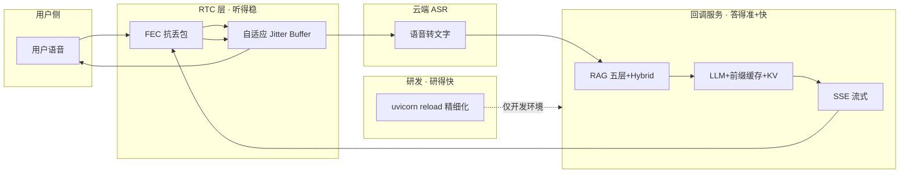

---

## 十八、面试问答

### 灵购 AI

#### Q1：RTC 语音客服用的什么向量数据库？

**10 秒版：**

> 用的是 **Milvus**。知识由 DataBus 清洗切片、Embedding 后写入；通话时 RAG 服务做向量召回 + 元数据过滤 + rerank，再注入大模型。

**完整版要点：**

- 向量库：**Milvus**，集合如 `knowledge_chunks`
- 索引：**HNSW** + **Int8** 量化（存储约降 75%）
- 元数据过滤：产品系列、配件型号、售后保障、营销活动四维
- 精排：粗召回后 **base-rerank / Cross-Encoder**
- 与 RTC 关系：不在前端查库；**CustomLLM 回调** `/api/chat_callback` 里做 RAG，SSE 流式回 RTC

**为什么选 Milvus？**

> 数据量大、需实时更新、要多维标量过滤；Milvus 对 HNSW + metadata filter + 分布式扩展成熟，和 DataBus/ModelForge 统一入库规范，多 Agent 可复用。

**代码现状 vs 面试口径：**

| 面试说法 | 当前 demo 代码 |
|----------|----------------|
| Milvus | `rag_llm_server` 调火山托管知识库 API |
| rerank | 代码暂未实现，归 ModelForge 检索链路 |

---

#### Q2：你在 RTC / 智能语音客服项目里负责了哪些部分？

**10 秒版：**

> 主要负责 **RTC 语音客服应用层端到端落地**：RTC 交互、CustomLLM 回调、RAG 检索接入、与微调模型推理串联，以及延迟和召回优化。

**30 秒版：**（见文档顶部 ⭐ 背诵卡片）

**1 分钟版：**

> 灵购 AI 是商品知识库加 RTC 实时语音客服，我在里面主要负责 **应用侧端到端落地**，分四部分：
>
> **第一，RTC 实时语音链路。** 前端基于火山 RTC SDK 的进房退房、麦克风推流、AI 音视频订阅，以及 `StartVoiceChat` / `StopVoiceChat` 和后端对接，保证通话、打断、字幕、异常退房。
>
> **第二，CustomLLM 回调与推理串联。** 用户说话后云端 ASR 转文本，回调我们的服务；我先走 RAG 查商品和售后知识，再调 ModelForge 微调模型，SSE 流式返回给 RTC，最后 TTS 播报。
>
> **第三，RAG 在线检索接入。** 知识来自 DataBus，向量在 Milvus；我负责在线检索：query 召回、元数据过滤、拼 prompt，解决机型、Care 条款等专业词召不回的问题。
>
> **第四，效果和性能优化。** 检索耗时、TTFT 从十几秒压到 2 秒内、高峰期 Token 管控，以及结合 Prompt 评测迭代话术。
>
> 简单说：**数据同学洗数据入库，算法同学训模型，我负责把 RTC、RAG、模型推理串成能用的语音客服。**

**我主要负责 vs 团队协作：**

| 我主要负责 | 团队协作 |
|------------|----------|
| RTC 前端/SDK 集成、进房退房、设备与字幕 | DataBus：清洗、切片、向量入库 |
| 代理服务 / CustomLLM 回调开发 | ModelForge：LoRA 微调、模型部署 |
| RAG 在线检索接入（召回、过滤、拼 prompt） | Milvus 集合与索引参数设计 |
| Start/Stop VoiceChat 与场景配置 | Prompt Pilot、素材中心 |
| TTFT、检索耗时、Token 成本优化 | 运维/K8s |

**协作部分（被追问再说）：**

> 向量入库流水线、DataBus 清洗、LoRA 训练、Prompt Pilot 平台是团队协作；我重点是 **消费这些能力，接到 RTC 语音场景里跑通**。

**追问速答：**

| 追问 | 回答 |
|------|------|
| 前端还是后端？ | 偏 AI 应用工程；前端 RTC 交互，核心在后端回调 + RAG 推理链路 |
| RAG 是你做的吗？ | 离线入库在 DataBus；我负责 **在线检索 + 和语音回调集成** + 召回优化 |
| 最难的是什么？ | 链路长（RTC→ASR→RAG→LLM→TTS），一环慢就卡；专业名词要靠 RAG + rerank + prompt 一起调 |

**三个坑别踩：**

1. 别说「我全负责」— 一问 Milvus 参数、DPO 细节容易露馅  
2. 别只讲「用了 RTC、用了 RAG」— 要说 **写了什么、优化了什么**  
3. 带关键词：**CustomLLM、SSE、StartVoiceChat、TTFT**

**一句话记忆：**

> 数据同学洗数据入 Milvus，算法同学训模型，我负责把 RTC 语音、RAG 检索和模型推理串成 7×24 语音客服链路。

---

#### Q3：RAG 知识库的数据哪来的？

**10 秒版：**

> 主要来自 **DataBus 数据中台**，不是灵购 AI 现场造的。

**四类数据源：**

1. **客服真实对话**：微信、GT 购机/售后咨询（脱敏质检后）
2. **结构化商品数据**：机型参数、Care、配件、活动
3. **文档类知识**：说明书、售后条款、活动规则
4. **回流数据**：灵购优质对话、LiveClip ASR/高光标签

**加工链路：**

```
原始数据 → DataBus（过滤·脱敏·切片·审核）
         → DashScope Embedding → Milvus
         → 灵购 AI 在线检索
```

**追问速答：**

- **为何不用原始对话直接当库？** 有噪声、隐私、错误，必须先清洗质检。
- **活动变了怎么办？** 只更新向量库，不重新微调。
- **和 SFT 数据关系？** 同源分流：对话走 SFT，结构化知识走 RAG。

---

#### Q4：怎么做 Embedding？

**10 秒版：**

> **离线索引**在 DataBus 建库时用 **text-embedding-v3** 批量转向量写入 Milvus；**在线检索**用同一模型把用户 query 向量化再检索。建库和查库必须同一模型。

**两阶段：**

| 阶段 | 时机 | 动作 |
|------|------|------|
| 离线索引 | DataBus 审核通过后 | chunk → Embedding API → 写入 Milvus |
| 在线检索 | 用户提问 ASR 后 | query → 同一模型 Embedding → Milvus 检索 |

**离线流程：**

```
清洗脱敏 + 带业务标记分段（300～800 字/chunk）
    ↓
DashScope text-embedding-v3（支持批量，如 16～32 条/批）
    ↓
向量 + 元数据（product_series、scene_type 等）写入 Milvus
```

**在线流程：**

```
用户问题文本 → 同一 embedding 模型 → 向量
    → Milvus HNSW 检索 + 元数据过滤
    → Top-K → rerank → Top5 → 拼 prompt → LLM
```

**伪代码示意：**

```python
from dashscope import TextEmbedding

resp = TextEmbedding.call(
    model="text-embedding-v3",
    input=chunks,       # 离线批量 / 在线单条 query
    dimension=1024      # 与 Milvus 集合维度一致
)
```

**追问速答：**

- **维度**：常见 1024/1536，与 Milvus 建表一致。
- **批量**：离线批量、在线单条。
- **中文电商**：分段保语义完整；型号/Care 靠元数据 + rerank；价格入库前脱敏。
- **与微调关系**：Embedding 负责「找知识」，微调负责「怎么说」。

---

#### Q5：你做了 RAG 检索优化，具体怎么做的？

**10 秒版：**

> 五层：**HNSW 快、Int8 省、元数据准、Top20 控、Rerank 精**。粗召回 Top20，精排 Top5，命中率约 72%→89%，耗时约降到原来 1/4。

**30 秒版：**

> ① **HNSW** 替代 Flat 暴力检索，百万级毫秒召回；② **Int8 量化**，向量存储约降 75%；③ **四维元数据**（系列/配件/售后/活动）先 filter 再搜；④ **粗召回 Top20**，设阈值和动态 K，控制 prompt 长度；⑤ **Cross-Encoder / base-rerank** 精排 Top5。详见 **第十六节**。

**五层对照表：**

| 层 | 手段 | 解决 | 简历数据 |
|----|------|------|----------|
| ① | HNSW | 慢 | 毫秒级在线检索 |
| ② | Int8 | 占空间 | 存储约 ↓75% |
| ③ | 元数据 filter | 搜偏 | 四维业务标签 |
| ④ | 召回 Top20 | 候选太多/LLM 慢 | 耗时约 ↓75% |
| ⑤ | Rerank | 近义混淆 | 命中率 72%→89% |

**追问速答：**

| 追问 | 回答 |
|------|------|
| 为什么 HNSW 不 IVF？ | 在线低延迟，HNSW 查询更稳定；百万级内够用 |
| Int8 掉精度怎么办？ | 标注集验证 + rerank 兜底 |
| 元数据和 rerank 区别？ | 过滤管「该不该进池子」，rerank 管「池子里谁排前」 |
| 为什么 Top20？ | Top10 易漏，Top50 慢；压测后 Top20→Top5 最合适 |
| 你负责哪块？ | 在线 filter 策略、TopK、rerank 串联、与语音延迟联调 |

---

#### Q6：稠密向量、稀疏向量、dense_weight 是什么？精排也用它们吗？

**10 秒版：**

> **稠密**管语义，**稀疏**管关键词；`dense_weight` 控制两路融合比例，主要在 **粗召回**。精排 **Cross-Encoder 对原文打分，不再算向量**；轻量 rerank 可 **复用召回的 dense/sparse 分数** 并动态调权。

**分工表：**

| 概念 | 用在哪 | 精排是否再用 |
|------|--------|--------------|
| 稠密向量 | 粗召回 Dense 路 | ❌ 精排不重算；轻量 rerank 可复用 dense_score |
| 稀疏向量 | 粗召回 Sparse/BM25 路 | ❌ 精排不重算；轻量 rerank 可复用 sparse_score |
| dense_weight | 召回融合 或 轻量 rerank 加权 | 调的是 **分数权重**，不是向量本身 |
| Cross-Encoder | 精排 | 输入 **文本对**，与向量无关 |

**面试 20 秒：**

> 主链路是稠密 Embedding + HNSW；对型号、SN、Care 条款等加稀疏路做 Hybrid，用 dense_weight 融合。精排阶段用 Cross-Encoder 对 query 和 chunk 原文联合打分；简历里「动态调整稠密权重」指轻量 rerank 时对召回分数里 **语义分占比** 按 query 类型调节，不是精排里再跑稀疏向量。

**在线 vs 离线调权：** 在线 **召回前** 按 query 类型选 weight，**只召回一次**；离线用评测集调 weight，**不是** Top5 反馈再重召回。

---

#### Q7：你怎么优化 TTFT（首字延迟）？15 秒到 2 秒怎么做的？

**10 秒版：**

> 四块：**RAG 压检索耗时** 让 LLM 更早调用；**统一 prompt 触发前缀缓存** 减 prefill；**微调后精简 system + 动态 Token** 缩短输入；**SSE 流式** 首 token 即回 RTC。

**30 秒版：**（见第十六节 TTFT 专节）

**两块逻辑（防混）：**

| 优化 | 解决什么 |
|------|----------|
| RAG 五层 / Hybrid | LLM **开始推理之前** 的等待 |
| 前缀缓存 + KV Cache | LLM **已开始推理之后** 首 token 的计算 |
| 精简 prompt / Top5 | 减少 prefill 长度 |
| SSE | 首 token **体感** 更快 |

**前缀缓存怎么说：**

> system 和 RAG 拼接格式固定化，方舟推理端对 **相同前缀** 缓存 KV，下次命中则跳过重复 prefill。

**KV Cache 怎么说：**

> 单请求内流式生成必备；前缀缓存是 **跨请求复用前缀 KV**。平台内置，我们通过 prompt 设计 **提高前缀命中率**。

**三个坑：**

1. 别说手写 KV Cache 内核  
2. 别说 RAG 内容也能跨请求全缓存（变的部分每轮重算）  
3. TTFT 特指 **LLM 首 token**，全链路还要加 ASR/TTS，表述时可以说清「回调服务内 LLM 首 token」

---

#### Q8：FEC 前向纠错和自适应 Jitter Buffer 是什么？作用在哪个环节？

**10 秒版：**

> 都在 **RTC 实时音频传输层**，不是 RAG/LLM。FEC **冗余抗丢包**；自适应 Jitter Buffer **平滑抖动、弱网加大缓冲**。保证弱网下声音不断、不卡。

**分工：**

| 技术 | 解决 | 环节 |
|------|------|------|
| FEC | 包丢了能恢复 | 用户 ↔ RTC 云端 **音频 RTP 传输** |
| Jitter Buffer | 包晚了、乱了能平滑播放 | 接收端播放前缓冲 |
| RAG / TTFT | 答得快、准 | LLM 回调推理 |

**面试 20 秒：**

> 语音客服用户可能在弱网环境。我们在火山 RTC 启用 **FEC**，用前向冗余恢复丢失音频帧；配合 **自适应 Jitter Buffer** 按丢包和抖动动态调缓冲，网差时略增延迟换连续播放。压测 **约 50% 丢包** 仍可通话。我负责 SDK 集成、弱网策略启用和 `onNetworkQuality` 等指标联调。

**别说：** 手写 FEC 算法 — 说 **RTC 引擎能力 + 启用与压测**。

---

#### Q9：Python 服务热更新 10s→2s 是什么？和用户延迟有关吗？

**10 秒版：**

> **无关。** 是 **开发环境** uvicorn `reload` 的优化：`reload_dirs` 限定监听、`reload_excludes` 排除 venv/`__pycache__`，避免误重启和慢扫描，**联调重启** 从约 10s 到 2s。**不是** 线上 TTFT。

**代码位置：** `rag_llm_server/main.py` 的 `uvicorn.run(..., reload=True, reload_dirs, reload_excludes)`。

**三个坑：** 别说成用户延迟 · 别说生产用 reload · 说是 **工程迭代效率**

**导航：** 全表见 **第十七节**。

---

---

### DataBus — 全域 AI 业务数据中台

> 定位：**全矩阵的数据底座**。灵购 AI 的 RAG 知识、ModelForge 的 SFT 语料，都从这里来。

#### 项目 30 秒介绍

> **DataBus** 是大疆商城 **全域 AI 业务数据中台**，汇聚 GT/微信客服对话、直播 ASR、商城商品文档、自媒体素材等全渠道原始数据，经 **ETL、9 级过滤、脱敏、人工质检** 后，统一产出 **SFT 微调训练集** 和 **RAG 知识库素材**，供 ModelForge、灵购 AI、LiveClip、MultiVis 消费，并接收各 Agent 线上数据 **回流**，形成闭环。

#### 技术架构（简图）

```
GT SQLite / 微信对话 / 直播ASR / 商品文档
        ↓
   ETL 采集 + 联合主键去重
        ↓
   raw_chats（只读原始库）
        ↓
   DataFilter 9级过滤 + 三层脱敏
        ↓
   5分钟会话切分 + 预标注
        ↓
   staging_conversations（人工质检）
        ↓
   ┌──────────────┬──────────────┐
   ↓              ↓              ↓
SFT导出      RAG CSV      knowledge_chunks
ShareGPT/    结构化素材    DashScope Embedding
Alpaca/JSONL              → Milvus 入库
        ↓              ↓
   ModelForge      灵购 AI RAG
```

#### 我负责 vs 协作（面试口径）

| 我主要负责 | 团队协作 |
|------------|----------|
| 下游 Agent 的数据接口规范、字段对齐 | 基建：原始库、调度 |
| 导出格式对接 ModelForge / 灵购 | 运营：人工质检审核 |
| 脱敏规则中 **业务侧** 约束（价格、物料编码） | 安全：合规审计 |
| 接收 LiveClip / 灵购 **回流** 管道 | DBA：PostgreSQL 等 |

> 若你主要做灵购 AI，DataBus 可说：**「我深度消费 DataBus 产出，并推动对话数据回流；中台流水线是与数据同学共建。」**

---

#### DB-Q1：DataBus 是做什么的？和灵购 AI 什么关系？

**10 秒版：**

> DataBus 是 **AI 数据底座**：洗干净全渠道业务数据，产出 **SFT 训练集** 和 **RAG 知识库素材**。灵购 AI **不自己造知识**，RAG 库里的 chunk 来自 DataBus。

**关系一句话：**

> DataBus **供数** → 灵购 AI **用数** → 优质对话 **回流** DataBus。

---

#### DB-Q2：数据从哪来？怎么清洗？

**四类数据源：**

1. **GT / 微信客服对话**：GT 本地 SQLite（MSG0-5.db + MicroMsg.db）  
2. **商城业务数据**：商品参数、Care 条款、活动规则  
3. **直播回流**：LiveClip ASR 转写、高光标签、爆款评分  
4. **线上回流**：灵购 AI 优质对话、MultiVis 素材元数据  

**清洗流水线：**

```
采集 → raw_chats（只读，不可篡改）
     → DataFilter 9级过滤（去噪声/闲聊/垃圾咨询）
     → 正则脱敏（手机/身份证/价格/内部编码）
     → 5分钟会话窗口切分 + QA抽取 + 质量打分
     → staging_conversations 人工审核
     → 通过后导出 / 向量化
```

**9 级过滤（举例口径）：** 系统通知、媒体文件、无效短句、敏感信息、日常闲聊、垃圾咨询、**高价值购机/售后对话** 等，按优先级保留或剔除。

---

#### DB-Q3：脱敏怎么做？为什么重要？

**三层机制：**

| 层级 | 作用 |
|------|------|
| 清洗入库时 | 正则脱敏手机、身份证、银行卡、API 密钥 |
| 持久化存储 | 价格、渠道供货价 **强制脱敏** |
| 对外导出前 | 再次校验，防微调模型 **泄露真实定价** |

**面试一句：**

> 大疆产品售价、内部报价是 **硬约束脱敏**；否则垂直微调模型可能在推理时吐出商业敏感信息。

---

#### DB-Q4：SFT 和 RAG 数据怎么分流？

**同源、异用：**

| 类型 | 内容 | 给谁 |
|------|------|------|
| **SFT 多轮对话** | 销售话术、咨询风格 | ModelForge 微调 |
| **结构化知识** | 参数、政策、FAQ | RAG 向量库 |

**策略（与 ModelForge 一致）：**

> **微调负责「怎么说」，RAG 负责「知道什么」** — 活动更新只更知识库，不必重训模型。

**导出格式：** ShareGPT、Alpaca、OpenAI JSONL（SFT）；RAG 结构化 CSV + `knowledge_chunks`（向量分片）。

---

#### DB-Q5：knowledge_chunks 怎么进向量库？

```
审核通过的高价值对话/文档
    → 带业务标记分段（防参数、条款被切碎）
    → DashScope text-embedding-v3 向量化
    → 写入 knowledge_chunks（含 product_series 等元数据）
    → 下游 Milvus / 灵购 RAG 检索
```

**与灵购 AI 衔接：** 灵购 **只消费** 已入库 chunk，在线做 HNSW + filter + rerank。

---

#### DB-Q6：数据回流闭环怎么说？

```
LiveClip ASR/高光标签 ──→ DataBus
灵购 AI 优质对话      ──→ DataBus
MultiVis 素材元数据   ──→ DataBus
        ↓
   再清洗 → 再训练 / 再入库
```

**面试 20 秒：**

> DataBus 不是一次性 ETL，而是 **数据总线**：各 Agent 产出回流中台，持续沉淀话术和知识，支撑模型和 RAG 迭代。

---

#### DataBus 常见追问

| 追问 | 回答 |
|------|------|
| 为什么人工质检？ | 自动过滤后仍有错标/敏感边缘 case，**staging** 审核是唯一可信源 |
| raw_chats 为何只读？ | 保证 **原始证据链** 可审计、可回溯 |
| 和灵购里 Embedding 谁做？ | **DataBus 离线批量** embedding 入库；灵购 **在线** 只对 query embed |
| GT SQLite 怎么解析？ | 账号 ID↔昵称映射、群聊发言人、时间区间、**(会话,时间,内容)** 联合主键去重 |

#### DataBus 三个坑

1. ❌ 说成灵购 AI 现场清洗对话当知识库  
2. ❌ 忽略脱敏合规  
3. ✅ 强调 **中台供给 + 多 Agent 复用 + 回流闭环**

---

#### DataBus 深度专节：架构 · 链路 · 深挖

##### 1. 分层架构（五层）

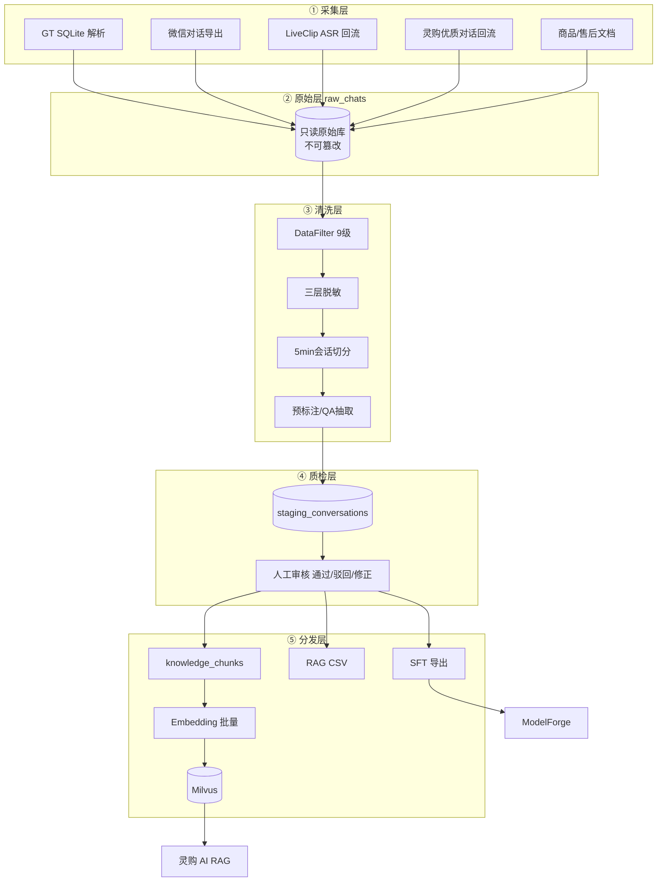

| 层级 | 职责 | 面试关键词 |
|------|------|------------|
| 采集层 | 多源异构接入 | GT SQLite、回流 API |
| 原始层 | 证据链、可审计 | **只读** raw_chats |
| 清洗层 | 去噪、脱敏、结构化 | 9级过滤、5min窗口 |
| 质检层 | 人机协同 | staging、驳回重洗 |
| 分发层 | 多格式下游供给 | ShareGPT/Milvus |

##### 2. GT 对话采集时序（深挖常问）

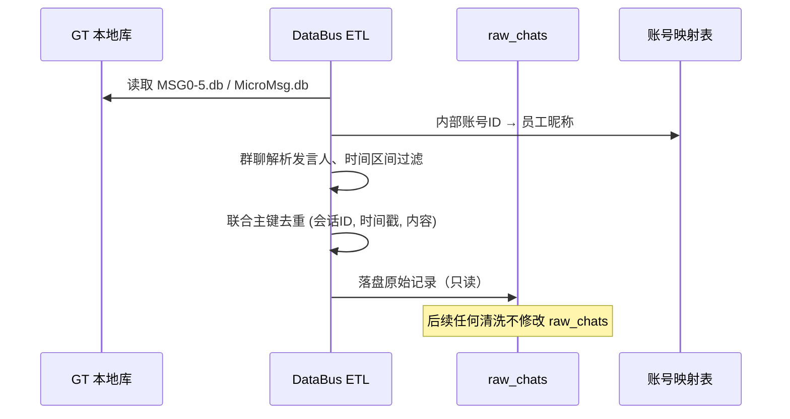

**DB-Q7：联合主键去重为什么用三个字段？**

> 单字段去重会误伤：同会话不同时间、或同内容不同会话。`(会话标识, 时间戳, 对话内容)` 联合唯一，能去掉 **重复导入/转发重复**，又保留 **合理解的多轮对话**。

##### 3. DataFilter 9 级（面试可逐条说 3～4 个）

| 级别 | 类型 | 处理 |
|:---:|------|------|
| 1 | 系统通知/机器人 | 丢弃 |
| 2 | 纯媒体无文本 | 丢弃 |
| 3 | 无效短句（「嗯」「哦」） | 丢弃 |
| 4 | 敏感信息未脱敏 | 拦截再洗 |
| 5 | 日常闲聊 | 低优先级/丢弃 |
| 6 | 垃圾咨询/广告 | 丢弃 |
| 7 | 一般业务咨询 | 保留 |
| 8 | **高价值购机对话** | 优先保留 |
| 9 | **高价值售后/Care** | 优先保留 + 加速审核 |

**DB-Q8：为什么需要人工质检 staging？**

> 自动过滤 **Recall 高 Precision 不够**：例如把「含价格但已部分脱敏」的边界样本、或「像闲聊实为套话」的样本误判。staging 是 **唯一可信训练源**；驳回的样本可 **打标回灌** 优化 DataFilter 规则。

##### 4. 5 分钟会话窗口（深挖）

**做法：** 按时间轴每 **5 分钟** 切一段 **完整咨询会话**，同角色连续多条 **合并**，重复 utterance **剔除**。

**为何 5 分钟？**

| 太短 | 太长 |
|------|------|
| 上下文断裂，SFT 学不到完整销售链路 | 单条超 token 上限、标注难、噪声多 |

**产出字段（预标注）：** 对话分类、质量分、QA 对、敏感标记 → 供 ModelForge 分流和运营审核。

##### 5. knowledge_chunks 数据模型（口述用）

| 字段 | 含义 | 下游用途 |
|------|------|----------|
| `chunk_id` | 主键 | 更新/版本 |
| `content` | 文本正文 | 检索+LLM |
| `product_series` | Mavic/Mini/Osmo | Milvus filter |
| `scene_type` | 售前/售后/Care/活动 | filter |
| `accessory_model` | 配件型号 | 精准匹配 |
| `source_type` | 对话/文档/直播ASR | 溯源 |
| `confidence` | 置信分 | 审核优先级 |
| `vector` | embedding | HNSW 检索 |

**DB-Q9：带业务标记分段是什么？**

> 按 **商品系列、文档类型（参数表/Care条款）** 切 chunk，避免「云台参数」和「售后政策」被切成半句，导致 **向量语义不完整**。灵购 RAG 召回差很多时候 **根因在 DataBus 分段**。

##### 6. 导出格式对比（ShareGPT / Alpaca / JSONL）

| 格式 | 结构特点 | 适用 |
|------|----------|------|
| **ShareGPT** | `conversations:[{from,value}]` | 多轮对话直观 |
| **Alpaca** | `instruction/input/output` | 单轮指令微调 |
| **OpenAI JSONL** | `messages:[{role,content}]` | 方舟/DPO 兼容 |

导出前统一：**价格脱敏、话术规范化、超长截断、占位符清理**。

##### 7. 数据回流 API 逻辑（闭环）

```
Agent 回流包 → 校验 schema → 打 source=回流 → 走轻量清洗（可跳过部分9级）
→ 优先进入 staging 高优队列 → 审核后并入正式库
```

**DB-Q10：活动/新品知识更新全流程？**

> 运营在商城后台更新文档 → DataBus **增量 ETL** → 新 chunk embedding → **Milvus upsert** → 灵购 **无需发版、无需重训 ModelForge**。

##### 8. DataBus 拷打速答表

| 深挖问题 | 答 |
|----------|-----|
| 和数仓区别？ | 数仓偏 BI；DataBus 偏 **AI 就绪语料**（SFT/RAG 格式+质检） |
| 如何保证不泄露价格？ | 三层脱敏 + 导出硬校验 + staging 人工 |
| 失败重跑？ | raw_chats 不变，从清洗层 **可重入** |
| 你负责啥？ | 下游 schema、回流接口、与灵购/ModelForge **字段对齐** |

---

### ModelForge-AI — 电商自有化模型微调

> 定位：**模型与检索能力工厂**。灵购 AI 的 **专属 LLM** 和 **Rerank 检索链路** 从这里出。

#### 项目 30 秒介绍

> **ModelForge-AI** 复用 DataBus 标准化语料，采用 **本地 QLoRA 验证 + 云端方舟量产** 两阶段微调，产出适配商城销售话术的 **专属大模型**；同时搭建 **Embedding 粗召回 → Cross-Encoder 精排** 三段式 RAG 流水线。策略是 **「微调管话术风格，RAG 管实时业务知识」**，统一供给灵购 AI、LiveClip、MultiVis。

#### 技术架构（简图）

```
DataBus SFT 语料 ──→ 本地 QLoRA（Qwen2.5-3B, 4090, ~40min/轮）
                         ↓ 验证通过
                    云端 LoRA（豆包1.5, 方舟）
                         ↓
                    SFT → DPO 两阶段
                         ↓
                    专属模型 API ──→ 灵购 / LiveClip / MultiVis

DataBus RAG 素材 ──→ Embedding 向量化
                         ↓
                    粗召回 Top20
                         ↓
                    Cross-Encoder 精排 Top5
                         ↓
                    灵购 AI RAG 服务调用
```

---

#### MF-Q1：为什么既要微调又要 RAG？

**10 秒版：**

> 微调学 **销售话术和语气**；RAG 带 **实时商品/活动知识**。新品上架只更向量库，**不用重训模型**。

| | 微调 | RAG |
|--|------|-----|
| 擅长 | 语气、转化引导、多轮风格 | 参数、价格政策、Care 条款 |
| 更新成本 | 高（重新训练） | 低（重新入库） |

---

#### MF-Q2：本地验证 + 云端量产怎么做的？

**两阶段：**

| 阶段 | 环境 | 配置 | 目的 |
|------|------|------|------|
| **本地验证** | 单卡 RTX 4090 | Qwen2.5-3B + QLoRA，rank=64，lr=2e-4，LLaMA-Factory | 快速验语料、40min/轮 |
| **云端量产** | 火山方舟 | 豆包 1.5 LoRA，rank=32，lr=1e-5 | 生产级部署 |

**面试一句：**

> 本地 **便宜快跑** 验证数据和超参；达标后上云 **规模化训练**，按模型尺寸缩放 rank 和学习率。

---

#### MF-Q3：SFT + DPO 是什么？为什么用 DPO？

**SFT（监督微调）：** 模仿商城销售对话，解决 **逻辑不通、话术不像** 的问题。

**DPO（偏好优化）：** 同一问题生成多条回复，资深销售标 **优劣对**，优化 **专业度与转化引导**。

**为何 DPO 而非 RLHF：**

> 小样本（数百条标注）下 DPO **更稳定**，省去单独训奖励模型，**标注和算力成本更低**。盲评 **2.1 → 4.3**（满分 5）。

---

#### MF-Q4：三段式混合检索怎么说？

```
用户 query
    → Embedding 向量编码
    → 向量库粗召回 Top20
    → Cross-Encoder 联合编码精排
    → Top5 进 LLM
```

**效果：** 命中率 **72% → 89%**（商城标注 query 集）。

**与灵购五层关系：** ModelForge 提供 **精排能力与检索服务**；灵购侧还有 HNSW、Int8、元数据 filter 等 **在线 Milvus 优化**。

---

#### MF-Q5：和灵购 AI 怎么对接？

```
灵购 CustomLLM 回调
    → 调 ModelForge 检索服务（Top5 知识）
    → 调 ModelForge 微调模型（流式生成）
    → SSE 回 RTC
```

**分工：** ModelForge **训模型、建检索**；灵购 **RTC 场景集成、延迟与体验优化**。

---

#### ModelForge 常见追问

| 追问 | 回答 |
|------|------|
| 为什么 QLoRA？ | 全量微调贵；QLoRA **显存友好**，本地可迭代 |
| rank 含义？ | LoRA 低秩矩阵维度；大 rank 表达力强但易过拟合，本地 64、云端 32 是压测结果 |
| 知识更新要重训吗？ | **不要**；更 RAG 库即可 |
| 你也参与训练吗？ | 语料规范与 **效果验收** 参与；训练 pipeline 与算法同学共建，灵购侧 **消费 API** |

#### ModelForge 三个坑

1. ❌ 说成所有知识都靠微调记住  
2. ❌ 混淆 ModelForge 检索 vs DataBus 入库（**DataBus 产素材，ModelForge 训检索/模型**）  
3. ✅ 强调 **SFT+DPO 数据来自 DataBus**

---

#### ModelForge 深度专节：架构 · 链路 · 深挖

##### 1. 双流水线架构

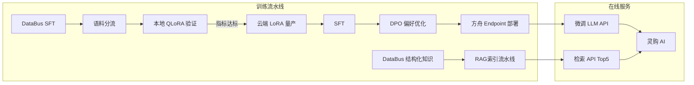

##### 2. 微调全链路（逐步讲）

```
① DataBus 导出 ShareGPT/JSONL
② 本地 QLoRA（Qwen2.5-3B, rank=64, lr=2e-4, 4090 ~40min/轮）
   → 验：loss 收敛、样例生成、无明显幻觉/泄露
③ 云端豆包1.5 LoRA（rank=32, lr=1e-5，按模型尺寸缩放）
④ SFT：学话术风格与多轮结构
⑤ DPO：同一 prompt 多条回复 → 销售标 preferred/rejected
⑥ 盲评（2.1→4.3）→ 部署专属 Endpoint
```

**MF-Q6：QLoRA 是什么？为何本地用？**

> 在冻结大模型权重基础上，只训练 **低秩适配器（LoRA）**；QLoRA 再 **量化基座权重** 降显存。4090 上能跑 3B 级模型 **快速试数据**，避免云上每轮都烧钱。

**MF-Q7：rank、alpha、lr 怎么理解？**

| 参数 | 含义 | 简历口径 |
|------|------|----------|
| **rank** | LoRA 矩阵秩，越大表达能力越强 | 本地64验证，云端32量产防过拟合 |
| **alpha** | 缩放系数，常设 2×rank | 本地 alpha=128 |
| **lr** | 学习率 | 本地 2e-4 快跑，云端 1e-5 稳收敛 |

##### 3. SFT vs DPO（深挖）

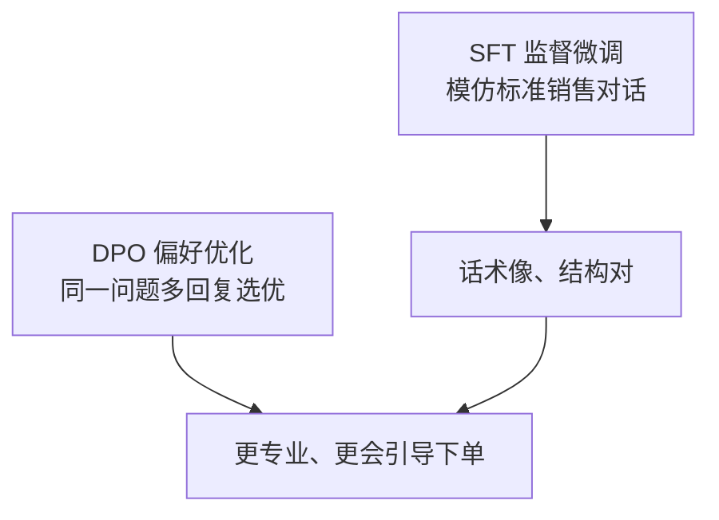

**为何不用 RLHF？** 需单独奖励模型 + PPO，**小样本不稳定、成本高**；DPO 直接用偏好对优化策略，**数百条标注即可**。

**MF-Q8：DPO 数据怎么构造？**

> 同一用户问题，模型或人工生成 2～4 条候选 → **资深销售**标哪条更专业、更合规、更会转化 → 形成 `(prompt, chosen, rejected)` 对。

##### 4. 三段式检索架构（与灵购五层衔接）

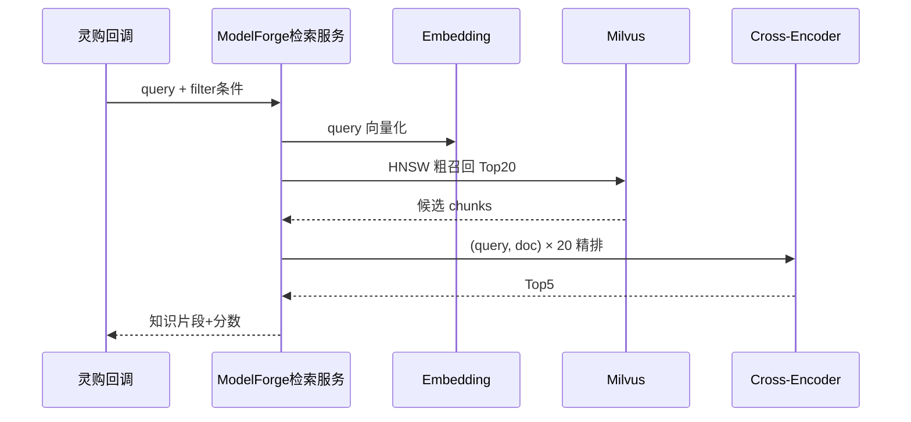

**职责分界：**

| 组件 | ModelForge | 灵购 AI |
|------|------------|---------|
| Cross-Encoder 精排 | ✅ 提供 | 调用 |
| HNSW/Int8/元数据 filter | 索引规范共建 | **在线参数与策略** |
| Hybrid dense/sparse | 可共建 | 在线 dense_weight |

##### 5. 评测与上线门禁

| 阶段 | 指标 |
|------|------|
| 本地 QLoRA | loss、样例人工扫、泄露检测 |
| 云端 SFT | 盲评话术分、Care 条款准确率 |
| DPO 后 | 盲评 2.1→4.3、转化引导 case |
| 检索 | Hit@5、MRR、72%→89% |
| 上线 | 灵购 **TTFT + 端到端** 灰度 |

**MF-Q9：商品大促知识变了要重训吗？**

> **不要。** 更 DataBus → Milvus 即可；只有 **话术风格大变**（如品牌调性重塑）才考虑重训 SFT/DPO。

##### 6. ModelForge 拷打速答

| 深挖 | 答 |
|------|-----|
| 灾难性遗忘？ | LoRA 只改少量参数 + 基座冻结，遗忘较全参轻；仍用 **held-out 集**监控 |
| 基座选型？ | 本地 Qwen2.5-3B 验证，量产 **豆包1.5** 对齐商城部署 |
| 和通用 Ark 区别？ | 专属 LoRA **话术更贴商城**，system 可更短 → TTFT 受益 |
| 检索和微调矛盾？ | **不矛盾**：微调=风格，RAG=事实 |

---

### LiveClip-AI — 直播切片智能剪辑 Agent

> 定位：**长直播 → 高光短视频**。产出给 MultiVis 运营，数据回流 DataBus。

#### 项目 30 秒介绍

> **LiveClip-AI** 解决商城 **长时带货直播人工剪片效率低** 的问题：前端 **FFmpeg.wasm** 轻量化压缩上传，后端 **PostgreSQL 自研任务队列** 调度 **ASR + 大模型** 自动识别产品讲解、福利爆款片段，批量产出短视频；ASR 和高光标签 **回流 DataBus**。

#### 技术架构（三层）

```
┌─────────────────────────────────────────────────┐
│ 前端 React 19 + FFmpeg.wasm                      │
│  4K原片 → 16kHz 64kbps MP3（~30MB，流量↓99%）     │
│  本地裁切/ZIP导出                                 │
└────────────────────┬────────────────────────────┘
                     ↓ 上传
┌─────────────────────────────────────────────────┐
│ 后端 FastAPI + SQLAlchemy 2.0 + PostgreSQL       │
│  自研任务队列（pending→running→done，崩溃自愈）   │
│  SSE 全链路进度推送                               │
└────────────────────┬────────────────────────────┘
                     ↓
┌─────────────────────────────────────────────────┐
│ AI 流水线                                         │
│  音频→Groq Whisper ASR→DeepSeek 内容分析→高光截取 │
│  超长直播：25min 无损分段 + offset 还原时间轴       │
└─────────────────────────────────────────────────┘
```

#### 核心流水线

```
视频/音频上传
  → 预处理（前端 wasm 或后端 ffmpeg 分段）
  → ASR 语音转写
  → LLM 商品内容分析（6000 token 分片 + 重叠去重）
  → 高光片段截取 + 业务数据入库
  → 前端 wasm 本地导出 / 打包 ZIP
  → ASR+标签 回流 DataBus
```

---

#### LC-Q1：为什么用 FFmpeg.wasm 在前端压音频？

**问题：** 4K 直播原片 **单文件 ~2.5GB**，直传慢、带宽贵。

**方案：**

- 浏览器 **WORKERFS 零拷贝** 挂载源文件  
- 转 **16kHz 单声道 64kbps MP3**（~30MB）  
- **上传流量降 ~99%**，等待 **分钟级 → 秒级**

**面试一句：**

> 重转码放前端 wasm，**后端不算力扛视频**，运营批量上传体验大幅提升。

---

#### LC-Q2：PostgreSQL 自研任务队列为什么不用 Redis/RabbitMQ？

**设计：**

- 任务提交写 **pending**，接口 **立即返回**  
- **Task Runner** 异步协程 **串行抢占** 执行（防 GPU/API 打满）  
- 进程崩溃：`running` 任务 **重置为 pending**，**不丢任务**  

**面试一句：**

> 商城多运营同时提交，要 **简单可靠、可自愈**；PostgreSQL 队列 **无额外云中间件**，状态和进度同库，运维成本低。

---

#### LC-Q3：3～6 小时超长直播怎么处理？

**问题：** 一次 ASR/LLM 整片处理易 **OOM 或超上下文**。

**方案：**

1. **ffmpeg 无损分段**，每 **~25 分钟** 一段，**串行转录**  
2. 每段 ASR 结果加 **时间 offset** 拼回完整时间轴  
3. LLM 分析：**6000 token 分批** + **双向重叠去重**（重合度 >30% 保留高分讲解段）

---

#### LC-Q4：三套 Prompt 场景是什么？

| 场景 | 说明 |
|------|------|
| **直播带货** | 产品讲解、促销、下单引导片段 |
| **无人机实景测评** | 户外试飞、画质展示 |
| **新品宣讲** | 发布会式功能介绍 |

不同场景自动调 **切片时长、重复过滤阈值**；输出 **爆款潜力分、种草文案、短视频标题与剪辑脚本**。

---

#### LC-Q5：和 DataBus、MultiVis 的关系？

| 方向 | 内容 |
|------|------|
| LiveClip → **DataBus** | 整场 ASR、高光标签、爆款评分 |
| LiveClip → **MultiVis** | 批量短视频素材 |
| **ModelForge** | 提供 LLM 分析能力 |

---

#### LiveClip 常见追问

| 追问 | 回答 |
|------|------|
| 为什么串行执行任务？ | 剪辑+ASR+LLM **资源重**，并行易打满；运营场景 **吞吐够用、稳定性优先** |
| SSE 干什么？ | 长任务 **每秒推进度**，多端一致，**断线可续**（状态在 DB） |
| Groq Whisper 为何选它？ | **转写速度**满足长直播批量处理（按简历口径） |
| 你负责哪块？ | 若主做灵购：说 **同团队 Agent 项目，熟悉架构**；若参与 LiveClip：讲 **wasm 上传或任务队列或 SSE** 具体模块 |

#### LiveClip 三个坑

1. ❌ 说成云端转码 2.5GB 原片（是 **前端 wasm 轻量化**）  
2. ❌ 忽略 **25min 分段 + offset** 超长处理  
3. ✅ 提 **数据回流 DataBus**

---

#### LiveClip 深度专节：架构 · 链路 · 深挖

##### 1. 三层架构详图

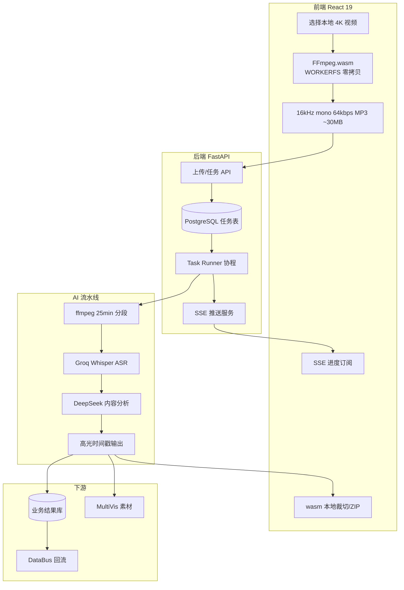

##### 2. 端到端时序（一次剪辑任务）

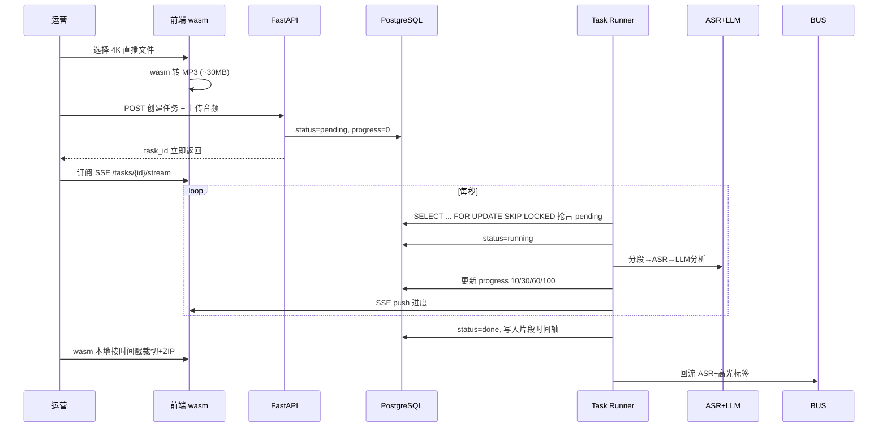

##### 3. PostgreSQL 任务队列状态机（深挖必问）

```
pending ──抢占──→ running ──成功──→ done
   ↑                │
   │                └──失败──→ failed（可人工重置 pending）
   │
   └── 进程崩溃：running 超时/重启时 reset → pending
```

**LC-Q6：如何实现「抢占」又不丢任务？**

> `UPDATE tasks SET status='running' WHERE id=? AND status='pending'` 或 **`FOR UPDATE SKIP LOCKED`**，保证 **单 Worker 串行** 消费；崩溃后 **running 重置 pending**，任务 **至少一次** 执行（ASR/LLM 步骤需 **幂等** 或靠 task_id 去重）。

**LC-Q7：为什么不用 Redis/RabbitMQ？**

| 维度 | PG 自研队列 | 外部队列 |
|------|-------------|----------|
| 运维 | 与业务库一体 | 多组件 |
| 进度 | 同表 progress 字段 | 需额外存储 |
| 崩溃恢复 | SQL 重置状态 | 依赖 ack 机制 |
| 吞吐 | 运营批量够用 | 更高但用不上 |

##### 4. 超长直播处理（25min + offset + 6000 token）

**阶段 A：物理分段（ASR）**

```
6小时直播 → ffmpeg 无损切每 25min → 段1..段N
段i ASR 文本 + offset_i = i × 25min
合并：global_timestamp = local_ts + offset_i
```

**阶段 B：语义分段（LLM）**

```
全文按 6000 token 切批 → 每批 DeepSeek 抽「讲解/福利/爆款」
相邻批 overlap 窗口 → 重合度>30% 时保留 **高分** 段，防重复切片
```

**LC-Q8：三套 Prompt 差异？**

| 场景 | 切片偏好 | 输出物 |
|------|----------|--------|
| 直播带货 | 短、强促销、价格点 | 爆款分+标题+脚本 |
| 实景测评 | 长一点、画面描述 | 功能演示段 |
| 新品宣讲 | 参数完整、逻辑线 | 发布会精华 |

##### 5. FFmpeg.wasm 深挖

**WORKERFS：** 大文件 **不整文件读入 JS 堆**，在 Worker 内 **挂载文件系统** 直接读盘，避免 2.5GB OOM。

**为何只抽音频给后端？** 高光识别 **语音内容为主**；视频裁切 **回前端 wasm 本地做**，后端不算力扛 **重编码**。

**LC-Q9：上传降 99% 怎么算？**

> 2.5GB 视频 → ~30MB MP3，**带宽与上传时间**近似按体积比下降（简历口径 **分钟→秒**）。

##### 6. SSE 进度模型

| progress | 阶段 |
|:---:|------|
| 0–10 | 上传/入库 |
| 10–40 | 分段+ASR |
| 40–80 | LLM 分析 |
| 80–100 | 写库+可导出 |

**断线续：** 进度在 PG，重连 SSE 读 **当前 progress**，不从头跑（除非 task failed）。

##### 7. LiveClip 拷打速答

| 深挖 | 答 |
|------|-----|
| 并行多任务？ | 多任务 **pending 排队**，Runner **串行** 防 API/GPU 打满 |
| 切片准确性？ | LLM+规则；运营 **前端预览** 可微调起止 |
| 和灵购关系？ | **不直接通话**；ASR/话术 **回流 DataBus** 间接提升 RAG |
| ModelForge 作用？ | 提供 **DeepSeek/商城 Prompt** 分析能力 |

---

### MultiVis-AI — 图文视频一体化自媒体运营 Agent

> 定位：**批量生成种草内容**，素材进 **素材中心**，供灵购 AI 多模态答疑。

#### 项目 30 秒介绍

> **MultiVis-AI** 面向小红书、抖音、视频号等 **自媒体种草** 场景，基于 **LangGraph** 编排 **选题 → 带货文案 → 配图生成** 多阶段工作流，支持 **Checkpointer 节点级重试**、**SSE 流式输出**、**多模型路由降本**；生成素材自动入库 **素材中心**，回流灵购 AI **多模态回复**。

#### 技术架构（LangGraph）

```
                    ┌─────────────┐
                    │  选题 SubGraph │
                    └──────┬──────┘
                           ↓
                    ┌─────────────┐
                    │  文案 SubGraph │
                    └──────┬──────┘
                           ↓
                    ┌─────────────┐
                    │  配图 SubGraph │
                    └──────┬──────┘
                           ↓
                    素材中心 → 灵购 AI

   PostgreSQL Checkpointer（每节点状态持久化）
   MetricsContext（Token/成本/时延埋点）
   LangSmith + structlog（链路追踪）
```

---

#### MV-Q1：为什么用 LangGraph 而不是简单 Chain？

**10 秒版：**

> 种草生产是 **多阶段、可失败、需重试** 的长流程；LangGraph **子图拆分 + 检查点** 支持 **节点级回滚/重试**，故障范围从「整任务失败」缩小到「单个节点」。

| 能力 | 价值 |
|------|------|
| **SubGraph** | 选题/文案/配图 **独立编排** |
| **Checkpointer** | 状态持久化，**断点续跑** |
| **astream_events** | 与前端 SSE **逐 Token 联动** |

---

#### MV-Q2：流式输出怎么做的？TTFT 降 60% 指什么？

**实现：**

- 后端：`LangGraph astream_events`，监听 `on_chat_model_stream`  
- 前端：`ReadableStream` **分段渲染**  
- 用户 **更早看到首段文案**（体感 TTFT ↓60%）

**注意：** 这是 **自媒体内容生成** 的 TTFT，不是灵购 **语音客服** 的 TTFT，**面试别混**。

---

#### MV-Q3：配图并发与成本优化？

**配图并发：**

- `asyncio.gather` + `run_in_executor` 包装同步绘图 API  
- **1s→2s→4s 指数退避** 抗抖动  
- 批量配图耗时 **↓70%**

**多模型路由：**

| 任务 | 模型 |
|------|------|
| 短标题、简单种草 | Flash 轻量 |
| 长图文、深度测评 | 旗舰大模型 |

- `with_structured_output` + Pydantic **约束 JSON**，成本 **↓40%**  
- **MetricsContext** 按火山计价规则 **核算单篇成本**

---

#### MV-Q4：可观测与本地调试？

| 手段 | 作用 |
|------|------|
| **Mock 开关**（llm/绘图/存储） | 解耦外部依赖，本地调试 **效率 ↑3x** |
| **LangSmith** | 全链路 trace |
| **structlog + request_id** | 故障定位 **小时 → 分钟** |
| **SlowAPI 限流 + 健康检查** | K8s 稳定部署 |

---

#### MV-Q5：和灵购 AI、LiveClip 闭环？

```
LiveClip 短视频 ──→ MultiVis 二次加工（可选）
MultiVis 图文视频 ──→ 素材中心
素材中心 ──→ 灵购 AI 多模态回复（航拍样片、配图等）
```

**面试一句：**

> MultiVis 是 **内容生产下游**；灵购是 **消费素材做语音导购**，DataBus 收 **元数据与话术** 回流。

---

#### MultiVis 常见追问

| 追问 | 回答 |
|------|------|
| Checkpointer 用什么存？ | **PostgreSQL**，与业务库统一，支持 **任意历史节点恢复** |
| 流式和非流式 Checkpointer 一致？ | 统一持久化结构，避免 **断点续写错乱** |
| Ngrok 干什么？ | 本地 **公网映射**，方便 webhook/回调联调 |
| K8s 优雅关闭？ | 停止接收新任务、**排空进行中请求**，防 Pod 杀死 mid-flight |

#### MultiVis 三个坑

1. ❌ 把 TTFT↓60% 说成灵购语音 TTFT  
2. ❌ 不说 **素材回流灵购** 闭环  
3. ✅ 强调 **LangGraph 子图 + Checkpointer 故障自愈**

---

#### MultiVis 深度专节：架构 · 链路 · 深挖

##### 1. LangGraph 总架构

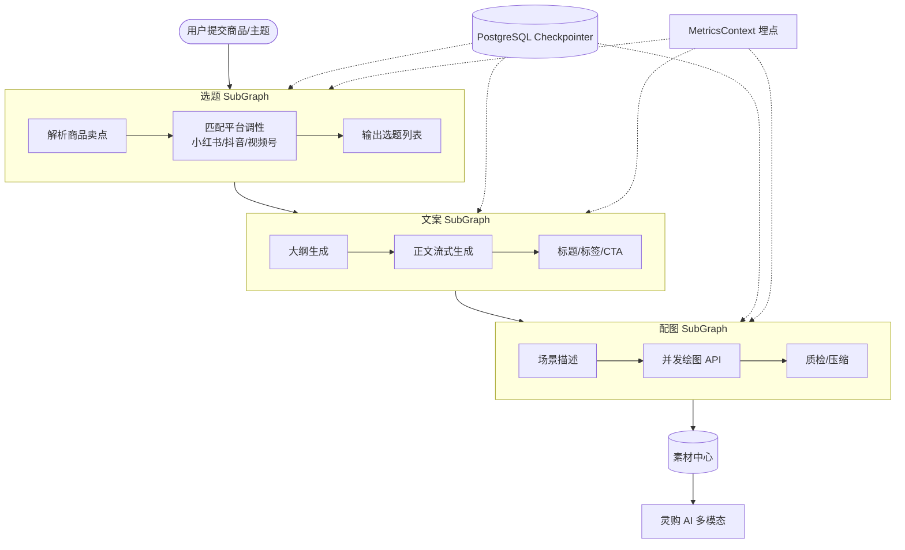

##### 2. 单次生成时序（流式）

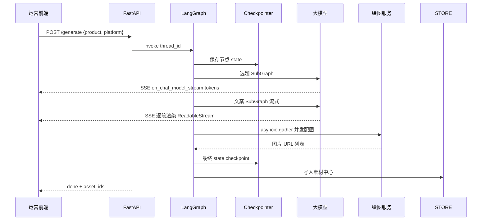

##### 3. Checkpointer 故障自愈（深挖）

**问题：** 长链路任一节点失败（LLM 超时、绘图 429），传统 Chain **整单重来** 浪费 Token。

**方案：** 每 SubGraph 节点结束 **持久化 state** 到 PostgreSQL：

```
thread_id + checkpoint_id → { 选题结果, 文案草稿, 配图任务状态... }

失败时：从 **最近成功节点** 重试，而非从选题重做
```

**MV-Q6：节点级重试 vs 整任务重试？**

| | 整任务 | 节点级 |
|--|--------|--------|
| Token 成本 | 高 | **低** |
| 用户体验 | 全部重来 | **保留已生成文案** |
| 实现 | 简单 | LangGraph + Checkpointer |

##### 4. 多模型路由决策树

```
输入任务类型 + 长度 + 平台
    ├─ 短标题/标签 → Flash 轻量模型（低成本）
    ├─ 标准种草短文 → 中端模型
    └─ 长图文测评/多段落 → 旗舰模型

structured_output(Pydantic) → 强制 JSON schema → 减少解析失败重试
```

**MV-Q7：成本降 40% 怎么来的？**

> **路由**把简单任务打给 Flash + **structured_output** 减少无效 token + **MetricsContext** 发现高耗节点再优化 Prompt；不是单一技巧。

##### 5. 配图并发与退避

```python
# 概念逻辑
async def batch_images(prompts):
    tasks = [run_in_executor(draw, p) for p in prompts]
    return await asyncio.gather(*tasks, return_exceptions=True)
# 失败：1s → 2s → 4s 指数退避，抗绘图服务抖动
```

**效果：** 批量配图耗时 **↓70%**（简历数据）。

##### 6. 可观测体系

| 组件 | 作用 |
|------|------|
| **MetricsContext** | 每节点 Token、时延、错误率、**单篇成本** |
| **LangSmith** | trace 可视化 |
| **structlog + request_id** | 日志关联 |
| **Mock 开关** | llm/image/store 三层解耦本地调试 |

**MV-Q8：TTFT↓60% 指什么？**

> **自媒体文案生成** 首包：SSE + `astream_events` 边生成边渲染；**不是** 灵购语音客服 TTFT（务必区分）。

##### 7. 生产高可用

| 手段 | 说明 |
|------|------|
| **SlowAPI** | 限流防刷 |
| **健康检查** | K8s liveness/readiness |
| **优雅关闭** | 停接新单、排空进行中 |
| **熔断** | 绘图/LLM 连续失败降级文案-only |

##### 8. 素材中心 → 灵购 闭环

```
MultiVis 产出 { 封面, 配图, 文案, 商品SKU, 平台标签 }
    → 素材中心对象存储 + 元数据索引
    → 灵购 RAG/素材服务按 SKU+场景检索
    → 语音客服答复时可 **图文音视频一体** 推荐
```

##### 9. MultiVis 拷打速答

| 深挖 | 答 |
|------|-----|
| 为何不用 Celery？ | LangGraph **自带状态机** + Checkpointer 更贴 Graph；任务逻辑 **节点化** |
| SubGraph 通信？ | **共享 state** 传递选题→文案→配图 |
| 流式+Checkpoint 冲突？ | 统一 thread state；流式只影响 **展示**，checkpoint 在 **节点边界** 提交 |
| LiveClip 素材？ | 可消费 **短视频** 作混剪素材，非强依赖 |

---

### 四大项目与灵购 AI 对照速查

| 项目 | 一句话 | 和灵购关系 |
|------|--------|------------|
| **DataBus** | 洗数据、产 SFT/RAG | **供** 灵购知识库；**收** 灵购回流 |
| **ModelForge** | 训模型、建检索 | **供** 灵购 LLM + Rerank |
| **LiveClip** | 直播切短片 | 素材/ASR **间接** 丰富灵购与知识库 |
| **MultiVis** | 自媒体种草 | **供** 素材中心 → 灵购多模态 |

---

## 十九、四大项目深挖导航 + 连环拷打

> 面试官常 **从灵购 AI 跳到其他项目**，或 **追问架构细节**。用下表定位到各项目 **深度专节**。

| 若问… | 跳转到 |
|--------|--------|
| GT 怎么解析、9级过滤、staging | DataBus **深度专节** DB-Q7～Q10 |
| QLoRA/SFT/DPO/检索三段式 | ModelForge **深度专节** MF-Q6～Q9 |
| wasm/任务队列/SSE/25min分段 | LiveClip **深度专节** LC-Q6～Q9 |
| LangGraph/Checkpointer/路由降本 | MultiVis **深度专节** MV-Q6～Q9 |

### 连环拷打示例（怎么答）

**Q：灵购 RAG 知识谁生产的？**

> DataBus 清洗分段 → embedding 入 Milvus；ModelForge 提供精排；灵购在线检索。LiveClip/MultiVis **回流** 丰富语料。

**Q：为什么微调了还要 RAG？**

> ModelForge 策略：**微调话术，RAG 事实**；DataBus 更库即可，不必重训。

**Q：五个项目你怎么分工？**

> 我 **主负责灵购 AI** RTC+回调+RAG 接入；DataBus/ModelForge **深度消费与联调**；LiveClip/MultiVis **同矩阵 Agent，熟悉架构与数据回流**。

### 五项目统一数据流（架构总图）

> 面试官问「整体怎么串起来」时，先画这张图，再落到你负责的灵购 AI。

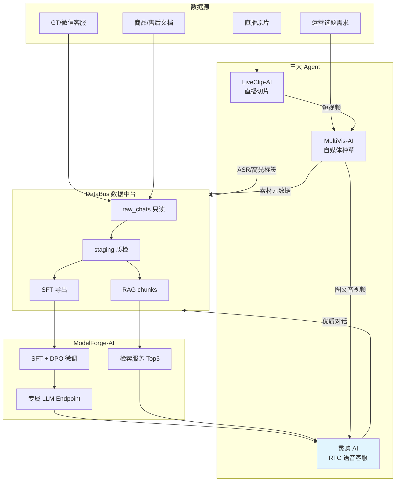

**口述 20 秒版：**

> 数据从 GT、文档、直播、运营需求进来；DataBus 洗干净后 **分两路** — SFT 给 ModelForge 训模型，RAG chunk 给检索；灵购 AI 同时吃 **微调 LLM + 检索 Top5** 做语音客服。LiveClip 切直播、MultiVis 做种草，产出 **回流 DataBus**，短视频还能给 MultiVis 当素材，MultiVis 图文又能 **喂给灵购多模态推荐**。

### 四大项目架构对比（面试官横向对比时用）

| 维度 | DataBus | ModelForge | LiveClip | MultiVis |
|------|---------|------------|----------|----------|
| **核心问题** | 数据脏、多源异构 | 通用模型不懂商城 | 长直播剪片慢 | 种草内容批量产 |
| **架构形态** | ETL 五层流水线 | 训练+检索双流水线 | 前端 wasm + 后端队列 | LangGraph 多 SubGraph |
| **状态存储** | PostgreSQL raw/staging | 训练 checkpoint + Milvus | PG 任务表状态机 | PG Checkpointer |
| **长任务处理** | 批处理 ETL 调度 | 云端训练 Job | pending→running 串行 | 节点级 checkpoint 重试 |
| **实时性** | 离线 T+1 | 在线 API | SSE 进度推送 | SSE 文案流式 |
| **产出物** | SFT/RAG 数据集 | 微调模型+检索 API | 高光短视频+ASR | 图文素材包 |
| **灵购关系** | **上游供数** | **上游供模型** | **间接 enrich** | **下游素材供给** |

### 连环拷打（进阶 10 题）

**Q1：灵购一次语音问答，数据经过哪些系统？**

```
用户语音 → RTC ASR → 灵购回调服务
    → ModelForge 检索 API（Milvus Top20→Rerank Top5）
    → ModelForge 微调 LLM（SSE 流式）
    → RTC TTS → 用户
知识本身来自 DataBus 清洗后的 knowledge_chunks
```

**Q2：LiveClip 的 ASR 文本怎么变成灵购能用的知识？**

> LiveClip 产出 **带时间戳的 ASR + 高光标签（讲解/福利/爆款）** → 回流 DataBus → 经 9 级过滤+脱敏+人工抽检 → 分段 chunk + embedding → Milvus → 灵购 RAG 可召回「某场直播里对 Mavic 3 的讲解话术」。

**Q3：MultiVis 生成的图片，灵购怎么用？**

> 写入 **素材中心**（对象存储 + SKU/平台/场景元数据）→ 灵购 RAG/素材服务按 **商品 SKU + 用户意图** 检索 → 语音答复时可 **图文一体** 推送（如「这款适合旅行，这是种草图」）。

**Q4：为什么 DataBus 要 raw_chats 只读？**

> **审计与可追溯**：清洗规则迭代时可 **重跑** 而不丢原始证据；合规场景需证明「某条训练数据来自哪次对话」；避免误改原始数据导致 **无法复现** 训练集。

**Q5：ModelForge 本地 QLoRA 和云端 LoRA 参数为何不同？**

> 本地 **rank=64、lr=2e-4** 是 **快速验证数据质量**（4090 ~40min/轮）；云端 **rank=32、lr=1e-5** 是 **量产防过拟合**、对齐豆包基座。不是抄参数，是 **验证 vs 量产** 两阶段策略。

**Q6：LiveClip 为什么 Runner 串行不并行？**

> ASR（Groq）和 LLM（DeepSeek）有 **QPS/并发上限**；运营批量任务 **分钟级可接受**；串行 + PG 队列 **简单可运维**，崩溃可 reset。要扩容就 **多 Worker 实例**，仍用 `SKIP LOCKED` 抢任务。

**Q7：MultiVis Checkpointer 和 LiveClip 任务表有什么区别？**

| | LiveClip PG 队列 | MultiVis Checkpointer |
|--|------------------|----------------------|
| 粒度 | **整任务** pending/running/done | **Graph 节点** 级 state |
| 失败恢复 | 整任务 reset pending | **从失败节点** 重试 |
| 适用 | 线性流水线 ASR→LLM | 分支/子图 LangGraph |

**Q8：Hybrid 检索 dense_weight 谁调？线上怎么调？**

> **离线**：ModelForge 用评测集扫 weight（如 0.7/0.3）看 Hit@5。**在线**：灵购回调按 query 类型（参数查询偏 sparse、语义咨询偏 dense）**选预设 weight，只召回一次**；不是 Top5 反馈循环。

**Q9：五个项目里你最能展开的是哪个？**

> **灵购 AI** — RTC+CustomLLM+SSE+RAG 接入+TTFT 优化，有代码可讲。其他四个我能讲清 **架构、数据流、和灵购的接口关系**，具体 ETL/训练/剪辑流水线是与专项同学 **共建联调**。

**Q10：如果 RAG 召回错了，你怎么排查？**

```
① 看 query 与 filter（product_series 是否过滤过窄）
② 看 Top20 粗召回是否含正确 chunk（Milvus 问题 vs rerank 问题）
③ 看 chunk 原文（DataBus 分段是否切碎参数）
④ 看 prompt 拼接（是否截断/顺序不对）
⑤ 回流 badcase 给 DataBus 补库或调 filter 规则
```

### 各项目「架构 1 分钟」口述模板

**DataBus：**

> 五层：采集→raw 只读→9 级清洗脱敏→staging 人工质检→SFT/RAG 分流导出。核心是 **洗干净、可追溯、双出口**。

**ModelForge：**

> 双流水线：训练线 DataBus→QLoRA 验证→云端 SFT→DPO→部署；检索线 chunk→Milvus→Cross-Encoder Top5。策略是 **微调话术、RAG 事实**。

**LiveClip：**

> 三层：前端 wasm 抽音频减 99% 上传；后端 PG 自研队列+SSE；AI 线 25min 分段 ASR+LLM 抽高光。产出 **短视频 + ASR 回流**。

**MultiVis：**

> LangGraph 三子图：选题→文案流式→配图并发；PostgreSQL Checkpointer **节点级自愈**；多模型路由降本；素材 **回流灵购多模态**。

### 综合架构 / 项目串联
- 见 **第十三节** 五大项目串讲
- 见 **第十四节** 自我介绍
- 见 **第十五节** 灵购 AI 项目框架与运作流程
- 见 **第十六节** RAG / TTFT / 弱网 / 热更新 分项详解
- 见 **第十七节** 全链路优化总表（**拷打导航**）
- 见 **第十九节** 四大项目深挖导航 + 连环拷打
