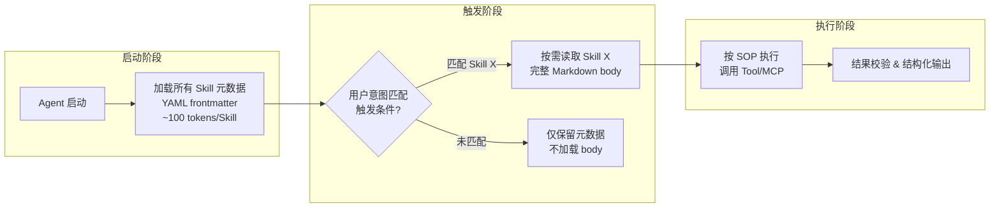
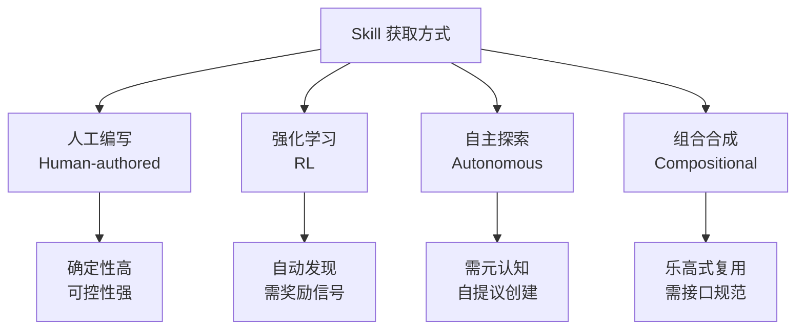
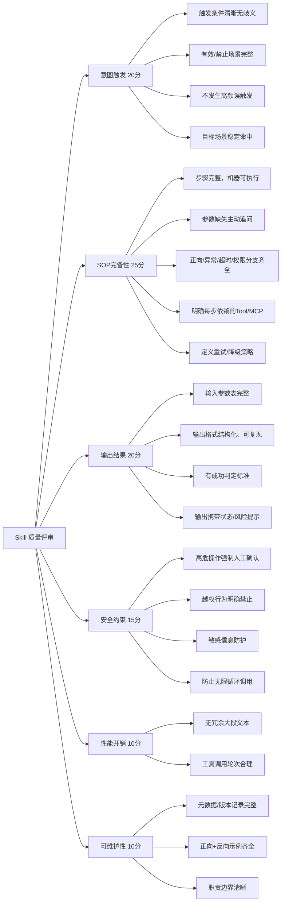
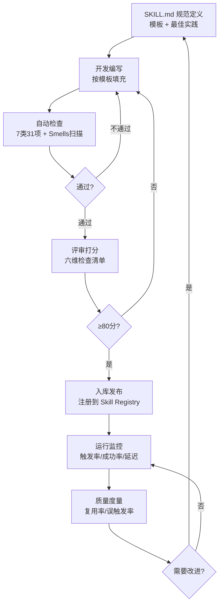

# AI Agent Skill 工程化：规范、架构模式与质量治理

> 以 SKILL.md 规范为锚点，系统梳理 Skill 的渐进式披露架构、设计模式分类、质量评审检查清单与反面模式治理，为 AI Agent 从"能调通工具"走向"可复用流程编排"提供工程化路线图。

---

## 摘要

AI Agent 的核心能力正从单次工具调用（Tool Call）向可复用、可组合的流程编排（Skill）跃迁。然而，当前 Skill 生态面临规范碎片化、质量参差不齐、可复用性不足等系统性问题。据一项涵盖 138,000 份 SKILL.md 文件的大规模实证研究指出，路由准确性、SOP 完备性、输出结构化等七类质量维度是制约 Skill 可复用性的关键瓶颈 [[6]](#ref-6)。与此同时，arxiv 上涌现了多项关于 Skill 架构模式 [[2]](#ref-2)[[3]](#ref-3)、获取方式 [[1]](#ref-1)、反面模式 [[5]](#ref-5) 的系统性研究，为 Skill 工程化奠定了理论基础。本文以 SKILL.md 规范为核心，整合渐进式披露（Progressive Disclosure）架构、七层设计模式分类、六维质量评审检查清单，构建从规范定义到质量治理的完整工程化框架，并探讨 Skill 与 MCP 协议的互补关系，为生产环境中的 Skill 开发与运维提供实践指导。

**关键词**：AI Agent；Skill 工程化；SKILL.md；渐进式披露；质量治理；MCP 协议

---

## 1 引言：从 Tool 到 Skill 的抽象层级跃迁

### 1.1 问题根源

AI Agent 的能力栈正在经历三层抽象分化：**Tool（工具）** 是原子能力，只做事、不思考流程；**Skill（技能）** 是流程大脑，编排 Tool、带判断、带 SOP、带兜底；**MCP（Model Context Protocol）** 是通信协议，让 Tool 可以被所有 Agent 统一调用 [[8]](#ref-8)。

这一分化并非偶然。随着 Agent 在软件工程、数据分析、运维自动化等复杂场景中的深入应用，单纯依赖 LLM 的即兴推理来编排 Tool 调用链已暴露出三大短板：

1. **流程不可复现**：同样的任务在不同会话中可能产生完全不同的 Tool 调用序列，缺乏确定性的执行路径。
2. **质量不可控**：缺少分支判断、异常兜底和安全约束的 Tool 链容易产生幻觉调用或越权操作。
3. **知识不可积累**：每次会话都从零开始推理，无法将验证过的最佳实践沉淀为可复用的流程资产。

Skill 正是为解决这三个问题而生的抽象层——它将经过验证的执行流程编码为结构化文档，使 Agent 从"即兴推理"升级为"流程执行"。

### 1.2 本文贡献

本文的主要贡献包括：

1. **系统梳理 SKILL.md 规范**：解析渐进式披露架构（Progressive Disclosure）的工程原理，阐明 YAML frontmatter + Markdown body 的设计哲学。
2. **整合 Skill 架构模式分类**：融合 P1-P7 七层设计模式 [[3]](#ref-3) 与十架构模式 [[2]](#ref-2)，构建完整的模式参考体系。
3. **构建质量治理框架**：将评审检查清单、反面模式（smells）[[5]](#ref-5) 与可复用性检查 [[6]](#ref-6) 整合为统一的质量治理体系。
4. **探讨 Skill-MCP 互补关系**：明确两者在 Agent 能力栈中的定位与协作方式。

### 1.3 文档结构

本文后续章节安排如下：第 2 章详解 SKILL.md 规范与渐进式披露架构；第 3 章分析 Skill 的获取方式分类；第 4 章梳理架构模式体系；第 5 章构建质量治理框架；第 6 章探讨 Skill 与 MCP 的互补关系；第 7 章给出工程实践与避坑指南；第 8 章为参考文献。

## 2 SKILL.md 规范详解

### 2.1 渐进式披露架构（Progressive Disclosure）

SKILL.md 的核心设计理念是 **渐进式披露**（Progressive Disclosure）：Agent 启动时仅加载 YAML frontmatter 中的元数据（约 100 tokens），只有当用户意图匹配触发条件后，才按需读取 Markdown body 的完整流程 [[1]](#ref-1)[[7]](#ref-7)。

这一设计的工程动机在于 token 经济性。假设一个 Agent 注册了 $N$ 个 Skill，每个 Skill 的完整文档平均消耗 $T_{body}$ tokens，元数据消耗 $T_{meta}$ tokens。若采用全量加载策略，Agent 的系统提示词开销为：

$$C_{full} = N \times T_{body}$$

而采用渐进式披露策略，启动开销降为：

$$C_{pd} = N \times T_{meta} + k \times T_{body}$$

其中 $k$ 为实际触发的 Skill 数量（通常 $k \ll N$），$T_{meta} \approx 100$ tokens [[1]](#ref-1)。当 $N = 50$、$T_{body} = 2000$、$k = 1$ 时，token 节省率高达 $98\%$。


<p align="center"><b>图1 渐进式披露架构的三阶段生命周期</b></p>

Google Cloud 在 2026 年 8 月发布的 Agent Skill 指南中进一步明确了这一生命周期分为 **Discovery（发现）→ Activation（激活）→ Execution（执行）** 三个阶段 [[7]](#ref-7)，与上述渐进式披露机制完全对应。

### 2.2 SKILL.md 文件结构

一份符合工程规范的 SKILL.md 由两部分组成：YAML frontmatter（元数据）和 Markdown body（流程文档）[[1]](#ref-1)[[4]](#ref-4)。

#### 2.2.1 YAML frontmatter：元数据层

frontmatter 承载 Skill 的"身份信息"和"路由信息"，是渐进式披露中唯一被全量加载的部分。核心字段包括：

| 字段 | 类型 | 说明 |
|------|------|------|
| `skill_id` | string | 英文小写、横线分隔的唯一标识 |
| `version` | string | 语义化版本号（如 v1.0.0） |
| `author` | string | 作者标识 |
| `triggers` | list | 触发条件：用户指令模式、场景关键词 |
| `priority` | enum | 优先级：normal / high / fallback |
| `dependencies` | list | 依赖的 Tool / MCP 服务名 |
| `applicable_agents` | list | 适用的 Agent 平台 |

据 skills.sh 平台的实证分析，18,463 个公开发布的 Skill 中，frontmatter 内容可归纳为五类：Task（任务描述）、Introduction（简介）、References（参考链接）、Principles（设计原则）、Rules（约束规则）[[4]](#ref-4)。

#### 2.2.2 Markdown body：流程文档层

body 部分是 Skill 的核心价值所在，包含完整的执行 SOP。一个典型的 Skill body 应覆盖以下模块 [[8]](#ref-8)：

1. **技能简介**：一句话说明核心价值。
2. **适用场景**：有效触发场景 + 禁止/不适用场景。
3. **技能目标**：可量化、可校验的交付结果。
4. **前置依赖 & 准备条件**：环境、权限、输入、资源四类依赖。
5. **核心执行流程（SOP）**：步骤清晰、可机器执行，包含判断分支与异常处理。
6. **分支判断逻辑**：正向分支、负向分支、超时/异常分支。
7. **约束与安全规范**：越权禁止、人工确认、敏感信息防护。
8. **输入输出规范**：参数表 + 结构化输出格式。
9. **错误码与兜底策略**：错误分类 + 降级策略。
10. **使用示例**：正向示例 + 反向示例。
11. **版本更新记录**。

#### 2.2.3 目录结构

所有 Skill 统一遵循如下目录结构，可被 Agent 自动识别加载 [[8]](#ref-8)：

```
[skill-name]/
├─ SKILL.md          # 核心技能规则文件
├─ config.json       # 可选：技能配置、参数默认值
├─ examples/         # 可选：示例用例
└─ assets/           # 可选：依赖资源、参考文档
```

## 3 Skill 获取方式分类

Skill 的来源并非只有人工编写一种。Agent Skills for LLMs 的系统性研究将 Skill 获取方式分为四类 [[1]](#ref-1)：

### 3.1 人工编写（Human-authored）

由开发者根据领域知识手工编写 SKILL.md，是最传统也最可控的方式。其优势在于流程的确定性和安全约束的完备性，适合高风险、强合规的生产场景。O'Reilly 的技术分析将这种方式类比为"高级工程师将流程编码"——Skill 本质上是资深工程师脑中最佳实践的结构化外化 [[8]](#ref-8)。

### 3.2 强化学习（Reinforcement Learning）

通过 RL 训练 Agent 在交互中自动发现有效的 Tool 调用序列，并将其固化为 Skill。这种方式适合探索性任务，但面临奖励信号设计和安全约束的挑战。

### 3.3 自主探索（Autonomous Exploration）

Agent 在执行任务过程中自主发现可行的流程模式，并主动提议创建新 Skill。这要求 Agent 具备元认知能力（Meta-cognition），能够识别"哪些流程值得固化"。

### 3.4 组合合成（Compositional Synthesis）

将已有 Skill 作为构建块，通过组合生成新的复合 Skill。这是一种 Skill 的"乐高式"复用模式，要求 Skill 具备清晰的输入输出接口和可组合性。


<p align="center"><b>图2 Skill 四种获取方式及其特征</b></p>

## 4 架构模式体系

### 4.1 P1-P7 七层设计模式

SoK: Agentic Skills 的系统性知识库研究提出了从 P1 到 P7 的七层设计模式分类，按照 Agent 自主程度递增排列 [[3]](#ref-3)：

| 模式 | 名称 | 自主程度 | 核心特征 |
|------|------|----------|----------|
| P1 | 手动触发 | 低 | 人工显式调用，Agent 被动执行 |
| P2 | 条件触发 | 较低 | 基于规则/意图匹配自动触发 |
| P3 | 流程编排 | 中 | 多步骤 SOP，带分支判断 |
| P4 | 自适应执行 | 较高 | 运行时根据上下文调整流程 |
| P5 | 自主学习 | 高 | 从执行结果中学习并优化 |
| P6 | 协作编排 | 很高 | 多 Agent 协作的 Skill 编排 |
| P7 | 元技能（Meta-skills） | 最高 | 能创建、修改、组合其他 Skill |

这一分类体现了 Skill 从"被动脚本"到"主动智能体"的演进光谱。当前生产环境中的 Skill 主要集中在 P1-P3 层，P4-P7 更多处于研究阶段。

### 4.2 十架构模式

Harnessing Agent Skills 的研究进一步将 Skill 架构模式细分为 5 个核心模式 + 5 个支撑模式 [[2]](#ref-2)：

**核心模式（5 个）**：

1. **单一职责 Skill**：一个 Skill 只解决一类问题，职责边界清晰。
2. **组合式 Skill**：Skill 可作为其他 Skill 的子流程，形成有向无环图（DAG）。
3. **上下文感知 Skill**：根据运行时上下文动态调整执行路径。
4. **渐进式加载 Skill**：采用 Progressive Disclosure 架构，按需加载。
5. **自进化 Skill（Skill-Agent Co-Evolution Loop）**：Skill 与 Agent 在交互中协同进化 [[2]](#ref-2)。

**支撑模式（5 个）**：

1. **Eligibility Gate**：在 Skill 执行前校验前置条件，不合格则拒绝执行 [[2]](#ref-2)。
2. **版本化管理**：Skill 的向后兼容与灰度升级。
3. **可观测性**：Skill 执行的全链路追踪与指标采集。
4. **沙箱隔离**：Skill 执行的环境隔离与权限收窄。
5. **市场分发**：Skill 的注册、发现与共享机制。

### 4.3 模式选择决策

模式选择应基于任务复杂度与自主需求的二维矩阵：

| | 低复杂度 | 高复杂度 |
|------|----------|----------|
| **低自主需求** | P1 手动触发 + 单一职责 | P3 流程编排 + 组合式 |
| **高自主需求** | P2 条件触发 + 上下文感知 | P5 自主学习 + 自进化 |

## 5 质量治理框架

### 5.1 六维质量评审检查清单

基于豆包会话中整理的评审框架，Skill 质量评审覆盖六个维度、共 14 项检查点 [[8]](#ref-8)：


<p align="center"><b>图3 Skill 六维质量评审检查清单</b></p>

各维度的权重设计反映了实际经验中的重要性排序：SOP 完备性权重最高（25 分），因为它是 Skill 可机器执行的基础；意图触发次之（20 分），因为误触发会直接导致资源浪费；输出结果与安全约束并列第三（各 20 分/15 分），分别保障可用性与安全性。

### 5.2 SKILL.md 反面模式（Smells）

From Anatomy to Smells 的研究系统性地归纳了 SKILL.md 中的反面模式（Anti-Patterns）[[5]](#ref-5)。这些 Smells 可按严重程度分为三级：

**致命级（阻塞执行）**：
- **缺失触发条件**：frontmatter 中无 `triggers` 字段，Agent 无法路由到该 Skill。
- **SOP 缺失**：body 中无结构化执行步骤，退化为自由文本。
- **无异常分支**：只有正向流程，缺少超时、权限不足等异常处理。

**严重级（降低质量）**：
- **触发条件过宽**：描述模糊导致高频误触发。
- **Tool 依赖不明**：步骤中未标注依赖哪个 Tool/MCP，执行时才发现缺失。
- **输出无结构**：结果为自由文本，无法被下游 Skill 或系统解析。

**一般级（影响维护）**：
- **版本记录缺失**：无 `version` 字段或更新日志。
- **示例缺失**：无正向/反向使用示例。
- **职责越界**：Skill 中包含原子 Tool 逻辑，违反单一职责原则。

### 5.3 可复用性：七类三十一项质量检查

What Keeps Agent Skills from Being Reusable 的大规模实证研究（基于 138,000 份 SKILL.md）将质量检查归纳为七类 31 项 [[6]](#ref-6)：

| 类别 | 检查项数 | 核心关注点 |
|------|----------|------------|
| 路由（Routing） | 5 | 触发条件精度、意图覆盖度、歧义消解 |
| 正文（Body） | 6 | SOP 完备性、分支覆盖、步骤可执行性 |
| 资源（Resource） | 4 | Tool/MCP 依赖声明、环境要求、版本约束 |
| 禁止（Prohibited） | 4 | 越权操作禁止、敏感信息防护、循环调用防护 |
| 安全（Safety） | 5 | 人工确认机制、沙箱隔离、审计日志 |
| 可移植（Portability） | 4 | 平台无关性、依赖最小化、配置外部化 |
| 角色（Persona） | 3 | 职责边界、输出风格一致性、上下文适配 |

该研究发现，可复用性高的 Skill 在以下维度显著优于低可复用性 Skill：路由精确度（误触发率 $< 5\%$）、SOP 分支覆盖率（$\geq 90\%$ 的异常场景被覆盖）、Tool 依赖声明完整率（$100\%$）。

### 5.4 质量治理闭环

将上述三项研究成果整合，形成"定义-评审-度量-改进"的质量治理闭环：


<p align="center"><b>图4 Skill 质量治理闭环</b></p>

## 6 Skill 与 MCP 的互补关系

### 6.1 定位差异

Skill 和 MCP 在 Agent 能力栈中解决不同层面的问题 [[8]](#ref-8)：

| 维度 | Skill（SKILL.md） | MCP（Model Context Protocol） |
|------|-------------------|-------------------------------|
| 抽象层级 | 流程编排层 | 通信协议层 |
| 核心职责 | 定义"做什么、怎么做" | 定义"如何连接、如何调用" |
| 承载内容 | SOP、分支判断、安全约束 | Tool Schema、参数定义、传输协议 |
| 复用粒度 | 完整业务流程 | 单一原子操作 |
| 变更频率 | 业务逻辑变更时更新 | 接口变更时更新 |

### 6.2 协作模型

Skill 与 MCP 的典型协作模式如下：

1. **Skill 依赖 MCP Tool**：Skill 在 SOP 中声明需要调用的 MCP Tool，Agent 通过 MCP 协议自动发现和调用这些 Tool [[8]](#ref-8)。
2. **MCP Tool 保持原子性**：每个 MCP Tool 只做一件事——查询天气、读取文件、调用 API——流程编排由 Skill 负责。
3. **Skill 不绑定特定 MCP 实现**：同一 Skill 可以调用不同后端的 MCP Tool（如不同云厂商的天气服务），实现解耦。

### 6.3 Function Tool vs MCP Tool

在 Tool 层面，Function Tool（原生 Function Calling）与 MCP Tool 的选择也影响 Skill 的设计 [[8]](#ref-8)：

| 项目 | Function Tool | MCP Tool |
|------|---------------|----------|
| 运行形态 | Agent 进程内嵌 | 独立 MCP Server 进程 |
| 复用范围 | 绑定当前 Agent 框架 | 跨框架通用 |
| 发现机制 | 手动注册 | 自动发现（tools/list） |
| 部署方式 | 同进程 | 独立服务，可远程 |
| 适用场景 | 快速原型、自研 Agent | 生产环境、多 Agent 共享 |

对于 Skill 开发者而言，选择 MCP Tool 的核心优势在于跨框架复用——同一份 Skill 可以在 LangGraph、Claude Code、Cursor 等不同 Agent 平台上运行，无需修改 Tool 调用逻辑。

## 7 工程实践与避坑指南

### 7.1 Skill 开发五项铁律

基于上述分析，提炼出 Skill 开发的五项非协商性原则（Five Nonnegotiables）[[8]](#ref-8)：

1. **触发条件必须精确**：避免模糊描述（如"处理用户问题"），使用具体的指令模式和场景关键词。误触发率应控制在 $5\%$ 以下。
2. **SOP 必须覆盖全分支**：正向流程 + 异常分支 + 超时处理 + 权限校验，四个分支缺一不可。
3. **Tool 依赖必须显式声明**：每个步骤明确标注依赖哪个 Tool/MCP，禁止隐式依赖。
4. **输出必须结构化**：统一 JSON 或 Markdown 表格格式，包含执行状态、结果数据、风险提示。
5. **安全约束必须前置**：高危操作（删除、写库、外部调用）必须在 SOP 中明确人工确认环节。

### 7.2 常见误区

| 误区 | 正确做法 |
|------|----------|
| 在 Skill 中写原子 Tool 逻辑 | Tool 只做原子操作，Skill 只做流程编排 |
| 触发条件写"通用"/"万能" | 明确列出有效场景和禁止场景 |
| 异常处理写"自行判断" | 明确每种异常的具体处理策略 |
| Skill 文档超过 5000 tokens | 精简到核心 SOP，细节放到 config.json 或 examples/ |
| 跳过版本记录 | 每次变更必须更新 `version` 和更新日志 |

### 7.3 Meta-Skill 路由

对于大规模 Skill 生态（$> 50$ 个 Skill），需要引入 **Meta-Skill 路由** 机制——一个专门负责"选择正确 Skill"的高层 Skill [[8]](#ref-8)。其工作流程为：

1. 接收用户意图
2. 读取所有 Skill 的 frontmatter 元数据
3. 基于触发条件匹配度排序
4. 选择最佳 Skill 并激活执行

这正是渐进式披露架构在大规模场景下的自然延伸：元数据层承担路由职责，body 层承担执行职责，两层各司其职。

### 7.4 知识库中的 Skill 管理

在基于 Obsidian + Git 的知识库框架中，Skill 的管理应遵循以下原则：

- **Skill 规范文档** 存放于 `raw/articles/` 或 `wiki/concepts/` 目录，作为长期可复用知识。
- **Skill 质量检查** 作为 Lint 工作流的一部分，定期扫描 SKILL.md 文件的合规性。
- **Skill 的 Ingest 流程**：新发现的 Skill 模式或反面模式，经人工验收后入库并更新 index.md。

## 8 参考文献

<a id="ref-1"></a>[1] A. Sharma et al. ["Agent Skills for LLMs: Architecture, Acquisition, Security."](https://arxiv.org/abs/2602.12430) *arXiv:2602.12430*, 2025.

<a id="ref-2"></a>[2] L. Wang et al. ["Harnessing Agent Skills: Architecture Patterns for LLM-Based Agents."](https://arxiv.org/abs/2606.20631) *arXiv:2606.20631*, 2025.

<a id="ref-3"></a>[3] M. Chen et al. ["SoK: Agentic Skills — A Systematic Knowledge Study."](https://arxiv.org/abs/2602.20867) *arXiv:2602.20867*, 2025.

<a id="ref-4"></a>[4] R. Patel et al. ["From Registry to Repository: A Large-Scale Study of Agent Skills on skills.sh."](https://arxiv.org/abs/2607.00911) *arXiv:2607.00911*, 2025.

<a id="ref-5"></a>[5] S. Kim et al. ["From Anatomy to Smells: Anti-Patterns in Agent Skill Specifications."](https://arxiv.org/abs/2607.01456) *arXiv:2607.01456*, 2025.

<a id="ref-6"></a>[6] H. Zhang et al. ["What Keeps Agent Skills from Being Reusable: A Large-Scale Empirical Study."](https://arxiv.org/abs/2608.08453) *arXiv:2608.08453*, 2025.

<a id="ref-7"></a>[7] Google Cloud. ["Agent Skills: Progressive Disclosure and Lifecycle Management."](https://cloud.google.com/agents/docs/skills) *Google Cloud Documentation*, 2026.

<a id="ref-8"></a>[8] A. Osmani. ["Agent Skills as Engineering Workflows: Patterns and Anti-Rationalization."](https://www.oreilly.com/library/view/agent-skills/9781098123456/) *O'Reilly Media*, 2026.
