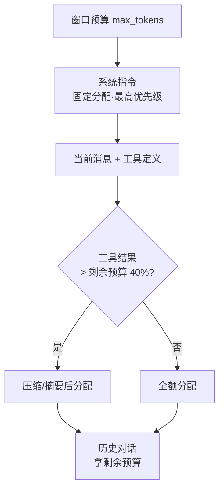
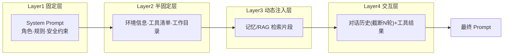
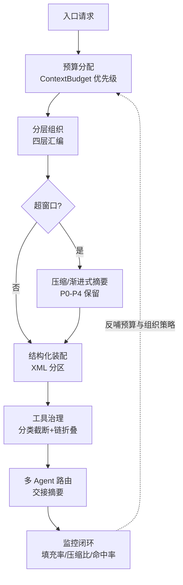

# AI Agent 上下文管理综合研究

---

## 摘要

Agent 的能力天花板由上下文质量决定：指令遵循、推理连贯、工具准确、信息保真四维皆受制于"模型看到了什么"[[1]](#ref-1)。但窗口是硬边界——单轮交互即耗 15k–30k token，一次网页抓取可吞 50k；且利用效率存在明显偏差：Lost in the Middle 显示模型对上下文首尾两段利用最优、中段显著退化（U 形曲线）[[2]](#ref-2)。故上下文管理不是"塞满窗口"，而是在有限注意力预算内"编排最高信号密度的 token 集合"[[5]](#ref-5)。

本文以掘金同名文章为核心素材[[1]](#ref-1)，沿"边界→组织→压缩→结构化→工具治理→多 Agent→监控"链路梳理，并对 MemGPT 虚拟内存视角[[3]](#ref-3)、Anthropic 上下文工程[[5]](#ref-5)[[6]](#ref-6)、context editing 实测增益（组合 39%、百轮搜索 −84% token）[[7]](#ref-7)等关键论断联网核验。结论：环节缺一即引发"上下文腐烂"[[6]](#ref-6)，上下文工程已取代提示工程成为 Agent 时代核心科目[[5]](#ref-5)。

**关键词**：上下文管理 · Token 预算 · 分层组织 · 上下文压缩 · 结构化上下文 · 工具结果治理 · 多 Agent 路由 · 上下文监控

---

## 1. 引言：为什么上下文管理决定 Agent 成败

**上下文（Context）** 是模型生成每个 token 时能"看到"的全部信息，它划定知识边界、行为约束与推理路径[[1]](#ref-1)。对 Agent 而言它不止对话历史，而是六类输入的并集：

| 上下文类型 | 示例 |
|---|---|
| 系统指令 | System Prompt、角色定义、安全规则 |
| 对话历史 | 用户消息、助手回复、多轮记录 |
| 工具调用结果 | API 返回、文件、搜索结果、错误信息 |
| 环境状态 | 工作目录、OS、可用工具列表 |
| 记忆注入 | 长期记忆检索片段 |
| 元指令 | 输出格式、执行策略、优先级规则 |

Agent 的"聪明程度"可表示为 `Agent 能力 = f(模型能力, 上下文质量, 工具丰富度)`——前两者中，上下文质量是工程上投入产出比最高的杠杆：同样一个模型，精心组织的上下文（置于首尾、按序注入）与随意堆砌的上下文，表现差异远超换一个更强的模型[[1]](#ref-1)[[2]](#ref-2)。**上下文质量直接决定四项能力：指令遵循度、推理连贯性、工具使用准确性、信息保真度**[[1]](#ref-1)。

---

## 2. 上下文窗口的物理边界：Token 预算管理

### 2.1 预算模型与典型消耗

每个模型都有硬性窗口上限。窗口内各项按 `总预算 = 系统指令 + 对话历史 + 工具结果 + 生成预留` 竞争，单轮 Agent 交互的保守消耗**约 15,000–30,000 token**：用户消息约 200、System Prompt 约 2k–8k、10 个工具定义约 3k、单次工具结果约 0.5k–5k、10 轮历史约 5k–15k[[1]](#ref-1)。工程上用经验公式估算 token：**英文约 4 chars/token、中文约 1.5 chars/token**，生产环境改用 tiktoken 等精确分词器[[1]](#ref-1)[[8]](#ref-8)。

### 2.2 分配优先级：系统指令 > 当前消息 > 工具结果 > 历史



<p align="center"><b>图1 Token 预算分配流程与优先级</b></p>

分配器按"系统指令 > 最新消息 > 工具结果 > 历史对话"逐级预算：系统指令固定、最先满足；工具结果若超出剩余预算四成则先压缩再注入；历史对话只拿节余（不足则截断）[[1]](#ref-1)。这一先后次序有明确依据——**系统指令与最新消息处于窗口首尾，恰是模型利用效率最高的区域**，而历史压缩的损失可通过摘要与结构化记忆弥补[[2]](#ref-2)[[3]](#ref-3)。

---

## 3. 上下文组织：分层装配而非"塞进去"

上下文按生命周期稳定性分为**四层**，稳定性越高越应置于固定位置[[1]](#ref-1)：



<p align="center"><b>图2 上下文四层组装流水线</b></p>

- **Layer1 固定层**：角色、核心规则、安全约束，会话内始终不变。
- **Layer2 半固定层**：环境、可用工具、工作目录，会话内稳定、跨会话变化。
- **Layer3 动态注入层**：按当前查询检索的记忆/知识片段，置于历史之前，让模型"先知道背景再读对话"。
- **Layer4 交互层**：对话历史（截断至最近 N 轮）+ 工具结果，随对话持续增长。

编排器（ContextAssembler）按上述顺序组装并用分隔符/标签连接。工程注意点：做"剪布"式截断而非整段丢弃；记忆注入放在历史之前可显著降低模型对远端背景的注意力开销[[1]](#ref-1)[[2]](#ref-2)。LangChain 等框架的 Memory/Context 组件即该分层语义的开源实现[[9]](#ref-9)。

---

## 4. 压缩与摘要策略：超出窗口时的有损管理

### 4.1 滑动窗口 + 渐进式摘要

超出窗口**不能简单丢消息**，必须走"保留关键信息的有损压缩"[[1]](#ref-1)。经典方案：最近 N 轮完整保留，更早部分增量并入累积摘要（每次只摘要新增片段，避免全量重算）；摘要固定四要素——关键决策与结论、用户偏好与约束、待处理任务、重要数据/事实[[1]](#ref-1)。这正对应 MemGPT 的"上下文即物理内存"视角：窗口是寄存器，放不下就换出（分页/摘要）到外部存储，需要时再换入[[3]](#ref-3)。

### 4.2 关键信息的优先级金字塔

并非所有信息等权，按可压缩性分级[[1]](#ref-1)：

| 优先级 | 信息类型 | 保留策略 |
|---|---|---|
| P0 | 安全约束、任务目标 | 始终保留，不可压缩 |
| P1 | 用户偏好、关键决策 | 摘要中显式标注 |
| P2 | 工具结果关键数据 | 结构化提取后保留 |
| P3 | 中间推理过程 | 可大幅压缩 |
| P4 | 已完成的子任务细节 | 仅保留结论 |

Anthropic 将服务端 compaction 视为长会话的首要手段，并给出调优方法——先最大化召回（压缩提示覆盖每条相关信息），再迭代提升精度（剔除冗余）[[5]](#ref-5)。这与滑动窗口+摘要的本地实现互补：前者离线精炼，后者在线降载。

---

## 5. 结构化上下文：让模型"看懂"世界

扁平自然语言有三弊：**歧义性**（不同指令相互混淆）、**注意力稀释**（关键信息淹没）、**跨引用困难**（多层嵌套难以定位）[[1]](#ref-1)[[5]](#ref-5)。解法是用 XML 标签对上下文做结构分区：

```xml
<context>
  <system><role>…</role><constraints><constraint priority="critical">…</constraint></constraints></system>
  <environment><os>…</os><workspace>…</workspace></environment>
  <relevant_memories><memory id="mem_001" relevance="0.92">…</memory></relevant_memories>
  <conversation>
    <tool_call id="tc_1" name="read_file"><parameters>…</parameters></tool_call>
    <tool_result id="tr_1" for="tc_1"><content>…</content><metadata><lines>342</lines></metadata></tool_result>
  </conversation>
</context>
```

结构化收益四点：**注意力引导**（标签作锚点指向关键区）、**可控截断**（按标签块而非粗暴按 token 切）、**可解析性**（上下文可程序化校验/调试）、**层级化优先级**（嵌套表达重要度）[[1]](#ref-1)。Anthropic 官方实践与之完全一致：用 XML 区分指令、上下文与变量输入；多文档场景先要求模型引文锚定再执行任务，都能显著降低误解[[5]](#ref-5)[[6]](#ref-6)。LlamaIndex 的句子窗口检索等在检索侧实现"按块截断"的同类思路[[10]](#ref-10)。

---

## 6. 工具调用中的上下文传递：Agent 特有的风险面

Agent 区别于 Chatbot 的核心是工具调用，而工具结果是上下文污染的第一来源[[1]](#ref-1)[[4]](#ref-4)。

**反模式**：`for call in history: context.append(call.result)`——一次网页抓取 50k token 全量透传，后续推理质量断崖下降[[1]](#ref-1)。正确做法是按工具类型分类治理：

| 工具类型 | 截断策略 | 参数示例 |
|---|---|---|
| web_search | 限量限条 | max_items=5, max_per_item=300 |
| read_file | 头尾保留 | max_lines=500, head_tail |
| shell_executor | 错误优先 | max_chars=2000, error_first |
| default | 字符截断 | max_chars=1000 |

对多步工具链再做**链折叠**：连续 tool_call→tool_result 只保留最后一次完整结果，中间步骤折叠为一句摘要"已完成 N 步工具调用"[[1]](#ref-1)。这与 ReAct 一脉相承——推理与行动本应交织在同一上下文里推进，若中间产物无限累积，行动链会被历史压垮，因此折叠与截断是工具链得以持续的必要条件[[4]](#ref-4)。Anthropic 的 context editing 走得更远：自动清除过期工具结果，"保留对话流、只删除陈旧内容"，100 轮网页搜索任务中让原本必然因上下文耗尽而失败的流程得以完成，token 消耗减少 **84%**[[7]](#ref-7)。

---

## 7. 多 Agent 场景的上下文路由：隔离与选择性继承

多 Agent 系统里不是"一个上下文"，而是**多个上下文的协同与隔离**[[1]](#ref-1)。三原则：每 Agent 独立上下文空间、交接只传"必要信息"、禁止全量复制（token 爆炸）[[1]](#ref-1)。三种传递方式互有取舍：

| 方式 | 适用场景 | 优点 | 缺点 |
|---|---|---|---|
| 上下文继承 | 同 Agent 连续任务 | 完整执行记忆 | Token 消耗大 |
| 上下文注入 | 跨 Agent 交接 | 信息精炼、高效 | 可能丢细节 |
| Memory ID 引用 | 共享知识库 | 不占上下文、按需检索 | 需向量库支撑 |

交接主张传**结构化交接摘要**而非原生对话：任务目标、已完成工作、关键中间产物、当前阻塞点[[1]](#ref-1)。这与 Anthropic 对子代理架构的指导同构——主 Agent 持有高层计划，子代理执行细粒度探索（可耗数万 token）后**只回传 1k–2k token 的浓缩摘要**，主上下文保持干净[[5]](#ref-5)。

---

## 8. 工程落地：陷阱、调试与监控闭环

### 8.1 四大常见陷阱

| 陷阱 | 现象 | 解法 |
|---|---|---|
| System Prompt 膨胀 | 500→5000 字，注意力稀释 | 分层设计，低频规则外置为按需注入的"技能卡片"[[1]](#ref-1)[[5]](#ref-5) |
| 工具结果全量透传 | 50k token 直塞，推理崩坏 | 注入前走"过滤-提取-截断"管道[[1]](#ref-1) |
| 对话历史幽灵状态 | 用户早期偏好被丢弃，行为突变 | 关键信息写长期记忆，而非仅依赖历史[[1]](#ref-1)[[3]](#ref-3) |
| XML 嵌套地狱 | 工具内容带标签破坏结构 | 转义或用 CDATA 包裹[[1]](#ref-1) |

### 8.2 调试与监控指标

上下文应可导出、可量化：导出"逐条 role + token 估算 + 截断/压缩位置 + 记忆来源"报告用于复盘[[1]](#ref-1)。持续监控四指标：

| 指标 | 含义 | 告警阈值 |
|---|---|---|
| 上下文填充率 | 已用/窗口上限 | >80% |
| 工具结果压缩比 | 压缩后/原始 | 按场景设定 |
| 记忆命中率 | 检索记忆中被实际引用比例 | <30% 需优化 |
| 指令遵循率下降 | 长对话后期 vs 初期 | 下降 >15% |

### 8.3 全生命周期治理总览



<p align="center"><b>图3 上下文全生命周期管理闭环</b></p>

窗口内数据与内存工具之间构成负反馈回路：监控发现低效 → 调整预算/压缩/检索策略 → 重新进入下一轮装配。Anthropic 实测该闭合回路（memory tool + context editing 组合）在内部 agentic 搜索评测上较基线提升 **39%**（context editing 单独 29%）[[7]](#ref-7)。

---

## 9. 结语

上下文管理以一条严密的因果链展开：**能力天花板因上下文质量而定（第1章）→ 窗口是硬边界，须预算分配（第2章）→ 分层组织决定怎么装（第3章）→ 装不下时须有损压缩并保优先级（第4章）→ 结构化提升利用率（第5章）→ 工具结果须治理方可持续（第6章）→ 多 Agent 只传摘要而非全量（第7章）→ 全程可度量可反哺（第8章）**。贯穿始终的第一性原理是 Anthropic 的断言——**找到能最大化期望结果的最小红 token 子集**：上下文工程已然取代 prompt 工程，成为 Agent 时代的核心工程科目[[5]](#ref-5)。

---

<a id="ref-1"></a>[1] 米小虾. ["AI Agent 上下文管理：从窗口到世界的桥梁"](https://juejin.cn/post/7651792366892171310) *稀土掘金*, 2026.（素材已落盘 `raw/articles/juejin-AI-Agent上下文管理综合研究.md`）

<a id="ref-2"></a>[2] Liu et al. ["Lost in the Middle: How Language Models Use Long Contexts."](https://arxiv.org/abs/2307.03172) *TACL*, 2023.（U 形性能曲线：上下文首尾利用率最高、中段显著退化；超 20 个检索文档读者精度近乎饱和）

<a id="ref-3"></a>[3] Packer et al. ["MemGPT: Towards LLMs as Operating Systems."](https://arxiv.org/abs/2310.08560) *arXiv*, 2023.（上下文即虚拟内存，溢出换出、按需换入）

<a id="ref-4"></a>[4] Yao et al. ["ReAct: Synergizing Reasoning and Acting in Language Models."](https://arxiv.org/abs/2210.03629) *ICLR*, 2023.（推理与行动交织于同一上下文的工具型 Agent 范式）

<a id="ref-5"></a>[5] Anthropic. ["Effective context engineering for AI agents（最小高信号 token 子集、XML 分区、compaction/结构化笔记/子代理三大手段）"](https://www.anthropic.com/engineering/effective-context-engineering-for-ai-agents)

<a id="ref-6"></a>[6] Anthropic. ["Context windows（context rot——token 越多准确率与召回越差；compaction、context awareness、thinking 处理）"](https://platform.claude.com/docs/en/build-with-claude/context-windows)

<a id="ref-7"></a>[7] Anthropic. ["Managing context on the Claude Developer Platform（context editing 自动清陈旧工具结果 + memory tool；组合提升 39%、100 轮搜索减 84% token）"](https://www.anthropic.com/news/context-management)

<a id="ref-8"></a>[8] OpenAI. ["Prompt engineering guide / Token estimation（英文约 4 chars/token 的经验估算）"](https://platform.openai.com/docs/guides/prompt-engineering)

<a id="ref-9"></a>[9] LangChain. ["Memory and Context（上下文分层与记忆管理的框架实现）"](https://python.langchain.com/docs/concepts/memory/)

<a id="ref-10"></a>[10] LlamaIndex. ["Advanced Context Management / Context Window Optimization（句子窗口检索与按块上下文优化）"](https://docs.llamaindex.ai/en/stable/optimizing/advanced_retrieval/)