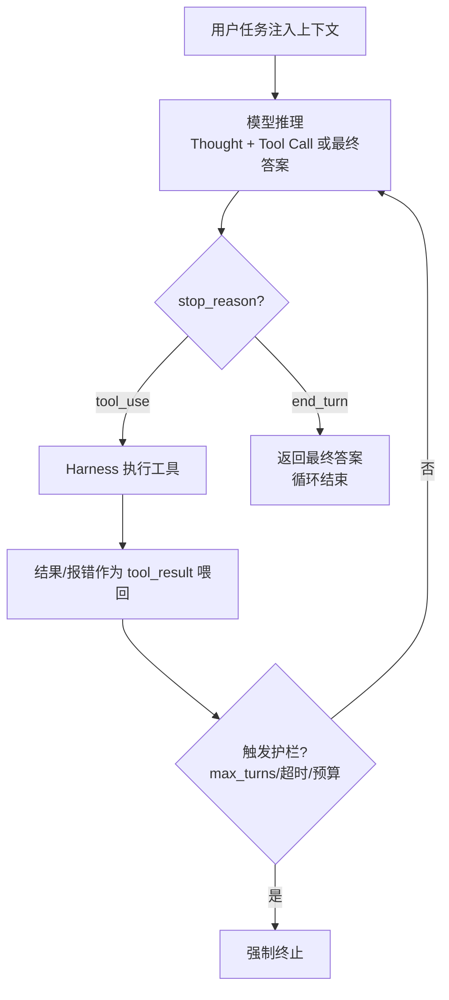

# Agent Loop

在循环中基于环境真实反馈自主决策，直到任务完成或触发终止条件。

## 摘要

Agent Loop 是 AI Agent 的核心运行机制，本质是 LLM 在"收集上下文→采取行动→验证结果"的多轮循环中，基于环境真实反馈（ground truth）自主决策、调用工具推进任务，直至任务完成或触发显式停止条件的过程。Anthropic 将其概括为"LLMs autonomously using tools in a loop"。本文以 Anthropic 五份官方文档为主体，结合 ReAct 协作范式，梳理 Agent Loop 的定义、三阶段模型、自主决策机制（条件生成、stop_reason 原语、Turn/Message 生命周期）、终止协议与控制点、失败护栏与上下文治理，并给出最小实现。结论：Agent 的智能来自模型，能力来自"循环 + 工具 + 上下文治理"，循环结构应保持简单。

**关键词**：Agent Loop、自主决策、ground truth、工具调用、agentic harness、上下文工程、终止条件、ReAct

## 一、定义

Anthropic《Building Effective Agents》（2024）将 agentic systems 分为两类 [[1]](#ref-1)：

- **Workflows**：LLM 与工具沿预定义代码路径编排，行为可预期。
- **Agents**：LLM 动态决定流程与工具使用，自主掌控任务完成方式。

《Effective context engineering for AI agents》（2025）给出精炼定义 [[2]](#ref-2)：

> LLMs autonomously using tools in a loop.

据此，Agent 不是"更聪明的模型"，而是"模型 + 工具 + 循环"构成的运行时。执行特征是：以人类指令为起点；独立规划与执行；每一步以环境反馈（工具结果、代码执行结果）评估进度，防止臆测推进；阻塞或检查点处回归人类；任务完成后终止，生产环境叠加显式停止条件 [[1]](#ref-1)。

## 二、三阶段模型

Claude Code 文档将其拆为三个相互融合（blend together）、非线性的阶段 [[3]](#ref-3)：

| 阶段 | 内容 |
|---|---|
| Gather Context | 搜索文件、读取代码、调用检索，建立对任务的理解 |
| Take Action | 编辑文件、执行命令、调用外部工具，改变环境状态 |
| Verify Results | 运行测试、查看报错、对比预期，获得 ground truth |

三阶段未必完整走遍：回答代码库问题或仅需收集上下文；修 Bug 反复循环三阶段；重构伴随大量验证。模型依据前一步反馈决定下一步，串联数十个动作并随时纠偏。循环的驱动主体是 **agentic harness**——提供工具、管理上下文、运行 while 循环的运行时外壳 [[3]](#ref-3)。

## 三、决策闭环



模型每轮二选一"继续干活或收工"，由 stop_reason 表达，harness 据此决定下一轮或终止 [[5]](#ref-5)：

| stop_reason | 含义 | harness 动作 |
|---|---|---|
| tool_use | 模型要调用工具 | 执行工具，结果塞回上下文，再次调用模型 |
| end_turn | 模型认为完成 | 退出循环，返回文本答案 |
| max_tokens | 触顶输出上限 | 按策略处理 |
| refusal | 拒绝请求 | 检测处理拒答 |

## 四、Turn 与 Message

### 4.1 Turn

一次往返即一个 Turn：Claude 生成输出（文本和/或工具调用）→ SDK 执行工具并收集结果 → 结果自动回喂。如此循环直至 Claude 产出不含工具调用的最终文本，循环结束。复杂任务在多个 Turn 中链式调用数十个工具 [[4]](#ref-4)。

### 4.2 五类 Message

| 类型 | 含义 |
|---|---|
| SystemMessage | 会话生命周期事件（init / compact_boundary / informational / worker_shutting_down） |
| AssistantMessage | Claude 的文本或工具调用块 |
| UserMessage | 工具执行结果回喂；亦承载流式输入 |
| StreamEvent | 流式输出时的原始 API 事件 |
| ResultMessage | 循环结束标志：最终文本、token 用量、成本、会话 ID |

### 4.3 终止状态

- `max_turns`：最大工具调用轮次（仅计 tool-use turn）；`max_budget_usd`：花费上限。均为默认无限制。
- ResultMessage 的 subtype 标识终止原因：`success`（含最终文本）、`error_max_turns`、`error_max_budget_usd`、`error_during_execution`、`error_max_structured_output_retries`；均携带成本、用量、轮数、会话 ID [[4]](#ref-4)。

## 五、自主决策

循环中的四类判断全部由模型在逐轮生成中完成：

| 决策维度 | 依赖 | 失败表现 |
|---|---|---|
| 行动选择（哪个工具、什么参数） | 任务目标 + 上下文 + 工具 schema | 选错工具、参数幻觉 |
| 路径修正（报错后调整策略） | 上轮 error / ground truth | 重复同样错误 |
| 终止判断（任务是否完成） | 验证结果 | 过早结束、死循环 |
| 上下文管理（保留哪些信息） | scratchpad、压缩策略 | 上下文溢出 |

其正确性依赖三点：自回归生成使每轮决策基于含全部历史的条件生成；ground truth 以环境客观事实约束规划，从"生成式猜测"转为"基于证据的决策" [[1]](#ref-1)；ReAct 式"思考—行动—观察"交错，将推理显式写入上下文供下一轮依据 [[6]](#ref-6)。

## 六、终止与护栏

终止双保险：模型侧通过系统提示给出显式完成判据（如"测试全部通过方可宣告完成"）；harness 侧叠加外部约束——最大轮次、token/成本预算、超时、循环检测（连续相同工具+参数即熔断）。

典型失败模式及对策：

| 失败模式 | 根因 | 护栏 |
|---|---|---|
| 死循环 | 未从反馈识别无效 | 循环检测 + 重复动作熔断 |
| 工具幻觉 | 把可推测内容当真实结果 | 工具结果仅由 harness 注入 |
| 过早终止 | 把"写了代码"当"代码能跑" | 完成判据 + 先验证再宣告 |
| 上下文溢出 | 长循环无节制累积 | 压缩、scratchpad、子代理 |
| 选错工具 | 工具描述模糊 | 打磨 schema 与 description |
| 错误不纠偏 | 报错被静默吞掉 | 异常显式写入 tool_result |

hooks 提供循环控制点：PreToolUse（校验/阻断）、PostToolUse（审计）、Stop（校验结果）、PreCompact（归档前保存）、SubagentStart/Stop（汇总子代理）等，运行于宿主进程、不占用上下文 [[4]](#ref-4)。

## 七、上下文治理

循环越久，上下文越长：系统提示、工具定义、对话历史随 Turn 累积，越过窗口上限并稀释注意力（Anthropic 称"注意力预算"，检索精度随 token 数增加衰减，即 context rot）[[2]](#ref-2)。SDK 在临近上限时自动压缩（compaction）并发出 compact_boundary 通知 [[4]](#ref-4)。三类工程应对：

1. **Compaction**：总结旧历史、保留架构决策与关键信息，重开窗口。
2. **scratchpad/笔记**：关键中间结论写于窗口外按需召回（如 Claude 玩 Pokémon 维护 1234 步任务台账，重置后靠笔记续跑）[[2]](#ref-2)。
3. **子代理**：高消耗、低保留价值的探索交由子代理在独立窗口进行，仅回传 1k–2k token 摘要 [[2]](#ref-2)。

## 八、最小实现

```python
messages = [{"role": "user", "content": TASK}]
MAX_TURNS = 25                     # 护栏1：迭代上限（仅计工具轮）
for _ in range(MAX_TURNS):
    resp = client.messages.create(model, max_tokens=4096,
        system=SYSTEM_PROMPT,      # 含完成判据与服务规范
        tools=TOOLS_SCHEMA, messages=messages)
    messages.append({"role": "assistant", "content": resp.content})
    if resp.stop_reason == "end_turn":        # 护栏2：模型判断完成
        return "".join(b.text for b in resp.content if b.type == "text")
    results = []
    for b in resp.content:                    # 执行每个工具请求
        if b.type == "tool_use":
            try:
                out = execute_tool(b.name, b.input)
            except Exception as e:
                out = f"ERROR: {e}"           # 报错也回喂，供纠偏
            results.append({"type": "tool_result",
                            "tool_use_id": b.id, "content": str(out)})
    messages.append({"role": "user", "content": results})   # ground truth 回喂
```

## 九、设计原则

1. **工具设计决定 Agent 质量**：工具集与文档是一等工程。
2. **不为所有任务上 Agent**：可预测任务用 Workflow；开放式问题才用 Agent，但需接受更高成本与误差累积，并加护栏。
3. **拒绝复杂框架**：简单可组合的模式胜过框架，后者遮蔽 prompt 与响应的调试。
4. **上下文是循环的血液**：以 compaction、笔记、子代理治理累积。
5. **显式终止判据**：系统提示给完成条件 + max_turns/预算/循环检测。
6. **权限与人在回路**：权限模式（default/acceptEdits/plan 等）、工具白名单、检查点限定循环影响面 [[3]](#ref-3) [[4]](#ref-4)。

## 十、结论

Agent 的自主决策是三个要素的叠加：完整上下文反馈（让模型看见真相）、条件生成（让模型每轮重新判断）、模型与 harness 共担的终止协议（stop_reason + 外部护栏）。前两者赋予"自主"，最后一个保证"可控"。能力来自循环、工具与上下文治理而非模型本身，故循环结构应保持简单，复杂度投向工具设计与上下文工程 [[1]](#ref-1) [[2]](#ref-2) [[3]](#ref-3) [[4]](#ref-4)。

## 参考文献

<a id="ref-1"></a>[1] Anthropic. ["Building Effective Agents."](https://www.anthropic.com/engineering/building-effective-agents) *Anthropic Engineering Blog*, 2024-12-19.

<a id="ref-2"></a>[2] P. Rajasekaran et al. ["Effective Context Engineering for AI Agents."](https://www.anthropic.com/engineering/effective-context-engineering-for-ai-agents) *Anthropic Engineering Blog*, 2025-09-29.

<a id="ref-3"></a>[3] Anthropic. ["How Claude Code Works."](https://code.claude.com/docs/en/how-claude-code-works) *Claude Code Docs*.

<a id="ref-4"></a>[4] Anthropic. ["How the Agent Loop Works."](https://code.claude.com/docs/en/agent-sdk/agent-loop) *Claude Agent SDK Docs*.

<a id="ref-5"></a>[5] Anthropic. ["The Agent Loop Explained."](https://academy.claude.com/courses/claude-platform-101/the-agent-loop-explained) *Claude Platform 101*.

<a id="ref-6"></a>[6] S. Yao et al. ["ReAct: Synergizing Reasoning and Acting in Language Models."](https://arxiv.org/abs/2210.03629) *ICLR*, 2023.