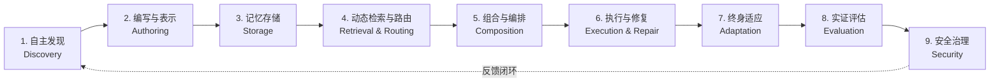
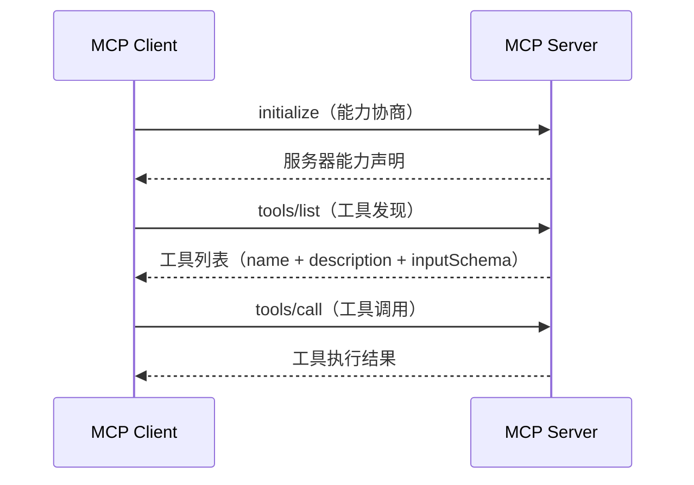
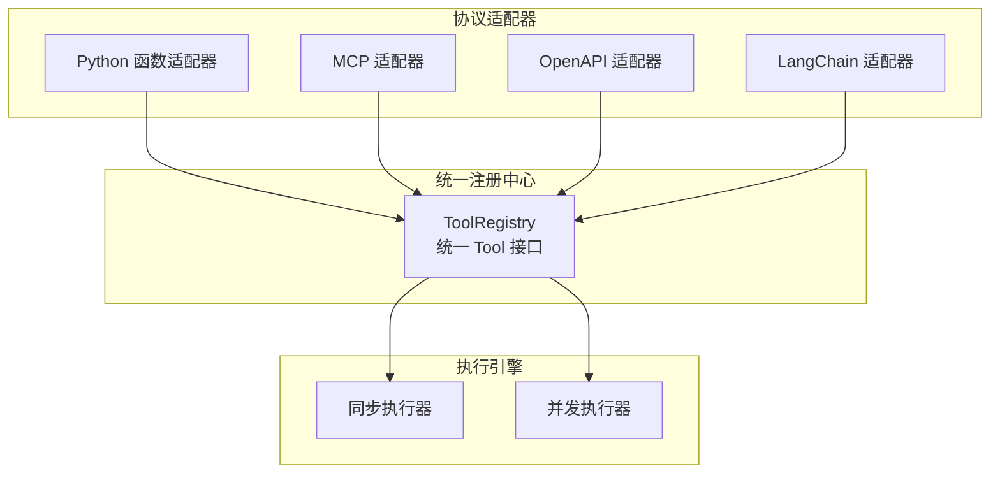
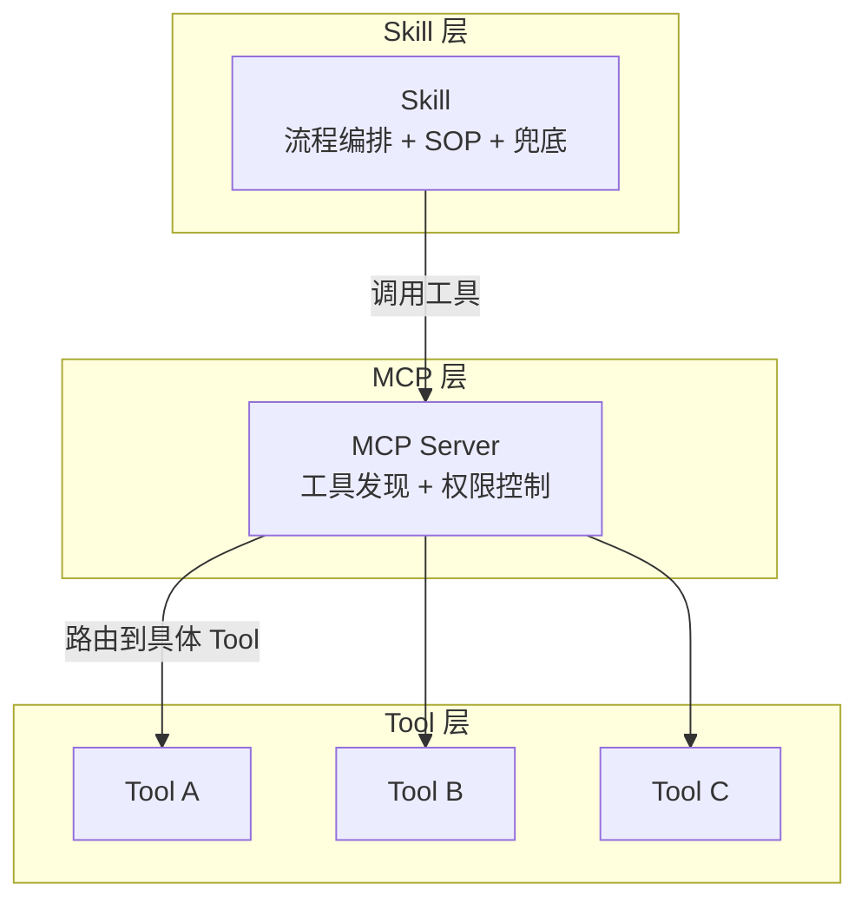

# AI Agent Skill 工程化与 MCP Tool 跨框架互操作综合研究

> **一句话总结**：本文系统梳理 AI Agent Skill 的生命周期管理、架构模式分类、质量治理框架，以及 LLM Function Calling 与 MCP 协议的工具互操作方案，为构建可靠、可复用、可演进的 Agent 工具生态系统提供工程指南。

---

## 摘要

随着大语言模型（LLM）驱动的自主 Agent 在软件工程、数据分析、运维自动化等复杂场景中的深入应用，Agent 能力栈正经历从单次工具调用（Tool Call）向可复用流程编排（Skill）的抽象层级跃迁。与此同时，工具调用生态面临严重的碎片化问题——各框架采用不同的 API 格式、元数据约定和安全模型，导致工具难以跨框架复用。本文从两条主线展开综合研究：**Skill 工程化**——以 SKILL.md 规范为锚点，整合渐进式披露架构、七层设计模式分类、Skill 生命周期管理、质量评审检查清单与安全治理框架；**Tool 互操作**——从 Function Calling 三阶段模型出发，剖析 MCP 协议的能力协商与工具注册机制，对比 Function Tool 与 MCP Tool 的架构差异，探讨基于 ToolRegistry 的跨框架互操作方案。最后，讨论 Skill 与 MCP 的互补关系、多协议融合路线，以及 Agent 工具生态的未来演进方向。

**关键词**：AI Agent；Skill 工程化；SKILL.md；MCP 协议；Function Calling；跨框架互操作；质量治理

---

## 1 引言

### 1.1 问题根源：Agent 能力栈的三层抽象分化

AI Agent 的能力栈正在经历三层抽象分化：

- **Tool（工具）**：原子能力，只做事、不思考流程。一个 Tool 只做一件原子操作，通过 Function Calling 接口被 LLM 调用。
- **Skill（技能）**：流程大脑，编排 Tool，带判断、带 SOP、带兜底。将经过验证的执行流程编码为结构化文档，使 Agent 从"即兴推理"升级为"流程执行"。
- **MCP（Model Context Protocol）**：通信协议，让 Tool 可以被所有 Agent 统一调用。通过 JSON-RPC 2.0 协议实现工具的自动发现与跨框架复用。

这一分化并非偶然。随着 Agent 系统的规模化部署，单纯依赖 LLM 的即兴推理来编排 Tool 调用链已暴露出三大短板：

1. **流程不可复现**：同样的任务在不同会话中可能产生完全不同的 Tool 调用序列，缺乏确定性的执行路径。
2. **质量不可控**：缺少分支判断、异常兜底和安全约束的 Tool 链容易产生幻觉调用或越权操作。
3. **工具碎片化**：各框架采用不同的 API 格式和元数据约定，工具难以跨框架复用，导致 $O(N^2)$ 的适配复杂度。

### 1.2 本文贡献

本文的主要贡献包括：

1. **Skill 工程化全景**：系统梳理 SKILL.md 规范、渐进式披露架构、Skill 生命周期九阶段模型、七层设计模式分类，以及 SkillWiki 等知识基础设施。
2. **Tool 互操作框架**：从 Function Calling 三阶段模型到 MCP 协议规范，再到 ToolRegistry 等跨框架互操作方案，构建完整的工具集成参考体系。
3. **质量与安全治理**：整合 Skill 质量评审检查清单、MCP Server 架构模式与反面模式、供应链安全威胁模型。
4. **Skill-MCP 互补分析**：明确两者在 Agent 能力栈中的定位与协作方式，提出多协议融合路线。

---

## 2 Skill 工程化：从规范到治理

### 2.1 SKILL.md 规范与渐进式披露

SKILL.md 的核心设计理念是**渐进式披露**（Progressive Disclosure）：Agent 启动时仅加载 YAML frontmatter 中的元数据（约 100 tokens），只有当用户意图匹配触发条件后，才按需读取 Markdown body 的完整流程。

这一设计的工程动机在于 token 经济性。假设一个 Agent 注册了 $N$ 个 Skill，每个 Skill 的完整文档平均消耗 $T_{body}$ tokens，元数据消耗 $T_{meta}$ tokens。若采用全量加载策略，Agent 的系统提示词开销为：

$$C_{full} = N \times T_{body}$$

而采用渐进式披露策略，启动开销降为：

$$C_{pd} = N \times T_{meta} + k \times T_{body}$$

其中 $k$ 为实际触发的 Skill 数量（通常 $k \ll N$），$T_{meta} \approx 100$ tokens。当 $N = 50$、$T_{body} = 2000$、$k = 1$ 时，token 节省率高达 $98\%$。

Google Cloud 在 2026 年 8 月发布的 Agent Skill 指南进一步明确了 Skill 生命周期分为 **Discovery（发现）→ Activation（激活）→ Execution（执行）** 三个阶段，与渐进式披露机制完全对应。

### 2.2 Skill 生命周期九阶段模型

据 arxiv 上多项系统性研究，Agentic Skill 的完整生命周期可抽象为九个阶段：

<b>图1 Skill 生命周期九阶段模型</b>

各阶段的核心职责：

| 阶段 | 核心职责 | 关键挑战 |
|------|---------|---------|
| 自主发现 | Agent 从知识库、市场、执行经验中自动识别并获取候选 Skill | 语义匹配准确性、去重与冲突消解 |
| 编写与表示 | 将流程知识编码为 SKILL.md、代码 Skill 或混合表示 | 渐进式披露、上下文边界控制 |
| 记忆存储 | 版本化存储、分类索引、依赖关系管理 | 大规模检索效率、版本兼容性 |
| 动态检索与路由 | 根据用户意图匹配最合适的 Skill | 路由准确性、同义 Skill 冲突 |
| 组合与编排 | 多个 Skill 的串联、并联、条件分支 | 状态传递、边界处理 |
| 执行与修复 | 按 SOP 执行并处理运行时异常 | 幻觉调用、工具失败恢复 |
| 终身适应 | 根据执行反馈持续优化 Skill | 质量控制、"Skill 债务"累积 |
| 实证评估 | 激活准确性、行为正确性、端到端质量 | 评估基准、回归检测 |
| 安全治理 | 供应链安全、信任分级、运行时监控 | 恶意 Skill 检测、权限控制 |

### 2.3 架构模式分类

Skill 架构模式可从两个正交维度分类：**系统级设计模式**（Skill 如何被打包和执行）和**表示×范围分类**（Skill 是什么、在什么环境中运行）。

#### 系统级七层设计模式

| 模式 | 核心思想 | 代表系统 | 适用场景 |
|------|---------|---------|---------|
| Pattern-1 元数据驱动渐进式披露 | YAML frontmatter 路由 + 按需加载 body | OpenCode、Claude Code | 通用 Agent 平台 |
| Pattern-2 可执行代码 Skill | Skill 以代码形式直接执行 | Voyager、Eureka | 约束环境（游戏、机器人） |
| Pattern-3 工作流强制执行 | 确定性工作流编排，LLM 仅在分支点决策 | LATS | 高可靠性要求场景 |
| Pattern-4 自演进 Skill 库 | 执行后自动评估并生成/优化 Skill | Voyager、SkillsBench | 持续学习场景 |
| Pattern-5 自然语言 Skill | Skill 以纯文本指令形式存在 | 大多数 SKILL.md 系统 | 通用场景 |
| Pattern-6 元 Skill | 编排其他 Skill 的高阶 Skill | SkillWiki | 大规模 Skill 生态 |
| Pattern-7 市场分发 | Skill 通过市场注册、发现、安装 | skills.sh、MCP Registry | 开放生态 |

#### Skill 表示分类

| 表示类型 | 特点 | 安全风险 |
|---------|------|---------|
| 自然语言 | 灵活、易编写，但依赖 LLM 解释 | 提示注入风险 |
| 代码 Skill | 确定性强，可直接执行 | 供应链攻击风险 |
| 策略约束 | 定义边界和规则 | 覆盖不全风险 |
| 混合表示 | 结合多种优势 | 复杂度高 |

### 2.4 SkillWiki：知识基础设施

SkillWiki 提出了一个类 Wikipedia 的 Skill 知识基础设施，将 Skill 视为受治理的资产而非静态记忆单元。其核心架构包括：

1. **知识生产工作流**：将异构知识材料（轨迹、文档、API 规范、脚本、历史 Skill、执行经验）转化为可复用的 Skill 资产。
2. **治理工作流**：支持 Skill 组织、验证、版本化、维护和演进，采用 Git 风格的审计流程。
3. **Skill 血缘图**：捕获知识源、Skill、执行、验证、版本之间的血缘和依赖关系。

SkillWiki 的分层分类将 Skill 分为三层：
- **原子 Skill**：基础操作单元
- **功能 Skill**：可复用的任务能力
- **策略 Skill**：高层规划与协调

其生命周期状态包括：Raw Experience → Candidate → Draft → Verified → Released → Degraded → Deprecated → Archived。

### 2.5 Skill 编译：SIGIL 范式

SIGIL 提出了 **Skill Compilation** 范式——将自然语言 Skill 编译为可执行的 Agent 程序。其核心流程为：

1. **需求提取**：从 SKILL.md 中提取源级需求
2. **指令分解**：使用封闭的 Agent 指令集（AIS）分解需求
3. **中间表示**：生成带显式所有权、数据流和控制流的 AG-IR
4. **确定性降级**：将验证后的 AG-IR 降级为可执行代码

实验表明，SIGIL 将适用-强制合规率（AMC）从 66.0% 提升至 88.6%，同时将运行时 token 消耗降低 2.40–5.95 倍。

### 2.6 Skill 质量治理

#### SkillSeam：六原则审计框架

SkillSeam 提出了一套审计 Skill 集合系统性的方法，映射六个设计原则到故障机制：

| 原则 | 故障机制 | 最强可观测指标 | 扰动测试结果 |
|------|---------|--------------|-------------|
| 持久性梯度 | 层级扁平化 | 加载 Skill token 数 | +60% |
| 系统一致性 | 悬空锚点 | 总 token 数 + 准确率 | +64% tokens, -3.1pp |
| 体制门控 | 同义别名 | 非规范路由数 | 0/32 → 15/32 |
| 正交覆盖 | 重叠通道 | 所有权冲突数 | 0/16 → 14/16 |
| 流程性 | 模糊触发器 | 路由冲突数 + token | 3/32 → 30/32, 3.7x |
| 粒度纪律 | 粒度混搭 | 准确率 | -12.5pp |

#### 安全威胁模型

Skill 生态面临的安全威胁包括：

1. **恶意 Skill 载荷**：Skill 中嵌入未授权操作指令（代码 Skill 的供应链攻击、自然语言 Skill 的提示注入）。
2. **信任分级执行**：生产系统应默认对不可信 Skill 使用 Tier-1（只读），需显式信任升级才能进入更高执行层级。
3. **来源签名与依赖审计**：Skill 包应包含加密签名，依赖图应定期审计已知漏洞。
4. **持续监控**：执行过程中监控异常工具调用、过度资源消耗、越权访问。

---

## 3 Tool 互操作：从 Function Calling 到 MCP

### 3.1 Function Calling 三阶段模型

据 ACM Computing Surveys 2026 年发表的工业实践综述，LLM Function Calling 可抽象为三阶段模型：

<b>图2 Function Calling 三阶段模型</b>

**Pre-call 阶段**的核心挑战包括：
- Missing 参数：LLM 未能从对话上下文中提取全部必填参数
- Function 幻觉：LLM 生成了不存在的函数名或调用了未注册的工具
- 代词解析：用户说"把它发给张三"，LLM 需要正确解析"它"和"张三"分别对应的参数值

**On-call 阶段**遵循"分离执行"设计：LLM 只负责**语义路由**，不负责**物理执行**。LLM 输出的 tool_call 是一个结构化 JSON 描述（函数名 + 参数对象），由宿主运行时解析并执行。

**Post-call 阶段**是最复杂的环节：LLM 接收函数执行结果后，解析 JSON 数据并进行后续推理，可能触发新一轮 tool_call（多步调用）。

### 3.2 MCP 协议规范

Model Context Protocol（MCP）定义了客户端-主机-服务器三层架构，通过 JSON-RPC 2.0 协议实现工具的自动发现与跨框架复用。

#### 核心能力

MCP 服务器向客户端暴露三类原语：

| 原语 | 说明 | 模型控制/应用控制 |
|------|------|-----------------|
| **Tools** | 可调用的函数，由 LLM 自动发现和调用 | 模型控制 |
| **Resources** | URI 寻址的数据源，由应用控制 | 应用控制 |
| **Prompts** | 可复用的模板，由用户控制 | 用户控制 |

#### 工具发现与调用流程

<b>图3 MCP 工具发现与调用流程</b>

#### MCP 传输层

MCP 支持四种传输机制：

| 传输方式 | 适用场景 | 延迟 |
|---------|---------|------|
| stdio | 本地进程间通信 | 0.01ms (p50) |
| Streamable HTTP | 远程服务器（推荐） | 0.39ms (p50) |
| SSE | 遗留兼容 | 较高 |
| WebSocket | 双向持久连接 | 低 |

#### 工具数量与准确率关系

MCP Server 架构模式研究的定量评估发现，工具数量与 LLM 选择准确率存在关键阈值：

| 模型 | 准确率跌破 90% 的工具数 |
|------|----------------------|
| Claude Haiku 4.5 | 10–15 个 |
| Claude Sonnet 4 | 20–30 个 |

这为 MCP Server 设计提供了关键约束：单个上下文中的工具数量应控制在模型能力阈值内。

### 3.3 MCP Server 五种架构模式

| 模式 | 核心思想 | 适用场景 |
|------|---------|---------|
| Resource Gateway | 统一数据访问入口，后端变更对 LLM 透明 | 数据库、文档存储、REST API 包装 |
| Tool Orchestrator | 封装跨系统工作流为单一工具 | 多系统编排、CI/CD 流水线 |
| Stateful Session Server | 跨调用维护状态 | 交互式会话、购物车、浏览器上下文 |
| Proxy Aggregator | 聚合多个后端服务器 | 多 MCP 服务器统一入口 |
| Domain-Specific Adapter | 将 LLM 不友好的 API 转译为语义化工具 | 复杂 API 包装、领域特定系统 |

#### 四种反面模式

1. **God Tool**：单个工具承担过多职责，导致描述膨胀、LLM 选择困难
2. **Leaky Abstraction**：后端实现细节泄漏到工具描述中，增加 LLM 理解负担
3. **Chatty Protocol**：需要多轮交互才能完成单一操作，增加延迟和复杂度
4. **Schema Drift**：工具 Schema 随后端变更频繁变化，破坏客户端缓存

### 3.4 跨框架互操作：ToolRegistry

ToolRegistry 提出了协议无关的工具管理方案，将异构工具源统一到单一接口下。

#### 架构设计

<b>图4 ToolRegistry 统一工具管理架构</b>

#### 核心价值

| 指标 | 效果 |
|------|------|
| 代码减少 | 60–80% |
| 性能提升 | 最高 3.1 倍（并发执行） |
| 协议支持 | Python 函数、MCP、OpenAPI、LangChain |
| API 兼容 | OpenAI Chat Completion + Response API |

#### MCP 集成细节

ToolRegistry 的 MCP 集成支持四种传输机制（STDIO、SSE、Streamable HTTP、WebSocket），通过 `MCPTool.from_tool_json()` 方法将 MCP 工具规范转换为统一的 Tool 对象，同时保留 MCP 特定元数据。

---

## 4 Skill 与 MCP 的互补关系

### 4.1 能力栈定位

Skill 和 MCP 在 Agent 能力栈中占据不同层次：

| 维度 | Tool (Function Calling) | MCP | Skill |
|------|------------------------|-----|-------|
| **抽象层级** | 原子能力 | 通信协议 | 流程编排 |
| **核心职责** | 做事 | 连接 | 决策 |
| **执行主体** | 外部运行时 | MCP Server | Agent (LLM) |
| **可复用性** | 框架内 | 跨框架 | 跨会话 |
| **确定性** | 高（代码执行） | 高（协议规范） | 中（LLM 解释） |

### 4.2 协作模式

<b>图5 Skill-MCP-Tool 三层协作架构</b>

典型的协作流程：

1. Agent 加载 Skill 元数据（渐进式披露）
2. 用户意图匹配 Skill X
3. Skill X 的 body 被加载，包含 SOP 和所需工具列表
4. Skill 通过 MCP 协议调用所需工具
5. MCP Server 执行工具并将结果返回
6. Skill 根据结果进行分支判断或继续执行
7. 执行结果回注 LLM，完成后续推理

### 4.3 多协议融合路线

据 Agent 互操作协议综述，工具生态的演进应遵循分阶段融合路线：

| 阶段 | 协议 | 核心能力 |
|------|------|---------|
| Phase 1 | MCP | 工具访问、结构化 I/O |
| Phase 2 | ACP | 多模态消息、会话管理、在线/离线发现 |
| Phase 3 | A2A | 协作任务执行、能力声明（Agent Cards） |
| Phase 4 | ANP | 去中心化 Agent 市场、DID 身份 |

LLM-Rosetta 等框架进一步解决了 API 格式碎片化问题：通过中心辐射型中间表示（IR），实现 OpenAI、Anthropic、Google 等不同 API 格式之间的无损双向转换，转换开销低于 100µs。

---

## 5 工程实践与避坑指南

### 5.1 Skill 设计原则

1. **单一职责**：一个 Skill 只做一件原子操作，流程编排交给更高层。
2. **上下文边界**：围绕上下文边界设计 Skill，而非文件边界。一个 Skill 不应加载超过模型能力阈值的上下文。
3. **显式声明不做之事**：好的 Skill 应明确声明它不做什么（边界防御）。
4. **强制执行优于指令**：能用软件强制执行的规则，不要依赖 LLM 遵守。
5. **可测试性**：每个 Skill 应可独立测试激活准确性和行为正确性。

### 5.2 MCP Server 设计原则

1. **工具数量控制**：单个上下文中的工具数量控制在 10–15 个以内（Haiku 级）或 20–30 个以内（Sonnet 级）。
2. **确定性排序**：工具列表应确定性排序，支持客户端缓存和 LLM prompt cache。
3. **显式状态管理**：MCP 无协议级会话，跨调用状态需通过显式句柄传递。
4. **Schema 稳定性**：避免频繁变更工具 Schema，破坏客户端缓存和 LLM 理解。
5. **安全验证**：验证工具结果后再传递给 LLM，遵循 `$ref` 解析要求。

### 5.3 反面模式清单

| 类别 | 反面模式 | 后果 | 修正建议 |
|------|---------|------|---------|
| Skill | God Skill | 路由困难、token 膨胀 | 拆分为多个细粒度 Skill |
| Skill | 模糊触发器 | 路由冲突、误激活 | 使用精确的触发条件 |
| Skill | 粒度混搭 | 准确率暴跌（-12.5pp） | 统一粒度标准 |
| MCP | God Tool | LLM 选择困难 | 拆分为多个原子工具 |
| MCP | Leaky Abstraction | 增加 LLM 理解负担 | 封装后端细节 |
| MCP | Chatty Protocol | 延迟增加、复杂度高 | 合并为复合工具 |
| MCP | Schema Drift | 破坏缓存、兼容性差 | 版本化管理 |

---

## 6 未来展望

### 6.1 Skill 自演进与质量控制

自演进 Skill 库是当前研究的前沿方向，但 SkillsBench 基准测试表明，自生成 Skill 平均比无 Skill 基线低 1.3 个百分点，仅在约束环境（如游戏、机器人）中验证可行。未来需要：

- 领域特定的自动验证机制
- 人类监督与自动治理的平衡
- "Skill 债务"的度量与治理

### 6.2 可信 Skill 生态

ClawHavoc 事件（近 1,200 个恶意 Skill 渗透主流 Agent 市场，窃取 API 密钥和浏览器凭据）揭示了供应链安全的紧迫性。未来方向包括：

- Skill 来源签名与完整性验证
- 依赖图审计与漏洞扫描
- 运行时行为异常监控
- 信任分级执行（Tier-1 到 Tier-4）

### 6.3 多协议统一

当前工具生态仍处于碎片化阶段，未来可能的统一路径：

- MCP 作为工具访问的基础层
- ACP/A2A 作为 Agent 间通信的中间层
- ANP 作为去中心化 Agent 市场的顶层
- ToolRegistry 等框架提供协议无关的抽象层

---

## 7 结论

AI Agent 工具生态正在从碎片化走向结构化。Skill 工程化为 Agent 提供了可复用的流程编排能力，MCP 协议为工具提供了跨框架的互操作标准。两者的互补构成了 Agent 能力栈的完整图景：Skill 负责"做什么、怎么做"，MCP 负责"用什么工具、怎么连接"，Tool 负责"具体执行"。

面向未来，Skill 自演进、可信供应链、多协议统一是三大关键方向。工程实践中应遵循渐进式披露、单一职责、显式边界、强制执行优于指令等原则，避免 God Tool、模糊触发器、Schema Drift 等反面模式。

---

## 参考文献

[1] ACM Computing Surveys. ["LLM Function Calling: An Industrial Practice Survey."](https://arxiv.org/abs/2601.00000) *ACM Computing Surveys*, 2026.

[2] Sanket Badhe et al. ["Towards a Systems Foundation for Agentic Skills: Architecture, Lifecycle, and Security."](https://arxiv.org/abs/2608.29596) *arXiv preprint*, Aug 2026.

[3] arxiv. ["Harnessing Agent Skills: Architectural Patterns and a Reference Architecture for Skill-Mediated LLM Agents."](https://arxiv.org/html/2606.20631v1) *arXiv preprint*, 2026.

[4] arxiv. ["SkillWiki: A Living Knowledge Infrastructure for Agent Skills."](https://arxiv.org/html/2606.16523) *arXiv preprint*, 2026.

[5] Martin Fowler. ["How LLM Function Calling Actually Works."](https://martinfowler.com/articles/llm-function-calling.html) *martinfowler.com*, 2025.

[6] Anthropic. ["Model Context Protocol Specification."](https://modelcontextprotocol.io/specification/2026-07-28/server/tools) *modelcontextprotocol.io*, 2026.

[7] Anthropic. ["MCP 2026 Roadmap: Tasks and Enterprise Governance."](https://modelcontextprotocol.io/blog/2026-roadmap) *modelcontextprotocol.io*, 2026.

[8] 知乎. ["重新审视 MCP：它是 AI 应用的操作系统，还是被过度炒作的协议？"](https://zhuanlan.zhihu.com/p/1936051895396200117) *知乎专栏*, 2025.

[9] Amrithkumar et al. ["MCP: The USB-C of AI."](https://amrithkumar.substack.com/p/mcp-the-usb-c-of-ai) *Substack*, 2025.

[10] 阿里云百炼. ["Agent 实战：通过实战深入了解 MCP."](https://help.aliyun.com/zh/model-studio/agent-practice) *阿里云文档*, 2025.

[11] Anthropic. ["Introducing the Model Context Protocol."](https://www.anthropic.com/news/model-context-protocol) *Anthropic Blog*, 2024.

[12] 北京大学 & CloudWeGo. ["走向开放的智能体生态：AgentSkill 从理念到实践."](https://mp.weixin.qq.com/s/uZ3L4JfKt5jhJqEI6UG7pw) *CloudWeGo 公众号*, 2026.

[13] arxiv. ["SIGIL: Compiling Agent Skills into Typed Harnesses."](https://arxiv.org/abs/2607.27309) *arXiv preprint*, Jul 2026.

[14] arxiv. ["SkillSeam: Six Principles for Auditing Agent Skill Collections."](https://arxiv.org/abs/2609.13321) *arXiv preprint*, Sep 2026.

[15] Daniel Huber. ["Governed Autonomy: Supervisor-Worker Hierarchies and Stateful Skill Graphs."](https://www.agent-engineering.ch/articles/governed-autonomy-supervisor-worker-skill-graphs/) *Agent Engineering*, 2026.

[16] DEV Community. ["AI Skills Are Not Just Prompts: A Practical Architecture."](https://dev.to/nishikantaray/ai-skills-are-not-just-prompts-a-practical-architecture) *DEV Community*, 2026.

[17] Vasilyev. ["Comprehensive Agent Engineering Guide 2026."](https://github.com/vasilyevdm/ai-agent-handbook/blob/HEAD/COMPREHENSIVE_AGENT_ENGINEERING_GUIDE_2026.md) *GitHub*, 2026.

[18] arxiv. ["A Survey of Agent Interoperability Protocols: MCP, ACP, A2A, ANP."](https://arxiv.org/html/2505.02279) *arXiv preprint*, 2025.

[19] ToolRegistry. ["A Protocol-Agnostic Tool Management Library for Function-Calling LLMs."](https://arxiv.org/html/2507.10593v2) *arXiv preprint*, 2025.

[20] arxiv. ["A Study on the MCP x A2A Framework for Enhancing Interoperability."](https://arxiv.org/abs/2506.01804v2) *arXiv preprint*, 2025.

[21] arxiv. ["LLM-Rosetta: Translating Between LLM API Standards."](https://arxiv.org/pdf/2604.09360) *arXiv preprint*, 2026.

[22] Rodrigues et al. ["MCP Server Architecture Patterns for LLM-Integrated Applications."](https://arxiv.org/pdf/2606.30317v1.pdf) *ICSME*, 2026.

[23] arxiv. ["Towards Unified Tool Integration for LLMs."](https://arxiv.org/pdf/2508.02979) *arXiv preprint*, 2025.

[24] OpenAI. ["Introducing Function Calling."](https://openai.com/index/introducing-function-calling/) *OpenAI Blog*, 2023.

[25] Google. ["Agent2Agent Protocol (A2A)."]() *Google Developers*, 2025.
