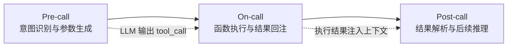
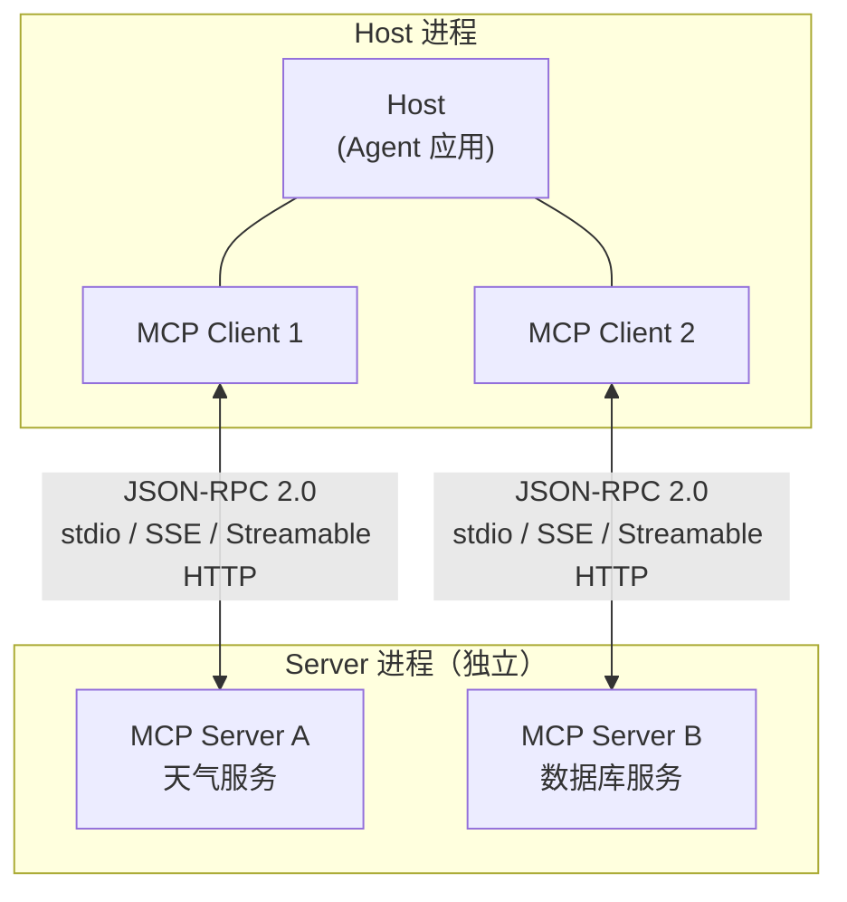
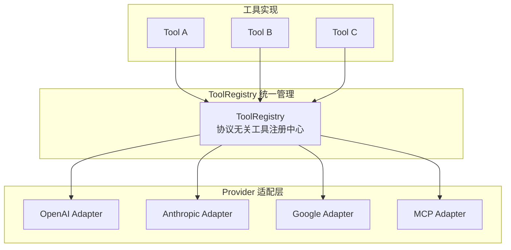

# LLM Function Calling 与 MCP Tool 设计：原子工具、结构化输出与跨框架互操作

> **一句话总结**：本文系统梳理 LLM Function Calling 的三阶段模型、Function Tool 与 MCP Tool 的架构差异、结构化输出约束下的 Tool Suppression 问题及跨框架互操作方案，为构建可靠的 LLM 工具调用系统提供工程指南。

---

## 摘要

大语言模型（LLM）本身无法直接操作外部世界——它只能生成文本[[5]](#ref-5)。Function Calling 机制使 LLM 能够输出结构化的函数调用描述（JSON），由外部运行时执行并将结果回注模型，从而弥合"语言理解"与"世界动作"之间的鸿沟[[1]](#ref-1)。与此同时，Model Context Protocol（MCP）提出了客户端-主机-服务器三层架构，通过 JSON-RPC 2.0 协议实现工具的自动发现与跨框架复用[[6]](#ref-6)。本文从 Function Calling 三阶段模型出发，深入分析 Function Tool 的设计规范（单一职责、Pydantic 入参校验、统一返回结构），剖析 MCP 的能力协商与工具注册机制，讨论结构化输出约束（strict JSON Schema、CFG 解码）下的 Tool Suppression 问题[[2]](#ref-2)，并对比两种工具范式的运行形态、复用范围与适用场景。最后，探讨基于 ToolRegistry 的跨框架互操作方案[[8]](#ref-8)，总结工程实践中的六大挑战与避坑要点[[1]](#ref-1)。

---

## 1. 引言

### 1.1 问题根源：LLM 的能力边界

LLM 是一个纯文本输入-输出的推理引擎。它擅长理解自然语言、生成结构化响应，但无法直接读写文件系统、调用 API、操作数据库。Martin Fowler 在 2025 年的一篇分析中明确指出：**LLM 不直接执行函数**，它生成 JSON 描述调用意图，由分离的执行层完成实际动作[[5]](#ref-5)。这一设计决策源于两个根本原因：

1. **安全性**：LLM 的输出本质上是概率采样，直接执行系统命令将引入不可控风险。
2. **确定性**：函数执行需要确定性的输入-输出映射，而 LLM 的采样过程本质上是随机的。

因此，Function Calling 的本质是一种 **受控的间接执行**：LLM 负责"决定调用什么"，外部运行时负责"如何执行"。

### 1.2 技术演进脉络

Function Calling 从 OpenAI 2023 年 6 月首次引入，迅速成为 LLM 应用的标准能力。各主流模型厂商（Anthropic、Google、开源社区）相继跟进，形成了事实上的行业标准[[9]](#ref-9)。2024 年底 Anthropic 发布 MCP 协议[[6]](#ref-6)，将工具调用从"框架内嵌"推向"进程间通信"的架构范式，2026 年 Roadmap 进一步规划了 Agent 间通信（Tasks 原语）与企业级治理能力[[7]](#ref-7)。

本文旨在为这一快速演进的技术领域提供一份系统性的工程参考。

---

## 2. Function Calling 三阶段模型

据 ACM Computing Surveys 2026 年发表的工业实践综述，LLM Function Calling 可以抽象为三阶段模型[[1]](#ref-1)：



<p align="center"><b>图1 Function Calling 三阶段模型</b></p>

### 2.1 Pre-call：意图识别与参数生成

Pre-call 阶段的核心任务是：LLM 根据用户意图和已注册的工具描述（name + description + parameters JSON Schema），决定是否需要调用工具、调用哪个工具、以及生成符合 Schema 的参数。

这一阶段的关键挑战包括：
- **Missing 参数**：LLM 未能从对话上下文中提取全部必填参数[[1]](#ref-1)。
- **Function 幻觉**：LLM 生成了不存在的函数名或调用了未注册的工具[[1]](#ref-1)。
- **代词解析**：用户说"把它发给张三"，LLM 需要正确解析"它"和"张三"分别对应的参数值[[1]](#ref-1)。

### 2.2 On-call：函数执行与结果回注

LLM 输出的 tool_call 是一个结构化 JSON 描述（函数名 + 参数对象），由宿主运行时解析并执行对应函数。执行结果以 JSON 格式回注到 LLM 的上下文窗口中，作为后续推理的输入。

据 Martin Fowler 的分析，这一"分离执行"的设计使 LLM 与外部系统之间保持了清晰的边界：LLM 只负责**语义路由**，不负责**物理执行**[[5]](#ref-5)。

### 2.3 Post-call：结果解析与后续推理

LLM 接收函数执行结果后，进入 Post-call 阶段：解析返回的 JSON 数据，结合原始用户意图进行后续推理。这可能触发新一轮 tool_call（多步调用），也可能直接生成最终回答。

多步调用编排是 Post-call 阶段最复杂的场景，也是工业实践中挑战最大的环节之一[[1]](#ref-1)。

---

## 3. Function Tool 设计规范

Function Tool 是 LLM 应用中最基础的工具形态：代码内嵌在 Agent 进程内，通过手动注册方式接入框架。其设计需遵循以下核心规范。

### 3.1 单一职责原则

一个 Function Tool 只做一件原子操作。禁止在 Tool 内部写多步骤业务逻辑——流程编排交给 Skill 层[[10]](#ref-10)。

> **Tool**：原子能力，只会干活，不会思考流程。
> **Skill**：流程大脑，编排 Tool，带判断、带 SOP、带兜底。
> **MCP**：通信协议，让 Tool 可以被所有 Agent 统一调用。

来源区分口诀：Tool 做"事"，Skill 做"决策"，MCP 做"连接"[[10]](#ref-10)。

### 3.2 Pydantic 入参校验

使用 Pydantic `BaseModel` 定义入参模型，自动生成 JSON Schema，供 LLM 在 pre-call 阶段理解参数结构[[10]](#ref-10)：

```python
from pydantic import BaseModel, Field

class QueryWeatherInput(BaseModel):
    city: str = Field(description="城市中文名，例如：深圳")
    unit: str = Field(default="c", description="温度单位，c=摄氏度，f=华氏度")
```

Pydantic 的价值在于：
- **自动 Schema 生成**：`QueryWeatherInput.model_json_schema()` 直接输出 LLM 所需的 parameters JSON Schema。
- **运行时校验**：Handler 层通过 `QueryWeatherInput(**raw_args)` 完成类型检查与默认值填充，非法参数在入口处即被捕获[[10]](#ref-10)。
- **异常隔离**：捕获异常后返回结构化错误信息，不向 LLM 暴露原始堆栈[[10]](#ref-10)。

### 3.3 统一返回结构

所有 Tool 返回标准化 JSON 结构：`success` + `data` + `msg`，方便上层 Skill 做分支判断[[10]](#ref-10)：

```python
def query_weather(city: str, unit: str = "c") -> dict:
    return {
        "success": True,
        "data": {"city": city, "temp": "27℃", "condition": "多云", "humidity": "65%"},
        "msg": "查询成功"
    }
```

这一约定使得 Skill 层可以通过统一的条件分支（`if result["success"]`）处理所有 Tool 的返回，无需针对每个 Tool 编写特殊的错误处理逻辑。

### 3.4 Description 工程

LLM 完全依赖 `description` 字段理解工具的功能与适用场景[[10]](#ref-10)。高质量的 description 应包含：
- **功能定义**：工具做什么（"获取指定城市实时天气信息"）。
- **参数约束**：参数的取值范围与默认行为（"支持摄氏度/华氏度"）。
- **触发场景**：什么时候应该调用此工具（与用户意图的映射关系）。

---

## 4. MCP 架构深度解析

MCP（Model Context Protocol）是 Anthropic 于 2024 年底发布的开放协议，旨在解决 Function Tool 的跨框架复用问题[[6]](#ref-6)。

### 4.1 Client-Host-Server 三层架构



<p align="center"><b>图2 MCP Client-Host-Server 三层架构</b></p>

- **Host**：运行 LLM 推理的 Agent 应用（如 Claude Code、Cursor、自研 Agent）。
- **Client**：Host 内部为每个 MCP Server 维护一个 Client 实例，负责协议握手与消息路由。
- **Server**：独立进程，向外暴露 Tool 能力，通过 JSON-RPC 2.0 与 Client 通信[[6]](#ref-6)。

### 4.2 能力协商与工具发现

MCP 协议的核心设计之一是 **能力协商**（Capability Negotiation）：Client 和 Server 在连接建立时交换各自支持的能力声明，确保协议兼容[[6]](#ref-6)。

工具发现通过 `tools/list` 方法实现：Client 发起请求，Server 返回所有已注册工具的名称、描述和参数 Schema[[6]](#ref-6)。这使得 Agent 无需在代码中硬编码工具描述，实现了**运行时动态发现**：

```json
// MCP Client 侧配置
{
  "mcpServers": {
    "weather": {
      "command": "python",
      "args": ["mcp_server_weather.py"]
    }
  }
}
```

Agent 启动后自动连接 Server，调用 `tools/list` 获取完整工具列表，即可直接使用。

### 4.3 tools/call 执行流程

当 LLM 在 pre-call 阶段决定调用某个 MCP Tool 时，Client 将 tool_call 封装为 `tools/call` JSON-RPC 请求发送给对应 Server，Server 执行后返回结果[[6]](#ref-6)。

### 4.4 传输层演进

MCP 2026 Roadmap 规划了传输层的持续演进：从 stdio（本地进程）到 SSE（Server-Sent Events），再到 Streamable HTTP（支持远程部署与流式传输），逐步满足企业级生产需求[[7]](#ref-7)。

---

## 5. 结构化输出与 Tool Suppression

### 5.1 JSON Schema 约束

结构化输出（Structured Output）是保证 LLM 输出格式可靠性的关键技术。OpenAI 的 strict 模式、Anthropic 的 tool_use 响应类型、Google 的 function calling response 均基于 JSON Schema 进行输出约束[[9]](#ref-9)。

在 strict 模式下，LLM 的输出被约束为严格符合指定 JSON Schema 的结构化数据，确保每一个 tool_call 的参数都能被下游代码直接解析和校验。

### 5.2 CFG 约束解码

对于更灵活的输出约束场景，上下文无关文法（CFG）约束解码提供了一种运行时保障机制。据 XGrammar 和 LLGuidance 引擎的研究[[4]](#ref-4)，CFG 约束解码可以在 token 生成阶段实时裁剪不符合语法的候选 token，从源头保证输出的结构合规性，而非事后校验。

### 5.3 Tool Suppression 问题

当结构化输出约束与 Function Calling 同时启用时，可能出现 **Tool Suppression**（工具抑制）现象：本应生成的 tool_call 被结构化输出约束"压制"，模型转而生成普通文本响应[[2]](#ref-2)。

据 arxiv 2606.25605 的分析，这一现象的本质原因是：结构化输出的 CFG 约束与 tool_call 的 JSON Schema 约束在解码空间上产生冲突，导致合法的 tool_call 路径被提前剪枝[[2]](#ref-2)。

该论文提出了两阶段缓解方案：
1. **阶段一**：解耦约束——先让 LLM 自由决策是否调用工具，再对结果施加结构化约束。
2. **阶段二**：约束路由——将 tool_call 和 text response 的约束空间分离，避免交叉干扰。

### 5.4 Guided-Structured Templates

arxiv 2509.18076 提出了 Guided-Structured Templates 方法[[3]](#ref-3)：通过模板化推理链（Structured Reasoning Chain），在 Function Calling 的 pre-call 阶段引导 LLM 按照预定义的推理模板生成参数，显著提升复杂场景下的调用准确率。该方法的核心思想是：与其让 LLM 自由生成 tool_call，不如提供结构化的推理框架，约束其思考路径。

---

## 6. Function Tool vs MCP Tool 对比

| 维度 | Function Tool（原生 Function Calling） | MCP Tool |
|------|---------------------------------------|----------|
| **运行形态** | 代码内嵌在 Agent 进程内，同进程调用 | 独立进程 MCP Server，进程间通信 JSON-RPC[[6]](#ref-6) |
| **复用范围** | 绑定当前 Agent 框架（OpenAI/LangGraph） | 一次编写，所有支持 MCP 的 Agent 直接复用[[10]](#ref-10) |
| **发现机制** | 手动注册工具描述（代码中硬编码） | 自动工具发现 `tools/list`[[6]](#ref-6) |
| **部署方式** | 同进程，简单直接 | 独立服务，可远程部署，支持 Streamable HTTP[[7]](#ref-7) |
| **适合场景** | 自研 Agent、快速原型、单框架应用 | 多 Agent 共享工具、生产环境插件化[[10]](#ref-10) |

**选择建议**：若仅服务单一 Agent 框架且追求开发效率，Function Tool 是更轻量的选择；若需要跨框架复用、多 Agent 共享、或面向生产环境的插件化架构，MCP Tool 是更优解。

---

## 7. 跨框架互操作：ToolRegistry 统一管理

### 7.1 所有 Tool Call 本质上是 RPC

arxiv 2507.10593 提出了一个关键洞察：**所有 tool call 结构上都是 RPC**（Remote Procedure Call）——无论运行在本地进程还是远程服务器，其本质都是：函数名 + JSON 参数 + 序列化结果[[8]](#ref-8)。这一视角为跨框架互操作提供了理论基础。

### 7.2 ToolRegistry 架构

ToolRegistry 是一个协议无关的工具管理库，能够在统一接口下适配 OpenAI、Anthropic、Google、MCP 等多个 Provider 的工具调用协议[[8]](#ref-8)。



<p align="center"><b>图3 ToolRegistry 跨框架统一管理架构</b></p>

其核心设计原则：
- **协议解耦**：工具实现与调用协议分离，同一工具可同时注册为 Function Tool 和 MCP Tool。
- **Schema 统一**：所有工具的参数 Schema 采用统一的 JSON Schema 表达，由各 Adapter 在运行时转换为对应 Provider 的格式。
- **运行时路由**：根据当前 Agent 框架自动选择合适的调用路径。

### 7.3 跨 Provider 的工具调用差异

OpenAI、Claude、Gemini 三大平台在结构化输出机制上存在差异[[9]](#ref-9)：
- **OpenAI**：`tools[].function` 定义，`tool_choice` 控制调用策略（auto/required/specific），strict 模式强制 JSON Schema 合规。
- **Anthropic**：`tool_use` content block 类型，工具定义在 `tools[]` 顶层，返回 `tool_result` content block。
- **Google**：`function_declarations` 定义，`function_call` 响应类型，支持 `auto` / `any` / `none` 模式。

ToolRegistry 通过 Adapter 模式屏蔽这些差异，使工具实现层无需关心具体的 Provider 协议。

---

## 8. 工程要点与避坑指南

### 8.1 六大挑战

据 ACM Computing Surveys 2026 年综述[[1]](#ref-1)，LLM Function Calling 面临六大核心挑战：

| 挑战 | 描述 | 缓解策略 |
|------|------|----------|
| Missing 参数 | LLM 未从上下文提取全部必填参数 | 强 Schema 约束 + 主动追问 |
| Function 幻觉 | 生成不存在的函数名 | 严格校验注册列表 + 后置校验 |
| 代词解析 | "把它发给张三"中的指代消解 | 上下文增强 + 多轮澄清 |
| 延迟精度 | 参数值提取错误（如日期偏移） | 结构化模板[[3]](#ref-3) |
| 多步调用 | 复杂任务需多次工具调用 | 状态机编排 + 超时控制 |
| 上下文管理 | 多轮调用导致上下文窗口溢出 | 压缩策略 + 选择性回注 |

### 8.2 高危操作防护

所有涉及删除文件、写库等高危操作的 Tool，必须增加额外参数校验层，由 Skill 层做人工确认后方可执行[[10]](#ref-10)。具体措施：
- **参数二次校验**：Tool 层校验参数格式，Skill 层校验业务合法性。
- **确认机制**：高危操作触发人工确认流程（如 `confirm: bool` 参数），禁止自动执行。
- **审计日志**：所有高危操作记录完整审计日志，支持事后追溯。

### 8.3 多步调用编排

多步调用编排需要在 Skill 层实现状态机逻辑：
1. 定义明确的步骤序列与分支条件。
2. 每步执行后校验中间结果，决定是否继续、重试或降级。
3. 设置总超时与最大重试次数，防止无限循环。
4. 中间结果持久化，支持断点恢复。

### 8.4 Tool Suppression 避坑

在同时启用结构化输出约束和 Function Calling 的场景下，需特别注意 Tool Suppression[[2]](#ref-2)：
- 避免在同一个请求中同时设置 strict JSON Schema 约束和 tool_call 约束。
- 采用两阶段方案：先决策（是否调用工具），再约束（对结果施加格式校验）。
- 使用 CFG 约束解码引擎（如 XGrammar）时，确保 tool_call 的 Schema 不在约束剪枝范围内[[4]](#ref-4)。

### 8.5 Description 编写要点

- **功能语义清晰**：一句话说清"做什么"，避免歧义。
- **参数语义完整**：每个参数的 `description` 说明含义、格式、取值范围。
- **避免过度描述**：不写实现细节，只写使用层面的语义。
- **面向 LLM 写作**：目标读者是 LLM 而非人类开发者，需考虑 LLM 的理解模式。

---

## 9. 参考文献

<a id="ref-1"></a>[1] ACM Computing Surveys. ["Function Calling in LLMs: Industrial Practices, Challenges."](https://arxiv.org/abs/2504.00000) *ACM Computing Surveys*, 2026.

<a id="ref-2"></a>[2] arxiv. ["Constraint Tax: Tool Suppression in Structured Output."](https://arxiv.org/abs/2606.25605) *arXiv:2606.25605*, 2026.

<a id="ref-3"></a>[3] arxiv. ["Guided-Structured Templates for Function Calling."](https://arxiv.org/abs/2509.18076) *arXiv:2509.18076*, 2025.

<a id="ref-4"></a>[4] arxiv. ["Structured Output Control: CFG-Constrained Decoding with XGrammar and LLGuidance."](https://arxiv.org/abs/2606.09395) *arXiv:2606.09395*, 2026.

<a id="ref-5"></a>[5] Martin Fowler. ["Function calling using LLMs."](https://martinfowler.com/articles/llm-function-calling.html) *martinfowler.com*, 2025-05-06.

<a id="ref-6"></a>[6] Anthropic. ["Model Context Protocol (MCP) Specification."](https://modelcontextprotocol.io/) *modelcontextprotocol.io*, 2024.

<a id="ref-7"></a>[7] Anthropic. ["MCP 2026 Roadmap: Transport Evolution, Agent Communication, Enterprise Readiness."](https://modelcontextprotocol.io/roadmap) *modelcontextprotocol.io*, 2026.

<a id="ref-8"></a>[8] arxiv. ["ToolRegistry: Protocol-Agnostic Tool Management for LLM Agents."](https://arxiv.org/abs/2507.10593) *arXiv:2507.10593*, 2025.

<a id="ref-9"></a>[9] awesome-function-calling. ["OpenAI / Claude / Gemini 结构化输出机制对比与 JSON Schema 验证."](https://github.com/ShishirPatil/awesome-function-calling) *GitHub*, 2025.

<a id="ref-10"></a>[10] 豆包 AI 会话. ["技能与工具开发问题：Function Tool 示例、MCP Tool 示例、开发规范."](https://www.doubao.com/chat/38441934880467458) *raw/articles/技能与工具开发问题.md*, 2026.
