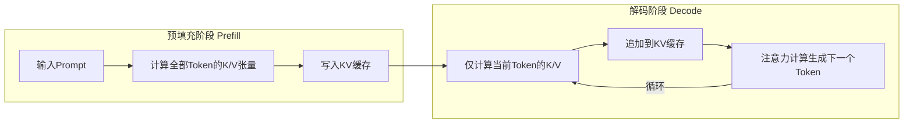
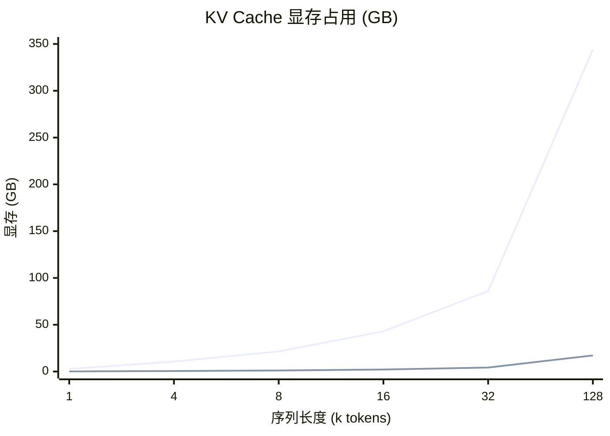
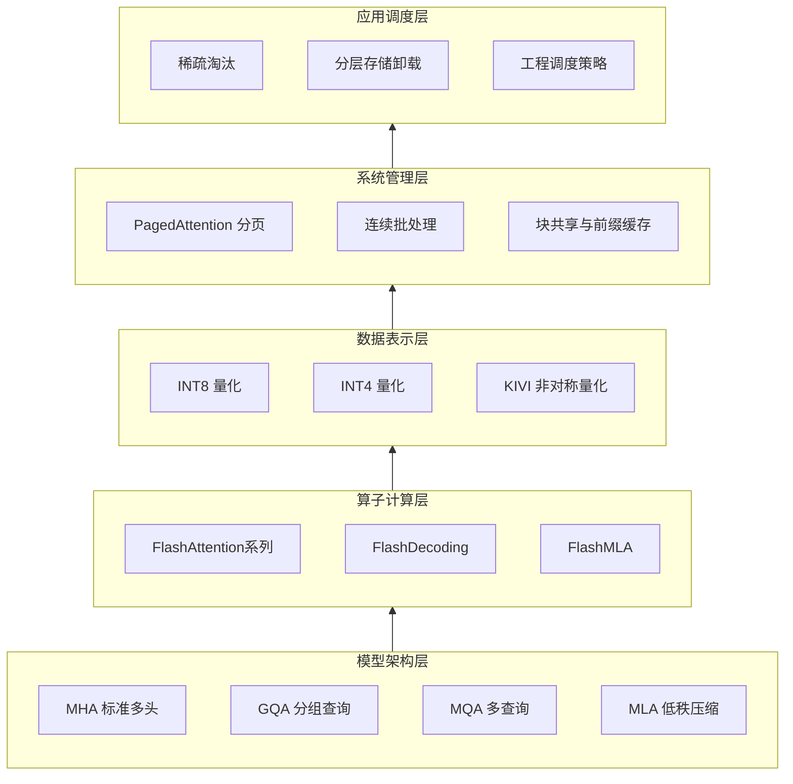
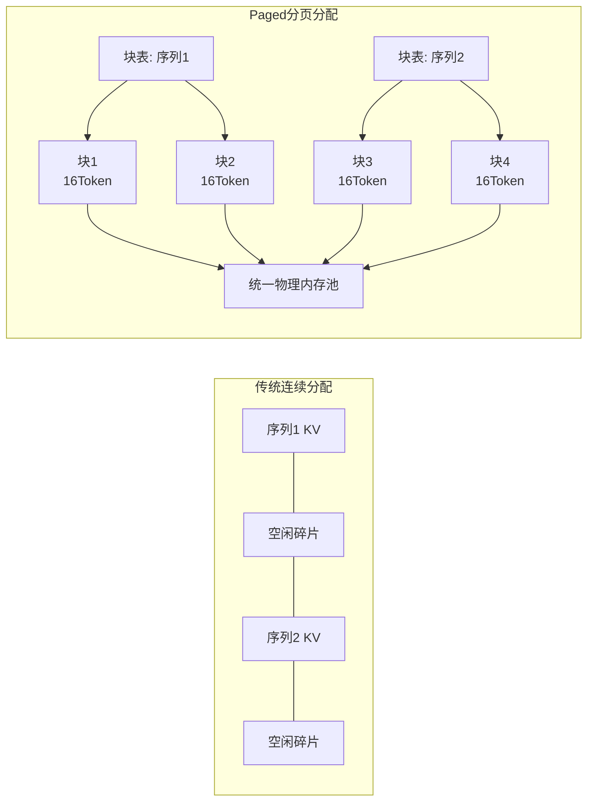

# 大模型原理之 KV Cache 缓存

## 摘要

针对大语言模型自回归推理过程中重复计算注意力键值对导致的性能瓶颈，KV Cache技术通过缓存历史Token的Key与Value张量，将解码阶段注意力计算复杂度从$O(T^2)$降至$O(T)$，是大模型推理优化的核心基础技术。本文系统阐述了KV Cache的基本原理、显存模型与阶段特性，构建了包含**模型架构层、算子计算层、数据表示层、系统管理层、应用调度层**的五级优化技术栈，深入剖析了分页内存管理、分组查询注意力、非对称量化、FlashAttention等核心技术的原理与收益，补充了工程调度与部署模式的工业实践，并给出了场景化的技术选型指南。实测数据表明，通过多层优化技术的正交叠加，可将KV缓存显存占用降低一个数量级以上，端到端推理吞吐量提升2–5倍，为长上下文、高并发场景的模型部署提供了完整的可行路径。

**关键词**：大语言模型；KV缓存；推理优化；PagedAttention；分组查询注意力；低比特量化；工程调度

---

## 1 引言

大语言模型普遍采用Decoder-only架构与自回归生成模式：每生成一个新Token，都需要将其与全部历史Token共同输入注意力层计算语义关联。若不做缓存，每步生成都需要重新计算所有历史Token的Key和Value投影，导致计算量随序列长度呈平方增长，推理延迟随上下文快速上升。

KV Cache的核心思想是**复用历史Token的键值计算结果**：仅在首轮预填充阶段计算全部上下文的K/V张量并缓存，后续解码阶段仅计算新增Token的K/V并追加到缓存中，从而避免重复计算。该技术已成为所有工业级推理框架的标配，但随着模型上下文窗口从4K扩展到128K甚至更长，KV缓存的显存占用线性增长，逐渐成为长序列推理的核心瓶颈[[3]](#ref-3)。

本文从基础原理出发，分层拆解KV Cache的优化技术栈，结合权威论文与工业实测数据，建立从原理到工程落地的完整技术认知体系。

---

## 2 KV Cache基本原理

### 2.1 多头注意力机制基础

Transformer的多头注意力计算可表示为：
$$
\text{Attention}(Q,K,V) = \text{softmax}\left(\frac{QK^T}{\sqrt{d_k}}\right)V
$$
其中$Q \in \mathbb{R}^{B \times H \times T_q \times d_k}$为查询矩阵，$K,V \in \mathbb{R}^{B \times H \times T_k \times d_k}$为键、值矩阵，$B$为批大小，$H$为注意力头数，$T_q,T_k$分别为查询与上下文长度，$d_k$为单头维度。

在自回归生成中，第$t$步生成时，查询仅对应当前Token，而键值需要覆盖全部$t$个历史Token。若无缓存，每步都需要重新投影所有历史Token的K/V，计算复杂度为$O(T^2)$。

### 2.2 KV Cache工作机制

KV Cache将推理过程分为两个阶段，工作流程如图 1 所示。



<p align="center">图 1 KV Cache 两阶段工作流程</p>

1. **预填充阶段（Prefill）**：接收完整Prompt，一次性计算所有输入Token的K/V张量，写入缓存空间。该阶段计算密集，算力为主要瓶颈。
2. **解码阶段（Decode）**：每生成一个新Token，仅计算该Token的K/V并追加到缓存末尾，同时读取全部历史缓存完成注意力计算。该阶段访存密集，显存带宽为主要瓶颈[[2]](#ref-2)。

### 2.3 显存占用模型

对于标准多头注意力（MHA），KV缓存的总显存占用可由式(1)计算[[1]](#ref-1)[[5]](#ref-5)：
$$
M_{\text{KV}} = 2 \times L \times H_{\text{kv}} \times d_k \times S \times B \times p \tag{1}
$$
其中：

- 系数$2$对应Key和Value两个独立张量；
- $L$为Transformer层数，$H_{\text{kv}}$为KV头数，$d_k$为单头维度；
- $S$为上下文长度（Token数），$B$为批大小；
- $p$为单元素字节数（FP16/BF16为2，INT8为1，INT4为0.5）。

以LLaMA-2 7B模型（32层、32个KV头、头维度128）为例，FP16精度下4K上下文单请求KV缓存约占2GB，32K上下文则升至16GB，显存随序列长度线性增长[[1]](#ref-1)。

### 2.4 容量爆炸与量级特征

KV缓存的显存占用由**四个线性因子**共同决定：序列长度$S$、批大小$B$、Transformer层数$L$、KV头数$H_{\text{kv}}$，任意一个因子的扩张都会线性推高显存需求。随着长上下文模型的普及，KV缓存已从次要开销上升为推理显存的主要组成部分。

典型量级对比（FP16精度，单批）：

- LLaMA-2 70B（若为MHA，64头）：32K上下文下KV缓存约86GB，已接近模型自身权重（140GB FP16）的60%；
- LLaMA-3 8B（GQA，8组）：32K上下文下KV缓存约4.3GB，仅为同规模MHA（32头）的1/4。

两者的显存随序列长度的增长趋势如图 2 所示。由式 (1) 知 $M_{\text{KV}} \propto S$，显存与序列长度严格成正比；需要说明的是，图 2 的横轴为等距类别刻度（1/4/8/16/32/128k），描出的折线会逐段变陡，故线性关系应以式 (1) 为准，而非由折线形状目测。同一坐标系下，GQA 把整条曲线压到 MHA 的 1/4–1/8 量级，而 70B 级 MHA 模型在 128K 上下文即突破 340GB。



<p align="center">图 2 KV Cache 显存随序列长度线性增长</p>

特别地，当模型权重量化至INT4时，权重体积缩减为原来的1/4，而KV缓存若仍保持高精度，会出现**KV缓存反超模型权重**的现象，成为长上下文推理的第一显存开销。

此外，朴素连续分配的内存碎片会进一步放大容量压力：内部与外部碎片合计可浪费60%–80%的KV显存，实际有效容量仅为理论值的20%–40%。

### 2.5 本质瓶颈与两难

解码阶段的核心特性是**内存带宽绑定（Memory-bandwidth bound）**：计算量仅为$O(T)$，但每步都需要读取全部KV缓存，数据访问量远大于计算量。以A100显卡为例，2GB的KV缓存单次读取耗时约1.3ms，远超计算本身的耗时。

由此形成推理的本质两难：

- 重算历史KV：速度慢，算力浪费；
- 缓存全部KV：占显存，并发能力受限。

所有KV Cache优化技术本质上都是在这两者之间寻找最优解。

---

## 3 KV Cache核心优化技术体系

KV Cache优化已形成完整的分层技术栈，从下到上分别为模型架构层、算子计算层、数据表示层、系统管理层与应用调度层，如图 3 所示。各层技术相互正交，可按需叠加。



<p align="center">图 3 KV Cache 优化技术栈分层架构</p>

### 3.1 系统管理层 · PagedAttention分页内存

朴素KV缓存采用连续内存分配，存在严重的内部与外部碎片，实际内存利用率仅20%–40%，浪费率高达60%–80%[[4]](#ref-4)[[6]](#ref-6)。

PagedAttention借鉴操作系统虚拟内存分页思想，将KV缓存划分为固定大小的物理块（默认16Token/块），通过块表维护逻辑序列与物理块的映射关系，如图 4 所示[[4]](#ref-4)。



<p align="center">图 4 连续分配与 Paged 分页分配对比</p>

具体到单条请求，逻辑块、块表与物理块的三段映射如图 5 所示：逻辑块在序列视角上完全连续，块表记录每个逻辑块对应的物理块编号，物理块则散落在显存各处、按需分配用完即还，这正是碎片被消除的根源。

```
 逻辑块(连续)        块表(页表)           GPU 显存物理块(非连续)
┌─────────┐        ┌───────────┐        ┌─────────────────────┐
│ Block 0 │───────→│ 0 → #7    │───────→│ ...  #5  ...  #7 ...│
│ (16 tok)│        ├───────────┤        │        ┌────┐       │
├─────────┤        │ 1 → #2    │───────→│  ...   │ #2 │  ...  │
│ Block 1 │        ├───────────┤        │        └────┘       │
│ (16 tok)│        │ 2 → #9    │───────→│  #9                 │
├─────────┤        └───────────┘        │  (物理块散落各处,   │
│ Block 2 │                             │   按需分配,用完即还)│
└─────────┘                             └─────────────────────┘

  传统方案对比:
  ┌──────────────────────────────┐
  │ 预分配最大长度连续buffer     │  ← 实际只用 20%~40%,
  │ ██████▒▒▒▒▒▒▒▒▒▒▒▒▒▒▒▒▒▒▒▒▒▒ │     其余浪费 (60%~80%)
  └──────────────────────────────┘
```

<p align="center">图 5 逻辑块 → 块表 → 物理块三段映射</p>

**核心收益**：

- 内存浪费从60%–80%降至4%以下，内存利用率提升至96%以上[[5]](#ref-5)[[6]](#ref-6)；
- 支持写时复制（Copy-on-Write），同Prompt多采样场景下前缀KV可共享，beam search场景显存节省可达55%；
- 自动前缀缓存通过对前缀Token序列做哈希映射（hash(前缀+块索引)），实现物理块的全局复用，相同系统提示词无需重复计算与存储。

PagedAttention与连续批处理（Continuous Batching）互为使能：分页机制允许不同请求的KV块独立调度，无需连续内存对齐，从而支持请求的动态加入与退出，大幅提升GPU利用率。该技术由vLLM团队于2023年提出，已成为工业界推理框架的标准配置[[4]](#ref-4)。

### 3.2 模型架构层 · MQA / GQA / MLA

通过修改注意力结构减少KV头数量，从模型层面降低KV缓存的基数，是长上下文模型的主流设计方向。

#### 3.2.1 三类注意力架构对比

| 架构 | KV头数 | 压缩比例 | 核心思想 | 代表模型 | 质量损失 |
| --- | --- | --- | --- | --- | --- |
| MHA（多头注意力） | $H$（与Q头数相同） | $1\times$（基准） | 每个Q头对应独立KV头 | LLaMA-1 | 无 |
| GQA（分组查询注意力） | $G$（分组数） | $(H/G)\times$ | Q头分组共享KV头 | LLaMA-2/3、Mistral、Qwen2 | 极小 |
| MQA（多查询注意力） | $1$ | $H\times$ | 所有Q头共享同一组KV | PaLM、Falcon、Gemma 1 | 较明显 |

三者的Q头与KV头共享结构及对应的KV Cache比例如图 6 所示。

```
  MHA (8 Q头 : 8 KV头)      GQA (8 Q头 : 2 KV组)      MQA (8 Q头 : 1 KV组)
  Q1 Q2 Q3 Q4 Q5 Q6 Q7 Q8   Q1 Q2 Q3 Q4 Q5 Q6 Q7 Q8   Q1 Q2 Q3 Q4 Q5 Q6 Q7 Q8
  │  │  │  │  │  │  │  │    └──┴┬─┴──┘  └──┴┬─┴──┘    └──┴──┴──┴─┬┴──┴──┴──┘
  │  │  │  │  │  │  │  │        │           │                    │
  ↓  ↓  ↓  ↓  ↓  ↓  ↓  ↓        ↓           ↓                    ↓
  KV KV KV KV KV KV KV KV       KV           KV                  KV
  (8份独立KV)               (2份KV, 每组4个Q头共享)   (1份KV, 全部Q头共享)
  KV Cache: 1× (基准)       KV Cache: 1/4             KV Cache: 1/8
```

<p align="center">图 6 MHA / GQA / MQA 的KV头共享结构对比</p>

GQA具备完整的谱系连续性：当分组数$G$等于Q头数$H$时，退化为标准MHA；当$(G=1)$时，退化为MQA。通过调整分组数$G$，可在显存占用与模型质量之间实现连续平滑的权衡[[12]](#ref-12)[[13]](#ref-13)。

GQA是当前工业界的主流折中方案：以LLaMA-2 70B为例，采用8组GQA后KV缓存缩减为原MHA的1/8，在几乎不损失效果的前提下大幅降低显存占用。

#### 3.2.2 MLA低秩联合压缩

MLA（Multi-head Latent Attention）由DeepSeek团队提出，不再保存完整的K/V向量，而是将其压缩为低维隐向量缓存，计算时再投影回原空间。其核心公式为：
$$
c_{\text{KV}} = W_{\text{DKV}} \cdot x, \quad r_{\text{kv}} \ll D
$$
其中$c_{\text{KV}}$为缓存的隐向量，维度远小于原始KV维度。

**实测性能**：DeepSeek-V2中MLA将KV缓存减少93.3%，最大生成吞吐量提升至5.76倍，同时训练成本降低42.5%[[14]](#ref-14)，是目前架构层面压缩效率最高的方案。

值得注意的是，对于采用MLA与MoE的模型，KV缓存与激活显存被大幅压缩后，推理瓶颈会从访存带宽转向互连带宽与专家负载均衡，注意力专用加速硬件的必要性随之下降[[15]](#ref-15)。这一结论限定了本文第2.5节"解码阶段访存绑定"论断的适用范围——该论断主要面向MHA/GQA类模型。

### 3.3 数据表示层 · 低比特KV量化

在不修改模型结构的前提下，降低KV数值的存储精度，可直接线性减少显存占用，是部署侧的首选优化手段。

量化的基础流程为：校准统计数值分布 → 确定缩放因子scale与零点zero-point → 转换为低比特整数存储 → 计算时反量化回高精度。
量化粒度由粗到细包括per-tensor、per-token、per-channel，粒度越细精度越高，但计算开销与存储开销也相应增加。

#### 3.3.1 非对称量化发现（KIVI）

传统量化采用统一粒度，但KIVI研究（ICML 2024）通过统计分析发现两个关键观察[[10]](#ref-10)[[11]](#ref-11)：

1. **Key张量**：各通道方差差异大，存在少数高幅值离群通道，按通道（per-channel）量化可更好保留精度；
2. **Value张量**：各通道分布平坦，且需要支持流式追加写入，按Token（per-token）量化更高效且精度损失可忽略。

基于此提出的KIVI算法采用**K per-channel + V per-token**的非对称2bit量化，无需训练微调，硬件友好。

**实测性能**：

- 峰值显存减少2.6倍，最大批大小扩大4倍；
- 端到端吞吐量提升2.35–3.47倍，生成质量基本无损[[10]](#ref-10)。

为补偿量化精度损失，通常保留最近$R$个Token的FP16缓存（滑动窗口），仅对历史Token做低比特量化，在显存与精度间取得平衡。后续进阶方案包括Kitty（保留sink区域FP16）、KVQuant、Duo-Attention等，进一步在极低比特下保障推理质量。

> 
> **注意**：KV缓存量化与模型权重量化是两个独立的优化方向，二者可叠加使用。

### 3.4 算子计算层 · FlashAttention

FlashAttention是IO感知的注意力计算优化，虽不直接减少KV缓存的总量，但能大幅降低注意力计算的中间显存占用，提升长序列下的计算效率。

其核心思想是将Q/K/V分块计算，利用GPU片上SRAM做中间结果累加，避免$N \times N$的注意力分数矩阵写入HBM，将注意力显存从$O(N^2)$降至$O(N)$[[7]](#ref-7)。朴素实现与FlashAttention的数据流对比如图 7 所示。

```
   朴素实现:                          FlashAttention:
   HBM: [Q][K][V]                    HBM: [Q][K][V]        [O 输出]
          │ │ │                              │ │ │             ↑
          ▼ ▼ ▼                              ▼ ▼ ▼             │ (只写最终结果)
   ┌──────────────┐                  ┌─────────────────┐       │
   │ QK^T (N×N)   │ → 写回 HBM       │ SRAM: 分块计算    │───────┘
   │   ~16 GB*    │                  │  K/V块, Q块      │
   │ softmax(N×N) │ ← 再读回          │  运行最大值 m     │
   │   ×V         │ → 再写回          │  分母和 ℓ        │
   └──────────────┘                  └─────────────────┘
   显存: O(N²)                       显存: O(N)
   中间矩阵落盘                      N×N 矩阵从未落盘
                                     (在线softmax, 结果精确等价)
                                     
   * ~16 GB 指 N=64K、fp32、单头 的 N×N 中间矩阵；N=4K 时仅约 67 MB
```

<p align="center">图 7 朴素注意力与FlashAttention的HBM/SRAM数据流对比</p>

**版本演进与性能**：

| 版本 | 核心创新 | 相对基线加速 | 显存复杂度 |
| --- | --- | --- | --- |
| FlashAttention-1 | 分块计算 + 在线Softmax | 2–4× | $O(N)$ |
| FlashAttention-2 | 优化并行与工作划分 | 约2× over v1 | $O(N)$[[8]](#ref-8) |
| FlashAttention-3 | Hopper架构适配 + FP8 | 1.5–2× over v2 | $O(N)$ |

衍生方案包括FlashDecoding（优化解码阶段并行）、FlashMLA（适配低秩注意力架构）、块稀疏FlashAttention等，针对不同场景进一步提升计算效率。FlashAttention已成为长上下文推理的必开选项，与KV缓存的所有优化技术完全正交[[9]](#ref-9)。

### 3.5 应用调度层 · 复用、分层与稀疏

#### 3.5.1 前缀缓存与共享

对于系统提示词、多轮对话等存在公共前缀的场景，可通过哈希匹配复用前缀KV缓存：

- RadixAttention（SGLang）采用前缀树结构，实现多请求自动命中公共前缀；
- 跨实例迁移技术（LMCache、Mooncake）支持KV在多设备、多节点间共享迁移。

需要注意的是，多租户场景下KV共享会带来数据隔离与权限边界问题，公共前缀与私有数据的划分需要严格的安全隔离机制。

#### 3.5.2 分层卸载

基于注意力访问的时间局部性，构建**HBM-DRAM-SSD**三级存储金字塔：

- 热数据（最近访问的KV）存放于HBM；
- 温数据存放于主机DRAM；
- 冷数据存放于SSD。

通过预取与异步DMA换入换出，以带宽换取容量，代表方案如FlexGen、InfiniGen，可将有效显存容量扩展数倍至数十倍，支持超长长上下文推理[[3]](#ref-3)。

#### 3.5.3 稀疏淘汰机制

针对上下文远大于实际需求的长会话场景，通过重要性筛选仅保留高价值KV：

- **H2O**：基于累计注意力打分，保留高贡献的"heavy hitter" Token；
- **SnapKV**：通过观测窗统计压缩长Prompt的KV；
- **滑动窗口**：仅保留最近N个Token的KV，是最简单的稀疏策略。

稀疏淘汰可进一步降低缓存数量，但存在信息丢失风险，适用于对上下文完整性要求不高的场景。

归纳起来，第3章的四类核心优化各治一症：**PagedAttention 治"放得乱"，MQA/GQA 与 MLA 治"存得太多"，FlashAttention 治"算得慢、读得累"，KV Cache 量化治"存得太胖"**；再加上3.5节应用调度层的复用、分层卸载与稀疏淘汰，五者彼此正交、可按需叠加，构成当代推理引擎的标准优化栈。

---

## 4 工程调度与部署模式

KV缓存的两阶段特性导致Prefill与Decode阶段存在显著的资源不对称性，是推理调度工程的核心矛盾。

### 4.1 前后缀阶段不对称性

| 阶段 | 核心操作 | 资源瓶颈 | 计算特性 |
| --- | --- | --- | --- |
| Prefill（预填充） | 批量计算全部Prompt的K/V | 算力密集（Compute-bound） | 计算量与长度平方正相关 |
| Decode（解码） | 逐Token读取KV缓存计算注意力 | 显存带宽密集（Memory-bandwidth-bound） | 计算量与长度线性相关 |

这种不对称性导致单一硬件配比难以同时优化两个阶段：Prefill需要更多算力，Decode需要更高显存带宽与容量。

### 4.2 Chunked Prefill（分块预填充）

长Prompt场景下，单次Prefill计算量大、耗时长，会阻塞后续Decode请求的调度，导致首Token延迟飙升。

Chunked Prefill将长Prompt切分为多个小块，分批次进行预填充计算，穿插在Decode请求之间调度，避免长请求独占GPU，从而降低调度延迟，提升系统公平性。

### 4.3 PD分离部署架构

针对两阶段的不同资源特性，采用Prefill与Decode分离部署的架构：

- **Prefill节点**：配置高算力GPU，专门负责预填充计算；
- **Decode节点**：配置大显存、高带宽GPU，专门负责生成解码。

计算完成的KV缓存通过高速网络从Prefill节点传输至Decode节点，实现硬件资源的按需配比与弹性伸缩，整体吞吐量可提升30%–50%。

### 4.4 并行切分策略

大规模部署中，KV缓存需配合并行计算进行分片：

- **张量并行**：按注意力头维度切分KV，各卡存储部分头的KV数据；
- **流水线并行**：按Transformer层维度切分KV，各卡存储部分层的KV数据；
- **序列并行**：超长上下文下按序列维度切分KV，配合分布式注意力计算。

不同并行模式下KV缓存的存储与通信开销差异显著，需根据模型规模与上下文长度选型。

---

## 5 主流推理框架实现对比

各主流框架对KV Cache优化的支持情况如下表所示。

| 框架 | 核心KV技术 | 分页管理 | 量化支持 | 前缀缓存 | 适用场景 |
| --- | --- | --- | --- | --- | --- |
| vLLM | PagedAttention + 连续批处理 | ✅ 原生支持 | INT8/INT4/KIVI | ✅ 自动前缀缓存 | 高并发服务、长上下文 |
| TensorRT-LLM | Paged KV + 算子深度优化 | ✅ | INT8/INT4/FP8 | ✅ | NVIDIA硬件极致性能 |
| TGI | 连续批处理 + 分页KV | ✅ | INT8/INT4 | ✅ | HuggingFace生态 |
| llama.cpp | 全平台量化KV | ❌ 连续分配 | INT8/INT4/Q4_K等 | ❌ | CPU/端侧轻量推理 |
| SGLang | RadixAttention前缀树 | ✅ | INT8/INT4 | ✅ 前缀树匹配 | 多前缀高并发场景 |

其中vLLM凭借PagedAttention的内存效率优势，吞吐量相比原生HuggingFace实现提升14–24倍，相比TGI提升2.2–3.5倍，是目前工业界部署的主流选择[[5]](#ref-5)。

---

## 6 性能评估体系

### 6.1 核心评估指标

1. **显存占用量**：KV缓存峰值显存，是长序列与并发能力的决定因素；
2. **首Token延迟（TTFT）**：从请求到输出第一个Token的耗时，主要由Prefill阶段决定；
3. **每Token延迟（TPOT）**：后续每个Token的平均生成耗时，主要由Decode阶段与KV读取速度决定；
4. **推理吞吐量**：单位时间生成的总Token数（token/s）；
5. **缓存命中率**：请求命中已有KV缓存的比例，前缀共享场景的核心指标；
6. **内存碎片率**：缓存中无法利用的碎片化显存比例。

### 6.2 优化技术正交性

KV Cache的各类优化技术大多相互正交，可叠加使用：

- 分页管理（系统层）+ GQA（架构层）+ 量化（数据层）+ FlashAttention（计算层）可同时生效；
- 叠加后显存压缩效果相乘，例如GQA-8 + INT4量化可将KV缓存压缩至原MHA FP16的1/16。

---

## 7 技术选型指南

KV Cache优化技术的选型需结合模型可修改性、显存约束、上下文长度、并发需求等约束条件，各类技术的正交性允许按需叠加。

### 7.1 场景化选型决策表

| 约束条件 | 场景描述 | 推荐技术组合 | 预期收益 |
| --- | --- | --- | --- |
| 不可修改模型结构 | 第三方开源模型、业务侧无权训练 | PagedAttention + 前缀缓存 + INT8量化 | 显存↓2–3×，吞吐↑2–4× |
| 可调整模型架构 | 自研模型、可二次训练 | GQA（8组主流） + PagedAttention + 量化 | 显存↓8–16×，吞吐↑3–5× |
| 长上下文推理 | 32K以上上下文、文档问答 | FlashAttention + 量化 + 滑动窗口 | 支持长度↑4–8× |
| 显存极度紧张 | 单卡小显存、高并发部署 | INT4量化 + 前缀共享 + 稀疏淘汰 | 显存↓4–6× |
| 超长长上下文 | 128K以上、百万级上下文 | 分层卸载 + 稀疏淘汰 + FlashAttention | 有效容量↑10–50× |
| 多前缀高并发 | 系统提示词统一、多租户服务 | RadixAttention前缀树 + 连续批处理 | 吞吐↑2–3× |

### 7.2 技术叠加优先级

优化技术按落地成本从低到高、收益从大到小的优先级排序：

1. 基础工程优化：PagedAttention + 连续批处理（零精度损失，部署侧即可开启）
2. 数据层优化：INT8量化 → INT4量化（几乎无损，无需改模型）
3. 计算层优化：FlashAttention（长上下文必开，无损）
4. 复用优化：前缀缓存（多轮/多租户场景收益显著）
5. 架构层优化：GQA / MLA（需训练，收益最大）
6. 极端场景优化：分层卸载、稀疏淘汰（仅超长长上下文使用）

---

## 8 挑战与展望

### 8.1 当前核心挑战

1. **长序列容量爆炸**：尽管多层优化叠加，当上下文扩展至百万级时，KV缓存仍会达到单卡显存上限；
2. **量化精度边界**：INT4以下量化在长推理链、复杂任务上的精度损失仍不可忽视，2bit及以下量化需依赖非对称设计与精度补偿；
3. **高并发调度复杂度**：多请求下KV的动态分配、前缀共享、抢占式调度带来显著的系统复杂度；
4. **内存碎片化**：极端异构负载下，分页管理仍存在块内碎片与调度开销。

### 8.2 未来方向

1. **端到端联合优化**：模型架构、算子、调度、存储的跨层协同设计，如MLA + FlashMLA的深度融合；
2. **语义感知缓存**：基于内容重要性的自适应量化与淘汰，替代固定窗口策略；
3. **近存计算与存算一体**：从硬件层面突破KV缓存的带宽瓶颈；
4. **预测式预取**：基于生成路径预测，提前将冷KV换入HBM，掩盖分层卸载的延迟。

---

## 参考文献

<a id="ref-1"></a>[1] 腾讯云开发者社区. ["什么是KV缓存机制."](https://developer.cloud.tencent.com/techpedia/2716) *腾讯云开发者社区*, 2026.

<a id="ref-2"></a>[2] NVIDIA. ["Mastering LLM Techniques: Inference Optimization."](https://developer.nvidia.com/blog/mastering-llm-techniques-inference-optimization/) *NVIDIA Developer Blog*, 2023.

<a id="ref-3"></a>[3] Y. Xu, N. K. Khaira, T. Singh. ["KV Cache Optimization Strategies for Scalable and Efficient LLM Inference."](https://arxiv.org/abs/2603.20397) *arXiv*, 2026. DOI: 10.48550/arXiv.2603.20397.

<a id="ref-4"></a>[4] W. Kwon et al. ["Efficient Memory Management for Large Language Model Serving with PagedAttention."](https://arxiv.org/abs/2309.06180) *SOSP*, 2023. DOI: 10.1145/3600006.3613165.

<a id="ref-5"></a>[5] W. Kwon et al. ["vLLM: Easy, Fast, and Cheap LLM Serving with PagedAttention."](https://blog.vllm.ai/2023/06/20/vllm.html) *vLLM Blog*, 2023.

<a id="ref-6"></a>[6] Runpod. ["vLLM Explained: PagedAttention and Continuous Batching."](https://www.runpod.io/articles/guides/vllm-pagedattention-continuous-batching) *RunPod*, 2026.

<a id="ref-7"></a>[7] T. Dao. ["FlashAttention-2: Faster Attention with Better Parallelism and Work Partitioning."](https://arxiv.org/abs/2307.08691) *ICLR*, 2024.

<a id="ref-8"></a>[8] Stanford CRFM. ["FlashAttention-2 Benchmark."](https://crfm.stanford.edu/2023/07/17/flash2.html) *Stanford CRFM*, 2023.

<a id="ref-9"></a>[9] LLM Academy. ["Flash Attention Explained: FA1, FA2, FA3."](https://llm-academy.dev/optimization/flash-attention/) *LLM Academy*, 2026.

<a id="ref-10"></a>[10] Z. Liu et al. ["KIVI: A Tuning-Free Asymmetric 2bit Quantization for KV Cache."](https://arxiv.org/abs/2402.02750) *ICML*, 2024.

<a id="ref-11"></a>[11] Stevens Institute of Technology. ["KIVI: A Tuning-Free Asymmetric 2bit Quantization for KV Cache."](https://researchwith.stevens.edu/en/publications/kivi-a-tuning-free-asymmetric-2bit-quantization-for-kv-cache/) *Stevens Institute of Technology*, 2024.

<a id="ref-12"></a>[12] J. Ainslie et al. ["GQA: Training Generalized Multi-Query Transformer Models from Multi-Head Checkpoints."](https://arxiv.org/abs/2305.13245) *EMNLP*, 2023. DOI: 10.18653/v1/2023.emnlp-main.298.

<a id="ref-13"></a>[13] N. Shazeer. ["Fast Transformer Decoding: One Write-Head is All You Need."](https://arxiv.org/abs/1911.02150) *arXiv*, 2019.

<a id="ref-14"></a>[14] DeepSeek-AI. ["DeepSeek-V2: A Strong, Economical, and Efficient Mixture-of-Experts Language Model."](https://arxiv.org/abs/2405.04434) *arXiv*, 2024.

<a id="ref-15"></a>[15] S. Yun et al. ["Rethinking LLM Inference Bottlenecks: Insights from Latent Attention and Mixture-of-Experts."](https://arxiv.org/abs/2507.15465) *arXiv*, 2025. DOI: 10.48550/arXiv.2507.15465.
