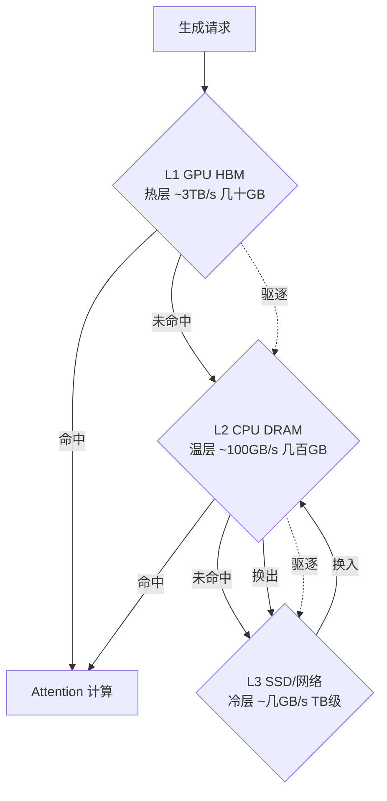

# KV Cache 分级存储

## 摘要

KV Cache 分级存储的本质是"以带宽换容量"，利用注意力访问的时间局部性，将冷数据下沉至低速大容量存储，热数据保留于显存。

**关键词**：KV Cache；分级存储；驱逐策略；换入换出；预取；长上下文

## 一、KV Cache 的定义

自回归生成过程中，每产生一个新 token，均需其与全部历史 token 执行注意力运算。为避免对历史 Key/Value 的重复计算，系统将历史 token 的 Key 与 Value 予以缓存，此即 KV Cache。

## 二、为什么需要分级存储

**显存墙**是长上下文推理的核心瓶颈。KV Cache 的大小随上下文长度线性增长：

$$\text{KV 大小} \approx 2 \times \text{层数} \times \text{序列长度} \times \text{隐藏维度} \times \text{精度字节数}$$

以 LLaMA-2 70B（80 层、隐藏维度 8192、64 头、FP16 精度）为例：

| 上下文长度 | KV Cache 占用 | 单卡 HBM（80GB） |
|------------|---------------|------------------|
| 4k | ~10 GB | 可容纳 |
| 32k | ~80 GB | 勉强容纳 |
| 128k | ~320 GB | 无法容纳 |

序列长度从 4k 增至 128k，KV Cache 由 10 GB 膨胀至 320 GB，而单卡 HBM 容量仅 80 GB。

高并发与多轮对话使问题进一步加剧。KV Cache 随请求数线性叠加，10 个并发 128k 会话即需 3.2 TB，远超单卡乃至单机容量上限；多轮对话中，历史 token 随轮次持续累积，同样推高 KV Cache 峰值。

除容量约束外，经济性亦构成约束。HBM 单位成本约为 DRAM 的 10 倍、SSD 的百倍量级，全量 KV 驻留显存代价过高。

综上，长上下文推理、高并发服务、多轮对话等场景对 KV Cache 容量提出极高要求，容量与经济性双重约束下无法全量驻留显存，分级存储因而被视为突破显存墙的主流方案。

## 三、存储层级

### 3.1 三级存储架构

分级存储以带宽代价换取有效显存容量数倍至数十倍的扩展，其载体为三级存储架构：



<p align="center">图 1 三级存储架构与数据流向</p>

| 层级 | 介质 | 带宽 | 容量 | 存储内容 |
|------|------|------|------|----------|
| L1 热层 | GPU HBM | ~3 TB/s | 数十 GB | 最近或最常被注意的 token |
| L2 温层 | CPU DRAM | ~100 GB/s | 数百 GB | 较久未访问、可能被回看的 token |
| L3 冷层 | SSD/网络 | ~数 GB/s | TB 级 | 长期未被访问的 token |

### 3.2 与相邻技术的关系

- 前缀缓存：跨请求复用相同前缀的 KV，降低 prefill 阶段开销，但不解决单请求内 KV 的容量问题。
- PagedAttention：通过分页管理消除显存碎片，提升显存利用率，但不扩展总容量。
- 分级存储：从时间维度对 KV 进行分层管理，直接解决容量瓶颈。

## 四、核心机制

### 4.1 驱逐策略与下沉对象

- 注意力分数驱动（H2O）：累计注意力得分较高的 token 为 heavy-hitter，予以保留；其余下沉 [[5]](#ref-5)。
- 时间局部性：最近 N 个 token 保留于显存，更早的 token 下沉。
- 语义重要性（SnapKV）：依据聚类或语义信息选取代表性 token 保留 [[6]](#ref-6)。
- 关键权衡：驱逐过激导致精度下降，驱逐不足则无法有效释放显存。

### 4.2 换入换出与数据迁移

- 换出：HBM 至 DRAM/SSD 的数据迁移，在生成过程中异步批量执行，不阻塞计算。
- 换入：DRAM/SSD 至 HBM 的数据迁移，在 token 被注意力访问时同步执行。
- 批量搬运：累积至一定批量后统一迁移，摊薄带宽开销。
- 异步执行：换出操作与计算重叠，隐藏迁移延迟。

### 4.3 预取机制与提前迁移

- 预测未来将被访问的 KV，提前从 DRAM 迁移至 HBM。
- 预测依据：注意力模式具有可预测性（时间局部性与 heavy-hitter 稳定性）。
- 命中时免除等待；预测失败则产生无效迁移，浪费带宽。

### 4.4 压缩机制与体积缩减

- 量化：FP16 至 INT8/INT4，体积减半或缩减至四分之一。
- 稀疏化：仅存储重要 token 的 KV。
- 与分级正交：可先压缩后分级，或先分级后压缩。

### 4.5 机制协同示例

以下伪代码展示驱逐、换入换出、预取三项机制在生成循环中的协同方式：

```python
def generate_with_tiered_cache(request):
    for step in range(max_steps):
        # 预取：预测下一步需要的 KV，提前从 DRAM 搬回 HBM
        prefetch_kv(predicted_tokens)
        # 前向计算：HBM 命中则直接算，未命中则换入
        output = attention(query, hbm_cache)
        # 驱逐：HBM 满了，按策略选冷 token 下沉到 DRAM/SSD
        if hbm_cache.is_full():
            victims = select_victims(eviction_policy)
            swap_out(victims, target_tier="DRAM")
        # 换入：计算中发现需要的 token 在 DRAM/SSD，搬回 HBM
        if needed_kv not in hbm_cache:
            swap_in(needed_kv, source_tier="DRAM")
```

四项机制由推理框架自动执行，开发者仅需配置层级容量配比与驱逐阈值等参数。

## 五、代表项目

下表从核心机制、存储层级、驱逐策略、预取能力与适用场景五个维度对代表性项目进行对比。

| 项目 | 核心机制 | 层级 | 驱逐策略 | 预取 | 适用场景 |
|------|----------|------|----------|------|----------|
| vLLM [[1]](#ref-1) | PagedAttention 按页管理，消除显存碎片 | 2 级 | 页级换出 | 无 | 中等长度序列 |
| FlexGen [[2]](#ref-2) | 线性规划求解最优换入换出调度 | 3 级 | LP 调度 | 无 | 单请求长上下文 |
| InfiniGen [[3]](#ref-3) | 学习注意力模式，预测未来访问 | 2 级 | 注意力驱动 | 有 | 多轮对话 |
| Mooncake [[4]](#ref-4) | KV 中心分离架构，跨请求/跨卡共享 | 多级 | 全局调度 | 有 | 高并发与长上下文 |

## 六、工程实践

### 6.1 层级容量配比

- HBM 与 DRAM 容量比约为 1:4 至 1:8（热层小、温层大）。
- SSD 作为兜底，容量不设上限。
- 依据并发数与平均序列长度估算。

### 6.2 驱逐阈值调优

- 阈值过激：精度下降（困惑度上升）。
- 阈值过松：无法有效释放显存。
- 采用离线标注集与线上 A/B 测试确定。

### 6.3 常见问题

- 换出带宽瓶颈：SSD 带宽仅数 GB/s，需控制换出频率。
- 延迟抖动：驱逐与换入时机不稳定导致 TPOT 毛刺。
- 预取预测失效：无效迁移浪费带宽，预测模型需持续校准。

## 七、结论

分级存储的本质并非"更大的显存"，而是"以带宽换容量"。注意力访问的时间局部性决定了大部分 KV 在大部分时间内并不被需要；将其下沉至廉价存储、在被访问时迁移回显存，是长上下文推理在有限显存条件下运行的关键。未来研究方向包括：更精确的预取预测、更细粒度的迁移控制、以及与压缩量化技术的联合优化。

## 参考文献

<a id="ref-1"></a>[1] W. Kwon et al. ["Efficient Memory Management for Large Language Model Serving with PagedAttention."](https://arxiv.org/abs/2309.06180) *SOSP*, 2023.

<a id="ref-2"></a>[2] Y. Sheng et al. ["FlexGen: High-Throughput Generative Inference of Large Language Models with a Single GPU."](https://arxiv.org/abs/2303.06865) *ICML*, 2023.

<a id="ref-3"></a>[3] W. Lee et al. ["InfiniGen: Efficient Generative Inference of Large Language Models with Dynamic KV Cache Management."](https://arxiv.org/abs/2406.19707) *OSDI*, 2024.

<a id="ref-4"></a>[4] R. Qin et al. ["Mooncake: A KVCache-centric Disaggregated Architecture for LLM Serving."](https://arxiv.org/abs/2407.00079) *ACM Trans. Storage*, 2025.

<a id="ref-5"></a>[5] Z. Zhang et al. ["H2O: Heavy-Hitter Oracle for Efficient Generative Inference of Large Language Models."](https://arxiv.org/abs/2306.14048) *NeurIPS*, 2023.

<a id="ref-6"></a>[6] Y. Li et al. ["SnapKV: LLM Knows What You are Looking for Before Generation."](https://arxiv.org/abs/2404.14469) *arXiv*, 2024.
