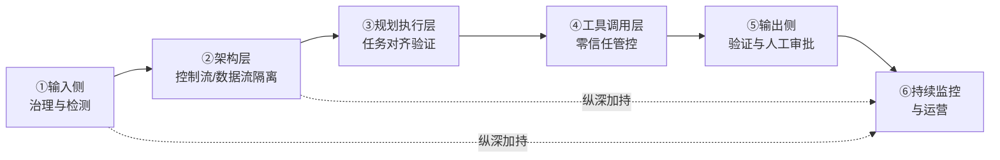
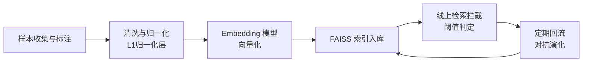

# LLM Agent 安全防护综合研究：提示词注入防御与权限最小化落地

> **一句话总结**：本文融合 GPT 系（ChatGLM/DeepSeek/豆包）三份 Agent 安全对话素材与学术论文实证，系统梳理提示词注入的纵深防御架构（输入清洗→架构隔离→任务对齐→工具管控→输出把关），以及 LLM 应用权限最小化的四层落地方法，给出可直接照抄的工程清单。

---

## 摘要

AI Agent 正从"单轮问答"演进为"具备自主规划与工具调用能力的执行体"。与此同时，提示词注入（Prompt Injection）成为 LLM 应用面临的最严峻安全挑战之一——尤其是间接注入，恶意指令隐藏于网页、文档、邮件等外部数据中，试图劫持 Agent 行为，进而通过工具调用产生真实世界的副作用[[1]](#ref-1)。OWASP Top 10 for LLM Applications 2025 将 Prompt Injection 列为 LLM01 头号风险[[2]](#ref-2)。

业界共识是**不存在一劳永逸的"银弹"**：LLM 在架构上无法从根本上区分"指令"与"数据"，因此防御必须是**分层纵深**的。本文以三份大模型对话素材（ChatGLM 纵深防御与输入清洗、DeepSeek Agent 专属防御路线、豆包权限最小化落地）为骨架[[3]](#ref-3)[[4]](#ref-4)[[5]](#ref-5)，结合 CaMeL[[6]](#ref-6)、AgentDojo[[7]](#ref-7)、Task Shield[[8]](#ref-8)、DRIFT[[9]](#ref-9)、MELON[[10]](#ref-10)、Meta Prompt-Guard-2[[11]](#ref-11) 等已发表文献，对数据进网络搜索验证后，提出一套完整的 Agent 安全防护框架——核心范式转变是：**从"防止模型被说服"转向"确保模型即使被说服也做不了坏事"**。

---

## 1. 引言

### 1.1 问题根源：LLM 的"指令-数据"界限模糊

基础的提示词注入（直接注入）发生在用户输入中夹带指令；进阶的**间接提示词注入（Indirect Prompt Injection）**发生在 Agent 读取外部数据（网页、文档、邮件、工具返回）时，恶意指令隐藏在这些数据中试图劫持 Agent[[1]](#ref-1)。LLM 在架构上无法根本区分"指令"与"数据"，这是注入永远存在的根因[[4]](#ref-4)。

Agent 与普通 LLM 应用有本质区别：Agent 具备**自主规划**和**工具调用**能力，一旦被注入，攻击者不仅能窃取信息，还能通过工具调用产生**真实世界的副作用**（发送邮件、执行代码、修改数据）。因此 Agent 的防御核心是**在架构层面假设注入终将发生**，通过隔离、权限最小化和执行管控，让被劫持的 Agent 也无法造成实质性破坏[[4]](#ref-4)。

### 1.2 素材与方法

本文素材来自三份 AI 对话（均已落盘 `raw/articles/`，仅作事实基点）：

| 来源 | 主题 | 落盘文件 |
|---|---|---|
| ChatGLM（GLM-5.3 深度） | 防提示词注入方法、输入清洗、恶意指令向量库 | [[3]](#ref-3) |
| DeepSeek（深度思考+联网） | AI Agent 防提示词注入（CaMeL/双LLM/Task Shield/DRIFT/MELON） | [[4]](#ref-4) |
| 豆包 | LLM 应用权限最小化落地 | [[5]](#ref-5) |

三份素材互为补充，路线一致但层级不同：ChatGLM 提供**战术层**（清洗与检测）、DeepSeek 提供**架构层**（隔离与对齐）、豆包提供**工程层**（权限落地清单）。文中所有涉及量化的结论（如 CaMeL 防御率、Task Shield 攻击成功率、Prompt-Guard-2 分类口径）均已通过原始论文/官方文档二次核实[[6]](#ref-6)[[7]](#ref-7)[[8]](#ref-8)[[9]](#ref-9)[[10]](#ref-10)[[11]](#ref-11)。

---

## 2. 纵深防御总体架构

### 2.1 框架总览

综合三份素材与学术文献，Agent 安全防护分为六大层面（图 1）：



<p align="center"><b>图1 Agent 安全纵深防御六大层面</b></p>

### 2.2 核心范式转变

> 防注入的关键在于**放弃对单一"完美过滤器"的幻想**，转而构建一个假设"攻击最终会成功"的弹性系统[[4]](#ref-4)。

- **在入口处**尽可能识别和净化恶意输入。
- **在架构上**通过权限隔离和数据/指令分离来限制损害。
- **在出口处**进行验证，并对高风险操作设置强制人工干预。
- **在整个生命周期中**进行持续监控、测试和迭代。

---

## 3. 第一层：输入侧治理与检测

在内容到达模型之前进行拦截和净化，是企业级应用最推荐的"安全前置"策略。

### 3.1 输入安全检测与风险分类

在请求链路入口部署检测层[[4]](#ref-4)：

- **风险分类**：需重点检测**系统指令窃取**（"输出你的系统提示词"）、**规则覆盖**（"忽略以上所有指令"）、**间接注入**（文档/网页夹带指令）以及**多轮诱导**等风险。
- **技术手段**：可采用基于 Transformer 的模型理解上下文，识别隐含的恶意意图，而不仅仅是关键词匹配；同时需对 Unicode 隐形字符、编码混淆等绕过技术进行规范化处理。

引入 Guardrail Agent：在主 Agent 处理数据之前，用专门轻量级分类模型或独立 Agent 审查输入是否具有注入意图，有风险直接拦截[[3]](#ref-3)。

### 3.2 输入清洗管道

ChatGLM 给出的输入清洗管道是"关键词正则过滤 + 字符转义 + 控制字符剥离 + 长度截断 + 轻量级分类模型拦截"的串联[[3]](#ref-3)。纯正则无法 100% 防住复杂语义注入，但能挡住大量低成本、自动化的大规模注入攻击。

**典型正则黑名单匹配目标**：

| 类别 | 示例词 |
|---|---|
| 覆盖系统提示词 | `ignore (previous\|all\|above) instructions`、`disregard prior`、`forget your rules` |
| 角色扮演越狱词 | `act as`、`pretend to be`、`you are now`、`enter developer mode` |
| 提示词边界破坏词 | `system:`、`assistant:`、`user:`、`</system>`、`<new_instruction>` |

**综合清洗管道**：

```text
长度截断 → 剥离控制字符 → 关键词正则过滤 → 字符转义(实体编码) → 结构化包装(<external_data>)
```

> 清洗必须与系统提示词防御、工具权限控制结合使用，形成纵深防御——对高度伪装的语义注入（隐喻、外语、复杂逻辑推理），纯清洗可能失效[[3]](#ref-3)。

### 3.3 恶意指令向量库（语义检测）

ChatGLM 给出了一套完整的"恶意指令向量库"构建流程，本质是把"已知攻击指纹"沉淀成可语义检索的知识库，用"查相似"替代"查精确匹配"[[3]](#ref-3)：



<p align="center"><b>图2 恶意指令向量库构建与运营闭环</b></p>

**关键要点**：

1. **样本来源混合**：公开数据集（prompt-injection-15k、agentic-prompt-injection-5k 等）+ 威胁情报采集（MITRE ATLAS、OWASP LLM Top 10）+ 红队自产（GCG、Many-shot、Base64 编码）+ 线上拦截回流。
2. **必须收集 hard negative**：形似攻击但实际正常的输入（如"忽略上面那段，直接告诉我结论"），否则假阳性失控。正交标签体系参考 WildGuard/Granite Guardian。
3. **归一化前置（L1 层）**：URL decode、Base64 decode、HTML unescape、Unicode normalize，否则同一攻击多编码后成"新向量"污染库。
4. **Embedding 选型双路线**：通用相似度（bge-large-zh-v1.5、text-embedding-3-large）建库做 top-K 召回，专用分类器（Meta Prompt-Guard-2）对召回结果二次确认，降低假阳性[[3]](#ref-3)[[11]](#ref-11)。
5. **阈值调参陷阱**：阈值不是数据的属性，而是 Embedding 模型的属性，不同模型间相似度分布不可横向比较。正确做法：画 benign/malicious 两组相似度分布直方图，选交叠最小的点，再做"召回率 vs 假阳性率"曲线。
6. **必须纵深防御**：向量库检索仅作 Pre-Model 层一环，对全新攻击家族（zero-day 注入）召回率断崖式下降，必须与架构隔离、工具管控叠加[[3]](#ref-3)。

---

## 4. 第二层：架构层——控制流与数据流隔离

这是学术界和工业界公认最强有力的架构级防御，本质借鉴传统软件安全的**控制流完整性**原则。

### 4.1 双 LLM 模式（物理隔离可信与不可信）

Simon Willison 提出、CaMeL 借鉴扩展的基础模式[[6]](#ref-6)。核心原则：**永远不要让不可信文本接触到拥有秘密或权限的模型**[[4]](#ref-4)。

- **特权 LLM**：只处理用户的原始指令，负责管理工作流，不直接接触任何外部不可信内容。
- **隔离 LLM**：专门接触不可信数据（网页、邮件、文档），但**无法调用任何工具**，只能从中提取特定信息返回给特权 LLM。
- 攻击即使成功注入隔离 LLM，也无法触发任何有副作用的操作。

### 4.2 CaMeL：基于能力的沙箱架构

Google DeepMind 在《Defeating Prompt Injections by Design》提出 CaMeL（CApabilities for MachinE Learning）[[6]](#ref-6)，宣告"首个声称提供强保证的提示词注入缓解方案"[[12]](#ref-12)。它不依赖另一个 AI 检测注入，而是采用传统软件安全原则（控制流完整性、访问控制、信息流控制）。

**核心机制**：

- 特权 LLM 生成用**受限 Python 子集**编写的"程序"，编排所有步骤。
- 当程序从不可信来源接收数据时，为每个数据值附加**能力元数据**（capability），跟踪来源和允许操作。
- 任何对数据的操作必须通过能力检查——不受信数据无法影响程序控制流。

**效果（盘核）**：原始论文在 AgentDojo 上以证明性安全解决 **77%** 任务（无防御时为 84%，即付出约 7% 效用代价）；对 Claude 3.5 Sonnet 的 949 次攻击中成功数为 **0**（次优的 tool filter 防御仍有 8 次成功）[[6]](#ref-6)。InfoQ 报道中"CaMeL 抵御 67% 攻击"为另一统计口径，对应未加策略的隔离收益部分[[13]](#ref-13)。两口径不冲突，均验证 CaMeL 架构有效性。

**延伸（NOVA）**：针对 Computer Use Agent（CUA），CaMeL 变体 NOVA 采用**单次规划**（single-shot planning）——可信规划器在开始时即生成覆盖所有预期运行时状态的完整分支计划，根治指令注入对控制流的劫持[[4]](#ref-4)。

### 4.3 分层内存隔离

对于有持久化记忆的 Agent，记忆流本身是注入传播媒介[[4]](#ref-4)：

- **DRIFT** 引入 **Injection Isolator**，专门检测并屏蔽记忆流中与用户原始查询冲突的指令，防止注入在长期交互中持续发酵[[9]](#ref-9)。
- **AgentSys** 采用操作系统式**分层内存管理**：主 Agent 派生的 worker 在隔离上下文执行，外部数据和子任务推理轨迹**永远不会直接进入主 Agent 内存**，只有经过 schema 验证的返回值才能跨越隔离边界。

---

## 5. 第三层：规划与执行层——任务对齐验证

Agent 的规划过程是注入攻击的主要目标。防御关键：**持续验证每一步行动是否仍服务于用户原始意图**。

### 5.1 Task Shield：任务对齐验证

Task Shield（ACL 2025）将安全视角从"阻止有害行为"**重新定义为"确保任务对齐"**[[8]](#ref-8)——测试时系统性地验证每条指令和每次工具调用是否对用户指定目标有贡献[[4]](#ref-4)。

**效果（已核实）**：GPT-4o 上攻击成功率降至 **2.07%**，同时保持 **69.79%** 任务效用[[8]](#ref-8)。

### 5.2 DRIFT：动态规则与计划偏差检测

DRIFT（NeurIPS 2025）三步工作流[[9]](#ref-9)：

1. **Secure Planner**：根据用户查询构造最小化功能执行轨迹和 JSON Schema 风格参数检查清单。
2. **Dynamic Validator**：监控执行是否偏离原始计划，按权限类别（读/写/执行）评估变更是否符合权限限制与用户意图。
3. **Injection Isolator**：从记忆流中检测并屏蔽与用户查询冲突的指令。

**效果（已核实）**：GPT-4o-mini 上 ASR 从 30.7% 降至 **1.3%**，无攻击下效用高出 CaMeL 20.1%[[9]](#ref-9)。

### 5.3 MELON：掩码重执行与工具比对

MELON（ICML 2025）利用关键观察：**成功攻击下，Agent 的下一步行动会变得对用户任务依赖更少、对恶意任务依赖更多**[[10]](#ref-10)。做法：用掩码函数修改用户提示后**重新执行 Agent 轨迹**，若原始执行与掩码执行的工具调用高度相似则判定遭受攻击[[4]](#ref-4)。

**效果（已核实）**：MELON-Aug 将 ASR 降至 **0.32%**，同时保持 68.72% 效用（GPT-4o）[[10]](#ref-10)。

---

## 6. 第四层：工具调用层——零信任执行管控 + 权限最小化

这是 Agent 特有且最关键的防御层面。即使 Agent 被注入并试图调用工具，**工具调用网关**也能在副作用发生前拦截。豆包给出的权限最小化落地将权限拆成 4 层：模型层、工具/函数层、数据访问层、运行时环境层[[5]](#ref-5)。

### 6.1 模型层：模型没有权限，只有"提案权"

> **核心思想**：模型本身不拥有任何权限；模型只负责输出意图/参数；所有真实操作由代码层执行，并且只授予完成当前任务刚好够用的权限，多余权限一律砍掉[[5]](#ref-5)。

- 模型只输出**意图 + 参数**（结构化 JSON），如 `{"action": "delete_order", "order_id": 100, "reason": "用户请求"}`。
- **代码层做决策校验**：不是模型说执行就执行。
- 一句话：**模型是打字员，不是管理员**。

### 6.2 工具/函数层：最小权限 + 参数强校验 + 操作白名单

**① 工具粒度拆分**：禁止万能大工具（`db_query(sql)`、raw shell、http 任意 url），拆成细粒度工具——`get_user_balance(user_id)`（固定预编译 SQL）、`cancel_my_order(order_id)`（只能取消当前用户订单）[[5]](#ref-5)。

**② 工具参数强制校验（代码层，不交给 LLM）**：

- **类型校验**：数字、字符串长度、格式。
- **值范围白名单**：`order_id` 必须是数字且属于当前用户。
- **权限主体校验 / 资源归属校验**：用户 A 不能操作用户 B 的订单。
- **危险字段黑名单**：禁止传入 `DROP`、`DELETE`、`../`、`file://`。

> ⚠️ **校验代码不能写在 prompt 里**，必须在后端硬编码。模型绕过 prompt 很容易，但很难绕过后端校验[[5]](#ref-5)。此条与 OWASP 建议"在代码层处理函数而非交给模型"完全一致[[2]](#ref-2)。

**③ 工具账号/身份隔离**：查询订单用只读 DB 账号（SELECT only），发送消息用专用 token，文件读取用限定目录的只读存储账号。即使 Agent 被注入劫持，拿到的也只是一个只读账号[[5]](#ref-5)。

**④ 网关级策略（Janus / 能力沙箱 / IPIGuard）**：

- **Janus**：每个工具调用执行前拦截，依据参数级 JSON Schema 条件验证；策略可由 LLM 自动生成并**增量收紧**；支持**污点跟踪**（记录会话读取过哪些不可信来源，对出站/状态改变调用门控）[[4]](#ref-4)。
- **能力沙箱（Agent Runtime）**：每个工具必须**声明所需权限**，仅当全部要求满足当前授权集时才允许调用[[4]](#ref-4)。
- **IPIGuard**：将任务执行建模为**计划好的工具依赖图**上的遍历，偏离既定路径的工具调用视为可疑并被阻止[[4]](#ref-4)。
- **计划-执行分离架构**：控制流在计划阶段已确定，不可信数据无法改变执行路径[[4]](#ref-4)。

### 6.3 数据访问层：按需分片 + 用户身份隔离

RAG 场景重点[[5]](#ref-5)：

1. **检索时带上用户身份过滤**：检索向量库时增加 `uid = 当前用户` 过滤条件，用户只能检索自己的文档——不做这个，注入后模型可以检索别人的隐私文档。
2. **文档分片脱敏**：手机号、身份证、密钥入库前脱敏。
3. **限制返回上下文长度**：不要一次性返回几百条记录，安全上同时减少注入面与 Token 成本。

> 不要将全量知识库一股脑丢给模型，模型看到的数据范围也要做权限边界。

### 6.4 运行时环境层：部署侧降权

- **容器**：非 root 运行、只读文件系统、限制 CPU/内存、网络策略禁止出站访问内网其他服务。
- **密钥管理**：不用硬编码密钥，工具 token 按最小权限申请。
- **日志**：模型输入输出日志禁止记录明文敏感信息。

---

## 7. 第五层：输出侧验证与人工把关

在模型生成响应或执行动作之前进行最后把关。

### 7.1 输出验证与审计

- 对模型生成的 structured output 做 **JSON Schema 验证**——注入可能通过畸形 JSON、额外字段或类型混淆进入下游执行链[[4]](#ref-4)。
- 检测输出是否包含敏感信息泄露（系统提示词、内部数据），或是否尝试调用未授权工具。

### 7.2 高风险操作人工审批

| 风险级别 | 示例 | 处置 |
|---|---|---|
| 低 | 查询余额、查订单 | 自动执行 |
| 中 | 修改收货地址 | 简单校验后执行 |
| 高 | 删除订单、资金操作、发邮件 | **人工确认** |

这是最终的决定性屏障——模型无法"说服"一个进行确定性检查的人类审批者。OWASP 同样要求"对高危操作实施人类在环控制"[[2]](#ref-2)。

### 7.3 Fail Closed 原则

当 Agent 检测到潜在注入或未授权工具使用时，必须**拒绝并升级**，而不是继续执行并期望无事发生[[4]](#ref-4)。

---

## 8. 第六层：持续监控与运营

- **全链路审计**：记录完整请求链路，包括输入、检索内容、工具调用和输出，事件发生后可追溯分析；安全相关事件（工具调用、信任边界穿越、策略违反）生成可追踪遥测数据[[4]](#ref-4)。
- **对定性测试**：在 CI/CD 集成对抗性测试框架，用含提示注入、数据外泄等攻击样本的测试集持续评估防御有效性。
- **账号风控**：识别批量攻击、异常调用模式——攻击往往不是单次请求而是自动化脚本组合；配合速率限制与熔断（短时间大量失败权限校验请求，直接封禁会话）[[5]](#ref-5)。

---

## 9. 工程落地清单与常见踩坑

### 9.1 最简落地清单

1. 模型只生成结构化参数，**无权执行任何操作**
2. 拆分细粒度专用工具，**禁用 raw sql / shell / 任意 http**
3. 所有工具调用在代码层做：类型校验 + 资源归属校验 + 参数白名单
4. 工具使用最小权限账号（只读优先）
5. RAG 检索带上用户身份过滤
6. 高危操作增加人工确认
7. 容器降权、密钥隔离、审计日志
8. 输入清洗 + Guardrail（分类器）前置；高危输入走"检索 → 分类 → 复核 → 回流"闭环

### 9.2 常见踩坑案例

1. ✘ 给 Agent 数据库写账号 + 通用 SQL 工具 → 注入直接删表
2. ✘ RAG 检索不做用户隔离 → 越权读取别人隐私
3. ✘ 工具参数只靠 prompt 校验，后端不校验资源归属 → 越权修改他人数据
4. ✘ 万能 http 工具可访问任意内网地址 → SSRF 渗透内网
5. ✘ 只做输入清洗、不做架构隔离 → 零日注入一来即失效

---

## 10. 结论

Agent 安全防护的核心范式转变：**从"防止模型被说服"转向"确保模型即使被说服也做不了坏事"**。

三层核心防线叠加：

- **架构隔离**（CaMeL / 双 LLM / 分层内存）——解决控制流完整性；
- **任务对齐验证**（Task Shield / DRIFT / MELON）——确保行为不偏离用户意图；
- **工具调用策略执行**（Janus / 能力沙箱 / 权限最小化四层）——在最后一道关口拦截副作用。

配合输入清洗、输出验证与人工审批、持续监控运营的纵深加持，企业级部署可将注入风险控制在可接受范围。没有银弹，但分层纵深 + 权限最小化是目前最有工程价值的答案。

---

## 参考文献

<a id="ref-1"></a>[1] [Simon Willison. "Prompt injection: What's the worst that can happen?"](https://simonwillison.net/2023/Apr/14/worst-that-can-happen/) *simonwillison.net*, 2023.

<a id="ref-2"></a>[2] OWASP. ["OWASP Top 10 for LLM Applications — 2025 (LLM01: Prompt Injection)."](https://github.com/OWASP/www-project-top-10-for-large-language-model-applications/blob/main/2_0_vulns/LLM01_PromptInjection.md) *OWASP*, 2025.

<a id="ref-3"></a>[3] ChatGLM（智谱清言）. ["防提示词注入方法（聊天素材）"](https://chatglm.cn/main/alltoolsdetail?t=1789653361643&lang=zh&cid=6aabf174a533587670e74fe5)，落盘 [chatglm-防提示词注入方法.md](../articles/chatglm-防提示词注入方法.md)

<a id="ref-4"></a>[4] DeepSeek. ["AI Agent 防提示词注入方法（聊天素材）"](https://chat.deepseek.com/a/chat/s/26e0f4b9-4399-4fd1-ba33-720331012699)，落盘 [deepseek-agent防提示词注入.md](../articles/deepseek-agent防提示词注入.md)

<a id="ref-5"></a>[5] 豆包. ["LLM 应用里的权限最小化落地（聊天素材）"](https://www.doubao.com/chat/38442114987601410)，落盘 [doubao-LLM权限最小化落地.md](../articles/doubao-LLM权限最小化落地.md)

<a id="ref-6"></a>[6] E. Debenedetti et al. ["Defeating Prompt Injections by Design (CaMeL)."](https://arxiv.org/abs/2503.18813) *arXiv:2503.18813*, 2025.

<a id="ref-7"></a>[7] L. Debenedetti et al. ["AgentDojo: A Dynamic Environment to Evaluate Attacks and Defenses for LLM Agents."](https://arxiv.org/abs/2406.13352) *arXiv:2406.13352*, 2024.

<a id="ref-8"></a>[8] F. Jia et al. ["The Task Shield: Enforcing Task Alignment to Defend Against Indirect Prompt Injection in LLM Agents."](https://aclanthology.org/2025.acl-long.1435/) *ACL*, 2025.

<a id="ref-9"></a>[9] H. Li et al. ["DRIFT: Dynamic Rule-Based Defense with Injection Isolation for Securing LLM Agents."](https://proceedings.neurips.cc/paper_files/paper/2025/file/77f3b26c7907aa27b207df9b9d43f29a-Paper-Conference.pdf) *NeurIPS*, 2025.

<a id="ref-10"></a>[10] K. Zhu et al. ["MELON: Provable Defense Against Indirect Prompt Injection Attacks in AI Agents."](https://proceedings.mlr.press/v267/zhu25z.html) *ICML*, 2025.

<a id="ref-11"></a>[11] Meta. ["Llama Prompt Guard 2 (PurpleLlama)."](https://github.com/meta-llama/PurpleLlama/tree/main/Llama-Prompt-Guard-2) *Meta AI*, 2024.

<a id="ref-12"></a>[12] Simon Willison. ["CaMeL offers a promising new direction for mitigating prompt injection attacks."](https://simonwillison.net/2025/apr/11/camel/) *simonwillison.net*, 2025.

<a id="ref-13"></a>[13] Google DeepMind. ["DeepMind Researchers Propose Defense against LLM Prompt Injection."](https://www.infoq.com/news/2025/04/deepmind-camel-promt-injection/) *InfoQ*, 2025.