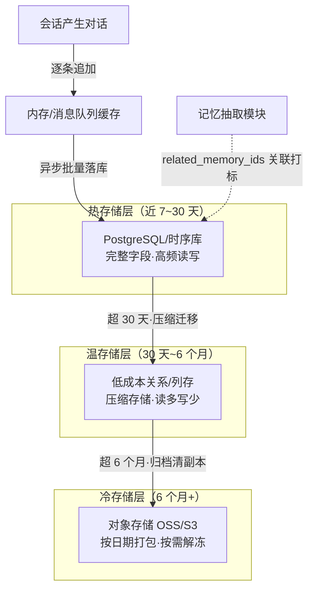
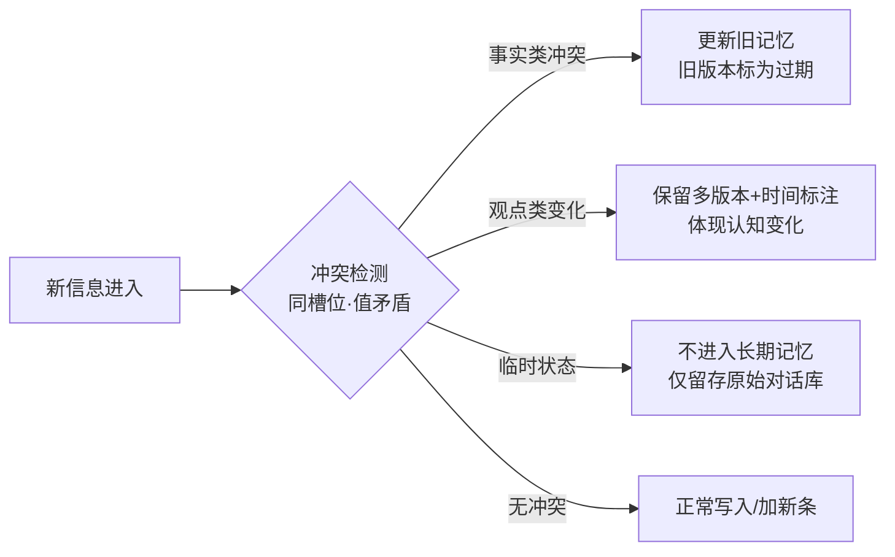
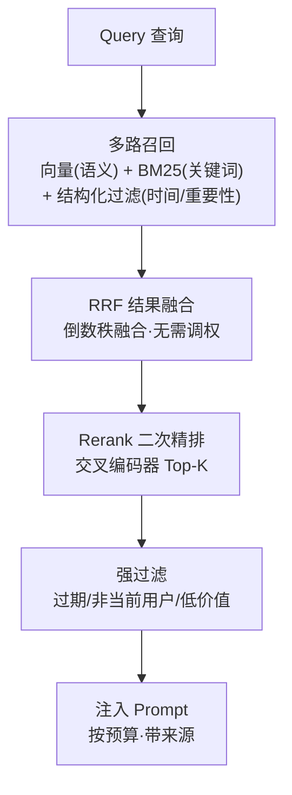
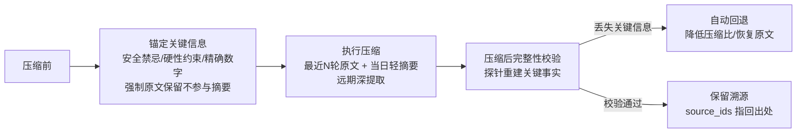
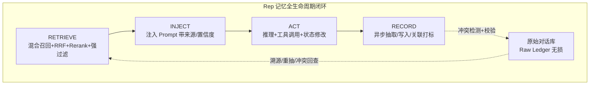

# LLM Agent 记忆机制与原始对话存储综合研究

> **关键词**：Agent 记忆系统 · 原始对话存储 · 记忆分类与冲突治理 · RRF 混合检索 · 摘要漂移 · 软遗忘 · 全生命周期治理

---

## 摘要

LLM 本身是无状态的——每次推理都只看到当前上下文窗口内的内容，跨会话学习能力为零[[1]](#ref-1)。这一根本缺陷催生了 Agent 记忆系统：把「过去」以可更新、可追责的方式带到「今天」。然而大量实践表明，**只要栈不完整，光靠向量数据库做 RAG 检索远远不够**——记忆系统必须覆盖**分类、写入、读取、压缩、遗忘**五大环节的全生命周期[[1]](#ref-1)。

本文对豆包会话《AI Agent 记忆机制与原始对话存储》中的两大主题——**① 原始 raw 历史对话的分层存储方案**、**② AI Agent 记忆机制的五大核心问题**——逐条联网核验，并结合已发表文献与生产系统实践给出强化结论。核验要点包括：记忆三层分类的工业落地（MemGPT/Letta 虚拟内存分页[[2]](#ref-2)）、混合检索中 RRF 无需人工调权的特性[[3]](#ref-3)[[4]](#ref-4)、上下文压缩的「摘要漂移/渐进式上下文遗忘」量化证据（标准压缩丢失约 77% 命名实体[[5]](#ref-5)[[6]](#ref-6)）、以及记忆冲突处理的版本化与 ADD-only 策略[[7]](#ref-7)[[8]](#ref-8)。

核心结论：**Agent 记忆系统的本质不是"存储"，而是"治理"**——原始对话作为底层溯源库（Raw Ledger），上层叠加可检索的派生视图（Derived Views）与写入/读取/遗忘策略（Policy），形成 Retrieve → Inject → Act → Record 的闭环[[9]](#ref-9)。

---

## 1. 引言

### 1.1 问题根源：LLM 的无状态与记忆的需求

大语言模型没有持久记忆。每次推理调用都将整个对话上下文作为输入，模型响应质量直接取决于输入质量[[5]](#ref-5)。当上下文累积超出窗口限制时，平台执行压缩（有损摘要）；而无记忆的 Agent 无法把昨天学到的知识可靠地带到今天[[1]](#ref-1)[[9]](#ref-9)。

工业级的量化证据触目惊心：

- 多智能体生产部署中，**标准压缩平均丢失 77% 的命名实体**（人名、决策、工具、日期），直接降低 Agent 决策质量[[5]](#ref-5)。
- 对 857 个生产 LLM 会话、445 万元效 token 的分析发现：**21.8% 的上下文是结构性浪费**（从未调用的工具定义、系统提示重复、过期工具结果）[[6]](#ref-6)。
- 企业 AI Agent 失败分析中约 **65% 可归因于上下文漂移与记忆丢失**，而非原始上下文耗尽[[6]](#ref-6)。

### 1.2 素材与方法

本文素材来自一份豆包 AI 会话（已落盘 `raw/articles/AI-Agent记忆机制与原始对话存储.md`），包含两大主题：

| 主题 | 内容 | 章节 |
|---|---|---|
| 原始 raw 历史对话的存储方案 | 分层存储（热/温/冷）、数据结构、异步落库、生命周期 | 第 2 章 |
| AI Agent 记忆机制的五大核心问题 | 分类/写入/读取/压缩/遗忘 + 生产级工程补充 | 第 3~7 章 |

素材中所有关键论断（RRF 无需调权[[3]](#ref-3)、Rerank 提升召回、摘要漂移、冲突分级、软遗忘）均已通过联网核验。核验中发现素材与工业实践**结论一致、细节可互补**：例如豆包提出的「事实类/观点类冲突分级」与学术界的版本化记忆[[7]](#ref-7)、后创作的多级降级体系（active/historical/archived/forgotten）[[8]](#ref-8)完全对齐。

---

## 2. 原始 Raw 历史对话的存储方案：记忆系统的底层溯源库

### 2.1 核心定位

原始 raw 对话**不直接参与实时检索**，而是服务记忆回溯、冲突校验、压缩溯源、模型迭代与合规审计。与结构化长期记忆形成「上层索引 + 底层原始数据」的双层架构[[1]](#ref-1)。

这一定位与腾讯云 Agent Memory 长期记忆四层金字塔一致：原始对话（完整记录、工具调用日志、文档片段）是最底层事实依据，往上逐层提炼为原子记忆→场景记忆→核心记忆，**每层保留向下追溯链接**（「看到结论可以下钻到原始记录」）[[10]](#ref-10)。

### 2.2 存储分层：按访问频率分级

<b>图 1 原始对话分层存储与生命周期流转</b>

| 层 | 存储范围 | 介质 | 作用 | 特点 |
|---|---|---|---|---|
| 热 | 当前会话 + 近 7~30 天 | 高性能关系库（PostgreSQL）/时序库 | 快速回溯、记忆重抽取、压缩溯源 | 读写频繁、完整字段、按会话/用户快查 |
| 温 | 30 天~6 个月 | 低成本关系库/列存/文档库 | 常规历史查询、效果复盘、语料筛选 | 读多写少、按时间分片、开启压缩 |
| 冷 | 6 个月以上 | 对象存储（OSS/S3）打包压缩 | 合规留存、微调语料、极端回溯 | 低频、按需解冻、成本最低 |

分层存储与 MemGPT/Letta 的虚拟内存思想相互印证：上下文窗口是主存（CPU 寄存器）、向量库是辅存（RAM+磁盘），Overflow 时把不活跃信息换出、需要时换入[[2]](#ref-2)[[9]](#ref-9)。分层的关键在于**压缩梯度**：近的轻压、远的重压、更远的归档或归档或丢弃[[6]](#ref-6)。

### 2.3 数据结构：原始信息无损 + 可索引

| 字段 | 说明 | 作用 |
|---|---|---|
| message_id | 单条消息唯一 ID | 主键，与结构化记忆关联溯源 |
| conversation_id | 会话 ID | 聚合同一次完整对话 |
| user_id | 用户唯一标识 | 按用户维度管理数据 |
| role | user/assistant/tool/system | 还原完整交互链路 |
| content_raw | 原始文本内容 | 无损保留原文，不做修改/摘要/截断 |
| timestamp | 毫秒级时间戳 | 时序排序、生命周期、时间衰减、溯源 |
| source_meta | 渠道/设备/版本元数据 | 问题排查、场景分析 |
| related_memory_ids | 关联的结构化记忆 ID | 「原始对话→结构化记忆」映射 |

**关键原则**：`content_raw` 严格存储原始输入输出，即使包含冗余、口误、闲聊，也不做清洗改写，保证溯源绝对真实[[1]](#ref-1)。这一「Raw Ledger」思想与学界 Memory 三件套一致——**Raw Ledger（追加式权威记录）+ Derived Views（派生向量/索引视图）+ Policy（读/写/遗忘策略）**[[9]](#ref-9)。

### 2.4 写入流程：异步落库，不阻塞主链路

原始对话不参与实时推理，采用异步写入：

1. **实时缓存**：对话产生先写内存/消息队列（Kafka、Redis），保证不丢。
2. **异步批量落库**：后台消费队列批量写热层，减少 DB IO。
3. **关联打标**：结构化记忆生成时同步记 `source_message_ids`，建立双向关联。
4. **完整性校验**：落库后做条数 + 内容哈希校验。

生产实践补充：记忆沉淀同样应**异步化**——写入需经大模型提取，耗时明显高于检索，同步执行会拖慢每轮响应；召回失败时本轮按无记忆降级处理[[10]](#ref-10)。

### 2.5 生命周期：自动流转与合规清理

- **自动分层流转**：会话结束 → 热层正式落库；超 30 天 → 温层（压缩）；超 6 个月 → 冷层归档并删温层副本。
- **留存与删除**：按合规设最长留存（如 3 年）到期自动删；支持用户维度完整删除（被遗忘权）；敏感信息存储前脱敏但留痕、不修改原文。

---

## 3. 记忆的分类：从三层到工程落地

### 3.1 逻辑三层

| 记忆 | 定义 | 载体 | 生命周期 |
|---|---|---|---|
| 短期记忆 | 当前交互即时信息 | 大模型上下文窗口（原始对话文本） | 随会话结束终止 |
| 工作记忆 | 当前任务中间态 | 运行时状态存储（Redis、任务上下文对象） | 任务完成归档/清除 |
| 长期记忆 | 跨会话重要信息 | 向量库 + 结构化数据库（事实/偏好） | 跨会话持久化 |

豆包三层分类与主流工业实践一致[[1]](#ref-1)[[11]](#ref-11)。更细分的五层（工作/短期/情景/语义/程序记忆）则把「情景记忆」（过去事件）与「语义记忆」（通用事实偏好）拆开——情景记忆适合近距离最近 7 天完整、7~30 天摘要、30 天以上只留关键事实的分层存储[[11]](#ref-11)。

### 3.2 工程补充：原始对话库的存在

豆包强调工程上额外独立存储原始对话库，不参与实时检索，与结构化长期记忆形成「底层原始数据 + 上层检索索引」双层架构[[1]](#ref-1)。这与第 2 章的分层存储遥相呼应，也是 MemGPT 以外众多生产系统（OpenClaw 的 MEMORY.md、腾讯云的四层金字塔）的共同选择[[10]](#ref-10)[[11]](#ref-11)。

### 3.3 记忆本质：资源调度而非存储

学界更本质的洞见：**Memory 不是"存储"，而是可被决策利用的外部状态**——能力来自「历史能否以某种形式影响决策分布」。Context window 是 CPU 寄存器、向量库是 RAM、对象存储是磁盘；MemGPT 的突破在于把操作系统虚拟内存分页搬进 LLM 架构，Agent 通过工具调用自主动态修改记忆（`core_memory_replace`、`archival_memory_insert`）[[2]](#ref-2)[[9]](#ref-9)。

---

## 4. 记忆的写入时机、抽取校验与冲突分级

### 4.1 三类触发时机

1. **对话结束时总结抽取**：对话告一段落，提取值得长期保存的信息。
2. **事件触发写入**：检测到特定事件/关键信息时立即触发。
3. **后台定期整理**：周期性后台任务归并优化。

### 4.2 抽取质量校验

对话总结抽取存在幻觉与漏提取风险，工程上增加校验环节：通过规则或小模型比对抽取结果与原始对话的**语义一致性**，不一致触发重抽，避免错误记忆入库[[1]](#ref-1)。生产实现常以置信度阈值 + pending 标记：`confidence < threshold → 打 pending 标记，不写入主库`[[12]](#ref-12)。

### 4.3 冲突分级处理：不简单按时间覆盖

<b>图 2 记忆冲突分级处理</b>

豆包的三类分级（事实类/观点类/临时状态）与学术界、工业界结论完全吻合[[1]](#ref-1)[[7]](#ref-7)[[8]](#ref-8)。补强的工程要点：

- **冲突判定可计算化**：用反义对照集 P（同槽位 + 命中反义对）近似，未来可升级为 Embedding 矛盾检测/NLI/LLM-as-Judge[[8]](#ref-8)。
- **版本化而非删除**：新事实作为新版本写入，旧事实标 `inactive/superseded/tombstoned`，保留审计链路；仅隐私/合规场景物理删除[[7]](#ref-7)。
- **ADD-only 策略**：遇到矛盾不修改旧记忆，新增记录并存，靠时间维度区分新旧[[10]](#ref-10)。
- **多级降级状态**：active（有效）/ historical（低权回溯）/ archived（硬过滤）/ forgotten（审计与可恢复性）[[8]](#ref-8)。
- **优先级仲裁**：用户明确纠正 > 可信工具结果 > 对话推测；对影响重要决策的冲突**必须向用户澄清**而不是让模型猜[[7]](#ref-7)。

---

## 5. 记忆的读取策略：混合检索「组合拳」

### 5.1 四路组合拳

读取不能只靠单一语义相似度检索，需组合拳策略[[1]](#ref-1)：

1. **语义相似度**：向量检索找语义相关记忆。
2. **时间衰减**：越久远权重越低，避免过时信息干扰。
3. **重要性加权**：按重要性分数排序。
4. **混合检索**：融合向量 + 关键词（BM25）+ 图遍历，结果融合（RRF）合并排序。

### 5.2 工业级四步流水线

<b>图 3 混合检索四步流水线</b>

- **多路召回**：向量 + BM25 + 结构化过滤（时间、重要性等级）同时召回[[1]](#ref-1)。
- **RRF 结果融合**：**倒数秩融合（Reciprocal Rank Fusion）**——不看分数只看排名，`score(d)=Σ 1/(k+rankᵢ(d))`，平滑常数 k 默认 60[[3]](#ref-3)[[4]](#ref-4)。Die 核心优势是**无需人工调权**，跨列表重复出现的文档胜过单单一路第一名的文档，抗单路噪声[[3]](#ref-3)[[4]](#ref-4)。
  - Elasticsearch 8.8+ 原生内置 RRF retriever；Milvus RRF Ranker（k∈[10,100]，默认 60）可在混合搜索中直接配置[[3]](#ref-3)。
  - **位置**：RRF 是粗排汇总层，下游再接 Rerank 精排；不应对 Rerank 之后再做 RRF[[3]](#ref-3)。rank 从 1 开始（1-based）[[3]](#ref-3)。
- **Rerank 二次精排**：交叉编码器对 Top-K（20~50）二次精排，生产标配，通常让召回准确率提升 30%+[[1]](#ref-1)[[4]](#ref-4)。
- **强过滤规则**：强制过滤过期记忆、非当前用户记忆（**命名空间隔离**）、低价值记忆，是不可省略的前置步骤——把安全/有效期治理前置，避免模型承担不擅长的确定性过滤[[1]](#ref-1)[[7]](#ref-7)。

### 5.3 命名空间隔离

多用户/多会话场景下，检索严格按 `tenant_id`、`user_id`、`agent_id`、`conversation_id` 做隔离，避免交叉污染[[1]](#ref-1)[[10]](#ref-10)。记忆的八维校验信号：Identity / Scope / Authority / Freshness / Task Fit / Confidence / Safety / Budget[[7]](#ref-7)。

---

## 6. 上下文窗口压缩：分层递进与风险兜底

### 6.1 压缩的必要性

上下文窗口有限，直接堆砌历史会导致**上下文腐烂（Context rot）**与推理性能下降——注意力随长度下降，`Lost in the Middle` 效应显著[[6]](#ref-6)。因此短期上下文必须是「最小必要信息集」而非「完整聊天记录」[[11]](#ref-11)。生产建议长上下文模型 prompt 控制在标称窗口 **1/3 以内**，更保守按 25%~30%[[6]](#ref-6)。

### 6.2 常见压缩方法

- **滑动窗口**：只保留最近 N 轮，更早直接丢弃。
- **语义压缩**：LLM 摘要式压缩。
- **分层摘要压缩**：最近 N 轮保留原文 → 当日对话轻度摘要 → 远期深度提取为事实条目，而非一次性压缩到底[[1]](#ref-1)。

### 6.3 摘要漂移：压缩的量化风险

**摘要漂移（"渐进式上下文遗忘症"）**是压缩最危险的副作用：summary 不是中性的——每一次摘要都隐含「选择哪些信息值得保留」的编辑决策，通用 LLM 摘要器偏向高频、显著内容，**罕见但关键的信息（安全禁忌、硬性约束、精确数字、否定表达、条件依赖）被系统性压制**[[6]](#ref-6)。

量化证据：

- 标准摘要后**只有 23% 的命名实体可恢复**（丢失 77%）；叠加结构化知识层 + 按需召回可恢复到 100%[[5]](#ref-5)。
- 多轮级联压缩不是一次有损变换，而是**级联的有损变换**："恰好 512 条"→"大约 500 条"→"数百条"，否定表达甚至可语义反转（"偏好 Python 但 Rust 是备选"退化）[[6]](#ref-6)。

### 6.4 风险兜底机制（工业级）

<b>图 4 压缩风险兜底闭环</b>

- **锚定关键信息**：压缩前把安全禁忌/约束/精确数字钉在 system header 或不参与摘要的稳定语义层，防被改写丢弃[[1]](#ref-1)[[6]](#ref-6)。
- **压缩后完整性校验**：用探针重建关键事实，`assert covers(probe, CRITICAL_FACTS)` 失败则回退并降低压缩比[[1]](#ref-1)[[6]](#ref-6)。
- **带校验的有损变换**：压完不校验等于没压；持续评估「召回准确率 / 关键信息丢失率 / 矛盾率」三大指标[[6]](#ref-6)。
- **早点触发**：压缩阈值早于溢出（如到 60% 触发），不要等到 95% 再截断[[6]](#ref-6)。

---

## 7. 遗忘机制：可追溯的软遗忘

### 7.1 为什么必须遗忘

记忆系统必须有遗忘与闭环机制，淘汰三类记忆：长期未被检索（价值低）、被新事实推翻（标记而非覆盖）、价值较低的记忆[[1]](#ref-1)。遗忘不是 Bug，**是防止记忆系统对现实过拟合的必要机制**[[9]](#ref-9)。

### 7.2 软遗忘 vs 硬删除

| 策略 | 做法 | 适用 |
|---|---|---|
| 降权而非物理删除 | 低价值、长期未检索记忆降低召回权重，不直接抹去 | 保留溯源能力 |
| 状态降级 | active → historical → archived → forgotten | 逐级降级，可审计 |
| TTL/阈值淘汰 | 评分跌破阈值 → 切 forgotten 状态而非删除 | 可恢复性 |
| 物理删除 | 隐私删除/合规保留策略要求 | 用户删除请求 |

软遗忘设计动机：保留**记忆血缘（memory lineage）**，便于追溯结论证据链；被遗忘记忆若被新交互重新印证，可凭频率/重要性回升重新激活[[8]](#ref-8)。

### 7.3 遗忘效果验证

除隔天测试外，用「召回准确率」「冲突记忆错误率」「关键信息丢失率」三个量化指标持续评测，形成优化闭环[[1]](#ref-1)。冲突事件亦可作为 eval 数据（repr 冲突组要覆盖真实场景的 8 类情况）[[7]](#ref-7)。遗忘与冲突共用一个时间感知评分 `S(m) = αI + βC + γR + δF`（重要性/一致性/时近/频率），使**遗忘与冲突仲裁都具备时间维度**[[8]](#ref-8)。

---

## 8. 全生命周期治理总览

<b>图 5 Agent 记忆全生命周期治理闭环</b>

记忆系统不是容器，而是三条链路的闭环[[9]](#ref-9)：

1. **写入链路**：抽取质量校验 + 冲突分级 + 分层落库（原始对话/原子记忆/场景记忆/核心记忆）。
2. **管理链路**：整合、冲突处理、衰减遗忘、来源追踪、权限治理。
3. **读取链路**：任务约束优先的混合召回（向量 + BM25 + 结构化过滤 → RRF → Rerank → 强过滤）。

三个关键数字：**标准压缩丢失 77% 命名实体**（为何必须双层架构）[[5]](#ref-5)、**约 65% 的 Agent 失败归因于上下文漂移与记忆丢失**（为何必须治理而非只存）[[6]](#ref-6)、**RRF 无需调权**（为何混合检索可用简单方案落地）[[3]](#ref-3)[[4]](#ref-4)。

---

## 9. 工程改造清单

- [ ] 原始对话独立分层存储（热/温/冷），`content_raw` 无损 + `related_memory_ids` 关联打标、异步批量落库 + 完整性校验。
- [ ] 长期记忆用「原始对话 / 原子记忆 / 场景记忆 / 核心记忆」四层金字塔，每层保留向下追溯链接。
- [ ] 记忆 entry 至少含主体、属性、值、来源、时间、作用域、置信度、版本、状态（active/historical/archived/forgotten）。
- [ ] 写入走抽取质量校验（置信度阈值 + pending 标记）与冲突分级（事实类覆盖标记 / 观点类多版本 / 临时态不入库）。
- [ ] 读取走四步流水线：多路召回（向量+BM25+结构化）+ RRF 融合（k=60，1-based）+ Rerank 精排 + 强过滤（命名空间隔离/过期/低价值）。
- [ ] 压缩前锚定安全禁忌与精确数字，压缩后探针校验，丢失自动回退；60% 阈值提前触发。
- [ ] 遗忘采用软遗忘状态降级 + TTL 淘汰，保留血缘与可恢复性，配三指标持续评测。
- [ ] 全链路 Trace：每次召回/注入/写入/冲突都记录原因，可与 No-Memory Baseline 对比。

---

[1] 豆包. ["AI Agent 记忆机制与原始对话存储"](https://www.doubao.com/chat/38442542909760258)（会话素材，已落盘 `raw/articles/AI-Agent记忆机制与原始对话存储.md`）

[2] Packer et al. ["MemGPT: Towards LLMs as Operating Systems."](https://arxiv.org/abs/2310.08560) *arXiv*, 2023.（Letta 前身，虚拟内存分页思想）

[3] Cormack et al. ["Reciprocal Rank Fusion outperforms Condorcet and individual Rank Learning Methods."](https://dl.acm.org/doi/10.1145/2505515.2507851) *SIGIR*, 2013.（RRF 原始论文；ES 8.8+ 已原生内置 RRF[[3a]](#ref-3a)）

[3a] Elasticsearch. [RRF retriever（无需调权的混合检索融合）](https://www.elastic.co/guide/en/elasticsearch/reference/current/rrf.html)

[4] RRF 工程实践综述：Walter Fan. [RRF 倒数排名融合：RAG 里那个看起来土、却一直没被换掉的小公式](https://www.fanyamin.com/blog/rrf-dao-shu-pai-ming-rong-he-rag-li-na-ge-kan-qi-lai-tu-que-yi-zhi-mei-bei-huan-diao-de-xiao-gong-shi.html)；Milvus. [RRF Ranker](https://milvus.io/docs/zh/rrf-ranker.md)；Deeptoai. [Elasticsearch RRF 详解](https://rag.deeptoai.com/docs/advanced-rag-deep-dive/elasticsearch-rrf)

[5] UAML. [Context Quality Paper（标准压缩丢失 77% 命名实体，三层召回恢复 100%）](https://github.com/uaml-memory/context-quality-paper/blob/main/translations/zh.md)

[6] 上下文压缩失真与渐进式上下文遗忘综述：[tianpan.co 压缩失真分析](https://tianpan.co/zh/blog/2026-05-05-context-compression-artifacts-summarization-information-loss)、[技术栈 长上下文失忆分析](https://jishuzhan.net/article/2097343956892438529)、[uaml-memory context-quality-paper](https://github.com/uaml-memory/context-quality-paper)

[7] XBSTACK. [AI Agent 记忆召回：混合检索、重排、时效性、冲突消解](https://www.xbstack.com/ai/ai-agent-memory-architecture/)；面试大师. [Agent 记忆过期/冲突事实的更新覆盖与回溯](https://mianshidashi.cn/interview-questions/bytedance/backend-development/bytedance-backend-agent-stale-memory-conflict)

[8] SegmentFault. [从 Memory Storage 到 Memory Evolution：长期 Agent 的关键是"治理变化"（HSM-CR 三级降级体系）](https://segmentfault.com/a/1190000047775715)；AI 智能范式网. [智能 Agent 记忆版本化策略](https://intelliparadigm.com/article/weixin_29056781/2211056)

[9] 腾讯云开发者社区. [Agent Memory：从概念到架构的完整解析（Raw Ledger + Derived Views + Policy，Retrieve/Inject/Act/Record 闭环）](https://developer.cloud.tencent.com/article/2657648)；sou350121/Agent-Playbook. [Agent 记忆系统：短期到长期架构](https://github.com/sou350121/Agent-Playbook/blob/main/theory/02-agent-design/agent-memory-system-short-to-long.md)

[10] 腾讯云. [云数据库 Agent Memory 介绍（四层分层金字塔 + ADD-only 冲突策略 + Chat Memory/Skill/Wiki/CodeGraph 资产）](https://cloud.tencent.cn/document/product/1813/132100)；[PostgreSQL 使用 Agent 记忆服务](https://cloud.tencent.cn/document/product/409/137542)

[11] AI Master. [AI Agent 记忆工程：从短期上下文到持久化知识体系的完整架构](https://www.ai-master.cc/article/agent-075)；LearnAgent. [Agent Memory：记忆系统基础概念](https://learnagent.org/library/foundations/agent-memory/)

[12] sou350121/Agent-Playbook. [Agent 记忆系统：L2/L3 优先级设计（置信度阈值 + pending 标记 + 矛盾检测阈值过滤）](https://github.com/sou350121/Agent-Playbook/blob/main/theory/02-agent-design/agent-memory-system-short-to-long.md)