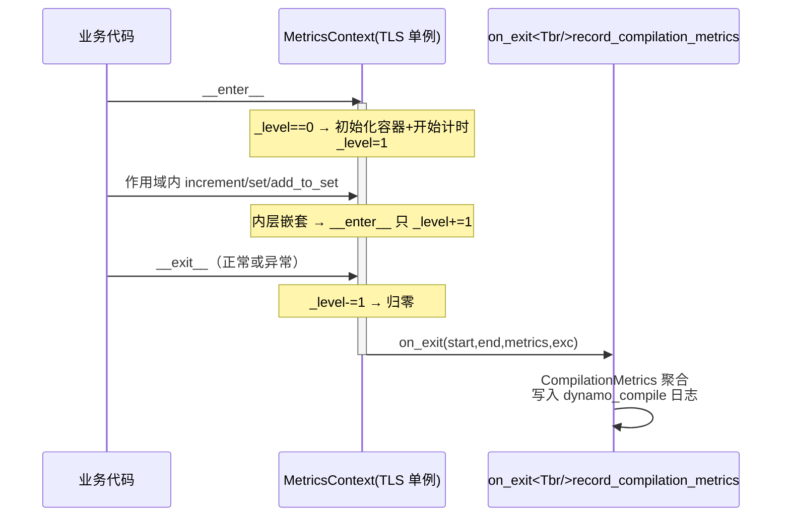
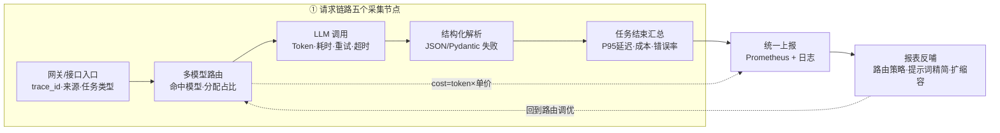
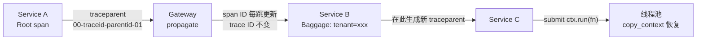
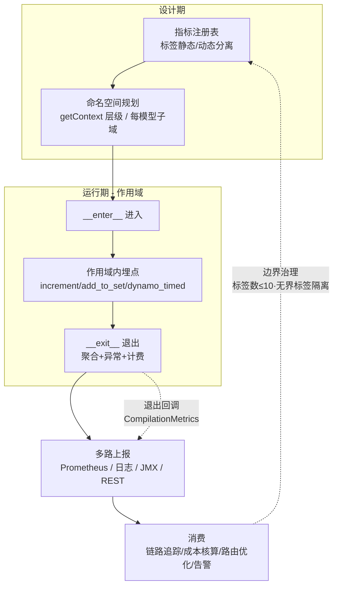

# MetricsContext 上下文管理器机制综合研究

> **关键词**：上下文管理器 · 指标采集与聚合 · 全链路埋点 · 指标命名空间 · 链路追踪 · Token 成本核算 · 标签基数 · 可观测性

---

## 摘要

LLM 服务的全链路监控与计费面临一个共性痛点：耗时、Token、异常、成本四类数据散落在网关、路由、模型调用、解析各环节，若逐函数手动传参与重复计时，代码侵入极高且极易漏埋[[1]](#ref-1)[[4]](#ref-4)。**MetricsContext 模式**用上下文管理器（`__enter__`/`__exit__`）划定一个"指标收集作用域"，把**收集、聚合、上报**自动绑定在作用域的进入与退出边界上，一次埋点、多处消费[[1]](#ref-1)[[3]](#ref-3)。

本文以 4 份对话/博客素材（豆包、ChatGLM、DeepSeek、博客园）为主线融合，并对其中全部关键论断做了联网核验：PyTorch Dynamo `MetricsContext` 的源码级实态（递归深度计数 `_level`、`TopN` 最小堆、`dynamo_timed` 装饰器、`CompilationMetrics` 上报）[[5]](#ref-5)[[6]](#ref-6)、Apache ZooKeeper/Kafka 的层级化命名空间与 `contextLabels`[[7]](#ref-7)[[8]](#ref-8)、Iceberg 真实构件为 `MetricsReporter`/`MetricsReport` 与跨引擎 `EnvironmentContext`（素材中"Iceberg MetricsContext"表述据此修正）[[9]](#ref-9)[[10]](#ref-10)、W3C `traceparent` 的 55 字符固定格式[[11]](#ref-11)、`contextvars` 在 Python 线程池中的丢失与 `copy_context().run()` 恢复[[12]](#ref-12)、以及标签基数 ≤10 的官方最佳实践[[13]](#ref-13)[[14]](#ref-14)。

核心结论：**MetricsContext 不是一个单一类，而是一族"以作用域承载指标生命周期"的设计模式**——在 Python 语言层是上下文管理器单例，在 Java 生态是层级化指标命名空间，在表级/任务级是可插拔的报告体系，在 LLM 服务是可核算成本的业务封装。

---

## 1. 引言

### 1.1 问题根源：全链路埋点为什么难

一次 LLM 请求的生命周期横跨接口网关、多模型路由、模型调用、结构化解析、结果返回多个环节[[4]](#ref-4)。若不做统一设计，工程上必然遭遇四类问题：

- **代码侵入**：`start = time.time()` … `end = time.time()` 散布各处，为计时反复改业务代码。
- **异常丢失**：try-except 分散且不统一，超时、参数错误、解析失败的记录口径不一，错误率统计失真[[1]](#ref-1)[[4]](#ref-4)。
- **成本盲区**：Token 计价涉及输入/输出单价差异与模型差异，缺少统一核算入口，成本数据无法精细化沉淀[[4]](#ref-4)。
- **上下文断裂**：跨服务时链路 ID 传播、跨线程时上下文变量失传，导致链路拼不起来[[2]](#ref-2)[[12]](#ref-12)。

### 1.2 素材与方法

本文素材来自 4 份对话/博客来源（已全部落盘 `raw/articles/`）：

| 来源 | 核心内容 | 落盘素材 |
|---|---|---|
| 豆包（会话 38443078420459010） | 不可变标签容器 + 指标注册表、动静分离、层级继承/Fork、全生命周期、ThreadLocal/W3C Baggage 传播、Kafka/Iceberg/Solr 对比、标签基数爆炸防控 | `doubao-MetricsContext完整原理解析.md` |
| ChatGLM（会话 6aafefc1916f6a9565670f5a） | `__enter__/__exit__` 上下文管理器、LLM 全链路耗时/Token 计费/异常上报、trace_id 跨服务传播与 asyncio 踩坑清单 | `chatglm-MetricsContext与traceid跨服务传播.md` |
| DeepSeek（会话 b9bea904-c066-48ad-b722-13a08678b219） | 单例 + 递归计数、层级化 Namespace（ZooKeeper 风格）、PT2 编译指标、LLM 全链路计费 | `deepseek-MetricsContext原理详解.md` |
| 博客园（itqinls/20684482） | 面向 LLM 服务落地设计：四类字段数据结构、五采集节点、火山引擎定价成本核算 | `cnblogs-MetricsContext上下文管理器整体设计思路.md` |

核验结论：**素材内部自洽，与官方源码/规范一致**（PyTorch、Kafka、ZooKeeper、W3C、Python 官方文档），唯一需要修正的是 Iceberg 相关表述（见 3.3 节）。

---

## 2. 核心机制：以作用域承载指标生命周期

### 2.1 生命周期钩子

MetricsContext 的本质是实现了 `__enter__` 与 `__exit__` 的 Python 上下文管理器[[2]](#ref-2)[[4]](#ref-4)：

- **`__enter__`（进入）**：标记一次独立指标收集任务的边界——记录开始时间、初始化指标容器、可能注册为"当前活跃上下文"[[3]](#ref-3)。
- **`__exit__`（退出）**：无论正常结束、`return`、`break` 还是抛异常都会被调用（异常时 `exc_type/exc_value/exc_tb` 非 `None`），在此执行聚合与上报——计算总耗时、汇总计数器、捕获异常、计算成本、统一落日志/监控[[1]](#ref-1)[[2]](#ref-2)[[4]](#ref-4)。

这等价于自动包裹一层 `try-finally`，但无需手动补写收尾逻辑，杜绝"漏写收尾导致监控/计费数据丢失"的隐患[[4]](#ref-4)。

### 2.2 递归深度计数：只在最外层聚合

嵌套进入同一上下文时，若每次退出都上报会造成重复记录。PyTorch 源码用 `_level` 计数器解决[[3]](#ref-3)[[5]](#ref-5)：

```python
class MetricsContext:
    def __init__(self, on_exit):
        self._on_exit = on_exit          # 退出回调（如 record_compilation_metrics）
        self._metrics = {}               # 指标容器：计数器/集合/KV 对
        self._start_time_ns = 0
        self._level = 0                  # 递归深度计数

    def __enter__(self):
        if self._level == 0:             # 仅在最外层初始化
            self._metrics = {}
            self._start_time_ns = time.time_ns()
        self._level += 1
        return self

    def __exit__(self, exc_type, exc_value, _traceback):
        self._level -= 1
        if self._level == 0:             # 仅在最外层聚合上报
            self._on_exit(self._start_time_ns, time.time_ns(),
                          self._metrics, exc_type, exc_value)
```

进入时只在 `_level == 0` 初始化、退出时只在归零时回调，避免嵌套覆盖已有数据或重复上报[[3]](#ref-3)。PyTorch 在 `__enter__` 之外还断言"作用域外禁止写指标"（`_level == 0` 时调用 `increment/set/update` 直接抛 `RuntimeError`），从机制上杜绝在未进入上下文时污染全局指标[[5]](#ref-5)。

### 2.3 单例与线程本地存储

进程内通常设计为单例，但挂在 **TLS（Thread-Local Storage）** 下，既保证"一次编译一条日志"的全局性，又避免多线程互相污染[[1]](#ref-1)[[3]](#ref-3)[[5]](#ref-5)。PyTorch 的 `get_metrics_context()` 利用 `_metrics_context_tls` 按线程懒加载单例，`on_exit=record_compilation_metrics`——进入即为一个编译分配单个 `CompilationMetrics` 对象与单条 `dynamo_compile` 日志条目[[3]](#ref-3)[[5]](#ref-5)[[6]](#ref-6)。



<p align="center"><b>图 1 MetricsContext 生命周期时序（递归深度计数）</b></p>

---

## 3. 跨生态的实现形态

同名"MetricsContext"在不同技术栈演化出三种形态，本质相通、构件各异。

### 3.1 语言级上下文管理器：PyTorch Dynamo

PyTorch Dynamo 的 `torch/_dynamo/metrics_context.py` 是目前社区最完整的公开实现[[5]](#ref-5)：

- **指标类型**：计数器（`increment`）、集合（`add_to_set`）、KV 键值对（`set_key`/`set`）、`update` 批量合并（默认不允许覆盖已被写入的键）。
- **TopN**：用最小堆记录"最昂贵的前 N 个操作"，默认上限 25——`heapq.heappush` 未满先入，满了 `heappushpop` 挤掉最小者，输出按值降序。用途是海量 Triton kernel 编译耗时只保留最贵的 25 条，避免日志爆炸[[5]](#ref-5)[[6]](#ref-6)。
- **dynamo_timed**：`@contextmanager` 装饰器风格调用。推荐写法是 `with dynamo_timed("_foo"):` 而非装饰器（装饰器形式会污染 cProfile 追踪）[[5]](#ref-5)。它按 `duration_us` 累计到 `CompilationMetrics` 指定字段（字段名强制以 `_us` 结尾并有断言），并在最外层事件额外 `increment("duration_us")`[[5]](#ref-5)[[6]](#ref-6)。
- **上报**：`record_compilation_metrics` 在 `MetricsContext` 退出时被调用，集中填充 start/end 时间、异常信息、compile_id 等公共字段，随后写 `dynamo_compile` 日志事件[[5]](#ref-5)[[6]](#ref-6)。

这是一次"埋点分散、聚合汇总在退出时集中发生"的教科书式实现。

### 3.2 指标命名空间：ZooKeeper 与 Kafka

-  Apache ZooKeeper 的 `org.apache.zookeeper.metrics.MetricsContext` 把 MetricsContext 定义为**指标命名空间**："A MetricsContext is like a namespace for metrics. Each component/submodule will have its own MetricsContext"，且 **Contexts are organized in a hierarchy（按层级组织）**[[8]](#ref-8)。通过 `getContext(String name)` 获取子上下文；`getCounter/getSummary/getSummarySet` 注册指标；`DetailLevel.BASIC/ADVANCED` 区分廉价聚合（min/max/avg）与昂贵聚合（百分位）[[3]](#ref-3)[[8]](#ref-8)。可以对"每个 peer"单独建上下文——与 LLM 多模型路由按模型维度拆分子上下文的思路同构[[8]](#ref-8)。

-  Apache Kafka 的 `org.apache.kafka.common.metrics.MetricsContext`（实现类 `KafkaMetricsContext`）把"上下文"定义为**给 Reporter 的附加标签**："encapsulates additional contextLabels about metrics exposed via a MetricsReporter"[[7]](#ref-7)。`contextLabels()` 返回供 Reporter 附加的标签 Map：所有组件必含 `_namespace` 字段（`kafka.server`、`kafka.consumer` 等），JmxReporter 将其作为 MBean 名的前缀；broker/connect 追加 `kafka.broker.id`、`kafka.cluster.id` 等；客户端可用 `metrics.context.<key>` 属性注入自由字段[[7]](#ref-7)。这一设计与豆包素材中"不可变标签容器"思想一致——标签在进入 Reporter 前就被做唯一、不可变的装配。

### 3.3 可插拔报告体系：Iceberg（表述修正）

豆包素材称"Iceberg 通过 MetricsContext 实现可序列化、跨引擎"。核验后**修正**：Iceberg 的真实构件是 **`MetricsReporter` + `MetricsReport` API**（1.1.0 起支持）与跨引擎元数据 `EnvironmentContext`[[9]](#ref-9)：

- `MetricsReporter` 为 `ScanReport`/`CommitReport` 提供可插拔上报（Prometheus 端点、REST 端点、内存收集器），`metrics-reporter-impl` catalog 属性注册实现类；RESTCatalog 默认走 **RESTMetricsReporter** 打点到 `/v1/{prefix}/.../tables/{table}/metrics`[[9]](#ref-9)。
- **跨引擎**：`EnvironmentContext` 把 `engine-name`、`engine-version`（如 `spark`、`3.3.1`）写进 report metadata，供多引擎（Spark/Flink）统一采集识别[[9]](#ref-9)。
- **跨序列化**：`SerializableTable` 反序列化时 metrics reporter 会丢失，需重建——社区 PR 的方案是让 `MetricsReporter` 实现 `Serializable`，非序列化对象（如 `KafkaProducer`）标 `transient` 并在反序列化后懒初始化[[10]](#ref-10)。这正是"上下文/报告器必须随对象生命周期走，而不是靠进程内静态持有"工程教训的体现。

三形态对比：

| 形态 | 代表 | 上下文承载物 | 作用域粒度 | 上报方式 |
|---|---|---|---|---|
| 语言级上下文管理器 | PyTorch Dynamo | TLS 单例 + 递归深度 | 一次编译 | 退出回调写结构化日志 |
| 层级化指标命名空间 | ZooKeeper / Kafka | `getContext` 树 / `contextLabels` Map | 组件 / 每个 peer / broker | JMX / Prometheus |
| 可插拔报告体系 | Iceberg | `MetricsReporter`（可序列化） | 一次 scan / commit | REST / Prometheus / 自定义 |

---

## 4. LLM 全链路埋点与成本核算

博客园素材给出一个可直接落地的 LLM 服务设计[[4]](#ref-4)。

### 4.1 全链路采集节点



<p align="center"><b>图 2 LLM 全链路指标采集与上报闭环</b></p>

1. **网关/接口入口**：记录 trace_id、请求来源、任务类型；限流熔断时直接标记失败，不进入 LLM 调用。
2. **多模型路由**：记录最终模型（Flash / Doubao-1.8），统计模型分配占比，指导路由调优。
3. **LLM 调用**：采集输入/输出/总 Token、实际推理耗时、重试次数；捕获超时/抖动/参数错误，统计接口错误率。
4. **结构化解析**：统计 JSON 解析失败、Pydantic 校验失败次数，归为业务异常，纳入整体错误率。
5. **任务结束汇总**：性能（各模型平均延迟、P95/P99）、成本（日均 Token、总费用、单任务平均成本）、稳定性（成功率、错误率、重试频次）[[4]](#ref-4)。

### 4.2 数据结构：四类字段

```python
@dataclass
class MetricsContext:
    # 1. 链路唯一标识
    trace_id: str; task_type: str; model_name: str
    # 2. 性能耗时指标
    start_time: float; end_time: float; total_latency_ms: float
    # 3. Token 与成本指标
    prompt_tokens: int; completion_tokens: int; total_tokens: int
    unit_price_input: float; unit_price_output: float; request_cost: float
    # 4. 异常与稳定性指标
    success: bool; error_code: str; error_msg: str; retry_count: int
```

业务使用极简：`with MetricsContext(trace_id=..., task_type=..., model_name=...) as ctx:` 包裹调用，从 `resp.usage` 回填 Token 与单价，退出时自动“计时 + 异常捕获 + `calc_cost()` + `report_metrics()`”[[4]](#ref-4)。从而“一次埋点、多处消费”：同一份数据既是计费凭据，又是可观测性数据源[[1]](#ref-1)。

### 4.3 基于定价模型的自动化成本核算

- 维护全局定价配置表：`PRICE_CONFIG = {"Flash": {"input": 0.0005, "output": 0.001}, "Doubao-1.8": {"input": 0.002, "output": 0.004}}`（每千 Token）。
- 上下文中自动核算：路由选中的 model_name 匹配单价 → 输入/输出 Token 分别计费累加 → 按天/任务类型/模型维度聚合[[4]](#ref-4)。
- 成本反哺：量化简单任务改用轻量模型（Flash）的节省，分析高耗时高 Token 任务优化提示词、裁剪上下文，反向迭代路由策略（中等难度任务以轻量模型替代旗舰降本）[[4]](#ref-4)。

---

## 5. 跨请求与跨服务传播

### 5.1 W3C traceparent 标准化格式

ChatGLM 提出的跨服务链路解决方案采用 W3C Trace Context，规格与官方规范逐字对齐[[11]](#ref-11)：

```
traceparent: version-trace-id-parent-id-trace-flags
示例:        00-4bf92f3577b34da6a3ce929d0e0e4736-00f067aa0ba902b7-01
```

- `version` = 2 位十六进制，当前恒为 `00`（`ff` 禁用）；`trace-id` = 32 位十六进制（16 字节，全零非法）；`parent-id` = 16 位十六进制（8 字节，每跳变化，全零非法）；`trace-flags` = 2 位十六进制（8 比特，**位 0 = sampled**，值 `01` 表示采样）。当前版本总长恰好 55 个字符，全部小写[[11]](#ref-11)。
- `trace-id` 贯穿所有服务不变，`parent-id` 每跳替换为调用者 span——这保证了"接收方看到的是调用自己的那个 span"，链条得以逐跳拼接[[11]](#ref-11)。

### 5.2 contextvars 的线程池陷阱

`ContextVar` 在同一协程链中自动传播（`asyncio.create_task` 捕获创建点上下文），但**一旦跨越线程边界就丢失**：`concurrent.futures.ThreadPoolExecutor` / `loop.run_in_executor` 不会自动复制上下文，子线程里拿到的将是初始值或触发缺失[[12]](#ref-12)。修复手段：

```python
ctx = contextvars.copy_context()          # 快照当前上下文
loop.run_in_executor(pool, ctx.run, fn)   # 在新线程中以 ctx.run 执行
```

而 `asyncio.to_thread()` 会自动复制当前上下文到线程函数，较为省心[[12]](#ref-12)。此外 `Context` 对象不可 pickle，跨进程（`ProcessPoolExecutor`）需要自行序列化上下文，这是一个常见二坑[[12]](#ref-12)。ChatGLM 踩坑清单（`asyncio` 任务中 trace_id 丢失、线程池隔离、重试中 reset Token 等）对应上述官方行为，属实[[2]](#ref-2)[[12]](#ref-12)。

### 5.3 Baggage 与显式上下文传递

在 `traceparent` 之外的业务键值（用户 ID、租户、灰度标记）随链路传播时，豆包素材建议用 W3C **Baggage** 键值对承载并配置传播器；无法用框架传播的边界（如异步中间件、异构协议桥）则退化为**显式上下文对象传参**[[1]](#ref-1)[[2]](#ref-2)。传播策略的选取优先级：内建传播（gRPC/OTel carrier）→ Baggage/header（HTTP）→ 显式传参（线程池/跨进程边界）[[1]](#ref-1)[[2]](#ref-2)。



<p align="center"><b>图 3 跨服务/跨线程链路上下文传播</b></p>

---

## 6. 标签基数防控

### 6.1 高基数的本质：标签的乘法关系

指标库（Prometheus/TSDB）中**每一个唯一的标签组合都生成一条独立时间序列**，标签维度呈乘法叠加[[13]](#ref-13)[[14]](#ref-14)。例如 3 个标签（method 10 种 × endpoint 100 种 × status 20 种）= 2 万序列可接受，但再引入无界的 `user_id`（10 万用户）→ 组合数飙到 2×10⁹ 直接失控[[14]](#ref-14)。高基数的风险是真实事故级的：查询变慢、内存倒排索引膨胀、频繁 OOM[[13]](#ref-13)[[14]](#ref-14)。

### 6.2 无界标签禁区

Prometheus 官方实践明确：**不要用标签存高基数/无上界维度**（`user_id`、`email`、IP 等）[[13]](#ref-13)。生产实践进一步归类出管控边界：

| 标签类别 | 典型值 | 是否建议入指标 |
|---|---|---|
| 资源级 | `instance`、`namespace`、`pod` | 通常建议（有可估算上界） |
| 业务聚合级 | `method`、`status`、`route` 模板 | 建议（低基数、可聚合） |
| 请求级 | `request_id`、`trace_id`、`span_id` | **不建议**（随请求持续生成新值） |
| 用户级 | `user_id`、`device_id`、`session_id` | **不建议**（无上界） |
| 瞬态实例级 | `container_id`、`pod_uid` | 通常不建议（churn 高） |

判断标准三条：是否有明确上界、能否服务聚合统计、是否随请求/实例持续产生新值[[15]](#ref-15)。

### 6.3 工程防控手段

结合豆包素材的"不可变标签容器 + 指标注册表 + 动静分离"[[1]](#ref-1)与 Prometheus 生产实践[[13]](#ref-13)[[14]](#ref-14)[[15]](#ref-15)：

- **静态/动态标签分离**：静态标签（服务、环境）编译期固定、复用同一容器；动态标签（路由、模型名）运行时受限枚举；**禁止运行时生成长尾标签**（trace_id 等走日志/追踪链路而非指标）。
- **指标注册表前置**：所有指标与固定标签在设计期注册，篡改/新增标签在代码评审与注册表层面拦下，而非依赖运行时日志排查[[1]](#ref-1)。
- **标签数量与取值约束**：每个指标标签数 ≤10（官方建议）[[14]](#ref-14)；标签值采用枚举、模板化 route；对源头散发的标签用 `metric_relabel_configs`/`labeldrop` 在采集侧丢弃[[14]](#ref-14)。
- **容量边界显式化**：Head Series 与 Series Created Rate（churn）上监控告警；新业务接入前做 series 规模估算[[13]](#ref-13)[[15]](#ref-15)。
- **借力分层采集**：Recording Rules 预聚合降维、联邦/远程存储把长期数据下沉，明细（日志/追踪/OLAP）与聚合（metrics）分域治理[[13]](#ref-13)[[15]](#ref-15)。

---

## 7. 综合设计总览

将前文统一到一条 "定义 → 采集 → 聚合 → 上报 → 消费" 的链路上：



<p align="center"><b>图 4 MetricsContext 全链路综合设计</b></p>

设计决策要点：

- **作用域粒度的选择**：一次请求 / 一次编译 / 一次表操作。粒度过细会造成上报风暴（对应 PyTorch 用 `TopN` 截断、Prometheus 用 ≤10 标签限幅）[[5]](#ref-5)[[14]](#ref-14)。
- **聚合完整性**：只有最外层退出才上报（`_level` 归零），异常与正常路径共用同一收尾逻辑，保证成功率口径一致[[3]](#ref-3)[[4]](#ref-4)[[5]](#ref-5)。
- **跨边界只传标识、不传数据**：进程内 TLS/ContextVar 传引用，线程间 `copy_context().run()` 传快照，跨服务只传 `traceparent`/Baggage 标识，避免把大对象塞进 header[[11]](#ref-11)[[12]](#ref-12)。

---

## 8. 工程改造清单

- [ ] 用 `with MetricsContext(...)` 包裹 LLM 调用主链路，`__enter__` 记起点、`__exit__` 统一聚合（耗时/异常）与上报。
- [ ] 四类字段就位：链路标识（trace_id/task_type/model_name）、耗时、Token 与单价、异常与重试计数。
- [ ] 静态标签与动态标签分离，指标名与标签在设计期注册表登记，禁止运行时新增标签。
- [ ] 每个指标标签数 ≤10、取值限枚举；`request_id`/`trace_id`/`user_id` 不进指标，走日志/追踪链路。
- [ ] 嵌套场景保证只在最外层上报（`_level` 递归计数），异常路径同样触发上报。
- [ ] 建立维护定价配置表，`__exit__` 内按模型 × 单价自动核算单次成本，按日/模型/任务维度聚合。
- [ ] 跨线程用 `copy_context().run()` 传递 ContextVar（`to_thread` 可自动复制）；跨服务用 W3C `traceparent` + Baggage。
- [ ] 上报双通道：Prometheus 聚合并降 + 结构化日志明细，配 Head Series/Series Created Rate 告警与容量预评估。

---

<a id="ref-1"></a>[1] 豆包. ["MetricsContext 完整原理解析（深度版）——不可变标签容器与指标注册表、动静分离、层级继承/Fork、全生命周期、ThreadLocal/W3C Baggage 传播"](https://www.doubao.com/chat/38443078420459010)（会话素材，已落盘 `raw/articles/doubao-MetricsContext完整原理解析.md`）

<a id="ref-2"></a>[2] ChatGLM. ["MetricsContext 与 trace_id 跨服务传播——上下文管理器、LLM 全链路耗时/Token 计费/异常上报、W3C traceparent/OTel/gRPC/Kafka、asyncio 踩坑清单"](https://chatglm.cn/main/alltoolsdetail?t=1789915066593&lang=zh&cid=6aafefc1916f6a9565670f5a)（会话素材，已落盘 `raw/articles/chatglm-MetricsContext与traceid跨服务传播.md`）

<a id="ref-3"></a>[3] DeepSeek. ["MetricsContext 原理详解——单例+递归计数、ZooKeeper 层级 Namespace、PyTorch Dynamo"](https://chat.deepseek.com/a/chat/s/b9bea904-c066-48ad-b722-13a08678b219)（会话素材，已落盘 `raw/articles/deepseek-MetricsContext原理详解.md`）

<a id="ref-4"></a>[4] 飘来荡去evo. ["MetricsContext 上下文管理器整体设计思路（LLM 服务落地：四类字段、五个采集节点、火山引擎成本核算）"](https://www.cnblogs.com/itqinls/p/20684482) *博客园*, 2026.（素材已落盘 `raw/articles/cnblogs-MetricsContext上下文管理器整体设计思路.md`）

<a id="ref-5"></a>[5] PyTorch. ["torch/_dynamo/metrics_context.py（MetricsContext/TopN/RuntimeMetricsContext 源码）"](https://github.com/pytorch/pytorch/blob/main/torch/_dynamo/metrics_context.py) *GitHub*；["dynamo_timed 与 CompilationMetrics（torch/_dynamo/utils.py）"](https://github.com/pytorch/pytorch/blob/main/torch/_dynamo/utils.py)

<a id="ref-6"></a>[6] PyTorch. ["[logging] Overhaul dynamo_timed and CompilationMetrics logging.（MetricsContext 引入 PR）"](https://github.com/pytorch/pytorch/pull/139849) *GitHub*, 2024.

<a id="ref-7"></a>[7] Apache Kafka. ["MetricsContext / KafkaMetricsContext（org.apache.kafka.common.metrics，contextLabels 附加标签，JmxReporter MBean 前缀）"](https://kafka.apache.org/40/javadoc/org/apache/kafka/common/metrics/MetricsContext.html) *Kafka 4.0 Javadoc*

<a id="ref-8"></a>[8] Apache ZooKeeper. ["MetricsContext（org.apache.zookeeper.metrics，层级化命名空间、getContext/getCounter/getSummary）"](https://zookeeper.apache.org/doc/current/apidocs/zookeeper-server/org/apache/zookeeper/metrics/MetricsContext.html) *ZooKeeper Server 3.9 Javadoc*

<a id="ref-9"></a>[9] Apache Iceberg. ["Metrics Reporting（MetricsReporter/MetricsReport，RESTMetricsReporter，EnvironmentContext 跨引擎 engine-name/engine-version）"](https://iceberg.apache.org/docs/nightly/metrics-reporting/)

<a id="ref-10"></a>[10] Apache Iceberg. ["Core: Add metrics reporter for serializable table（SerializableTable 反序列化重建 MetricsReporter）"](https://github.com/apache/iceberg/pull/7144) *GitHub*

<a id="ref-11"></a>[11] W3C. ["Trace Context（traceparent 四段式 55 字符固定格式：00-32位trace-id-16位parent-id-2位flags）"](https://www.w3.org/TR/trace-context/)

<a id="ref-12"></a>[12] Python. ["contextvars — Context Variables（copy_context/Context.run；线程池不自动传播，跨进程不可 pickle）"](https://docs.python.org/3/library/contextvars.html)

<a id="ref-13"></a>[13] Prometheus. ["Metric and label naming（不要用标签存高基数/无上界维度）"](https://prometheus.io/docs/practices/naming/)；["The Zen of Prometheus（标签是乘法关系，基数至关重要）"](https://prometheus.ac.cn/docs/practices/the_zen/)

<a id="ref-14"></a>[14] 腾讯云开发者社区. ["Prometheus 高基数问题剖析与 TSDB 存储优化实践（标签组合爆炸案例、每指标标签数 ≤10 官方建议）"](https://developer.cloud.tencent.com/article/2723066)

<a id="ref-15"></a>[15] 掘金. ["Prometheus High Cardinality（高基数）问题完全指南（无上界标签判断三标准、容量边界显式化）"](https://juejin.cn/post/7615224961281982527)