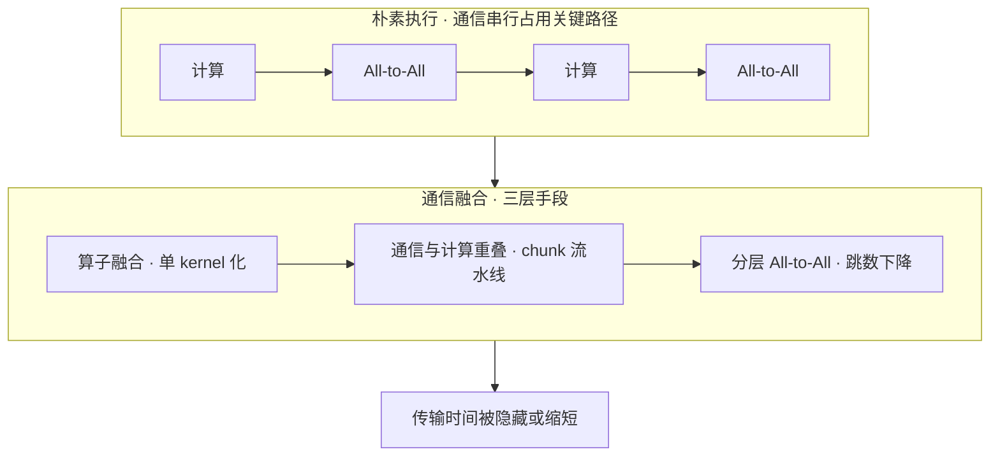
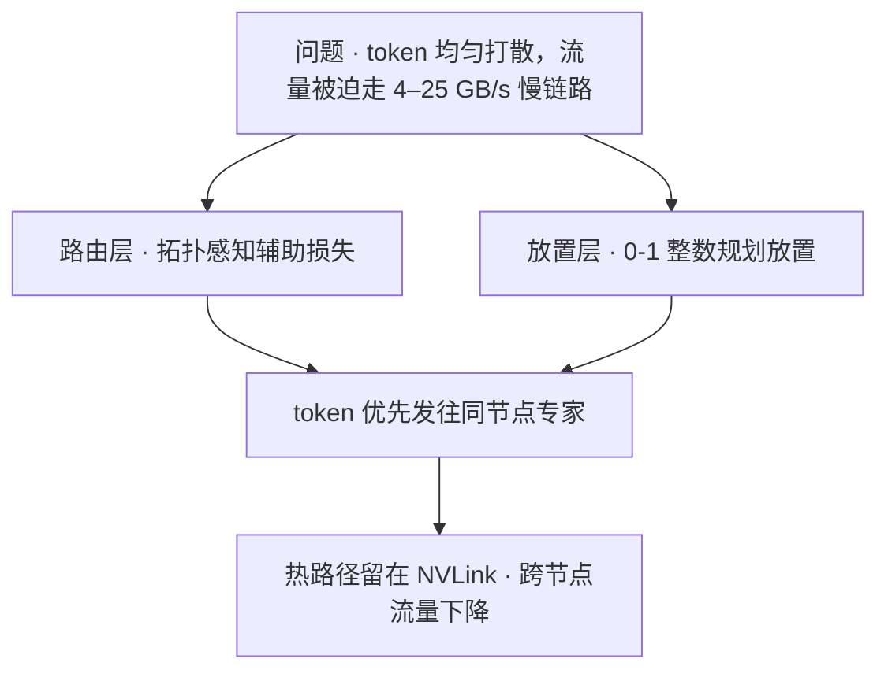

# 大模型原理之 MoE 混合专家模型

## 摘要

混合专家模型在 Transformer 中以“多个并行前馈专家 + 可学习门控路由”替代单一稠密 FFN 层，实现知识容量与单次计算量的解耦：每个 token 仅激活少量专家，模型得以在近恒定算力预算下承载远超同规模稠密模型的参数总量。本文从架构机理、稀疏激活、训练稳定性与系统工程四个维度梳理 MoE 技术体系：形式化门控路由与 Top-K 稀疏激活的数学表达，剖析“赢家通吃”正反馈导致的路由坍缩及主流均衡方案，总结 DeepSeekMoE 细粒度切分与共享专家隔离创新，归纳显存墙、All-to-All 通信与推理负载不均三座大山及应对策略。基于 Mixtral 8×7B 与 DeepSeek-V3 实证数据，论证 MoE 在大规模场景下“容量翻倍、算力打折”的经济学优势，并给出小规模场景下稠密模型仍占优的适用边界。

**关键词**：混合专家模型；稀疏激活；门控路由；负载均衡；细粒度专家；共享专家；专家并行；条件计算

---

## 1 引言

Transformer 模型的 scaling law 表明，参数规模的扩大能持续提升模型能力，但稠密架构的参数量与算力成本呈线性绑定，使超大模型训练不可负担。混合专家模型提供了一条替代路径：将 FFN 层扩展为 $N$ 个并行专家，由可学习路由器为每个 token 选择性地激活其中 $K \ll N$ 个，从而在单 token 算力近恒定的前提下线性扩展总参数。这一“条件计算”思想最早由 Shazeer 等人 [[1]](#ref-1) 于 2017 年系统化，实现了模型容量千倍扩展而计算量仅小幅增加。
从 GShard [[2]](#ref-2) 首次将 MoE 扩展至 600B 级多语言翻译模型，到 Switch Transformer [[3]](#ref-3) 简化路由并首次将稀疏模型推至万亿参数，再到 DeepSeek-V3 [[8]](#ref-8) 以 671B 总参 / 37B 激活的架构用 2.788M H800 GPU 小时完成训练，MoE 已成为前沿大模型的主流选择。然而，稀疏路由引入了三项稠密模型所没有的挑战：路由坍缩、跨卡通信和专家间负载不均。本文围绕这些问题展开系统性梳理。

## 2 基础架构（专家网络与门控路由）

### 2.1 MoE 层的数学形式化

给定输入隐状态 $x \in \mathbb{R}^{d}$，一个包含 $N$ 个专家的 MoE 层可形式化为：
$$
y = \sum_{i=1}^{N} g_i(x) \cdot \mathrm{FFN}_i(x)
$$
其中 $g_i(x)$ 为门控网络输出的标量权重。标准 Top-K 稀疏门控定义为：
$$
g_i(x) = \begin{cases} \dfrac{\exp(s_i)}{\sum_{j \in \mathcal{T}} \exp(s_j)}, & i \in \mathcal{T} = \mathrm{TopK}(\{s_1,\dots,s_N\}, K) \\[4pt] 0, & \text{otherwise} \end{cases}
$$
其中 $s_i = W_g x$ 为路由器 logits。仅 $\mathcal{T}$ 中的 $K$ 个专家被实际计算，其余 $N-K$ 个专家对当前 token 零激活。$K$ 是关键超参：Shazeer 2017 采用 Top-4，GShard 采用 Top-2，Switch Transformer 进一步简化为 Top-1，DeepSeek-V3 采用 Top-8 路由专家 + 1 共享专家。

### 2.2 信号流向

图 1 给出一次 Top-K=2 路由的信号流向：


```
                        输入 token x ∈ R^d
                              │
                              ▼
                  ┌───────────────────────┐
                  │  Router: s = W_g·x    │
                  │  p = softmax(s)       │
                  │  T = TopK(p, K)       │
                  └──────┬────────┬───────┘
              p_1  │              │  p_3
          ┌────────▼───┐  ┌───────▼────┐
          │ Expert 1   │  │ Expert 3   │    E2, E4 … 未选中
          │  FFN(x)    │  │  FFN(x)    │    → 零计算、零激活
          └─────┬──────┘  └──────┬─────┘
                │ p_1·FFN_1(x)   │ p_3·FFN_3(x)
                └────────┬───────┘
                         ▼
              y = p_1·FFN_1(x) + p_3·FFN_3(x)
                         │
                         ▼
                     残差连接输出
```
<p align="center">图 1　MoE 层信号流向</p>

### 2.3 路由范式的谱系

现有路由方案可分为两大范式：
| 范式 | 决策方向 | 代表方法 | 关键性质 |
|---|---|---|---|
| **Token-Choice** | token 挑专家 | Top-K / 加噪 Top-K、ReLU 路由、自适应 K（AdaMoE） | 主流方案；需均衡损失兜底 |
| **Expert-Choice** | 专家挑 token | Zhou et al. 2022 [[5]](#ref-5) | 天然负载均衡；收敛加速约 2× |
| **软分配** | 加权融合所有专家 | Soft MoE [[15]](#ref-15) | 完全可微；无 token 丢弃 |
| **确定性哈希** | hash 决定路由 | Hash Layers [[14]](#ref-14) | 零路由参数；无需均衡损失 |
多任务场景下，MMoE [[10]](#ref-10) 为每个任务设置独立门控、共享同一专家池，通过门控差异建模任务相关性，缓解多任务学习中的负迁移，是推荐系统中的经典变体。ReMoE [[6]](#ref-6) 以 ReLU 函数替代 TopK+Softmax，实现完全可微的路由，配合自适应 $L_1$ 正则控制稀疏性，在多种规模下优于 TopK 路由。

## 3 稀疏激活（容量与算力的解耦）

### 3.1 原理

MoE 的核心价值在于将两个原本绑定的量分离：
$$
\underbrace{|\theta_{\text{total}}| = N \cdot |\theta_e|}_{\text{总参数 → 知识容量}}, \qquad \underbrace{|\theta_{\text{active}}| = K \cdot |\theta_e|}_{\text{激活参数 → 单token算力}}
$$
模型可“记住”的知识量由 $N$ 决定，而单次前向 FLOPs 仅由 $K$ 决定，两者解耦。当 $N/K \gg 1$ 时，MoE 以近恒定算力承载远超稠密模型的参数总量。

### 3.2 代表模型参数对比

| 模型 | 总参数 | 激活参数 | 激活比例 | 路由策略 |
|---|---|---|---|---|
| Mixtral 8×7B [[9]](#ref-9) | 46.7B | 12.9B | ~28% | 8 选 2 |
| DeepSeek-V3 | 671B | 37B | ~5.5% | 256 选 8 + 1 共享 |
| Switch Transformer | 1.6T | 每层 FFN 仅激活 1/2048 | — | 2048 选 1 |
| ST-MoE-32B | 269B | ≈32B 稠密等算力 | — | Top-2 |

### 3.3 容量因子与 token 丢弃

由于路由是动态的，各专家实际收到的 token 数会偏离均衡。为保证张量形状固定，GShard 引入**专家容量**：
$$
C = \left\lfloor \frac{B \cdot S}{N} \cdot \mathrm{CF} \right\rfloor
$$
其中 $B$ 为 batch 大小、$S$ 为序列长度。超出容量 $C$ 的 token 被丢弃（通过残差连接直通）。Switch Transformer 实证推荐 $\mathrm{CF} = 1.0\text{–}1.25$。MegaBlocks [[12]](#ref-12) 通过块稀疏 GPU kernel 彻底取消容量约束与 token 丢弃，端到端训练加速最高 40%。

## 4 训练负载均衡与路由演进

### 4.1 冷热不均的成因

路由器本质上是一个 softmax 分类器，训练早期若某专家对某类 token 有微弱优势，就会获得更多梯度而变强，下一步被选中的概率更高，形成“赢家通吃”正反馈。最终收敛到路由坍缩态：少数专家包揽大部分 token，其余专家长期得不到训练信号，实际容量远小于名义容量。

### 4.2 辅助均衡损失

GShard 与 Switch Transformer 将均衡问题转化为损失正则项。设 $f_i$ 为实际分配到专家 $i$ 的 token 比例，$P_i$ 为路由器分配给专家 $i$ 的平均概率，则：
$$
\mathcal{L}_{\text{aux}} = \alpha \cdot N \sum_{i=1}^{N} f_i \cdot P_i
$$
$f_i$ 不可导，$P_i$ 可导并接受梯度。当分布均匀时 $f_i = P_i = 1/N$，损失达最小值 $1$；分布越倾斜，损失越大。该方法简单有效，但 $\alpha$ 与主任务共享参数，过大会产生“干扰梯度”损害模型质量。

### 4.3 Router z-loss

ST-MoE [[4]](#ref-4) 发现路由 logits 的数值幅度不稳定是训练崩溃的重要根源，提出 z-loss 加以约束：
$$
\mathcal{L}_z = \frac{1}{B} \sum_{b=1}^{B} \left( \log \sum_{j=1}^{N} e^{s_j^{(b)}} \right)^2
$$
该损失惩罚 logits 的整体幅度，防止 softmax 饱和，与均衡损失互补使用。

### 4.4 无辅助损失的专家偏置

DeepSeek-V2 [[16]](#ref-16) 首次提出辅助损失无关的均衡策略，DeepSeek-V3 将其规模化落地。为每个专家维护一个偏置 $b_i$，仅在 Top-K 排序阶段使用，不进入门控权重：
$$
\mathcal{T} = \mathrm{TopK}\big(\{s_1 + b_1, \dots, s_N + b_N\}, K\big), \qquad g_i = \frac{\exp(s_i)}{\sum_{j \in \mathcal{T}} \exp(s_j)}
$$
训练过程中根据专家的近期负载统计动态调节 $b_i$：超载专家的 $b_i$ 下调，闲置专家的 $b_i$ 上调。由于 $b_i$ 不参与加权，主任务的梯度流完全不受干扰，实现了均衡与模型质量的兼得。

### 4.5 细粒度切分与共享专家隔离

传统 MoE 使用少量大专家，每个专家需处理多样化的知识类型，专业化受限。DeepSeekMoE [[7]](#ref-7) 提出两项策略：
**（1）细粒度专家切分**：将 $N$ 个大专家拆为 $mN$ 个小专家，激活数从 $K$ 增至 $mK$。以 $N=4, K=2$ 为例，传统 Top-2 组合数为 $\binom{4}{2}=6$，而切分后为 $\binom{8}{3}=56$，组合自由度指数级提升，路由可更精准地组合知识。
**（2）共享专家隔离**：设置 $K_s$ 个对所有 token 都激活的共享专家，承接通用共性知识；其余 $K_r$ 个路由专家通过门控选择性激活。该设计避免路由专家重复学习共性知识，专业化程度更高：
$$
h'_t = \sum_{i=0}^{K_s - 1} \mathrm{FFN}_{s_i}(h_t) + \sum_{i=1}^{K_r} g_{i,t} \cdot \mathrm{FFN}_i(h_t)
$$
实验表明，DeepSeekMoE 16B 仅用约 40% 的计算量即达到 DeepSeek 7B 稠密模型的水平，并超过参数量约 2.5 倍的 LLaMA2 7B。

### 4.6 均衡方法对比

| 方法 | 机制 | 优点 | 局限 |
|---|---|---|---|
| 辅助均衡损失 | 附加正则项 $\alpha \cdot N \sum f_i P_i$ | 简单、成熟 | 干扰主任务梯度 |
| Router z-loss | 惩罚 logits 幅度 | 稳定训练 | 不直接解决均衡 |
| 专家偏置 | 偏置仅用于 Top-K 排序 | 无梯度干扰 | 偏置更新节奏需调 |
| Expert-Choice | 专家挑 token | 天然均衡，收敛 2× | token 处理数不定 |
| ReLU 路由 | 完全可微替代 TopK | 动态分配、可扩展 | 需 $L_1$ 正则 |
| Soft MoE | 软加权组合所有 token | 无丢弃、完全可微 | 大语言场景需适配 |
| Hash Layers | 哈希确定性路由 | 零路由参数 | 无语义自适应 |

## 5 工程挑战

### 5.1 显存墙

MoE 需将**全部**专家参数驻留显存，即便推理时大多数参数闲置。应对策略有三：**专家并行**（Expert Parallelism，EP）按专家维度切分到多卡；**极致量化**通过 QMoE [[13]](#ref-13) 将 1.6T SwitchTransformer-c2048 压缩至 160GB 以下（0.8 bit/参数，20× 压缩，开销 <5%），首次实现单台 4×A6000 服务器部署万亿参数模型；**稀疏升级 Sparse Upcycling** [[11]](#ref-11) 从稠密 checkpoint 复制 FFN 为专家初始化 MoE，复用约 50% 的沉没训练成本，优于同算力从零训练。

### 5.2 通信开销

专家并行下，token 需跨卡路由到承载其专家的 GPU，引入 **All-to-All 通信**：每个 rank 同时向所有 rank 发送与接收数据，形成 dispatch 与 combine 两轮数据交换，构成 MoE 层的关键路径。NVIDIA Megatron-Core 官方文档指出，未加优化时仅专家并行的 All-to-All 就可占到训练时间的 30%–40% [[18]](#ref-18)。当专家数与 $K$ 较大、专家跨多节点部署时，通信带宽成为瓶颈。三条正交的优化路线分别是：**量化压缩减少传输量**、**通信融合隐藏传输时间**、**拓扑感知调度缩短传输距离**。

**（1）通信融合：把传输藏进计算里。** 包含三层。**算子融合**——门控的 mask、Top-K、cumsum 与稀疏矩阵乘原本是几十次零散 kernel 启动，DeepSpeed-MoE 将其并为单 kernel，并用稠密 token→专家映射表替代稀疏张量，削减启动次数与显存开销 [[19]](#ref-19)。**通信与计算重叠**——把 dispatch/combine 切成细粒度 chunk 流水线，使跨卡传输与 attention、FFN 计算并行推进；MegaScale-MoE 在算子内、算子间两个层级做重叠，1440 张 Hopper GPU 训练 352B MoE 达 1.41M tokens/s，较 Megatron-LM 提速 1.88× [[20]](#ref-20)。**分层 All-to-All**——先节点内、再节点间交换，跳数由 $O(p)$ 降至 $O(G + p/G)$（$p$ 为总卡数、$G$ 为单节点卡数）；通信量虽约翻倍，但小 batch 下通信是延迟受限而非带宽受限，净效果更快。同工作还借张量并行的数据复制，把 All-to-All 限制在共享同一张量并行 rank 的设备子集内，延迟由 $O(p)$ 降至 $O(p/L)$（$L$ 为张量并行度）[[19]](#ref-19)。图 2 归纳如下。


<p align="center">图 2　通信融合的三层手段</p>

**（2）量化压缩：让每个 token 传得更省。** All-to-All 传的是激活而非权重，BF16 下每维 2 字节，改用 FP8 传输即减半，且不动模型结构与路由逻辑。MegaScale-MoE 据此以 FP8 All-to-All 替换正向的 BF16 reduce-scatter、以 FP8 all-gather 替换反向，归约仍在 FP32 进行；BF16 混合精度下再把跨节点参数同步由 FP32 降到 BF16，同步开销减半 [[20]](#ref-20)。代价是量化误差，需合适的 scale 策略与 FP32 归约保证收敛稳定。

**（3）拓扑感知调度：让热路径留在快链路上。** 节点内 NVLink 远快于节点间网络，TA-MoE 实测后者仅 4–25 GB/s 且波动明显 [[21]](#ref-21)；朴素 All-to-All 却把 token 均匀打散，大量流量被迫走慢链路。优化分两层：**路由层**让 token 优先发往同节点专家——TA-MoE 以拓扑感知辅助损失实现该偏置且不损精度，较 DeepSpeed-MoE 提速 1.01–1.61×、较 FastMoE 提速 1.01–4.77× [[21]](#ref-21)；**放置层**决定专家常驻哪张卡——Sivtsov 等将其建模为 0-1 整数规划，兼顾专家负载统计与网络跳数以最小化 token 期望传输次数，在 DeepSeekMoE 16B 与 DeepSeek-R1 671B 上流量均低于各对比基线 [[22]](#ref-22)。三类手段彼此正交、可叠加使用，图 3 归纳如下。


<p align="center">图 3　拓扑感知调度的两层手段</p>

### 5.3 负载不均与推理部署

训练期的均衡手段无法保证推理期同样均衡——线上输入分布与训练分布存在偏差。主流方案是**冗余专家**：根据线上负载统计复制热门专家，并启发式重排到各 GPU（DeepSeek 开源的 EPLB [[17]](#ref-17) 即为此类实现）。此外，MoE 单 batch 时专家访问分散，需大 batch 才能吃满算力；批处理调度、专家缓存与 CPU-GPU 协同 offloading 是常见部署优化。

推理侧另有两类易被忽略的开销。其一是**静态 Top-K 门控的占位与掩码代价**：门控需为每个 token 固定激活 $K$ 个专家，并生成 mask、排序与占位张量，属于稀疏路由固有的额外开销；Huang 等人针对 MoE 部署低效提出的 Dynamic Gating，将语言建模推理的最大吞吐提升 6.21–11.23×、内存使用最高降低 1.36× [[23]](#ref-23)。其二是**动态形状**：每个专家实际收到的 token 数随输入变化，专家 GEMM 的 shape 逐 step 改变，使 kernel 难以复用、CUDA Graph 难以捕获回放，只能退化为逐次启动的动态执行路径【推导】。

## 6 与稠密模型的对比

| 维度 | 稠密模型 | MoE 模型 |
|---|---|---|
| 激活参数 | 全量激活 | 仅 Top-K（~5%–30%） |
| 知识容量 | = 激活量，受算力限制 | 可远超算力预算 |
| 单 token FLOPs | 与总参数成正比 | 与激活参数成正比 |
| 训练难度 | 低，稳定 | 高（均衡/坍缩/调参） |
| 显存需求 | 一份参数 | 全部专家驻留 |
| 推理效率 | 单 batch 利用率高 | 需大 batch + 专家调度 |
| 规模收益 | 成本线性上升 | 规模越大越划算 |

**规模越大，MoE 的“容量/算力比”优势越显著**，数 B 以内的小规模场景，稠密模型在稳定性与部署简易性上仍占优。

## 7 发展时间线

图 4 给出 MoE 关键节点的演进时间线：

```
 2017 ───── 2020 ──── 2021 ──────── 2022 ────────── 2024 ─────────────── 2025+
  │          │         │             │               │                    │
  Shazeer    GShard    Switch        ST-MoE          Mixtral              无辅助损失主流化
  稀疏门控   600B 级   Transformer   z-loss          8×7B 开源            QMoE 极致压缩
  奠基       Top-2     1.6T Top-1    Expert-Choice   DeepSeek-V2          细粒度+共享
                       简化路由      Upcycling       首提无辅助损失均衡   广泛落地
                       +辅助损失                     V3 671B 规模化
```
<p align="center">图 4　MoE 发展时间线</p>

## 总结

MoE 的本质是用“多个并行专家模型 + Top-K 稀疏门控路由”把算力瓶颈转化为算法与工程问题：容量靠专家堆、算力靠 Top-K 省、均衡靠辅助损失或专家偏置调、部署靠量化、通信融合与冗余专家兜底。在数十 B 参数以上、追求“容量翻倍、算力打折”的场景下，MoE 已成为事实标准；而在小规模、强调部署简洁与训练稳定性的场景，稠密模型仍是务实之选。当前研究沿“完全可微路由”“无辅助损失均衡”“极致压缩与端侧部署”三条主线持续演进。

## 参考文献

<a id="ref-1"></a>[1] N. Shazeer et al. ["Outrageously Large Neural Networks: The Sparsely-Gated Mixture-of-Experts Layer."](https://arxiv.org/abs/1701.06538) *ICLR*, 2017.  
<a id="ref-2"></a>[2] D. Lepikhin et al. ["GShard: Scaling Giant Models with Conditional Computation and Automatic Sharding."](https://arxiv.org/abs/2006.16668) *ICLR*, 2021.  
<a id="ref-3"></a>[3] W. Fedus, B. Zoph, N. Shazeer. ["Switch Transformers: Scaling to Trillion Parameter Models with Simple and Efficient Sparsity."](https://arxiv.org/abs/2101.03961) *JMLR*, 2022.  
<a id="ref-4"></a>[4] B. Zoph et al. ["ST-MoE: Designing Stable and Transferable Sparse Expert Models."](https://arxiv.org/abs/2202.08906) *arXiv*, 2022.  
<a id="ref-5"></a>[5] Y. Zhou et al. ["Mixture-of-Experts with Expert Choice Routing."](https://arxiv.org/abs/2202.09368) *NeurIPS*, 2022.  
<a id="ref-6"></a>[6] Z. Wang et al. ["ReMoE: Fully Differentiable Mixture-of-Experts with ReLU Routing."](https://arxiv.org/abs/2412.14711) *ICLR*, 2025.  
<a id="ref-7"></a>[7] D. Dai et al. ["DeepSeekMoE: Towards Ultimate Expert Specialization in Mixture-of-Experts Language Models."](https://arxiv.org/abs/2401.06066) *ACL*, 2024.  
<a id="ref-8"></a>[8] DeepSeek-AI. ["DeepSeek-V3 Technical Report."](https://arxiv.org/abs/2412.19437) *arXiv*, 2024.  
<a id="ref-9"></a>[9] A. Q. Jiang et al. ["Mixtral of Experts."](https://arxiv.org/abs/2401.04088) *arXiv*, 2024.  
<a id="ref-10"></a>[10] J. Ma et al. ["Modeling Task Relationships in Multi-task Learning with Multi-gate Mixture-of-Experts."](https://doi.org/10.1145/3219819.3220007) *KDD*, 2018.  
<a id="ref-11"></a>[11] A. Komatsuzaki et al. ["Sparse Upcycling: Training Mixture-of-Experts from Dense Checkpoints."](https://arxiv.org/abs/2212.05055) *NeurIPS*, 2022.  
<a id="ref-12"></a>[12] T. Gale et al. ["MegaBlocks: Efficient Sparse Training with Mixture-of-Experts."](https://arxiv.org/abs/2211.15841) *arXiv*, 2022.  
<a id="ref-13"></a>[13] E. Frantar, D. Alistarh. ["QMoE: Practical Sub-1-Bit Compression of Trillion-Parameter Models."](https://arxiv.org/abs/2310.16795) *arXiv*, 2023.  
<a id="ref-14"></a>[14] S. Roller et al. ["Hash Layers For Large Sparse Models."](https://arxiv.org/abs/2106.04426) *NeurIPS*, 2021.  
<a id="ref-15"></a>[15] J. Puigcerver et al. ["From Sparse to Soft Mixtures of Experts."](https://arxiv.org/abs/2308.00951) *ICLR*, 2024.  
<a id="ref-16"></a>[16] DeepSeek-AI. ["DeepSeek-V2: A Strong, Economical, and Efficient Mixture-of-Experts Language Model."](https://arxiv.org/abs/2405.04434) *arXiv*, 2024.  
<a id="ref-17"></a>[17] DeepSeek-AI. ["EPLB: Expert Parallelism Load Balancer."](https://github.com/deepseek-ai/EPLB) *GitHub*, 2025.  
<a id="ref-18"></a>[18] NVIDIA. ["Mixture of Experts — Megatron Core Developer Guide."](https://docs.nvidia.com/megatron-core/developer-guide/latest/user-guide/features/moe.html) *NVIDIA 官方文档*, 2025.  
<a id="ref-19"></a>[19] S. Rajbhandari et al. ["DeepSpeed-MoE: Advancing Mixture-of-Experts Inference and Training to Power Next-Generation AI Scale."](https://arxiv.org/abs/2201.05596) *ICML*, 2022.  
<a id="ref-20"></a>[20] C. Jin et al. ["MegaScale-MoE: Large-Scale Communication-Efficient Training of Mixture-of-Experts Models in Production."](https://arxiv.org/abs/2505.11432) *arXiv*, 2025.  
<a id="ref-21"></a>[21] C. Chen et al. ["TA-MoE: Topology-Aware Large Scale Mixture-of-Expert Training."](https://arxiv.org/abs/2302.09915) *NeurIPS*, 2022.  
<a id="ref-22"></a>[22] D. Sivtsov, A. Katrutsa, I. Oseledets. ["Cluster Topology-Driven Placement of Experts Reduces Network Traffic in MoE Inference."](https://arxiv.org/abs/2508.09229) *arXiv*, 2025.  
<a id="ref-23"></a>[23] H. Huang et al. ["Towards MoE Deployment: Mitigating Inefficiencies in Mixture-of-Expert (MoE) Inference."](https://arxiv.org/abs/2303.06182) *arXiv*, 2023.  

---
