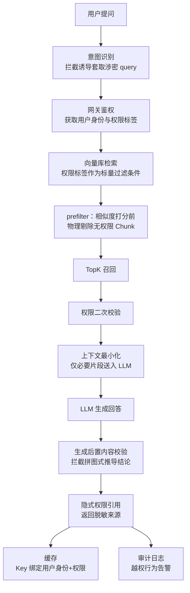
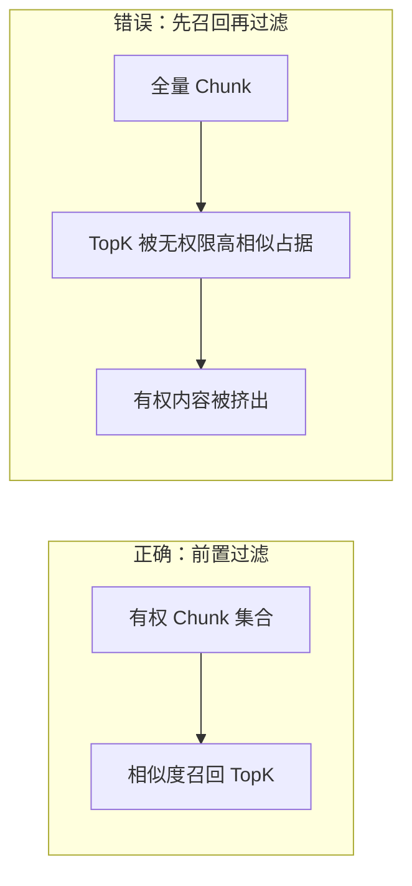

# RAG 权限隔离：三道闸门与全链路管控

## 摘要

企业知识库 RAG 系统中，权限隔离是防止敏感信息泄露的关键环节。本文融合"三道闸门"威胁模型与"全链路管控"工程实践，提出完整的 RAG 权限隔离方案。威胁模型覆盖三类攻击面：明文文档泄露（看不见）、拼图式推导泄密（说不出）、权限标签侧信道泄露（标签不显）。工程实践在文档入库、检索前置过滤、上下文最小化、生成后置校验、缓存隔离、审计监控等层面实施确定性管控，将权限拦截从模型层下沉至数据层，消除对大模型自律性的依赖。同时探讨了向量库 metadata 过滤能力差异及降级策略，为企业 RAG 系统的安全落地提供参考。

**关键词**：RAG；权限隔离；向量数据库；元数据过滤；数据层安全；威胁模型

## 一、问题背景

### 1.1 权限问题是一条链路，不是单点

企业 RAG 系统中，不同用户和角色能够访问的文档范围各不相同。权限问题绝非"多返回了一篇文档"这么简单，而是贯穿整条链路：

- **入库**：存在切片粒度与权限元数据绑定问题
- **检索**：存在权限过滤时机与策略问题
- **生成**：存在模型推理拼接与输出泄露问题
- **运维**：存在人员调岗权限同步、监控与降级问题

只盯住某一个点无法解决问题，必须以链路视角审视全流程，才能构建完整防御体系。

### 1.2 Prompt 限制为何不足

最常见的错误做法是在 Prompt 中声明"你只能回答该用户有权限看到的内容"。此方式存在三个致命缺陷：

1. **提示词注入**：恶意输入可覆盖 Prompt 中的约束指令
2. **幻觉效应**：模型可能无视约束直接输出敏感内容
3. **暴露面失控**：敏感 Chunk 一旦被召回进入上下文，数据便已暴露至大模型——风险在召回阶段即已产生，与模型是否遵守 Prompt 无关

**核心原则**：权限拦截应置于数据层，而非依赖大模型 Prompt 约束。大模型本质上是概率模型，将安全机制托付于模型自律，不可靠。真正安全的 RAG 权限隔离须前置至数据流，实施确定性管控。

## 二、威胁模型：三类泄密路径

构建防御体系前，须先明确攻击面。RAG 权限泄露可归纳为三类路径，后续章节的三道防线与之一一对应：

| 闸门 | 防御目标 | 攻击面 | 核心机制 |
|------|----------|--------|----------|
| 第一道：看不见 | 明文文档泄露 | 无权用户直接获取敏感文档内容 | 检索前置过滤（prefilter） |
| 第二道：说不出 | 拼图式推导泄密 | A、B 段单独合规，拼接后推导机密结论 | 生成后置校验（脱敏/截断/拒答） |
| 第三道：标签不显 | 权限标签侧信道泄露 | 明文密级标签本身暴露敏感信息存在性 | 隐式权限向量（不存储/返回明文标签） |

### 2.1 明文泄露

无权限的 Chunk 被召回，以原文片段形式进入模型上下文并出现在回答中。这是最直接、最高频的泄露路径。

**对策** → 第四章：检索前置过滤，让用户"看不见"。

### 2.2 拼图式推导泄密

A、B 两段内容单独看均合规（各自权限校验都通过），但拼接在一起就能推导出机密结论。例如多份公开周报的措辞变化拼起来可推导出高管人事变动机密。逐段核对权限标签对这类攻击无效。

**对策** → 第五章：生成后置内容校验，让模型"说不出"。

### 2.3 权限标签侧信道泄露

许多系统将明文权限标签、密级标签随 Chunk 存入向量库，并在返回引用来源时一并展示。用户即使看不到正文，仅凭标签、密级、文档归属也能猜出敏感信息——例如看到某文档密级为"高管级"，即使内容不可见，也能推断该事件存在。

**对策** → 第六章：隐式权限引用，让"标签不显"。

### 2.4 诱导提问攻击

用户通过提示注入、套话诱导模型拼接信息。系统增加意图识别模块，识别套取涉密信息的提问，直接拦截高危 query，减少模型被诱导推理泄密。

## 三、全链路防御架构总览

三道防线覆盖数据流各阶段，如图 1 所示。



<p align="center">图 1 全链路权限隔离架构流程图</p>

- 第一道防线（第四章）：检索前置过滤，解决"看不见"
- 第二道防线（第五章）：生成后置校验，解决"说不出"
- 第三道防线（第六章）：隐式权限引用，解决"标签不显"

三道闸门叠加配套工程机制（第七章），构成完整防御体系。

## 四、第一道防线：检索前置过滤——"看不见"

> 本章包含第一道闸门的支撑机制（4.1 文档入库）与核心机制（4.2 前置过滤）。

### 4.1 文档入库：权限元数据绑定与切片规范

**目标**：确保每个 Chunk 均携带权限信息，检索时不丢失。

文档上传时绑定权限标签，包括租户 ID、部门 ID、角色列表、用户白名单、文档密级。切片时每个 Chunk 继承原文档权限，向量与 metadata 一并存入向量数据库。

**切片粒度硬性规范**：同一文档内若有不同密级段落，禁止混在同一个 Chunk——一个切片内部权限、密级必须统一，否则切片继承权限时直接失效。这是入库阶段的硬性规范。

```python
doc_metadata = {
    "tenant_id": "t_123",
    "dept_id": "dept_hr",
    "roles": ["hr_manager", "hr_staff"],
    "whitelist": ["user_001"],
    "classification": "internal"
}

for chunk in split_document(document):
    vector = encoding_model.encode(chunk.text)
    vector_db.insert(
        vector=vector,
        metadata={**doc_metadata, "chunk_id": chunk.id, "doc_id": doc.id}
    )
```

### 4.2 prefilter：过滤须发生在相似度打分之前

**目标**：在向量引擎层执行权限过滤，仅召回用户有权访问的 Chunk。

用户提问后，系统第一件事不是直奔向量库，而是先问权限中心：这个人此刻能看什么？将其角色、所在项目、临时授权实时拉出，拼成一组过滤条件，再携带条件执行检索。

此过程可类比公司门禁：不是先放你进大门再一间间查你能不能进，而是你刷卡那一刻，系统就知道你能去哪几层，电梯只给你亮那几层。

**关键工程细节**：过滤必须发生在相似度打分之前（prefilter 前置过滤）——检索算分之前，先把无权限的切片从候选空间里物理剔除，让模型根本看不到它。与之相对的是 postfilter（后置过滤）：先检索、再在应用层筛。

不推荐 postfilter 的原因有二：

- **安全上**：敏感内容一旦进入候选结果甚至模型上下文，就可能被模型总结润色后「说出来」，硬边界必须建在检索层
- **性能上**：高相似度的无权限文档会占据 TopK 名额，导致有权限内容被挤出召回列表，造成检索漏斗坍塌（图 2）



<p align="center">图 2 检索漏斗坍塌对比图</p>

```python
user = authenticate(request)
user_perms = permission_center.get_roles(user.id)

results = vector_db.search(
    query_vector=encoding_model.encode(query),
    filter={
        "tenant_id": user.tenant_id,
        "dept_id": {"$in": user.dept_ids},
        "roles": {"$in": user_perms}
    },
    limit=top_k
)
```

### 4.3 性能基准：prefilter vs postfilter

在同一查询集上对比两种模式的三项指标：

| 指标 | pre-filter | post-filter |
|------|-----------|-------------|
| P99 延迟增加 | <10% | 较低 |
| 召回率@K | 无明显损失 | 下降 15%-30%（漏斗坍塌） |
| 过滤开销占比 | 引擎层承担 | 业务层承担 |

结论：prefilter 以可接受的延迟代价换取召回率与安全性双重保障，是主防线的不二选择。

## 五、第二道防线：生成后置内容校验——"说不出"

> 本章包含第二道闸门的支撑机制（5.1 上下文最小化）与核心机制（5.3 后置校验）。

### 5.1 上下文最小化与二次校验

**目标**：缩减敏感数据暴露面，为后置校验提供干净输入。

召回后执行二次权限校验作为兜底，仅将回答所需的必要片段送入 LLM 上下文，而非将完整文档全部塞入：

```python
authorized_chunks = [c for c in results if check_permission(c, user)]
context = build_context(authorized_chunks, max_tokens=2000)
```

### 5.2 直接泄露与间接推理的风险区分

两种风险须区别对待：

- **直接泄露**：无权限原文片段被召回，prefilter 在打分前物理剔除即可拦截
- **间接推理泄露**：拼图式推导出的涉密结论——即使前置过滤再严也无法防御，必须依靠后置校验

后置校验不是替换第一道闸门，而是兜底防线。

### 5.3 后置校验模块设计

模型将答案敲定、准备开口之前，由一道独立关卡执行校验：

1. 解析模型准备输出的整段文本
2. 逐句评估信息密度，判断当前用户能否获取该推导结论
3. 处置：一旦识别出越权推导内容，直接执行脱敏、截断或拒答

```python
def post_check(answer_text, user):
    verdict = info_density_evaluator.evaluate(
        text=answer_text,
        user_perms=user_perms
    )
    if verdict.leak_detected:
        return sanitize_or_refuse(answer_text, verdict)
    return answer_text
```

与 5.1 的二次权限校验互补：二次校验核对召回 Chunk 的标签归属（属性级），后置校验评估输出文本的信息组合风险（内容级）。

## 六、第三道防线：隐式权限引用——"标签不显"

### 6.1 明文标签的侧信道风险

将明文权限标签、密级标签随 Chunk 存入向量库并在引用来源中展示，存在侧信道泄露：正文不可见，但"高管级"三个字本身即泄露事件的存在性与敏感等级。标签即线索。

### 6.2 隐式权限向量方案

第三道闸门的思路是权限不使用明文标签：

- 将权限、密级、角色编码为隐式权限向量，嵌入到切片向量内部
- 全程不存储、不返回明文权限标签
- 权限校验依靠隐式向量匹配完成

```python
implicit_perm_vec = perm_encoder.encode(
    roles=["hr_manager"], classification="confidential"
)
vector_db.insert(
    vector=merge(content_vec, implicit_perm_vec),
    metadata={"tenant_id": "t_123"}
)
```

### 6.3 对外引用脱敏

对外引用只返回脱敏后的来源（如"内部文档 #1024"），不暴露密级、角色等权限元信息，防止从标签本身泄露线索。此步骤对应图 1 中的 H2 节点。

## 七、配套工程机制

### 7.1 分层权限模型

系统采用三层权限粒度：

| 层级 | 粒度 | 适用场景 | 实现策略 |
|------|------|----------|----------|
| 租户隔离 | tenant_id | SaaS 多客户 | 元数据过滤 + 命名空间双重隔离 |
| 角色/部门 | dept_id + roles | 企业内部 | 按角色/部门过滤可见文档 |
| 用户白名单 | user_id | 机密文档 | 仅指定个人/项目组可读 |

<p align="center">表 1 分层权限模型</p>

### 7.2 缓存隔离

**目标**：防止跨用户缓存泄露。缓存 Key 须绑定用户身份和权限标签，用户 A 的缓存结果不可直接返回给用户 B：

```python
cache_key = f"rag:answer:{user.id}:{','.join(user.roles)}:{hash(query)}"
cached = cache.get(cache_key)
if cached:
    return cached

response = generate_answer(results)
cache.set(cache_key, response, ttl=3600)
return response
```

### 7.3 动态权限同步

**目标**：人员调岗、项目退出、临时授权过期、文档密级调整后，检索过滤条件及时同步。

采用事件驱动架构：权限中心发布变更事件，消费者订阅后批量更新向量库中受影响 Chunk 的 metadata，并失效相关缓存。关键要求：不需要重新 Embedding、重刷向量，做到秒级生效，关闭权限变更窗口期。

```python
@on_event("permission.changed")
def handle_permission_change(event):
    vector_db.update_metadata(
        filter={"doc_id": event.doc_id},
        update={"roles": event.new_roles, "classification": event.new_level}
    )
    cache.delete_pattern(f"rag:answer:*:{event.doc_id}:*")
```

### 7.4 审计与越权监控

**目标**：实现事后溯源和实时告警。

全链路日志记录：用户 ID、query、召回的切片、权限过滤条件、模型输出、后置校验拦截记录。对高危查询、多次触发后置拒答的账号触发告警：

```python
audit_log.info({
    "user_id": user.id,
    "query": query,
    "retrieved_chunks": [c.id for c in results],
    "filter_conditions": user_perms,
    "post_check_blocks": blocked_count,
    "response": response_text,
    "timestamp": now()
})
```

### 7.5 诱导提问防御

用户可能通过提示注入、套话诱导模型拼接信息。系统增加意图识别模块，识别套取涉密信息的提问，直接拦截高危 query，在入口处减少模型被诱导推理泄密的概率（对应图 1 中的 A0 节点）。

## 八、向量库选型与降级方案

### 8.1 主流向量库 metadata 过滤能力

不同向量库对 metadata 过滤的支持程度存在差异：

- **原生支持**：Pinecone、Qdrant、Weaviate、Milvus、ChromaDB、pgvector、LanceDB 均提供 metadata 标量过滤参数，多数支持 pre/post filter 策略
- **原生不支持**：FAISS 无 metadata 概念，须自行维护 id 到 metadata 的映射进行事后过滤，或对 id 子集执行范围检索
- **性能语义**：需区分 filter 是否与 ANN 索引一体化（如 Qdrant 的 filtered HNSW），或先暴力过滤再暴力扫描（post-filter 会导致召回损失）

### 8.2 FAISS 降级方案

对于不具备原生 metadata 过滤能力的向量库（如 FAISS），可采用的降级策略：业务层预先拉取该用户全部有权文档 ID 集合，构建文档白名单，检索时限定 doc_id 范围。局限：有权文档数量庞大时性能显著下降。

## 九、段落/字段级权限细化

**目标**：同一文档内不同段落或字段设置差异化权限。

在 Chunk 级权限基础上，元数据 schema 增加 `section_id` 和 `field_name` 维度。入库时按段落/字段独立标注权限，检索时过滤条件更细粒度。

```python
chunk_metadata = {
    "doc_id": "doc_123",
    "section_id": "sec_4",
    "field_name": "salary",
    "tenant_id": "t_123",
    "dept_id": "dept_hr",
    "roles": ["hr_manager"],
    "classification": "confidential"
}
```

典型场景：员工档案中基本信息全员可见，薪资字段仅 HR 可见；合同文档中甲方法务条款仅甲方可见。代价是元数据膨胀和过滤复杂度上升。

## 十、结论

RAG 权限隔离的核心原则是将权限拦截置于数据层，而非依赖大模型 Prompt 约束。三道闸门合起来构成完整防御体系：

- 检索前置 prefilter——让用户看不见无权切片
- 生成后置内容校验——拦截拼图式推导，让模型说不出涉密结论
- 隐式权限向量——去掉明文权限标签，做到标签不显

再搭配入库切片规范、动态权限同步、缓存隔离、审计告警、诱导意图识别等配套运维机制，即可实现全链路 RAG 权限防护。

**一句话总结**：前置检索过滤挡住明文文档，后置校验挡住拼接推理泄密，隐式权限向量防止权限标签本身泄密，三层闸门叠加配套运维机制，实现全链路 RAG 权限防护。

## 参考文献

[1] 小哲讲面经. "京东二面：RAG知识库怎么做权限隔离." 抖音视频. https://www.douyin.com/video/7667140069655973172

[2] 企业级 RAG 三道权限闸门. 抖音视频. https://v.douyin.com/VMvMjU1WK4Q/
