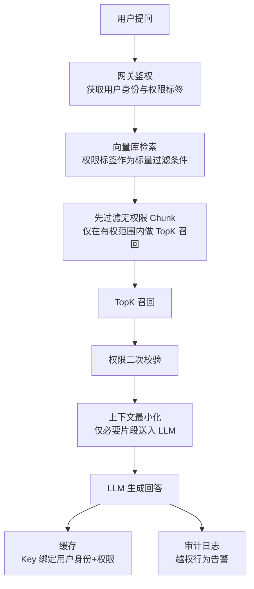
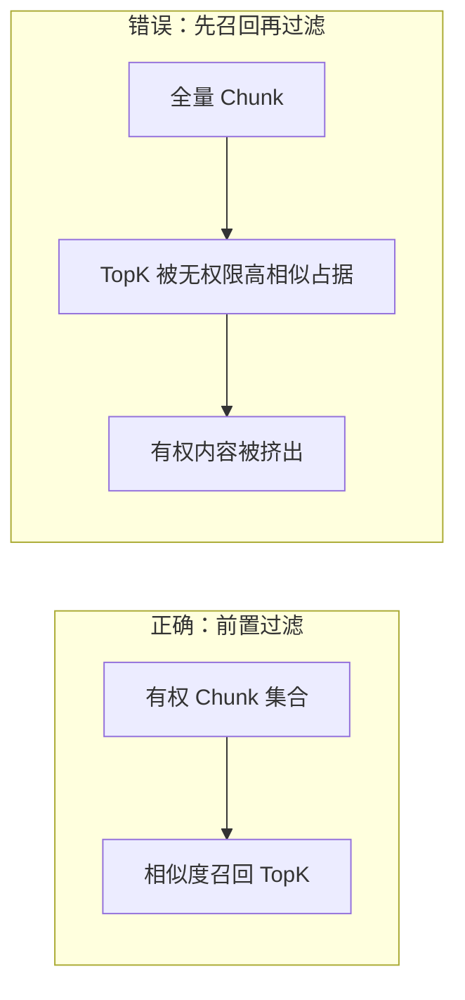

# RAG 知识库权限隔离全链路设计

## 摘要

企业知识库 RAG 系统中，权限隔离是防止敏感信息泄露的关键环节。本文针对"仅依赖 Prompt 限制权限"这一常见误区，提出基于数据流的全链路权限隔离方案。该方案在文档入库、检索前置过滤、上下文最小化、缓存隔离、审计监控五个层面实施确定性管控，将权限拦截从模型层下沉至数据层，消除对大模型自律性的依赖。同时探讨了向量库 metadata 过滤能力差异及降级策略，为企业 RAG 系统的安全落地提供参考。

**关键词**：RAG；权限隔离；向量数据库；元数据过滤；数据层安全

## 一、问题背景

企业知识库 RAG 系统中，不同用户和角色能够访问的文档范围各不相同。若权限隔离机制不完善，敏感文档将经由检索召回进入 LLM 上下文，导致信息泄露。因此，如何在 RAG 流程中实现可靠的权限隔离，是系统设计的核心安全问题。

## 二、核心原则

**权限拦截应置于数据层，而非依赖大模型 Prompt 约束。**

大模型本质上是概率模型，存在提示词注入和幻觉等风险。将安全机制托付于模型自律，相当于以概率骰子充当守卫。真正安全的 RAG 权限隔离须前置至数据流，在入库、检索、上下文、缓存、审计五个层面实施确定性管控。

## 三、Prompt 限制为何不足

最常见的错误做法是在 Prompt 中声明"你只能回答该用户有权限看到的内容"。此方式存在三个致命缺陷：

1. **提示词注入**：恶意输入可覆盖 Prompt 中的约束指令
2. **幻觉效应**：模型可能无视约束直接输出敏感内容
3. **暴露面失控**：敏感 Chunk 一旦被召回进入上下文，数据便已暴露至大模型——风险在召回阶段即已产生，与模型是否遵守 Prompt 无关

## 四、全链路权限隔离架构

全链路权限隔离覆盖数据流各阶段，如图 1 所示。



<p align="center">图 1 全链路权限隔离架构流程图</p>

### 4.1 文档入库，权限元数据绑定

**目标**：确保每个 Chunk 均携带权限信息，检索时不丢失。

文档上传时绑定权限标签，包括租户 ID、部门 ID、角色列表、用户白名单、文档密级。切片时每个 Chunk 继承原文档权限，向量与 metadata 一并存入向量数据库。

需特别注意的是，若仅在文档层存储权限而 Chunk 未携带权限信息，检索召回的切片将丢失权限属性，导致越权访问。文档入库权限元数据绑定示例如下：

```python
doc_metadata = {
    "tenant_id": "t_123",
    "dept_id": "dept_hr",
    "roles": ["hr_manager", "hr_staff"],
    "whitelist": ["user_001"],
    "classification": "internal"
}

for chunk in split_document(document):
    vector = encoding_model.encode(chunk.text)
    vector_db.insert(
        vector=vector,
        metadata={**doc_metadata, "chunk_id": chunk.id, "doc_id": doc.id}
    )
```

### 4.2 检索前置过滤（核心）

**目标**：在向量引擎层执行权限过滤，仅召回用户有权访问的 Chunk。

检索流程如下：

1. 网关鉴权，获取用户身份及权限标签
2. 检索请求携带权限标签作为标量过滤条件
3. 向量库先过滤无权限 Chunk，仅在有权范围内执行相似度计算和 TopK 召回

过滤逻辑须下推至向量引擎层，而非召回全部后在业务代码中循环过滤。若采用后者，高相似度的无权限文档将占据 TopK 名额，导致有权限内容被挤出召回列表，造成检索漏斗坍塌，如图 2 所示。



<p align="center">图 2 检索漏斗坍塌对比图</p>

检索前置过滤示例如下：

```python
user = authenticate(request)
user_perms = permission_center.get_roles(user.id)

results = vector_db.search(
    query_vector=encoding_model.encode(query),
    filter={
        "tenant_id": user.tenant_id,
        "dept_id": {"$in": user.dept_ids},
        "roles": {"$in": user_perms}
    },
    limit=top_k
)
```

### 4.3 上下文最小化

**目标**：缩减敏感数据暴露面。

召回后执行二次权限校验作为兜底，仅将回答所需的必要片段送入 LLM 上下文，而非将完整文档全部塞入。上下文最小化示例如下：

```python
authorized_chunks = [c for c in results if check_permission(c, user)]
context = build_context(authorized_chunks, max_tokens=2000)
```

### 4.4 缓存隔离

**目标**：防止跨用户缓存泄露。

缓存 Key 须绑定用户身份和权限标签。用户 A 的缓存结果不可直接返回给用户 B。缓存隔离示例如下：

```python
cache_key = f"rag:answer:{user.id}:{','.join(user.roles)}:{hash(query)}"
cached = cache.get(cache_key)
if cached:
    return cached

response = generate_answer(results)
cache.set(cache_key, response, ttl=3600)
return response
```

### 4.5 审计与越权监控

**目标**：实现事后溯源和实时告警。

每次请求记录以下信息：用户 ID、问题、召回 Chunk 列表、权限过滤条件、模型输出。当检测到多次越权检索行为时触发告警。审计日志示例如下：

```python
audit_log.info({
    "user_id": user.id,
    "query": query,
    "retrieved_chunks": [c.id for c in results],
    "filter_conditions": user_perms,
    "response": response_text,
    "timestamp": now()
})
```

### 4.6 权限变更传播

**目标**：用户角色变更或文档密级调整后，向量库 metadata 和缓存及时同步。

采用事件驱动架构：权限中心发布变更事件，消费者订阅后执行两步操作——批量更新向量库中受影响 Chunk 的 metadata，以及失效相关用户的缓存。

```python
@on_event("permission.changed")
def handle_permission_change(event):
    vector_db.update_metadata(
        filter={"doc_id": event.doc_id},
        update={"roles": event.new_roles, "classification": event.new_level}
    )
    cache.delete_pattern(f"rag:answer:*:{event.doc_id}:*")
```

### 4.7 性能基准

**目标**：量化前置过滤的延迟与召回影响。

在同一查询集上分别测试 pre-filter（前置过滤）和 post-filter（先召回再过滤）两种模式，对比三项指标：

| 指标         | pre-filter | post-filter              |
| ------------ | ---------- | ------------------------ |
| P99 延迟增加 | <10%       | 较低                     |
| 召回率@K     | 无明显损失 | 下降 15%-30%（漏斗坍塌） |
| 过滤开销占比 | 引擎层承担 | 业务层承担               |

## 五、分层权限模型

系统采用三层权限粒度，如表 1 所示。

| 层级       | 粒度            | 适用场景    | 实现策略                      |
| ---------- | --------------- | ----------- | ----------------------------- |
| 租户隔离   | tenant_id       | SaaS 多客户 | 元数据过滤 + 命名空间双重隔离 |
| 角色/部门  | dept_id + roles | 企业内部    | 按角色/部门过滤可见文档       |
| 用户白名单 | user_id         | 机密文档    | 仅指定个人/项目组可读         |

<p align="center">表 1 分层权限模型</p>

## 六、段落/字段级权限细化

**目标**：同一文档内不同段落或字段设置差异化权限。

在 Chunk 级权限基础上，元数据 schema 增加 `section_id` 和 `field_name` 维度。入库时按段落/字段独立标注权限，检索时过滤条件更细粒度。

```python
chunk_metadata = {
    "doc_id": "doc_123",
    "section_id": "sec_4",
    "field_name": "salary",
    "tenant_id": "t_123",
    "dept_id": "dept_hr",
    "roles": ["hr_manager"],
    "classification": "confidential"
}
```

典型场景：员工档案中基本信息全员可见，薪资字段仅 HR 可见；合同文档中甲方法务条款仅甲方可见。代价是元数据膨胀和过滤复杂度上升。

## 七、向量库 metadata 过滤能力

不同向量库对 metadata 过滤的支持程度存在差异：

- **原生支持**：Pinecone、Qdrant、Weaviate、Milvus、ChromaDB、pgvector、LanceDB 均提供 metadata 标量过滤参数，多数支持 pre/post filter 策略
- **原生不支持**：FAISS 无 metadata 概念，须自行维护 id 到 metadata 的映射进行事后过滤，或对 id 子集执行范围检索
- **性能语义**：需区分 filter 是否与 ANN 索引一体化（如 Qdrant 的 filtered HNSW），或先暴力过滤再暴力扫描（post-filter 会导致召回损失）

## 八、不支持原生 metadata 过滤时的降级方案

对于不具备原生 metadata 过滤能力的向量库（如 FAISS），可采用如下降级策略：业务层预先拉取该用户全部有权文档 ID 集合，构建文档白名单，检索时限定 doc_id 范围。该方案的局限在于有权文档数量庞大时性能显著下降。

## 九、结论

RAG 权限隔离的核心原则是将权限拦截置于数据层，而非依赖大模型 Prompt 约束。通过在入库绑权限、检索前置过滤、上下文最小化、缓存隔离、越权审计五个层面的全链路管控，配合分层权限模型和向量库过滤能力选型，可有效防止越权召回与信息泄露。

不能只靠 Prompt 做权限限制，只要敏感切片进入上下文，数据就已经暴露，正确做法是全链路权限管控：

- 第一，文档入库绑定权限元数据，Chunk 继承权限标签
- 第二，检索阶段在向量库层面做前置过滤，只在有权限范围内召回，避免先召回再过滤导致漏斗坍塌
- 第三，召回后兜底校验，上下文最小化
- 第四，缓存绑定用户身份
- 第五，全链路审计告警
- 分层权限分为租户隔离、部门角色、个人白名单

核心原则：安全前置在数据层，不依赖大模型自律。

## 参考文献

[1] 小哲讲面经. ["京东二面：RAG知识库怎么做权限隔离"](https://www.douyin.com/video/7667140069655973172) .
