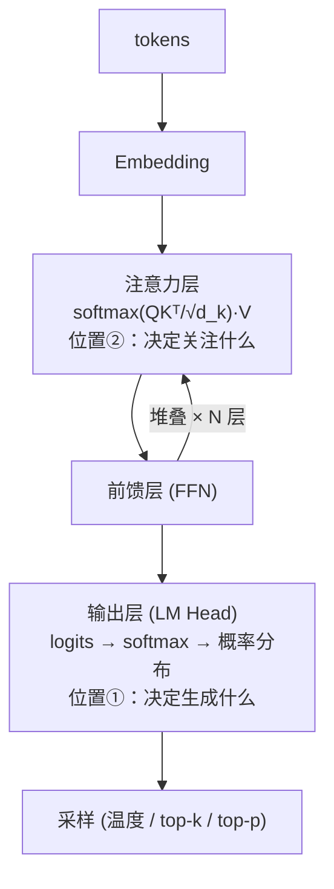
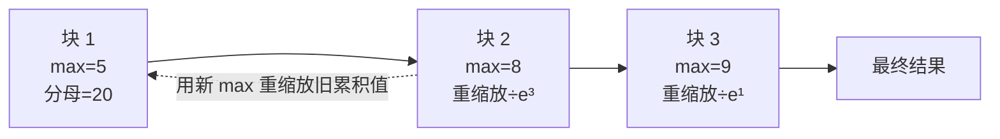

# 大模型原理之 Softmax

**摘要**：Softmax 是将任意实数 logits 转化为概率分布的归一化指数函数，是大模型中出场频率最高的数学函数。本文以"为什么→是什么→在哪→怎么稳→怎么训"为主线：它被概率分布的三项硬约束（各项为正、总和为一、保序）加上光滑可导要求逼成唯一自然解；在 Transformer 中出现于输出层（决定"生成什么"）与注意力层（决定"关注什么"），配套 $\sqrt{d_k}$ 缩放与因果掩码；工程上利用平移不变性减 max 防溢出，online softmax 支撑 Flash Attention 将显存从 $O(n^2)$ 降到 $O(n)$；训练时与交叉熵复合，梯度简化为"预测减真实"。最后按"控尖锐度、稀疏化、省算力"梳理主要变体，指出其共性是以牺牲标准 softmax 的某条性质换取特定收益。

**关键词**：Softmax；大语言模型；注意力机制；交叉熵；温度参数；Flash Attention

---

## 一、为什么需要 Softmax

模型最后一层输出的 logits 是任意实数（可正可负、无界），但下游需要的是一个**概率分布**。这座"打分 → 概率"的桥必须满足四个条件：

- **每项 > 0**：指数 $e^z$ 恒为正
- **总和 = 1**：归一化，除以总和
- **保持相对强弱**：指数天然单调
- **可以训练**：指数处处光滑可导

其他候选全被条件逼出局：**线性归一化**除完还有负数；**argmax** 没有梯度；**sigmoid** 各项独立、加总不为 1。而指数函数有一个独特性质——**差分变比值**：$z_i - z_j$ 直接变成概率比 $e^{z_i}/e^{z_j}$，logit 的加法对应概率的乘法，这是其他函数不具备的。由此还自然导出**平移不变性**（$\text{softmax}(z+c) = \text{softmax}(z)$），为第四节的数值稳定性埋下伏笔。Softmax 不是被挑选出来的，而是被这些条件**逼出来的唯一自然解**——顺带还有指数放大差距的福利，使它成为 argmax 的可导软化版[[1]](#ref-1)。

---

## 二、公式与计算

$$
\text{softmax}(z)_i = \frac{e^{z_i}}{\sum_{j=1}^{K} e^{z_j}}
$$

以 logits `[2.0, 1.0, 0.1, 3.0]` 为例，三步算完：

| 步骤 | 操作 | 结果 |
|---|---|---|
| ① 取指数 | $e^{z_i}$ | `[7.39, 2.72, 1.11, 20.09]` |
| ② 求和 | 归一化分母 | `31.31` |
| ③ 相除 | 逐项除以总和 | `[0.236, 0.087, 0.035, 0.642]` |

输出全正、总和为 1，头部概率被显著放大——这就是"软化的 argmax"。

---

## 三、在大模型中的两个位置

先看全景，softmax 在 Transformer 中一内一外只出现两次[[2]](#ref-2)：

图 1 Softmax 在 Transformer 中的两个位置

### 3.1 输出层决定"生成什么"

自回归生成时，每一步对整个词表做一次 softmax，得到下一个 token 的概率分布，再从中采样。所有解码参数都作用在它的输出**之后**：

- **温度 T**：softmax(z/T)。T<1 分布尖锐（保守确定），T>1 平坦（随机有创造性）；T→0 退化为 argmax，T→∞ 退化为均匀分布——一个旋钮控制全部谱系。
- **Top-k / Top-p**：只保留概率最高的 k 个、或累计概率达 p 的最小集合，再归一化采样，防止选中低质量词。温度 + top-p 是生产环境最常见组合。

### 3.2 注意力层决定"关注什么"

$$
\text{Attention}(Q, K, V) = \text{softmax}\!\left(\frac{QK^\top}{\sqrt{d_k}}\right)V
$$

softmax 把 query 与 key 的相似度分数归一化为和为 1 的权重，再对 V 加权求和。两个配套设计都源于 softmax 的特性：

- **除以 $\sqrt{d_k}$**：维度大时点积分差过大，会把 softmax 推入饱和区（趋近 one-hot、梯度消失）；缩放把方差拉回 1，保持梯度健康[[2]](#ref-2)。
- **Causal mask**：屏蔽位置加 $-\infty$，softmax 后概率严格为 0——"看不到未来"的数学表达。

---

## 四、数值稳定性

logit 较大时 $e^{z_i}$ 会溢出（float32 上限约 $e^{88}$）。利用 softmax 的**平移不变性**（整体加减常数结果不变），实现时先减去最大值[[3]](#ref-3)：

$$
\text{softmax}(z)_i = \frac{e^{z_i - \max(z)}}{\sum_j e^{z_j - \max(z)}}
$$

减 max 后指数最大仅为 $e^0=1$，彻底避免溢出。在此基础上，**online softmax** 支持分块流式计算：

图 2 Online softmax 分块流式计算

这是 **Flash Attention** 的核心技巧——显存从 $O(n^2)$ 降到 $O(n)$，让长上下文成为可能[[3]](#ref-3)[[4]](#ref-4)。

---

## 五、训练与交叉熵的组合

预训练最小化交叉熵 $\mathcal{L} = -\log\,\text{softmax}(z)_{y_{\text{true}}}$。softmax 单独求导较繁琐，但与交叉熵复合后梯度简化为：

$$
\frac{\partial \mathcal{L}}{\partial z} = p - y
$$

即"预测分布减真实分布"，形式简洁且无饱和问题——这是两者成为标配组合的数学原因。常用指标困惑度即交叉熵的指数：$\text{PPL} = e^{\mathcal{L}}$。

---

## 六、主要变体

- **控尖锐度**：温度；知识蒸馏用高温软化 teacher 输出，传递"暗知识"[[5]](#ref-5)；
- **稀疏化**：Sparsemax 输出可含精确 0[[6]](#ref-6)；Gumbel-Softmax 实现可微的近似 one-hot 采样[[7]](#ref-7)；
- **省算力**：层次化 softmax（$O(V)$ → $O(\log V)$）、负采样、Flash Attention[[4]](#ref-4)。

变体本质都是在牺牲标准 softmax 的某条性质，换取特定收益——反衬出标准版的地位。

---

## 总结

Softmax 的本质是**把任意实数 logits 转化为概率分布的归一化指数函数**——大模型训练时用交叉熵拟合它、推理时从它采样、每层注意力靠它分配权重，是模型"做选择"与"分注意力"的共同出口。

---

## 参考文献

[1] J. S. Bridle. ["Probabilistic Interpretation of Feedforward Classification Network Outputs, with Relationships to Statistical Pattern Recognition."](https://link.springer.com/chapter/10.1007/978-3-642-76153-9_28) *Neurocomputing*, 1990.  
[2] A. Vaswani et al. ["Attention Is All You Need."](https://arxiv.org/abs/1706.03762) *NeurIPS*, 2017.  
[3] M. Milakov, N. Gimelshein. ["Online Normalizer Calculation for Softmax."](https://arxiv.org/abs/1805.02867) *arXiv*, 2018.  
[4] T. Dao et al. ["FlashAttention: Fast and Memory-Efficient Exact Attention with IO-Awareness."](https://arxiv.org/abs/2205.14135) *NeurIPS*, 2022.  
[5] G. Hinton, O. Vinyals, J. Dean. ["Distilling the Knowledge in a Neural Network."](https://arxiv.org/abs/1503.02531) *arXiv*, 2015.  
[6] A. Martins, R. Astudillo. ["From Softmax to Sparsemax: A Sparse Model of Attention and Multi-Label Classification."](https://arxiv.org/abs/1602.02068) *ICML*, 2016.  
[7] E. Jang, S. Gu, B. Poole. ["Categorical Reparameterization with Gumbel-Softmax."](https://arxiv.org/abs/1611.01144) *ICLR*, 2017.
