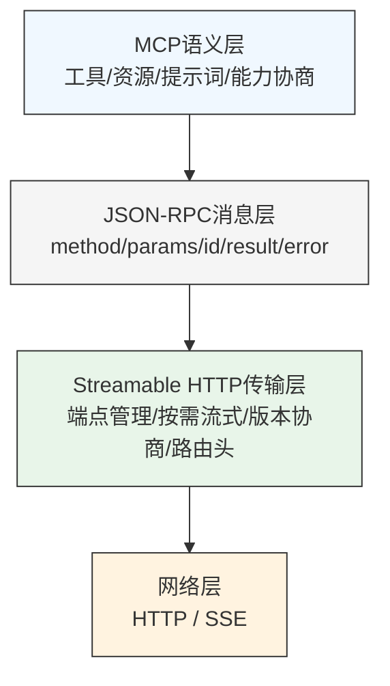
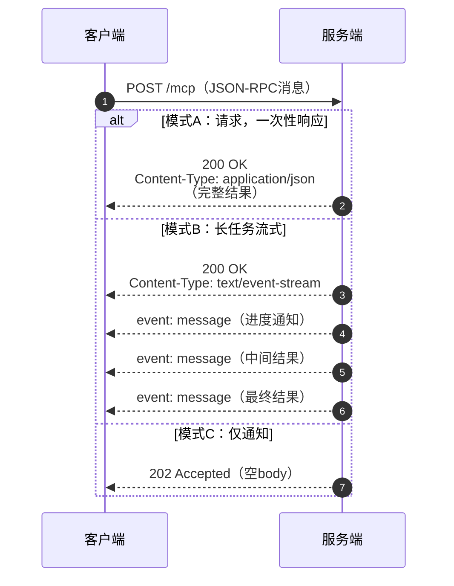
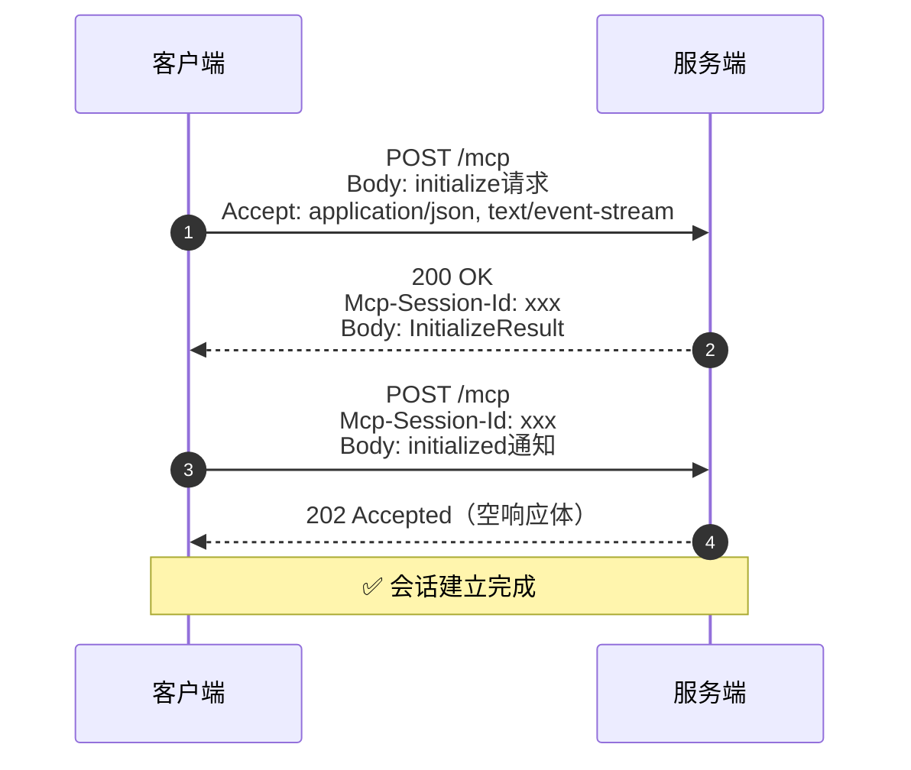
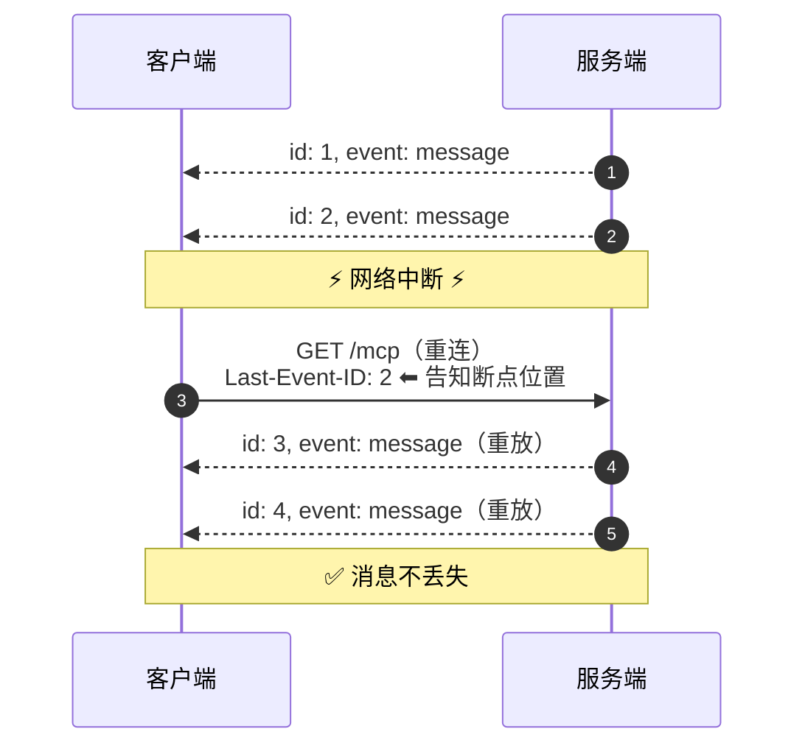
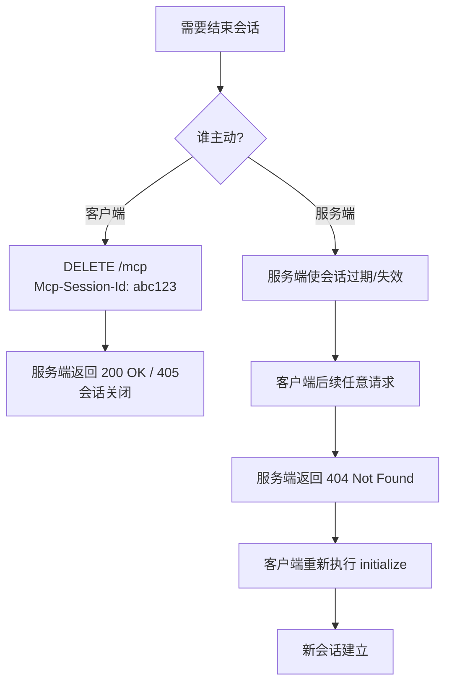
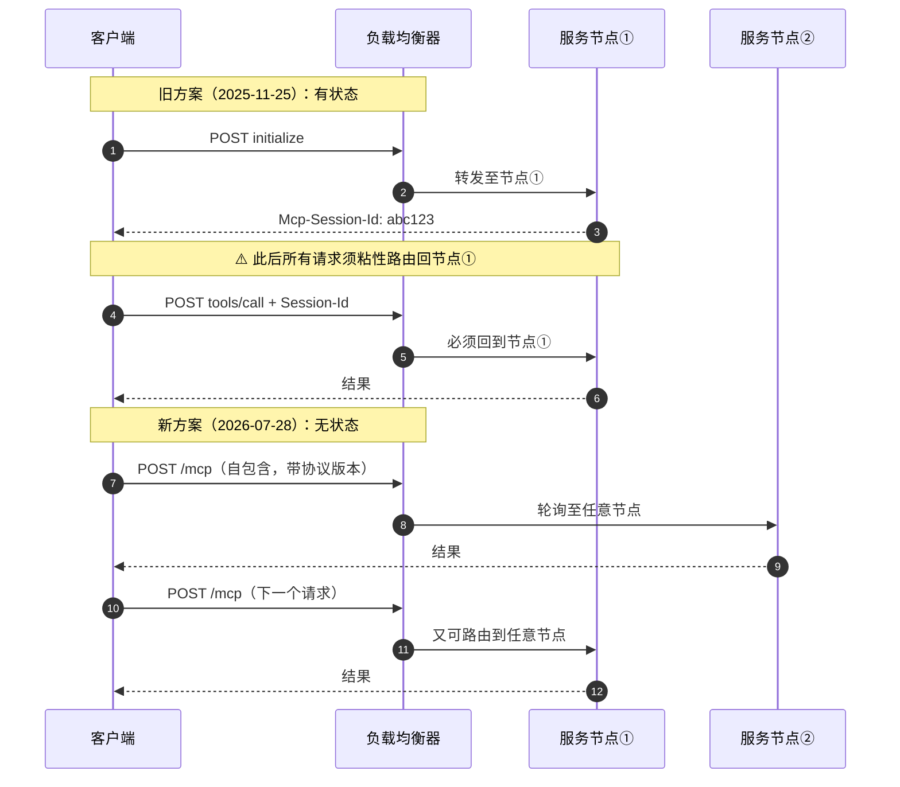
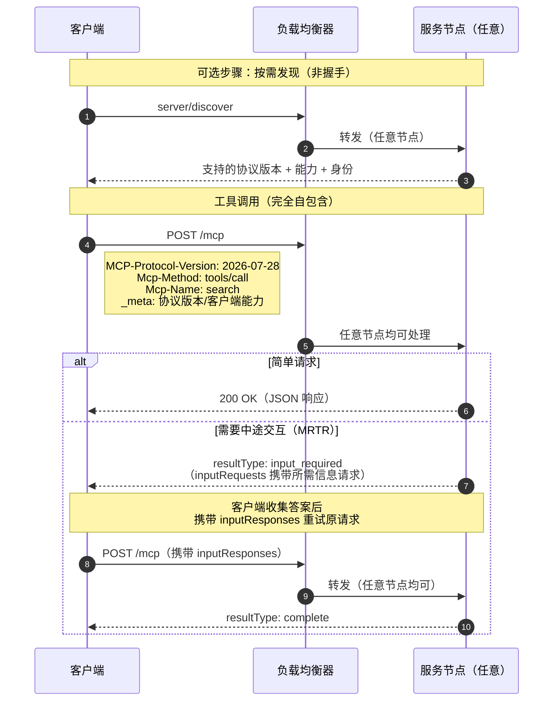

# Streamable HTTP

> Streamable HTTP = HTTP + JSON-RPC + JSON/SSE + MCP规则

**摘要**：Streamable HTTP是模型上下文协议（Model Context Protocol, MCP）的标准远程传输范式。针对传统HTTP+SSE双端点架构会话管理复杂、水平扩展困难、长连接资源开销大等生产痛点，MCP自2025-03-26版本起以"单一端点、按需流式"的Streamable HTTP取代旧传输，并于2026-07-28完成无状态化重构，移除会话、GET推送通道与SSE断线恢复，将交互模型改写为"一组自包含的HTTP请求"。本文先进行概念分层与多方案对比，厘清其与SSE、WebSocket、JSON-RPC的层次关系；再按演进顺序完整解析有状态经典机制与无状态新机制（server/discover、_meta、MRTR、subscriptions/listen、双栈兼容），给出可落地的协议实现示例，并从性能影响、静默退化风险与部署实践角度给出工程建议。

**关键词**：模型上下文协议；Streamable HTTP；Server-Sent Events；JSON-RPC；无状态架构；多轮次请求

---

## 1 引言

### 1.1 研究背景

随着AI Agent技术的规模化落地，工具调用、资源访问、上下文注入等外部交互需求日益增长。MCP协议的出现统一了大语言模型与上下文提供者之间的交互语义，定义了工具、资源、提示词等标准化能力接口。但在远程部署场景下，传输层方案长期存在架构不统一、基础设施适配性差等问题：早期的HTTP+SSE双端点方案[[1]](#ref-1)需要为客户端消息与服务端事件流分别维护`/messages`与`/sse`两个端点，存在会话绑定、扩展困难、长连接闲置开销高等缺陷，难以适配生产级分布式部署与Serverless环境。

在此背景下，Streamable HTTP取代旧HTTP+SSE方案，成为MCP标准远程传输方式[[2]](#ref-2)；经最新修订的无状态化重构[[4]](#ref-4)后，它已是当前MCP生态中远程服务部署的首选方案，完整演进路线见3.4节。

### 1.2 研究意义

Streamable HTTP重构了MCP传输层交互模型，其核心价值在于用标准HTTP协议实现了"按需流式调用"的能力，既保留了流式输出的实时性，又兼具普通Web API的易部署、易扩展特性；2026年的无状态重构进一步使其成为可直接部署于轮询负载均衡之后的"普通HTTP工作负载"。深入解析其协议机制、演进逻辑与实现方法，对AI Agent网关、分布式工具服务、Serverless MCP部署、企业级AI集成等场景具有重要的工程参考价值。

---

## 2 概念辨析与设计定位

MCP生态中存在多种传输方案，同时聚集了一批易混概念——`streamable-http`、SSE、WebSocket、JSON-RPC并不在同一层次上，"自研一个POST + text/event-stream接口是不是就够了"也常被拿来质疑[[10]](#ref-10)。本章先厘清概念层次与本质区别，再给出多维度对比。

### 2.1 概念分层：各概念处于不同层次

Streamable HTTP的本质是既有成熟技术的标准化组合，而非新发明的底层协议[[10]](#ref-10)：

> Streamable HTTP = HTTP承载 + JSON-RPC消息信封 + 可选SSE流式下行 + MCP端点/版本/会话规则

各概念分工如下：

1. **HTTP**：运输方式，解决"消息怎么运过去"，保留标准请求/响应语义，可直接复用反向代理、鉴权、网关、监控等基础设施。
2. **JSON-RPC**：消息格式，解决"消息里面长什么样"——用统一信封描述调用哪个方法（method）、传什么参数（params）、属于哪个请求（id）、成功结果（result）还是失败错误（error）[[7]](#ref-7)。普通HTTP接口的请求体是裸业务字段，字段含义由接口自定；MCP请求体则是标准化的RPC调用描述，`initialize`、`tools/list`、`tools/call`、`resources/list`等调用均为JSON-RPC风格。
3. **SSE**：服务端流式下行手段，经`Content-Type: text/event-stream`的响应连接以`event:`/`data:`行逐段推送事件[[8]](#ref-8)；仅在需要边处理边输出时启用，短任务直接返回普通JSON。
4. **MCP规则**：在上述技术之上补充端点约定、协议版本协商、会话与断线语义（历史版本）、服务端主动消息等交互行为约定。

因此其层次关系为：**MCP语义 → JSON-RPC → Streamable HTTP → HTTP/SSE**，如图1所示。它既不是"只有SSE"，也不是"和WebSocket同类的双向长连接协议"。


<center>图1 Streamable HTTP分层架构图</center>

### 2.2 与自研"POST + SSE"接口的区别

传输技巧上相似，协议层次上完全不同[[10]](#ref-10)。自研接口本质上只是"用了HTTP流式响应 + 自定义事件格式"，而Streamable HTTP在此之外还规定了：

- 请求体必须是JSON-RPC信封，而非裸业务字段——普通接口关心"这个URL对应什么业务"，MCP关心"调用哪个方法、请求ID是多少、参数是什么"；
- 初始化与协议版本协商流程（经典版本为握手，2026版为按需发现，见5.3节）；
- 会话ID传递与断线恢复（历史版本，见4.3、4.4节）；
- 服务端主动消息的走法（见4.3、5.4节）。

简言之，自研POST+SSE是"能传"，Streamable HTTP是"能互通、能恢复、能被任意MCP客户端标准化理解"——差别不只是多了几个header，而是一整套交互行为约定。

### 2.3 与WebSocket的区别及官方选型

- **连接形态**：WebSocket协议升级后为持久全双工通道，双方可随时主动发消息，不再是普通HTTP请求响应，适合高频、低延迟的双向持续交互；Streamable HTTP保留请求响应语义，客户端以POST驱动调用，服务端仅在需要时经SSE做流式下行。
- **基础设施**：WebSocket需要维护连接状态、易被代理/WAF拦截；Streamable HTTP完全复用标准HTTP生态，更容易部署在企业网关与代理之后，便于接入认证与审计系统。
- **典型场景**：WebSocket适合在线聊天、协同编辑、实时游戏、状态同步；Streamable HTTP适合远程MCP Server、工具调用、资源读取、Agent编排与LLM推理结果流式返回。

官方未把标准传输定为WebSocket，是工程权衡而非能力不足[[10]](#ref-10)：MCP的主流场景并非"永远保持一条超活跃双向信道"，而是"标准化地调用远端能力，必要时流式返回结果"——对该"请求驱动、按需流式"的场景，Streamable HTTP已经足够。一句话概括：WebSocket更像一条自由的双向消息管道，Streamable HTTP更像一套标准化的HTTP流式调用协议。

### 2.4 主流传输方案多维度对比

MCP生态中多种传输方案分别适用于本地、远程、实时交互等不同场景。表1从多个核心维度对主流方案进行了对比。

**表1 主流MCP传输方案多维度对比**

| 对比维度 | 传统HTTP+SSE（旧方案） | Streamable HTTP（2026版） | WebSocket | stdio |
| --- | --- | --- | --- | --- |
| 端点数量 | 2个（/messages + /sse） | 1个（/mcp） | 1个 | 无（标准输入输出） |
| 连接形态 | 短请求+长连接并存 | 请求级按需连接 | 持久全双工长连接 | 进程内管道 |
| 状态模型 | 有状态会话绑定 | 默认无状态，请求自包含 | 有状态连接 | 有状态进程 |
| 基础设施兼容性 | 一般，长连接易被代理超时 | 优秀，完全兼容标准HTTP生态 | 较差，易被防火墙/WAF拦截 | 不适用网络场景 |
| 水平扩展能力 | 差，需粘性会话路由 | 优秀，任意节点可处理任意请求 | 一般，需连接状态同步 | 不适用 |
| 实现复杂度 | 中等，需管理双连接同步 | 低，单端点逻辑简洁 | 中等，需处理连接生命周期 | 低 |
| 适用场景 | 早期远程MCP服务 | 生产级远程部署、Serverless | 高频双向实时交互 | 本地子进程调用 |

从对比可见，Streamable HTTP在扩展性、基础设施兼容性与实现成本之间取得了最优平衡，是远程部署场景的工程最优解。

---

## 3 核心设计：单一端点与按需流式

### 3.1 单一端点的三条交互规则

与需要两个端点的旧HTTP+SSE传输不同，Streamable HTTP使用**一个MCP端点**（例如`https://example.com/mcp`），其交互收敛为三条规则[[3]](#ref-3)：

1. **客户端 → 服务端（POST）**：每条JSON-RPC消息（请求、通知、响应）都作为新的HTTP POST发送到MCP端点；服务端根据`Accept`与请求类型，要么返回单个JSON对象，要么开启一条SSE流，在其中传输进度通知、服务端到客户端的请求，并最终返回响应。
2. **服务端 → 客户端（GET，经典版本）**：客户端可以（MAY）通过GET请求到同一端点开启SSE流，让服务端随时主动推送请求/通知；服务端不支持此功能时只需返回`405 Method Not Allowed`。该通道已于2026-07-28移除，替代机制见5.4节。
3. **无需回复的消息**：如果POST请求体只包含通知/响应，服务端返回`202 Accepted`和空响应体即可。

这是关键简化：服务端不再需要为每个客户端维护一条专用的"电话线路"，并且可以在同一个响应流中推送中途产生的数据——既像普通Web API一样"按需响应"，又保留了需要时升级为实时流的能力。

### 3.2 三种响应模式

对同一个POST消息，服务端可根据消息类型选择三种响应模式，如图2所示：

- **模式A：一次性JSON响应**：适用于快速请求（如工具列表查询）
- **模式B：SSE流式响应**：适用于长耗时任务（如工具调用、模型推理）
- **模式C：202无响应**：适用于仅通知类消息，无需返回结果



<center>图2 三种响应模式时序图</center>

2026无状态版本中，模式A与模式B仍为响应主干，模式C对应仍然存在的通知类消息（见5.5节）。

### 3.3 核心设计原则

1. **单一端点原则**：所有通信收敛到单个`/mcp`端点，简化路由配置与安全策略，消除双端点的会话同步问题。
2. **按需流式原则**：服务端根据请求类型动态选择响应模式，短任务返回一次性JSON，长任务启用SSE流式输出，资源按需分配，避免闲置长连接开销。
3. **无状态优先原则**：每个请求自包含全部元数据，服务端无需存储会话状态，原生支持轮询负载均衡与水平扩展（2026-07-28起为默认形态）。
4. **基础设施兼容原则**：完全基于标准HTTP协议[[9]](#ref-9)，可直接复用现有反向代理、鉴权、WAF、监控、CDN等Web基础设施。

### 3.4 版本演进路线

Streamable HTTP经历了三个关键演进阶段：

1. **2025-03-26：首次引入**，替代旧版HTTP+SSE双端点方案，确立单端点架构[[2]](#ref-2)
2. **2025-11-25：机制完善**，有状态模式下会话管理、断线重连、服务端主动推送等能力齐备[[3]](#ref-3)
3. **2026-07-28：无状态重构**，移除会话机制与独立SSE通道，新增路由头，默认无状态化，原生支持Serverless部署[[4]](#ref-4)、[[6]](#ref-6)

---

## 4 有状态经典交互（2025-11-25）

本章描述2025-11-25定型的经典有状态交互，用于理解演进背景与维护存量服务；当前生产标准为第5章的无状态版本。

### 4.1 核心协议头

经典版本的关键HTTP头字段见表2。

**表2 经典版本关键HTTP头字段**

| 头字段 | 方向 | 作用 |
| --- | --- | --- |
| `Accept` | 请求 | 需同时声明`application/json, text/event-stream`，告知服务端支持两种响应模式 |
| `Mcp-Session-Id` | 双向 | 会话唯一标识，初始化后由服务端下发，客户端后续请求回传 |
| `Last-Event-ID` | 请求 | 断线重连时携带最后接收的事件ID，用于消息重放 |

### 4.2 初始化与会话建立

会话建立需经过三步消息（客户端 initialize 请求、服务端 InitializeResult 响应、客户端 initialized 通知），完成版本协商与会话标识下发，时序如图3所示。



<center>图3 经典版本会话初始化时序图</center>

### 4.3 会话管理与服务端推送

服务端可以（MAY）在初始化时通过`InitializeResult`响应的**`Mcp-Session-Id`响应头**下发会话标识符：如果存在，客户端必须（MUST）在后续每个请求中回传该请求头；会话ID必须是加密安全的、仅含可见ASCII字符的值。

除POST响应外，客户端还可向`GET /mcp`发起请求，建立一条独立的SSE长连接，服务端经此通道主动向客户端推送消息，包括两类：

- **服务端通知（notification）**：如工具列表变更（`notifications/tools/list_changed`）等广播消息；
- **服务端发起的请求（server-initiated request）**：如采样（sampling）、主动问询（elicitation）等需要客户端应答的反向调用。

客户端发起GET后，服务端若不支持推送通道，直接返回`405 Method Not Allowed`，客户端可降级为仅POST模式。该通道与POST的响应流相互独立，是"客户端问、服务端答"之外的补充能力。2026-07-28无状态重构后，GET推送通道被移除，两类能力分别由`subscriptions/listen`订阅流与MRTR多轮次请求承接（见5.4节）[[4]](#ref-4)。

### 4.4 断线重连

为了在网络中断后恢复，服务端可以（MAY）为SSE事件附加`id`字段；重连的客户端在GET请求中携带**`Last-Event-ID`请求头**，服务端会重放该流上错过的消息——事件ID是每条流的游标，消息不会在多个并发流之间冗余广播，时序如图4所示。



<center>图4 经典版本断线重连时序图</center>

### 4.5 会话终止

会话支持双向终止，如图5所示：



<center>图5 经典版本会话终止流程图</center>

即：客户端通过发送HTTP DELETE请求主动关闭会话，服务端则可通过返回`404 Not Found`促使客户端重新初始化。

### 4.6 核心要点速查

经典版各环节的要点汇总见表3。

**表3 经典版本核心要点速查表**

| 环节 | 方法 | 关键头字段 | 响应 |
| --- | --- | --- | --- |
| 初始化 | POST | `Accept` | 200 + `Mcp-Session-Id` |
| 发消息 | POST | `Mcp-Session-Id` | JSON 或 SSE 或 202 |
| 接收推送 | GET | `Mcp-Session-Id` | SSE 或 405 |
| 断线恢复 | GET | `Last-Event-ID` | 重放缺失事件 |
| 结束会话 | DELETE | `Mcp-Session-Id` | 200 |

即：初始化拿会话ID → 之后所有POST都带着它 → 简单请求直接回JSON、复杂任务走SSE流中途推送 → 断线用`Last-Event-ID`补发 → 不用了DELETE掉会话。

---

## 5 无状态重构（2026-07-28）

2026-07-28是MCP发布以来最大的一次修订[[4]](#ref-4)：Streamable HTTP从"一条会话化的双向通道"变成"一组自包含的HTTP请求"——POST是主干，SSE退化为单个请求的响应形态而非独立端点，断线恢复从传输层下沉到应用层。

### 5.1 重构动因与核心变化

旧的有状态设计在真实生产环境中暴露出三大痛点：

1. **水平扩展困难**：会话粘性要求负载均衡器把同一客户端路由到同一服务器节点，阻碍了无状态扩缩容和Serverless部署。
2. **基础设施摩擦**：网关、CDN、代理对长连接会话的支持参差不齐，排障困难。
3. **运维复杂度**：会话过期、重连、状态同步都需要额外逻辑。

无状态化前后，同一客户端的路由行为差异如图6所示：



<center>图6 有状态与无状态路由对比时序图</center>

具体而言，新规范做了以下几件事：

- **移除会话**：不再有`Mcp-Session-Id`请求头，不再有`initialize`→`initialized`握手流程，每个HTTP请求都是自包含的，服务端可独立处理任一请求[[6]](#ref-6)。
- **新增`Mcp-Method`、`Mcp-Name`等HTTP头**：让网关、代理、负载均衡器无需解析请求体就能路由和过滤MCP流量，把MCP变成"一等公民"的HTTP工作负载[[4]](#ref-4)。
- **扩展机制重构**：扩展改为按能力协商（negotiated capabilities），不再塞进基础协议包，交互式应用、长任务、企业鉴权等需求通过扩展按需启用[[11]](#ref-11)。

### 5.2 新旧机制逐项对比

新旧机制的逐项差异见表4。

**表4 有状态版本与无状态版本核心差异**

| 机制 | 2025-11-25有状态版 | 2026-07-28无状态版 |
| --- | --- | --- |
| 会话机制 | 存在，`Mcp-Session-Id`全局绑定 | 移除，请求自包含元数据（`_meta`） |
| 初始化握手 | 必须initialize三步握手 | 移除，改用`server/discover`按需发现 |
| GET推送通道 | 支持独立SSE长连接推送 | 移除，改为`subscriptions/listen`订阅流 |
| 服务端发起请求 | SSE长连接回调（sampling/elicitation/roots） | 移除，改为MRTR重试循环 |
| 断线恢复 | 传输层内置`Last-Event-ID`重放 | 移除，需应用层幂等重试与任务句柄 |
| 会话终止 | DELETE关闭或404过期重初始化 | 不再需要 |
| 路由头 | 无，仅凭请求体识别操作 | 新增`Mcp-Method`、`Mcp-Name`（必带） |
| 版本标识 | 隐含在initialize中 | 每请求`MCP-Protocol-Version`+`_meta`显式携带 |
| 负载均衡 | 需粘性路由，同一客户端绑定同一节点 | 轮询即可，任意节点可处理任意请求 |
| 推送范围 | SSE流上任意推送 | 收紧为请求响应流或订阅流 |

### 5.3 新交互流程：按需发现与自包含请求

无状态模式下，版本协商改为按需进行：服务端**必须**实现`server/discover` RPC，公布其支持的协议版本、能力与身份信息，客户端可在首个请求前调用以提前选版，也可直接发起业务请求、依据错误信息重试[[4]](#ref-4)。HTTP场景下协议版本同时由`MCP-Protocol-Version`头承载；请求的元数据统一放入`_meta`字段（`io.modelcontextprotocol/protocolVersion`、`io.modelcontextprotocol/clientCapabilities`、`io.modelcontextprotocol/clientInfo`等），服务端不支持所请求版本时返回`UnsupportedProtocolVersionError`（错误码`-32022`）并在`supported`列表中给出可选版本，客户端从中选择互支持版本重发[[11]](#ref-11)。完整流程如图7所示。



<center>图7 无状态版本请求交互时序图</center>

新增的路由头使网关、负载均衡器无需解析请求体即可识别流量类型，实现精细化路由与限流，天然支持轮询负载均衡与Serverless部署[[4]](#ref-4)。

### 5.4 服务端主动消息与订阅：MRTR与subscriptions/listen

2026-07-28将服务端主动请求重构为多轮次请求（MRTR）：服务端不再经长连接发起回调，而是返回中间结果`InputRequiredResult`（`resultType: "input_required"`，其`inputRequests`字段携带所需信息的请求），客户端收集答案后携带`inputResponses`重试原请求，服务端最终返回`resultType: "complete"`的结果；所有结果均携带`resultType`字段，旧服务端省略该字段时客户端按`"complete"`处理[[12]](#ref-12)。原先依赖SSE长连接的`sampling/createMessage`、`elicitation/create`、`roots/list`等服务端发起请求全部改由此模式——控制流从"回调"倒置为"重试循环"。

服务端广播类通知则由`subscriptions/listen`承载：这是一个长连接的POST响应流，客户端按类型（`toolsListChanged`、`promptsListChanged`、`resourcesListChanged`、`resourceSubscriptions`）订阅，服务端以`io.modelcontextprotocol/subscriptionId`标注每条通知；它取代了旧的GET推送流与`resources/subscribe`，但不吸收请求级流量[[4]](#ref-4)。长耗时任务则移入`io.modelcontextprotocol/tasks`扩展，以`tasks/get`轮询替代阻塞式等待。

### 5.5 仍保留的部分

并非所有东西都变了：

- **POST仍是唯一必须的HTTP方法**，请求体仍是JSON-RPC 2.0格式；
- 响应仍可在`Content-Type: text/event-stream`的SSE流上返回进度与最终结果——模式A/B（见3.2节）仍是响应主干；
- `notifications/progress`与`notifications/message`依然只随所属请求的响应流走，并未移动到订阅流[[4]](#ref-4)。

熟悉旧流程的人可以把DELETE、`Mcp-Session-Id`、`Last-Event-ID`三件套从心智模型中删掉，换成"每个请求都自带身份"这一条。

---

## 6 实现示例

以下示例均按2026-07-28无状态语义编写，携带`MCP-Protocol-Version`与`Mcp-Method`头。

### 6.1 curl命令验证示例

#### 6.1.1 简单工具列表查询（一次性JSON响应）

```bash
curl -X POST https://example.com/mcp \
  -H "Content-Type: application/json" \
  -H "Accept: application/json, text/event-stream" \
  -H "MCP-Protocol-Version: 2026-07-28" \
  -H "Mcp-Method: tools/list" \
  -d '{
    "jsonrpc": "2.0",
    "id": 1,
    "method": "tools/list"
  }'
```

正常响应为`Content-Type: application/json`的JSON-RPC格式结果，包含可用工具列表。

#### 6.1.2 流式工具调用示例

```bash
curl -X POST https://example.com/mcp \
  -H "Content-Type: application/json" \
  -H "Accept: text/event-stream" \
  -H "MCP-Protocol-Version: 2026-07-28" \
  -H "Mcp-Method: tools/call" \
  -d '{
    "jsonrpc": "2.0",
    "id": 2,
    "method": "tools/call",
    "params": {
      "name": "search",
      "arguments": {"query": "mcp streamable http"}
    }
  }' --no-buffer
```

长任务场景下，服务端返回`text/event-stream`格式的流式响应，分段推送进度与结果。

### 6.2 Python服务端实现（FastAPI）

以下为基于FastAPI的极简Streamable HTTP服务端实现，支持工具列表查询与流式工具调用。

```python
from fastapi import FastAPI, Request, Response
from fastapi.responses import JSONResponse, StreamingResponse
import json
import asyncio

app = FastAPI()

# 模拟工具定义
TOOLS = [
    {
        "name": "echo",
        "description": "回显输入内容，支持流式输出",
        "inputSchema": {
            "type": "object",
            "properties": {"message": {"type": "string"}},
            "required": ["message"]
        }
    }
]

def json_rpc_response(request_id: int, result: dict) -> dict:
    """构造JSON-RPC响应"""
    return {"jsonrpc": "2.0", "id": request_id, "result": result}

def json_rpc_error(request_id: int, code: int, message: str) -> dict:
    """构造JSON-RPC错误响应"""
    return {"jsonrpc": "2.0", "id": request_id, "error": {"code": code, "message": message}}

@app.post("/mcp")
async def mcp_endpoint(request: Request):
    body = await request.json()
    method = body.get("method")
    request_id = body.get("id")
    
    # 工具列表查询 - 一次性JSON响应
    if method == "tools/list":
        result = {"tools": TOOLS}
        return JSONResponse(
            content=json_rpc_response(request_id, result),
            media_type="application/json"
        )
    
    # 工具调用 - SSE流式响应
    elif method == "tools/call":
        params = body.get("params", {})
        tool_name = params.get("name")
        arguments = params.get("arguments", {})
        
        if tool_name != "echo":
            return JSONResponse(
                content=json_rpc_error(request_id, -32602, "Invalid params: unknown tool"),
                status_code=200
            )
        
        message = arguments.get("message", "")
        
        async def stream_generator():
            # 模拟分段流式输出
            chars = list(message)
            for i, char in enumerate(chars):
                chunk = {
                    "jsonrpc": "2.0",
                    "id": request_id,
                    "result": {
                        "content": [{"type": "text", "text": char}],
                        "isFinal": i == len(chars) - 1
                    }
                }
                yield f"event: message\ndata: {json.dumps(chunk)}\n\n"
                await asyncio.sleep(0.1)
        
        return StreamingResponse(
            stream_generator(),
            media_type="text/event-stream",
            headers={"Cache-Control": "no-cache"}
        )
    
    else:
        return JSONResponse(
            content=json_rpc_error(request_id, -32601, "Method not found"),
            status_code=200
        )

if __name__ == "__main__":
    import uvicorn
    uvicorn.run(app, host="0.0.0.0", port=8000)
```

> **说明**：以上流式响应为简化演示——逐段返回相同 `id` 的 `result` 并自造 `isFinal` 字段；标准 MCP 语义中，进度经 progress 通知推送，最终结果由单次 JSON-RPC 响应返回。

**依赖安装**：

```bash
pip install fastapi uvicorn requests
```

### 6.3 Python客户端调用示例

```python
import requests
import json

def call_mcp_json(base_url: str, method: str, params: dict = None) -> dict:
    """调用MCP接口，接收一次性JSON响应"""
    payload = {
        "jsonrpc": "2.0",
        "id": 1,
        "method": method,
        "params": params or {}
    }
    headers = {
        "Content-Type": "application/json",
        "Accept": "application/json",
        "MCP-Protocol-Version": "2026-07-28"
    }
    resp = requests.post(f"{base_url}/mcp", json=payload, headers=headers)
    return resp.json()

def call_mcp_stream(base_url: str, method: str, params: dict = None):
    """调用MCP接口，接收SSE流式响应"""
    payload = {
        "jsonrpc": "2.0",
        "id": 2,
        "method": method,
        "params": params or {}
    }
    headers = {
        "Content-Type": "application/json",
        "Accept": "text/event-stream",
        "MCP-Protocol-Version": "2026-07-28"
    }
    resp = requests.post(f"{base_url}/mcp", json=payload, headers=headers, stream=True)
    
    for line in resp.iter_lines(decode_unicode=True):
        if line.startswith("data: "):
            data = line[6:]
            yield json.loads(data)

# 使用示例
if __name__ == "__main__":
    base = "http://localhost:8000"
    
    # 1. 查询工具列表
    tools = call_mcp_json(base, "tools/list")
    print("工具列表:", json.dumps(tools, indent=2, ensure_ascii=False))
    
    # 2. 流式调用echo工具
    print("\n流式输出:")
    for chunk in call_mcp_stream(base, "tools/call", {
        "name": "echo",
        "arguments": {"message": "Hello Streamable HTTP"}
    }):
        text = chunk["result"]["content"][0]["text"]
        print(text, end="", flush=True)
```

---

## 7 迁移、性能与部署

### 7.1 性能影响

无状态化总体是**正收益为主，代价集中在三处**：收益集中在部署侧，代价落在请求开销、断线重试与长任务轮询场景，如表5所示。

**表5 无状态重构的性能影响**

| 维度 | 变化 | 方向 |
| --- | --- | --- |
| 连接开销 | 不再维护SSE长连接，资源按请求释放 | 显著降低 |
| 水平扩展 | 无粘性路由，轮询LB即可，扩缩容自由 | 大幅提升 |
| 单请求开销 | 每个请求重复携带`_meta`与路由头 | 略微增加 |
| 断线成本 | 无传输层恢复，中断即整单重试 | 恶化 |
| 长任务 | 走tasks扩展，客户端轮询 | 持平略差 |

收益端：不再有闲置SSE通道占用内存与文件描述符，冷启动的Serverless实例也能直接服务请求，吞吐、扩展性与运维复杂度全面改善。代价端一（带宽）：每次请求重复携带`_meta`和路由头，对高频小请求是可测量的字节数增加，但相比省掉的长连接维护成本通常划算。代价端二（重试语义）与代价端三（长任务轮询）：分别见7.2节第2、4点。

### 7.2 局限与静默退化风险

1. 非全双工通信，服务端广播依赖`subscriptions/listen`订阅流，不适合高频双向实时交互场景。
2. **SSE断线恢复的移除是最需要警惕的静默退化**：`Last-Event-ID`头与SSE事件ID均已删除，响应流一旦中断，正在进行的请求结果即告丢失，客户端必须以新的JSON-RPC请求ID重新发起请求[[4]](#ref-4)。迁移后测试不会报错，但真实网络环境下会出现偶发丢失的工具调用；对扣款、发邮件等有副作用的工具，重试就等于重复执行副作用——必须自行实现**幂等键**。
3. 每个请求必须自包含全部元数据（`_meta`与路由头），无法像会话方案那样仅在初始化时协商一次，带宽影响见7.1节代价端一。
4. 长耗时任务需迁移至tasks扩展轮询，相比流式阻塞等待略有轮询延迟。

### 7.3 双栈兼容与旧客户端迁移

规范采用**协商式兼容**：由于大量在线客户端仍使用2025-11-25协议，希望同时服务新旧客户端的服务器**可以**在同一`/mcp`端点实现双栈（dual-era）[[11]](#ref-11)：

- 收到携带`_meta`的现代请求 → 走无状态语义；
- 收到`initialize`请求 → 走旧版会话语义（按协商到的pre-2026版本）；
- 时代判定是服务器的属性而非单个请求的属性，客户端应按服务器进程/源缓存判定结果。

HTTP客户端的时代探测机制为：先尝试一个现代请求，检查`400 Bad Request`的响应体——若为可识别的现代JSON-RPC错误（如`UnsupportedProtocolVersionError`）则对方是现代服务器，按其`supported`列表重试；否则回退到`initialize`握手。仅支持现代版本的服务器应在拒绝`initialize`的错误中注明所支持的版本，因为旧客户端没有前向兼容机制，该信息可能是其唯一可呈现给用户的诊断[[11]](#ref-11)。

### 7.4 部署建议

1. **单端点收敛**：将 `/mcp` 端点统一挂载到反向代理/网关之后，集中完成鉴权、限流、审计，并利用 `Mcp-Method`、`Mcp-Name` 路由头实现按方法的差异化调度[[4]](#ref-4)。
2. **负载均衡与流式**：无状态版本可直接使用轮询策略，无需会话粘性；网关需关闭响应缓冲（如 `proxy_buffering off`），避免 SSE 分段被堆积缓存。
3. **超时与重试**：为长任务配置合理的网关读超时，客户端按需实现应用层幂等重试（有副作用的工具必须使用幂等键），弥补传输层断线恢复机制的移除[[4]](#ref-4)。
4. **升级回归**：从有状态版本升级时，回归验证 initialize 握手的移除与 `Mcp-Method`/`Mcp-Name` 路由头注入[[5]](#ref-5)；需要延续存量客户端服务的，按7.3节实施双栈。

---

## 8 结论与展望

Streamable HTTP是MCP协议面向生产环境的重要传输层升级：以"单一端点+按需流式"的设计解决了传统HTTP+SSE方案扩展难、部署复杂的痛点；2026-07-28的无状态重构进一步将其从"一条会话化的双向通道"改写为"一组自包含的HTTP请求"，使MCP服务器能像普通Web API一样部署在轮询负载均衡之后，成为远程MCP服务的事实标准。

未来演进方向主要包括：1）`subscriptions/listen`等应用层订阅机制的持续完善，弥补服务端广播能力；2）tasks等扩展对长任务的标准化承载，平衡轮询开销与断线韧性；3）幂等与句柄机制的工程实践成熟，覆盖有副作用工具的重试安全。对于AI Agent与工具服务的规模化部署，Streamable HTTP将持续作为核心传输基础设施发挥作用。

---

## 参考文献

<a id="ref-1"></a>[1] Model Context Protocol. ["Specification Revision 2024-11-05 (HTTP+SSE 传输)."](https://modelcontextprotocol.io/specification/2024-11-05) *modelcontextprotocol.io*.

<a id="ref-2"></a>[2] Model Context Protocol. ["Specification Revision 2025-03-26."](https://modelcontextprotocol.io/specification/2025-03-26) *modelcontextprotocol.io*.

<a id="ref-3"></a>[3] Model Context Protocol. ["Specification Revision 2025-11-25."](https://modelcontextprotocol.io/specification/2025-11-25) *modelcontextprotocol.io*.

<a id="ref-4"></a>[4] Model Context Protocol. ["Key Changes in the 2026-07-28 Revision."](https://modelcontextprotocol.io/specification/2026-07-28/changelog) *modelcontextprotocol.io*, 2026.

<a id="ref-5"></a>[5] Model Context Protocol. ["Streamable HTTP Transport."](https://modelcontextprotocol.io/specification/2026-07-28/basic/transports/streamable-http) *MCP Specification 2026-07-28*.

<a id="ref-6"></a>[6] J. Hefner et al. ["SEP-2575: Make MCP Stateless."](https://modelcontextprotocol.io/seps/2575-stateless-mcp.md) *Model Context Protocol*, 2025.

<a id="ref-7"></a>[7] JSON-RPC. ["JSON-RPC 2.0 Specification."](https://www.jsonrpc.org/specification) *jsonrpc.org*.

<a id="ref-8"></a>[8] WHATWG. ["Server-sent events."](https://html.spec.whatwg.org/multipage/server-sent-events.html) *HTML Living Standard*.

<a id="ref-9"></a>[9] IETF. ["HTTP Semantics (RFC 9110)."](https://www.rfc-editor.org/rfc/rfc9110) *RFC 9110*, 2022.

<a id="ref-10"></a>[10] linhx. ["理解 MCP 的 Streamable HTTP：它和 SSE、WebSocket、JSON-RPC 到底是什么关系."](https://linhx1999.github.io/posts/2026/03/13/mcp-streamable-http/) *Lhx's Blog*, 2026.

<a id="ref-11"></a>[11] Model Context Protocol. ["Versioning and Compatibility."](https://modelcontextprotocol.io/specification/2026-07-28/basic/versioning) *MCP Specification 2026-07-28*.

<a id="ref-12"></a>[12] Model Context Protocol. ["Multi Round-Trip Requests (MRTR)."](https://modelcontextprotocol.io/specification/2026-07-28/basic/patterns/mrtr) *MCP Specification 2026-07-28*.

---
