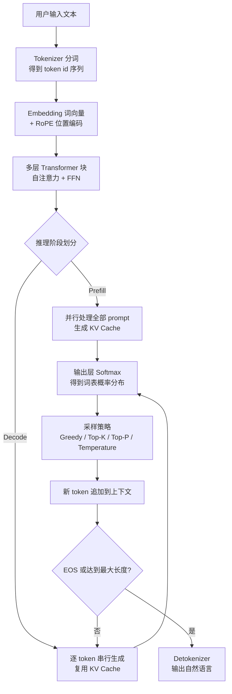

# 大模型推理全链路

## 摘要

大语言模型的推理过程是一条**"文本→token→向量→多层 Transformer→概率采样→自回归循环"**的流水线。本文以 Decoder-only 架构为基准，按执行顺序拆解六个核心环节：Tokenizer 分词编码、Embedding 与位置编码、多层 Transformer（自注意力 + 前馈网络）、Prefill/Decode 两阶段计算与 KV Cache 加速机制、输出层概率分布、采样解码策略，以及自回归迭代与终止条件。文中给出 KV Cache 显存估算公式，并对现代主流架构（RoPE、SwiGLU、GQA）及生产级推理优化（PagedAttention、投机解码、Chunked Prefill、连续批处理）做延伸说明，为理解模型性能瓶颈与部署调优提供完整知识框架。

**关键词**：大语言模型；推理流程；KV Cache；注意力机制；采样策略

---

## 1 引言

大模型推理的本质是**自回归生成**：模型在每一步只输出一个 token，并将该 token 追加到上下文末尾，作为下一步的输入，循环往复直到终止。理解这条链路不仅有助于把握模型的语义建模机制，也是诊断推理延迟、显存占用等工程问题的前提。整体流程如图 1 所示。

图 1 大模型（Decoder-only）推理完整流程

## 2 Tokenizer：文本到 token 的转换

Tokenizer 负责将连续自然语言切分为模型词表中的最小离散单元——token。现代大模型普遍采用 **BPE（Byte Pair Encoding）** 或其变体（如 Unigram、WordPiece），切分粒度介于"词"与"字符"之间：高频英文词通常映射为单 token，生僻词被拆成子词，中文多按字或词组切分。每个 token 在词表中对应唯一整数 ID，模型的输入输出始终是 ID 序列，**模型从未见过"文字"本身**，最后由 Detokenizer 将 ID 还原为可读文本。

## 3 Embedding 与位置编码

Embedding 层是一个可学习的查找矩阵，形状为 `[vocab_size, hidden_dim]`。以隐藏维度 4096 为例，每个 token ID 被映射为一个 4096 维向量，语义相近的词在向量空间中距离更近。
位置编码的演进尤为关键：
- **绝对位置编码**：为每个位置学习一个可训练向量并叠加到词嵌入，但训练时见过的位置有限，**超出最大长度即无法外推**；
- **RoPE（旋转位置编码）** [[3]](#ref-3)：不额外加向量，而是对每层的 Q、K 做角度正比于位置的旋转变换，使注意力得分仅依赖 token 间的**相对位置差**。配合线性插值、NTK-aware scaling 或 YaRN，可将 4K 训练长度外推至 128K 以上。LLaMA、Qwen、DeepSeek 等主流开源模型均采用 RoPE。

## 4 Transformer 层：自注意力与前馈网络

Decoder-only 架构中，每层 Transformer 包含两个子模块，主流实现采用 **Pre-Norm 残差包裹**：`x = x + Attn(LN(x))`，再 `x = x + FFN(LN(x))`，如此堆叠 N 层（如 Llama-3-70B 有 80 层）。
**多头自注意力（MHA）**是上下文建模的核心，计算公式为 [[2]](#ref-2)：
$$\text{Attention}(Q,K,V)=\text{softmax}\left(\frac{QK^T}{\sqrt{d_k}}\right)V$$
其中 Q（查询）、K（键）、V（值）由当前 token 的隐向量线性投影得到。直觉理解：当前 token 的 Q 与所有历史 token 的 K 做点积衡量相关性，softmax 归一化为权重后对 V 加权求和，实现"按相关性融合全上下文"。**多头机制**将 h 个头在独立子空间并行计算再拼接，不同头分别捕捉句法、指代、语义等不同依赖模式。
**前馈网络（FFN）**是逐位置的两层 MLP，现代模型以 **SwiGLU** 门控激活 [[5]](#ref-5) 取代传统 ReLU，中间维度约为隐层的 2.7 倍。FFN 参数量约占全模型的 **2/3**，普遍被认为承担"知识存储"角色。层间分工上，底层偏词法、高层偏抽象语义。

## 5 Prefill 与 Decode：两阶段计算与 KV Cache

推理在时间上被划分为两个性质迥异的阶段，这也是理解推理性能的关键。

### 5.1 两阶段对比

| 维度 | Prefill | Decode |
|---|---|---|
| 计算模式 | 整段 prompt **并行**过网络 | 每步仅计算**一个**新 token |
| 瓶颈 | 计算密集（compute-bound） | 访存密集（memory-bound） |
| 决定指标 | 首 token 延迟 TTFT | 生成速度 tokens/s（TPOT） |

### 5.2 KV Cache：Decode 阶段的加速核心

Decode 阶段每步只产生一个新 token，其 Q 是新的，但 K/V 若不缓存，则需对整个历史重算注意力，计算量按 O(n²) 膨胀。**KV Cache** 将已计算好的 K、V 存入显存，后续步骤直接读取，避免重复计算——这是 Decode 阶段能高效运行的根本前提。
KV Cache 的显存代价由下式估算：
$$\text{KV Cache 显存} = 2 \times N_{\text{layer}} \times L_{\text{seq}} \times H_{\text{kv}} \times d_{\text{head}} \times b_{\text{dtype}}$$
以 Llama-2-7B（32 层、32 头、head_dim=128）在 FP16、4K 上下文为例：
$$2 \times 32 \times 4096 \times 32 \times 128 \times 2 \text{B} \approx 2 \text{ GB}$$
该值随序列长度**线性**增长、随 batch size **线性**倍增：4K 上下文下单请求占 2 GB，batch=8 即占 16 GB；Llama-3 8B 在 FP16、128K 上下文下 KV Cache 达约 16 GB，已逼近或超出多数消费级 GPU 容量。**这就是长上下文推理吃显存的根源，也是模型卡上"支持 128K"与实际可部署长度存在差距的原因**——架构上限是训练时的属性，硬件可承载长度才是部署的真实约束，二者取较小值。

### 5.3 衍生优化方向

围绕 KV Cache 与两阶段瓶颈，业界形成了一系列生产级方案：
- **GQA/MQA** [[4]](#ref-4)：将 K/V 头数压缩为 Q 头数的 1/g 甚至 1，直接降低 KV Cache 体积，是现代长上下文模型的标配；
- **PagedAttention**（vLLM）[[7]](#ref-7)：借鉴操作系统分页管理显存，消除 KV Cache 的连续存储要求，显著提升并发吞吐；
- **Chunked Prefill**：将长 prompt 切块分批计算，避免一次 Prefill 长时间独占 GPU 而阻塞在线 Decode 请求，降低 TTFT 尾延迟；
- **Continuous Batching** [[9]](#ref-9)：动态插入/移除请求，填满 Prefill 与 Decode 的算力空隙；
- **投机解码** [[8]](#ref-8)：小模型起草多个候选 token，大模型一次并行验证，将 Decode 的串行瓶颈部分打破。

## 6 输出层与采样策略

最后一层隐向量乘以 lm_head 矩阵（部分模型与 Embedding 权重共享）得到 logits，再经 softmax 变换为覆盖整个词表（通常 10 万~15 万维）的概率分布。
采样策略从概率分布中选出下一个 token，不同策略在**确定性与多样性**间权衡：

| 策略 | 机制 | 特点 |
|---|---|---|
| 贪心 | 直接取 argmax | 确定性输出，适合代码/数学，但易陷入重复 |
| Temperature | logits 除以 T 再 softmax | T<1 使分布更尖锐、输出更确定；T→0 退化为贪心；**T>1 使分布更平坦、输出更多样**，但过高易失控 |
| Top-K | 仅保留概率最高的 K 个候选再归一化 | 候选数固定，不随分布尖平变化 |
| Top-P（核采样）[[6]](#ref-6) | 按概率降序累加，保留累计概率 ≤P 的最小候选集 | 候选数**动态**变化，质量较稳定 |

实践中通常**组合使用**（如 temperature=0.6 + top-p=0.95），并辅以 repetition penalty 抑制复读。生成出的 token ID 再交由 Detokenizer 还原为人类可读文本。

## 7 迭代与终止

生成的 token id 被追加到上下文末尾，作为下一轮 Decode 的输入，同时对应的 K/V 也并入 KV Cache，进入下一轮计算。该循环持续到以下任一条件触发：
1. 命中 **stop token / EOS**（如 `<|end▁of▁sentence|>`）；
2. 达到 `max_new_tokens` 硬上限；
3. 命中自定义停止字符串。
这也解释了为何生成速度用 tokens/s 衡量、为何输出越长总耗时越线性增长——每个 token 都是一次完整的 Decode 步骤。

## 8 结语

将整条链路串起来：输入文本 → Tokenizer 编码为 ID → Embedding + RoPE 位置编码 → **Prefill**：全 prompt 并行过 N 层 Transformer，填充 KV Cache，产出首 token → **循环 Decode**：lm_head 出 logits → softmax → 采样得下一 token → Detokenize 流式输出 → 命中 EOS 或达最大长度即停。

本文沿这条主链路覆盖了原始口播内容中的全部核心知识点，并针对现代主流实现做了三点澄清与延伸：其一，主流模型的位置编码已从绝对位置演进到 RoPE；其二，FFN 的激活函数普遍采用 SwiGLU；其三，KV Cache 的显存占用是理解长上下文部署瓶颈的关键，围绕它衍生出 GQA、PagedAttention、Chunked Prefill、Continuous Batching、投机解码等生产级优化方向。掌握这条链路，即掌握了从模型原理到推理工程的分析框架。

---

## 参考文献

[1] 2.05 03/04 q@r.rE cAT. ["深度拆解从输入到输出的完整的大模型推理流程."](https://v.douyin.com/lVL0Hk58ovg/) *抖音视频*, 2025.  
[2] A. Vaswani et al. ["Attention Is All You Need."](https://arxiv.org/abs/1706.03762) *NeurIPS*, 2017.  
[3] J. Su et al. ["RoFormer: Enhanced Transformer with Rotary Position Embedding."](https://arxiv.org/abs/2104.09864) *Neurocomputing*, 2024.  
[4] J. Ainslie et al. ["GQA: Training Generalized Multi-Query Transformer Models from Multi-Head Checkpoints."](https://arxiv.org/abs/2305.13245) *EMNLP*, 2023.  
[5] N. Shazeer. ["GLU Variants Improve Transformer."](https://arxiv.org/abs/2002.05202) *arXiv*, 2020.  
[6] A. Holtzman et al. ["The Curious Case of Neural Text Degeneration."](https://arxiv.org/abs/1904.09751) *ICLR*, 2020.  
[7] W. Kwon et al. ["Efficient Memory Management for Large Language Model Serving with PagedAttention."](https://arxiv.org/abs/2309.06180) *SOSP*, 2023.  
[8] Y. Leviathan et al. ["Fast Inference from Transformers via Speculative Decoding."](https://arxiv.org/abs/2211.17192) *ICML*, 2023.  
[9] R. Pope et al. ["Efficiently Scaling Transformer Inference."](https://arxiv.org/abs/2211.05102) *MLSys*, 2023.
