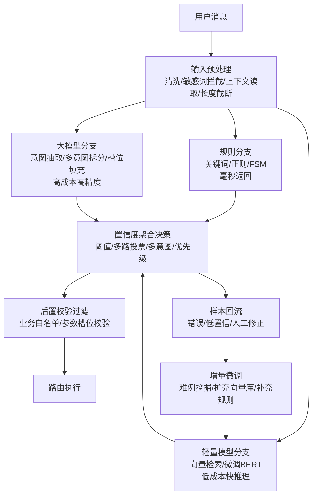

# 工业级 AI 意图识别架构设计

## 摘要

工业级意图识别的核心不是单纯提升准确率，而是构建兼顾延迟、算力成本、可运维、可迭代的完整架构。本文提出五模块混合架构：输入预处理（降噪）、多路并行识别分支（规则/轻量模型/大模型）、置信度聚合决策（阈值+投票+多意图）、后置校验过滤（白名单+槽位校验）、样本回流迭代（难例挖掘+增量微调）。相比串行漏斗，多路并行抗干扰更强、擅长多意图与歧义句，代价是算力消耗更高。ACL 2026、IJCAI-ECAI 2026 等研究验证了混合架构与置信度校准在生产环境的有效性。

**关键词**：意图识别；多路并行；置信度聚合；混合架构；工业级部署

## 一、问题背景

### 1.1 传统 NLP vs 大模型意图识别

传统方案（BERT 单标签分类）适合固定少量意图，缺点是新增意图需重新训练、泛化差、无法处理多意图和指代省略。大模型原生方案不用标注、新增意图不用训模型，但 token 成本高、P99 延迟不可控、容易幻觉误判。工业方案一定是混合架构，不是单一方案。

### 1.2 工业级核心挑战

- **延迟**：大模型 P99 延迟不可控，难以满足实时交互
- **成本**：全量大模型推理算力成本线性增长
- **可运维**：意图定义膨胀、模型静态不变导致效果衰减
- **可迭代**：新表达方式持续出现，需闭环反馈机制

## 二、五模块混合架构



<p align="center">图 1 工业级意图识别五模块架构</p>

### 2.1 输入预处理

用户原始消息进来，先做清洗：去除多余空格、表情、乱码；敏感词初步拦截；会话上下文读取（历史对话、当前槽位、用户身份、权限标签）；输入长度截断（超长文本直接截断或分片）。预处理目的：降噪，减少下游无效计算。

### 2.2 多路并行识别分支

三条线路同时跑，不是串行漏斗：

| 分支 | 方法 | 适用场景 | 延迟 | 成本 |
|------|------|----------|------|------|
| 规则分支 | 关键词、正则、有限状态机 | 高频无歧义指令（转人工/退出/查询余额） | 毫秒级 | 零算力 |
| 轻量模型分支 | 微调 BERT / 向量检索匹配 | 同义改写、常规业务请求 | 低 | 低 |
| 大模型分支 | LLM 意图抽取 | 歧义、多意图、跨任务、复杂指代 | 高 | 高 |

规则分支只维护稳定高频意图，避免规则爆炸。轻量模型分支承担大部分业务流量。大模型分支默认低优先级，只有前两路置信度不足才采信结果。

### 2.3 置信度聚合决策

三路分支返回各自的意图结果+置信分，统一聚合：

- **高于高阈值**：直接采信
- **高低阈值之间**：多路投票
- **全部低于阈值**：判定未知意图，拒绝路由，转人工兜底

支持多意图识别（一句话多个诉求一次性输出），意图优先级配置（冲突意图按业务优先级取舍）。

### 2.4 后置校验过滤

拿到聚合后的意图，不能直接路由，做两层校验：

1. **业务白名单校验**：判断该用户是否允许触发这个意图
2. **参数槽位校验**：判断必要参数有没有缺失，缺参数发起追问

提前拦截越权调用、参数不全的错误请求，防止下游系统被误调用。

### 2.5 样本回流与迭代

线上所有请求记录 query、识别结果、人工修正结果。把识别错误、低置信、人工干预的数据自动存入样本库。定时筛选难例，增量微调轻量模型、扩充向量库、补充规则库，持续降低长尾错误。

### 2.6 最小实现示例

```python
def recognize_intent(user_input, context):
    # 多路并行识别
    rule_result = rule_branch.match(user_input)        # 规则分支
    model_result = bert_classifier.predict(user_input) # 轻量模型分支
    llm_result = llm_extractor.extract(user_input)     # 大模型分支

    # 置信度聚合决策
    candidates = [rule_result, model_result, llm_result]
    best = max(candidates, key=lambda c: c.confidence)

    if best.confidence > HIGH_THRESHOLD:
        return route(best.intent, context)
    elif best.confidence > LOW_THRESHOLD:
        return vote(candidates, context)
    else:
        return escalate_to_human(user_input)

    # 后置校验在 route() 内执行：白名单 + 槽位校验
```

## 三、串行漏斗 vs 多路并行

| 维度 | 串行漏斗 | 多路并行 |
|------|----------|----------|
| 流程 | 先跑规则，命中直接返回，不跑后面 | 三条线同时推理，聚合层综合打分 |
| 优点 | 算力消耗更低 | 抗干扰更强，擅长多意图、歧义句 |
| 缺点 | 前面识别错误后面无机会修正，单点失效 | 算力消耗更高 |
| 适用场景 | 高并发客服类 | 复杂 Agent、一句话多诉求场景 |

## 四、常见工程坑

| 坑 | 说明 | 对策 |
|----|------|------|
| 意图无限膨胀 | 意图定义越多，识别混淆概率越高 | 意图合并，细粒度放到槽位 |
| 没有置信度直接采信 | 模型永远会给结果，幻觉导致误调用 | 配置置信阈值，低置信转人工 |
| 缺少回流机制 | 模型静态不变，新表达方式效果衰减 | 建立样本回流闭环 |
| 忽略上下文管理 | 脱离会话历史，指代省略识别失败 | 读取会话上下文和槽位 |

## 五、结论

工业级意图识别架构核心：不单一依赖大模型或传统分类模型，采用多分支混合识别；增加聚合决策、后置校验拦截错误调用；配套线上样本回流闭环持续迭代。在延迟、成本、准确率之间取得平衡，才是可落地的工业级架构。

**一句话总结**：多分支混合识别 + 置信度聚合 + 后置校验 + 样本回流闭环，在延迟/成本/准确率之间取得平衡。

## 参考文献

[1] Arora et al. ["Intent Detection in the Age of LLMs."](https://aclanthology.org/2024.emnlp-industry.114/) *EMNLP Industry Track*, 2024.

[2] Wang et al. ["Building Multi-turn Intent Classification with LLM-based Labeling."](https://aclanthology.org/2026.acl-long.230/) *ACL*, 2026.

[3] Intent Hub. ["Self-healing semantic agent routing."](https://ijcai-preprints.s3.us-west-1.amazonaws.com/2026/DM113.pdf) *IJCAI-ECAI*, 2026.

[4] FutureAGI. ["Intent Classification Evaluation Pipeline."](https://futureagi.com/blog/intent-classification-evaluation-pipeline-2026) 2026.

[5] 工业级 AI 意图识别架构设计. ["抖音视频."](https://v.douyin.com/ZqbovzGAGhU/)
