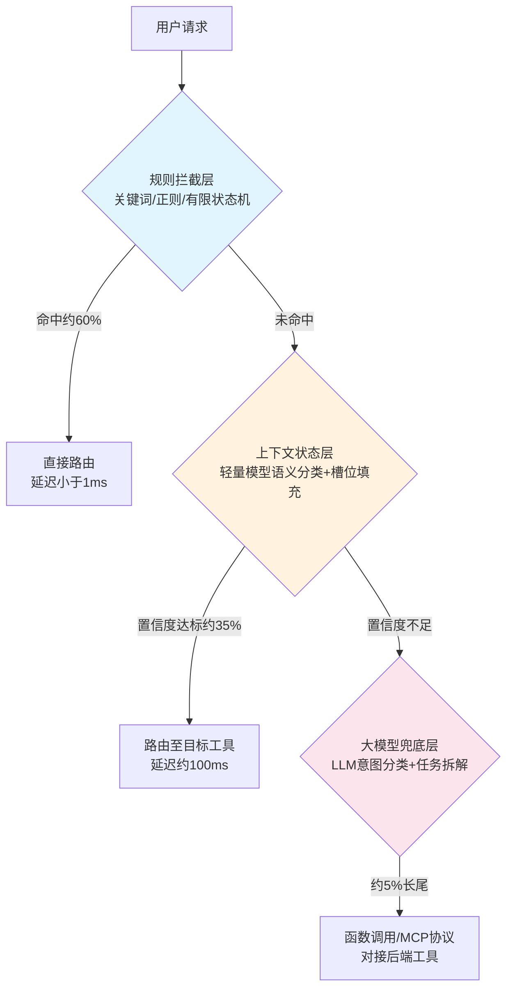

# 工业级Agent意图识别分层漏斗

**摘要**：意图识别是工业级 Agent 路由的总闸门，误判将导致全链路工具调用偏差。全量大模型方案存在延迟、成本、稳定性三重硬伤。本文提出分层漏斗架构：规则层拦截约 60% 高频意图（<1ms），上下文层处理约 35% 多轮指代（~100ms），大模型层兜底约 5% 长尾请求。三层按复杂度递进分配算力，兼顾准确率、低延迟与可控 GPU 成本，并给出技术选型、阈值设计、MVP 代码与监控指标。

**关键词**：意图识别；分层漏斗；规则路由；上下文状态；LLM 兜底；Agent 路由；成本优化

## 一、问题背景：全量大模型的三个硬伤

工业级 Agent 系统中，意图识别模块是整条链路的总闸门——它决定后续所有路由走向，一旦误判，下游工具调用、任务拆解全部偏离。

最直觉的方案是将所有请求无差别送入大模型。该方案在低流量验证阶段表现正常，但一上并发便暴露三个硬伤：

| 硬伤 | 表现 | 根因 |
|------|------|------|
| 延迟失控 | 单次推理 2000ms 起步，P99 随并发线性恶化 | 大模型推理耗时与并发队列堆叠放大等待 |
| 成本爆炸 | 简单指令也消耗 token，高峰期 GPU 开销超预算 | 未区分请求复杂度，贵算力被浪费在简单任务上 |
| 稳定性风险 | 大模型存在幻觉，意图分类偶尔跑偏 | 单一依赖 LLM，无确定性兜底 |

这三个问题构成"不可能三角"：准确率、低延迟、低成本难以同时成立。分层漏斗的核心思想是**按请求复杂度分配算力**，使三者同时可达。

## 二、分层漏斗架构



漏斗三层逐级过滤，每层只处理上一层无法确认的请求。关键设计原则：

- **规则层不无限堆砌**：只维护高频、稳定不变的意图，规则过多会导致冲突与维护成本爆炸。
- **上下文层不做重型推理**：使用轻量小模型完成语义分类与槽位填充，不消耗大模型算力。
- **大模型层绝不扛主流量**：仅作为最后兜底防线，处理前两层置信度不足的长尾请求。

### 2.1 层间协同与冲突解决

三层并非完全独立，需明确协同规则：

1. **信息传递**：规则层未命中时，将原始请求与规则匹配中间结果（如部分匹配的规则 ID）传递至上下文层，辅助轻量模型判断。
2. **冲突解决**：若规则层与上下文层同时命中但意图不一致，以规则层结果为准（确定性优先），同时将冲突案例记录至审计日志供后续分析。
3. **降级策略**：上下文层服务不可用时，规则层命中直接路由，未命中请求全部降级至大模型层，保证服务可用性。

## 三、第一层：规则拦截层

**定位**：高频固定意图，毫秒级响应，完全不消耗大模型算力。

**技术手段**：关键词匹配、正则表达式、有限状态机（FSM）。

**适用场景**：表达固定、无歧义的指令。例如：

- "转人工" → 人工客服路由
- "查询余额" → 账户查询工具
- "退出会话" → 会话终止

**设计要点**：

1. 规则按优先级排序，命中即返回，不做多余计算。
2. 每条规则附带置信度分数（精确匹配 1.0，正则匹配 0.9），供下游审计。
3. 规则变更走灰度发布，避免全量切换引入冲突。

## 四、第二层：上下文状态层

**定位**：承接规则漏下的约 35% 流量，处理多轮对话中的省略指代场景。

**核心挑战**：单独一句话无法判断意图，必须结合会话历史、当前激活任务与槽位信息。

**典型场景**：

> 用户前一轮："我要申请退款"
> 用户当前轮："那算了，不办了"

单独看"那算了，不办了"无法识别意图，需读取上下文才能判定为**取消退款申请**。

**技术选型**：

- 轻量小模型（如 1B-7B 参数）做语义分类与槽位填充
- 会话历史存储于 Redis，读取延迟 <5ms
- 槽位信息由上游任务状态机维护，支持多轮累积

**置信度机制**：该层输出置信度分数，低于阈值（建议 0.8）时升级至第三层。

## 五、第三层：大模型兜底层

**定位**：仅处理前两层置信度不足的约 5% 长尾复杂请求。

**适用场景特征**：

- 表达模糊、歧义强
- 跨多任务、多步骤组合
- 需要任务拆解与工具选择

**能力范围**：不仅做意图分类，还完成任务拆解、工具选择、参数提取，通过函数调用（Function Calling）或 MCP 协议直接对接后端工具。

**成本控制**：该层延迟最高（500-2000ms）、成本最贵，定位是最后兜底防线，绝对不能扛主流量。

## 六、工业实践要点

### 6.1 置信度阈值调优

| 阈值 | 效果 | 适用场景 |
|------|------|----------|
| 0.9 | 更多请求升级至 LLM，准确率最高，成本最高 | 对准确率敏感的业务 |
| 0.8 | 平衡点，多数生产系统推荐 | 通用场景 |
| 0.7 | 更多请求在中间层消化，成本最低 | 对延迟敏感的业务 |

阈值应通过离线标注集 + 线上 A/B 测试确定，并随业务迭代定期复核。

### 6.2 规则治理

- 规则数量上限建议 200 条，超出后合并同类项或迁移至语义层。
- 每周审计规则命中率，清理零命中规则。
- 规则冲突检测：新规则上线前与现有规则集做交集测试。

### 6.3 监控指标

| 指标 | 目标值 | 说明 |
|------|--------|------|
| 规则层命中率 | ≥55% | 设计目标约 60%，低于 55% 触发告警 |
| 上下文层命中率 | ≥30% | 低于此值说明轻量模型能力不足 |
| LLM 兜底率 | ≤8% | 高于此值说明前两层过滤不够 |
| 端到端 P99 延迟 | <200ms | 不含 LLM 兜底请求 |
| 意图识别准确率 | ≥95% | 离线标注集 + 人工抽检 |

## 七、意图评测

### 7.1 评测数据集构建

意图识别的评测依赖高质量标注集，构建流程如下：

1. **线上日志采样**：从生产环境抽取真实用户请求，覆盖各意图类别。
2. **人工标注**：由领域专家对每条请求标注真实意图标签，标注一致性需达到 κ≥0.85。
3. **数据集划分**：按 8:1:1 划分训练集、验证集、测试集，确保各意图类别比例一致。
4. **难例挖掘**：重点补充多轮省略指代、歧义表达、跨任务组合等易错样本。

### 7.2 评测指标

| 指标 | 定义 | 目标值 |
|------|------|--------|
| 准确率（Accuracy） | 正确识别的请求数 / 总请求数 | ≥95% |
| 精确率（Precision） | 某意图正确识别数 / 该意图被识别总数 | ≥93% |
| 召回率（Recall） | 某意图正确识别数 / 该意图真实总数 | ≥93% |
| F1 值 | 精确率与召回率的调和平均 | ≥93% |
| 混淆矩阵 | 各意图间的误判分布 | 用于定位薄弱意图 |

### 7.3 分层评测

除端到端评测外，需对每层单独评测以定位瓶颈：

| 层级 | 评测重点 | 方法 |
|------|----------|------|
| 规则层 | 规则覆盖率与冲突率 | 统计规则命中分布，检测未覆盖意图 |
| 上下文层 | 置信度校准能力 | 绘制可靠性图（Reliability Diagram），检查置信度与实际准确率是否匹配 |
| 大模型层 | 长尾识别准确率 | 对难例集单独评测，分析失败案例 |

### 7.4 在线评测

离线评测无法完全反映生产环境，需配合在线评测：

- **影子流量**：将 1-5% 真实流量同时送入新旧路由方案，对比结果差异。
- **人工抽检**：每日随机抽取 100 条路由结果，人工复核意图是否正确。
- **反馈闭环**：收集下游工具调用失败案例，反哺意图识别优化。

## 八、MVP 示例代码

以下为一个最小可行实现，展示三层漏斗的核心调度逻辑：

```python
import re
from dataclasses import dataclass
from enum import Enum
from typing import Optional

class RouteSource(Enum):
    RULE = "rule"
    CONTEXT = "context"
    LLM = "llm"

@dataclass
class RouteResult:
    intent: str
    confidence: float
    source: RouteSource
    latency_ms: float

# ========== 第一层：规则拦截 ==========
RULES = [
    (re.compile(r"转人工|人工客服", re.IGNORECASE), "human_agent", 1.0),
    (re.compile(r"查.*余额|余额.*查", re.IGNORECASE), "query_balance", 0.95),
    (re.compile(r"退出|结束会话", re.IGNORECASE), "exit_session", 1.0),
]

def rule_layer(text: str) -> Optional[RouteResult]:
    for pattern, intent, conf in RULES:
        if pattern.search(text):
            return RouteResult(intent, conf, RouteSource.RULE, 0.5)
    return None

# ========== 第二层：上下文状态层 ==========
def context_layer(text: str, session_history: list[str]) -> Optional[RouteResult]:
    # 简化示例：检测省略指代
    # 生产环境应替换为轻量模型推理
    if any(kw in text for kw in ["那算了", "不办了", "取消"]):
        if any("退款" in h for h in session_history):
            return RouteResult("cancel_refund", 0.85, RouteSource.CONTEXT, 80.0)
    return None

# ========== 第三层：大模型兜底 ==========
def llm_layer(text: str) -> RouteResult:
    # 生产环境应调用 LLM API 做意图分类
    # 此处为占位实现
    return RouteResult("complex_task", 0.7, RouteSource.LLM, 1500.0)

# ========== 漏斗调度器 ==========
def route(text: str, session_history: Optional[list[str]] = None) -> RouteResult:
    history = session_history if session_history is not None else []
    
    # 第一层：规则拦截
    result = rule_layer(text)
    if result:
        return result
    
    # 第二层：上下文状态
    result = context_layer(text, history)
    if result and result.confidence >= 0.8:
        return result
    
    # 第三层：大模型兜底
    return llm_layer(text)

# ========== 测试 ==========
if __name__ == "__main__":
    print(route("转人工"))                      # 规则层
    print(route("那算了不办了", ["我要申请退款"]))  # 上下文层
    print(route("帮我分析这个季度销售数据并生成报告"))  # LLM 层
```

## 九、效果与成本对比

以下为典型生产环境估算数据：

| 方案 | 平均延迟 | 日均 GPU 成本 | 准确率 |
|------|----------|--------------|--------|
| 全量大模型 | 2000ms | 100% | 约 92% |
| 分层漏斗 | 50ms | 15-25% | 约 95% |

分层漏斗将约 95% 的请求在毫秒级闭环，仅约 5% 长尾消耗大模型算力，综合成本降低约 75-85%。同时因规则层与上下文层的确定性更高，整体准确率反而优于全量 LLM 方案。

## 十、总结

分层漏斗通过按请求复杂度分配算力，使准确率、低延迟与低成本三者同时成立。该架构已在多个生产环境中验证，是工业级 Agent 意图识别的实用方案。

## 参考文献

<a id="ref-1"></a>[1] Chen, Z. et al. ["FrugalGPT: How to Use Large Language Models While Reducing Cost and Improving Performance."](https://arxiv.org/abs/2305.05176) *arXiv*, 2023.

<a id="ref-2"></a>[2] Ong, Y. et al. ["RouteLLM: Learning to Route LLMs with Preference Data."](https://arxiv.org/abs/2406.18665) *arXiv*, 2024.

<a id="ref-3"></a>[3] STAR. ["Steelmaking Task-Aware Routing for Multi-Agent LLM Expert Systems."](https://www.mdpi.com/2079-9292/15/4/720) *Applied Sciences*, 2026.

<a id="ref-4"></a>[4] Nova OS. ["The 3-Tier Routing Cascade: Rule-Based → Semantic → LLM."](https://blog.meganova.ai/the-3-tier-routing-cascade-rule-based-semantic-llm/) *Meganova Blog*, 2026.

<a id="ref-5"></a>[5] MLflow. ["LLM Routing in Production: Four Stages."](https://mlflow.org/articles/llm-routing/) *MLflow Blog*, 2026.

<a id="ref-6"></a>[6] CalibreOS. ["LLM Router and Model Cascade: Cost-Aware Query Routing at Production Scale."](https://www.calibreos.com/learn/genai-llm-router) *CalibreOS*, 2026.
