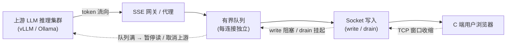
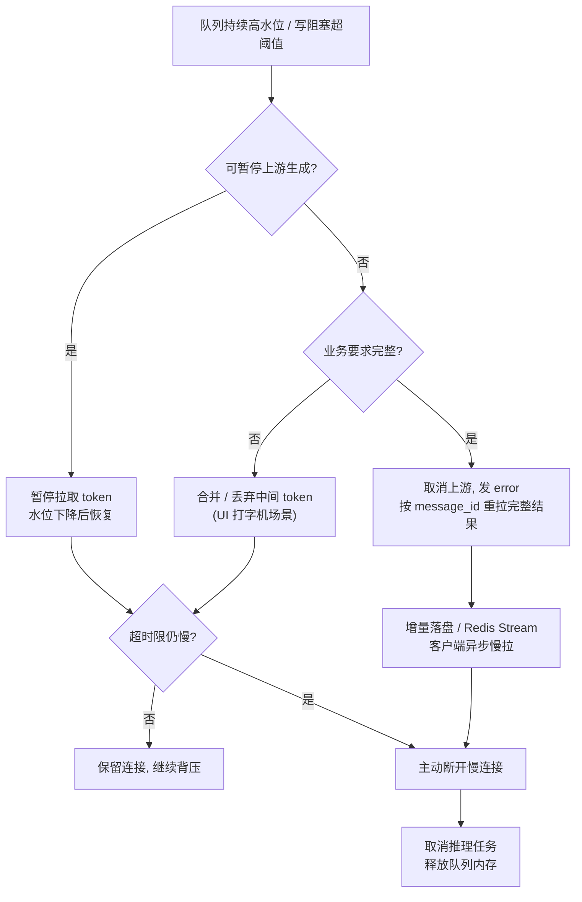

# 面向 SSE 流式转发的背压与内存治理研究

> 当上游大模型生成速率显著高于下游 C 端消费速率时，SSE 长连接会在服务端内存中累积待推送 token，最终引发内存暴涨乃至 OOM；治理的核心不是扩大缓存，而是重建并透传背压——用有界队列 + 暂停上游 + 慢连接处置三件套，把"内存承接慢消费者"的问题转化为"随时可安全断开慢消费者"的问题。

---

## 摘要

SSE（Server-Sent Events）是单向服务端推送协议，本身不携带应用层流控信息，仅依赖底层 TCP 背压。前向式代理在"上游大模型快、下游 C 端慢"的典型场景下，若业务代码贪婪地把上游输出全部读入内存（无界队列、整包读取、异步任务无限拉取），会切断背压，导致生产者速率恒大于消费者速率，服务端内存不可控增长并最终 OOM。本文综合三家大模型（豆包、DeepSeek、ChatGLM）对同一问题的处置方案，交叉验证后抽取出统一的分层治理框架：(1) 流式转发透传 TCP 背压；(2) 每连接独立有界队列，满则暂停上游甚至取消生成；(3) 慢连接识别与主动断开，配套落盘续传兜底；(4) 断连即时回收上游推理任务；(5) 入口网关关闭代理缓冲并做全局内存水位熔断。最后给出 Node.js / Python 的关键实现范式与监控指标体系。三家方案在"背压必须透传、禁止无界缓冲"上结论一致，分歧仅为落盘续传的优先级与降级策略取舍，均可调和。

**关键词**：SSE；背压；流式转发；有界队列；OOM 治理；慢消费者；断线续传

## 1. 引言与问题根源

**问题的产生条件**由三个促成因素叠加构成，见 [[2]](#ref-2)、[[3]](#ref-3)：

- **上游快**：LLM 推理侧（vLLM/Ollama 等）吐 token 速率极快，且作为独立异步生产者，**不感知**下游消费速度，也不会自动暂停。
- **下游慢**：C 端网络弱、客户端渲染慢、TCP 滑动窗口小，服务端 `write` 阻塞，消息积压在内存缓冲区。
- **背压缺失**：SSE 基于 `Transfer-Encoding: chunked` 长连接持续写入，协议层没有应用级流控 [[4]](#ref-4)，背压只能依赖底层的 TCP 窗口，一旦应用层把数据"先读进内存再转发"，TCP 背压即被切断。

当"上游生产 > 下游消费"持续成立，内存迟早耗尽。最终只能三选一：**让上游慢下来、丢弃/合并、落盘/转异步**，见 [[2]](#ref-2)。

### 1.1 两种典型的内存暴涨形态

根据 [[1]](#ref-1)、[[3]](#ref-3)，内存失控集中在两种来源：

- **框架内部缓冲区堆积**：Node.js response buffer、Python aiohttp/starlette 的 write queue 无上限积压，进程内存持续上涨。
- **业务自建无界队列**：把 token 丢进数组或 `asyncio.Queue` 不设上限，慢客户端连接直接将队列塞满；最典型的错误是先读全/攒满 `chunks` 整包再返回。

## 2. 分层治理框架

三家方案虽然表述不同，但可统一抽象为五层纵深防御，见图1：



<p align="center"><b>图1 SSE 背压透传与治理链路</b></p>

### 2.1 第一层：背压透传（流式转发）

**核心原则**：不打破 TCP 背压，让它透传——下游写不进去时暂停读上游，上游 TCP 窗口自然收缩、网关自然减速，见 [[3]](#ref-3)。

- **最稳做法是同步转发**：从上游读一块立即写下游，写阻塞就不读上游，见 [[2]](#ref-2)。这使下游窗口变小的反馈一路反压到上游代理，形成完整链条。
- 各语言实现要点见 [[3]](#ref-3)：Netty 检查 `channel.isWritable()`，不可写时 `setAutoRead(false)`；Node 用 stream 自带的 `highWaterMark`，`write()` 返回 false 时 `pause()` 上游、drain 后 `resume()`；Reactor/WebFlux 用 `onBackpressureBuffer(maxSize)` 等有界背压策略。

### 2.2 第二层：每连接独立的有界队列

生产者不能无脑推，需加带最大长度的阻塞队列 [[1]](#ref-1)：

- **队列满时暂停向 LLM 拉取 token**（对话场景不直接丢弃，避免丢 token），水位下降后恢复消费；
- **每个 SSE 连接独立队列，严禁全局共享**，防止一个慢用户拖垮所有连接（豆包与 DeepSeek 均强调此点）[[1]](#ref-1) [[2]](#ref-2)；
- 禁止无界队列/无界缓冲、先拼完整结果再发、另起异步读上游直接塞队列 [[2]](#ref-2)。

队列水位可分级治理 [[1]](#ref-1)：低水位全速推；高水位通知上游降采样/降速；硬上限处，对话场景暂停生成等待消费，非关键场景（日志、摘要）允许丢弃旧消息。

队列的填充速率关系可用下式表达：服务端某连接在时间段 $[0,t]$ 内的待推送量 $Q(t)$ 为上游到达量与下游消费量的积分差。

$$Q(t)=\int_0^t\bigl[\lambda_{up}(\tau)-\lambda_{down}(\tau)\bigr]\,d\tau$$

有界队列即对 $Q(t)$ 施加硬上限 $Q_{max}$：当 $Q(t)\rightarrow Q_{max}$ 时暂停上游读取，使得 $\lambda_{up}\rightarrow 0$，从而 $Q(t)$ 回落。背压治理的本质即"在 $Q_{max}$ 处反向切断上游供给"。

### 2.3 第三层：慢连接识别与主动断开

慢消费者不能无限等，需监控并主动处置：

- 监控指标：每连接缓冲区水位、排空速率（drain rate）、连续写阻塞时长 [[3]](#ref-3) [[2]](#ref-2)；
- 超过阈值（如缓冲持续满 10s、写超时 5s、空闲 30s、排空超时 30s）判定为慢连接，**主动断开**并同时取消上游 [[3]](#ref-3) [[2]](#ref-2)；
- **关键配套是断线续传**：把会话内容增量落盘（Redis/DB），客户端带 Last-Event-ID 或提交 offset 从断点续传，见 [[3]](#ref-3)。有了兜底才敢激进杀慢连接，不怕用户丢内容——这一步成功把"内存里扛住慢消费者"转化为"随时安全断开慢消费者"。

慢连接处置的完整决策流见图2：



<p align="center"><b>图2 慢消费者处置决策流</b></p>

### 2.4 第四层：断连回收上游任务

客户端断开后必须**立刻取消上游 LLM 请求** [[1]](#ref-1) [[2]](#ref-2)：

- 监听 `close` 事件，立即调用 upstream abort / cancel；
- 若不取消，LLM 仍在后台疯狂生成 token，白白占用 GPU + 内存，这是最常见的工程坑 [[1]](#ref-1)；
- 配合心跳包（SSE `: ping\n\n`）检测僵死连接，超时关闭连接并终止上游请求 [[1]](#ref-1)。

### 2.5 第五层：入口网关与全局水位熔断

- **关闭代理层 buffer**：nginx `proxy_buffering off` + 响应头 `X-Accel-Buffering: no`，Envoy 限制 per-connection buffer，溢出直接断开而非无限缓存 [[3]](#ref-3) [[2]](#ref-2)。但需注意适度缓冲其实能隔离慢客户端保护后端，应权衡 buffer 大小 [[3]](#ref-3)。
- **全局水位控制**：单机连接数上限、单用户并发 SSE 数限制；进程内存水位监控（如超 70% 熔断新请求、超 85% 踢掉最慢一批连接），做 **load shedding** 而非等 OOM [[3]](#ref-3)。
- **全局限流与隔离**：单连接缓冲上限（256KB～1MB）、全局内存配额、租户限流；用 cgroup 隔离流式代理，OOM 不影响核心服务 [[2]](#ref-2)。
- **规模化架构隔离**：单进程托管 SSE+LLM 极易 OOM，应拆分为"纯 CPU 的 SSE 网关（管长连接/队列/背压）"与"独立 LLM 推理集群（支持取消/暂停、OpenAI 兼容 stream）"，两者经 HTTP/gRPC stream 通信，使 SSE 服务 OOM 不影响推理、扩容解耦 [[1]](#ref-1)。

## 3. 关键实现范式

依据 [[3]](#ref-3)、[[2]](#ref-2) 提炼三类主流实现范式。

### 3.1 Node.js：stream 原生背压

Node 用流式内建背压 [[5]](#ref-5)，配 15s stall 检测主动中断；其底层机制是 `res.write()` 缓冲超 `highWaterMark` 时返回 false，据此 `pause` 上游、`drain` 后 `resume`：

```javascript
const axios = require('axios');

const STALL_TIMEOUT = 15_000; // 下游连续写阻塞 15s 判定为慢连接

async function handleChat(req, res) {
  res.setHeader('Content-Type', 'text/event-stream');
  res.setHeader('X-Accel-Buffering', 'no');
  res.flushHeaders();
  const ac = new AbortController();

  let stalledAt = 0; // 下游写阻塞起始时间戳
  const stallTimer = setInterval(() => {
    if (stalledAt > 0 && Date.now() - stalledAt > STALL_TIMEOUT) {
      ac.abort(); // 下游持续阻塞，取消上游
      res.destroy(new Error('slow consumer'));
    }
  }, 1000);

  try {
    const upstream = await axios.post(UPSTREAM_URL, { stream: true }, {
      responseType: 'stream', signal: ac.signal,
    });

    upstream.data.on('data', (chunk) => {
      if (res.write(chunk)) return;          // 可写，继续
      if (!stalledAt) stalledAt = Date.now(); // 写缓冲满，开始计时阻塞
      upstream.data.pause();                  // 暂停读上游，TCP 背压反馈回源头
      res.once('drain', () => {               // 排空后恢复，清零阻塞计时
        stalledAt = 0;
        upstream.data.resume();
      });
    });
    upstream.data.on('end', () => res.end());
    upstream.data.on('error', () => res.destroy());
  } catch (err) {
    res.destroy();
  }

  req.on('close', () => { ac.abort(); clearInterval(stallTimer); });
}
```

> 说明：Node 的 `pipe()` 已内建背压（写缓冲超限自动 `pause` 上游、`drain` 后 `resume`）[[5]](#ref-5)，若只求正确不求慢连接检测，`upstream.data.pipe(res)` 一行即可；上例手写 `res.write` 只是为了**显式暴露背压状态**以支撑慢连接超时判定。

手动转发时需自行处理背压，这是最容易踩的坑：`write()` 返回 false 时必须 `pause()` 上游、drain 后 `resume()`，绝不能无脑 `on('data')` 直接写。

### 3.2 Python：aiohttp 有界缓冲 / FastAPI 串行生成器

- **aiohttp**：`bytearray` 缓冲 + `asyncio.Event` 水位同步，缓冲超限时暂停读上游，stall 超时抛错主动断连 [[3]](#ref-3)。
- **FastAPI/httpx**：`StreamingResponse` 生成器串行拉取天然自带背压——只需逐 chunk `yield`，消费端写不出去时生成器挂起、httpx 流读取随之暂停；**严禁先把数据攒进 list 再返回** [[3]](#ref-3)。

```python
from fastapi import FastAPI, Request
from fastapi.responses import StreamingResponse
import httpx

async def stream_llm(payload, client):
    async with client.stream("POST", UPSTREAM_URL, json=payload) as resp:
        async for line in resp.aiter_lines():
            if line.startswith("data: "):
                yield f"{line}\n\n"

@app.post("/chat")
async def chat(req: Request):
    client = httpx.AsyncClient(timeout=httpx.Timeout(None, read=15))
    return StreamingResponse(stream_llm(await req.json(), client),
                             media_type="text/event-stream",
                             headers={"X-Accel-Buffering": "no"})
```

## 4. 工程要点与避坑指南

依据 [[1]](#ref-1)、[[2]](#ref-2)、[[3]](#ref-3) 汇总的常见错误与其修正：

| 错误做法 | 后果 | 正确做法 |
|---|---|---|
| 只用无限队列，`queue.put()` 永不阻塞 | LLM 疯狂塞 token，内存爆炸 | 有界队列，满则阻塞/暂停上游 |
| 忘记 `drain()` | write 直接丢进内核 buffer，感知不到客户端慢 | 每次写后 `await res.drain()` |
| 客户端断开后不取消上游 | GPU 持续生成 token 丢进失效连接 | close 事件立即 abort 上游请求 |
| 全局共享队列 | 一个慢用户拖垮所有连接 | 每连接独立队列 |
| 把完整历史文本存在连接内存 | 内存随历史增长 | 只保留待推送 token，历史放 Redis/存储 |
| 先一次性读全/攒满 chunks 再返回 | 背压完全失效 | 流式逐块转发 |
| 漏掉断线续传 | 不敢断开慢连接 | 落盘 + Last-Event-ID 续传兜底 |

## 5. 监控指标体系

三份回答在大规模运营指标上口径一致 [[2]](#ref-2) [[3]](#ref-3)，核心包括：

- 每连接缓冲字节数 / 队列深度分布；
- 慢连接数量、主动断开率、续传成功率；
- 写阻塞时间、上游读取速率与下游写入速率；
- SSE 并发连接数、全局内存水位、OOM 事件计数。

**告警信号**：慢连接占比突增往往意味着下游网络故障或攻击，应立即处置 [[3]](#ref-3)。

## 6. 三源交叉验证说明

本论文为同一问题（三家平台分别给出的一次性方案问答）的整合提炼。三家在"背压必须透传、禁止无界缓冲、慢连接必须主动处置"三方面**结论一致**；分歧点在于：(1) ChatGLM 更强调落盘续传作为"敢断开"的前提 [[3]](#ref-3)，豆包将其列为超大流量的"慎用"选项 [[1]](#ref-1)——可按业务确定性要求取舍；(2) DeepSeek 补充了网关 buffer 与 cgroup 隔离等部署层细节 [[2]](#ref-2)，与其他两家互补而非冲突。因此【当前采信结论】：以流式转发透传背压为纲，有界队列 + 暂停/取消上游为骨，慢连接断开 + 断线续传 + 全局水位熔断为兜底，五层纵深防御体系成立。

## 7. 参考文献

<a id="ref-1"></a>[1] 豆包. ["SSE 下游慢及 OOM 处理方案（会话分享）."](https://www.doubao.com/chat/38441372338426114) *豆包*, 2026.  
<a id="ref-2"></a>[2] DeepSeek. ["SSE 下游慢内存暴涨处理（会话分享）."](https://chat.deepseek.com/a/chat/s/9c925d7b-8a24-48ed-b6f1-cacd9e64719e) *DeepSeek*, 2026.  
<a id="ref-3"></a>[3] ChatGLM. ["SSE 内存暴涨问题处理（会话分享，含重新生成 Node/Python 版）."](https://chatglm.cn/main/alltoolsdetail?t=1789393742280&lang=zh&cid=6aa7fb52bcfb614d92c665de) *智谱清言*, 2026.  
<a id="ref-4"></a>[4] MDN Web Docs. ["Server-Sent Events."](https://developer.mozilla.org/en-US/docs/Web/API/Server-sent_events) *MDN Web Docs*, 2026.  
<a id="ref-5"></a>[5] Node.js Documentation. ["Backpressuring in Streams."](https://nodejs.org/en/learn/modules/backpressuring-in-streams) *Node.js*, 2026.