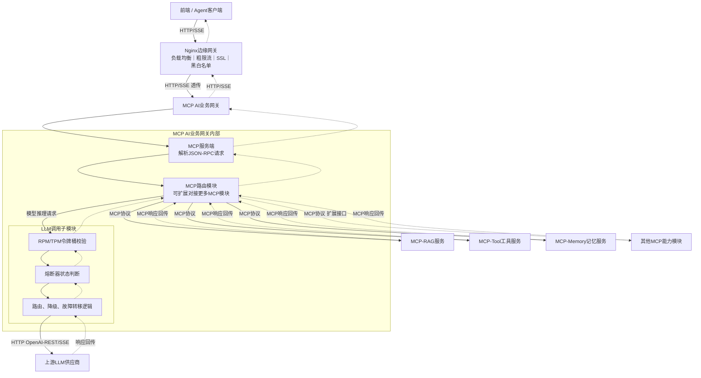
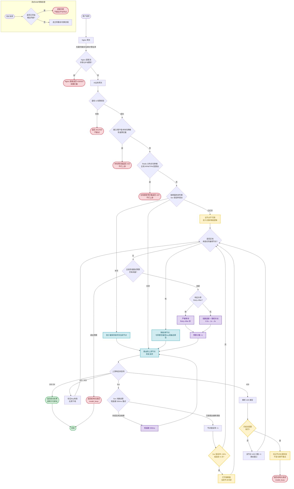

# 面向大模型服务的动态路由与流量治理架构研究

> 提出「Nginx 边缘网关 + AI 业务网关」双层动态路由架构，以 RPM/TPM 双配额令牌桶、5xx 驱动熔断与 429 配额感知切换分离的调度策略，结合 SSE / 非幂等 / 长上下文差异化容错，解决企业级 LLM 调用的 429 限流与业务连续性问题。

---

## 摘要

随着大语言模型（LLM）在企业级场景的深度落地，高并发调用导致上游服务频发429（Too Many Requests）限流错误，严重影响业务连续性。大模型的限流不仅包含传统的并发请求数（RPM），更涉及Token消耗配额（TPM），使得传统网关的限流策略难以直接适用。本文提出并实现了一种基于"Nginx网关 + AI业务网关"的双层动态路由与流量治理架构。该架构通过多维度前置限流拦截、**5xx频率驱动熔断与429配额感知切换相分离的调度语义**、灰度回切的故障转移策略，结合针对流式响应（SSE）的特殊容错机制，有效解决企业场景下RPM/TPM双重配额约束带来的调度难题，在复杂网络环境和严格配额约束下保障系统高可用性与调用成本可控。

**关键词**：大语言模型；Nginx网关；API网关；流量治理；熔断器；智能降级；429限流

---

## 1 引言与背景挑战

在大模型服务化架构中，上游服务商（如OpenAI、Anthropic等）通常对API实施严格的配额管理。当调用方的RPM（Requests Per Minute）或TPM（Tokens Per Minute）超出阈值时，服务端将返回HTTP 429状态码。传统静态路由架构在处理429时，往往采用简单的重试机制，这不仅无法解决配额耗尽的本质问题，反而可能引发"惊群效应"，导致上游服务雪崩。

现有开源与商用AI网关（LiteLLM [[1]](#ref-1)、Portkey [[2]](#ref-2)、APISIX-AI）虽已初步支持故障转移与fallback，但普遍存在三点短板：（1）对RPM+TPM双配额建模粗糙，缺少预估扣减+事后退款的令牌生命周期管理，多实例部署易出现配额超发；（2）流式SSE异常容错逻辑简陋，重试策略缺少约束，容易造成输出重复、语义错乱；（3）异构模型降级多采用硬编码映射，缺少能力标签校验，在Agent工具调用场景下容易降级至不支持Function Call的模型，引发业务报错。

除此之外，大模型调用具有单次请求耗时长、网络带宽占用大、部分场景上下文非幂等等独特属性。因此，设计一套能够动态感知节点健康状态、支持细粒度配额管理并进行智能调度的网关层架构，成为解决上述痛点的关键。

## 2 相关工作

现有大模型API网关系统为大模型调用提供基础路由与故障容错。LiteLLM [[1]](#ref-1) 提供基础的多模型路由、重试与fallback机制，但缺少RPM/TPM联合配额管控，未针对SSE流式请求设计独立容错逻辑。Portkey [[2]](#ref-2) 支持模型降级、缓存与可观测性，但其降级策略为静态配置，缺少基于能力标签的候选模型筛选，无法约束降级后的模型能力。APISIX-AI插件在网关层集成LLM路由，侧重于流量转发，缺少独立熔断状态机与灰度回切机制。FrugalGPT [[3]](#ref-3) 侧重于通过提示压缩、模型选择降低推理成本，并未解决上游API限流429的流量治理问题。

区别于上述系统，本文提出的双层网关架构，实现RPM+TPM联合配额令牌桶，基于能力标签约束异构降级，针对SSE长流、非幂等请求做差异化容错，并引入**熔断与配额切换双通道解耦**与灰度回切的完整闭环，解决企业级大模型服务中配额耗尽、突发限流带来的业务连续性问题。

## 3 系统架构与全链路流量模型

### 3.1 总体架构设计

本系统采用边缘流量治理（Nginx）与核心业务调度（AI业务网关）解耦的双层架构。流量从Nginx接入，经过粗粒度安全与并发过滤后，进入AI业务网关执行细粒度鉴权、令牌桶限流、熔断状态判断及动态路由调度。

当AI业务网关以MCP网关形态落地时，内部进一步细化为：MCP服务端解析JSON-RPC请求，MCP路由模块统一编排RAG/Tool/Memory等能力模块，并将模型推理请求下沉到内置令牌桶、熔断器与路由逻辑的LLM调用子模块。请求全生命周期处理流程如图2所示。

<b>图1 MCP AI业务网关总体架构</b>

双层架构的核心优势在于职责分离：Nginx层专注于高性能连接管理、安全过滤与粗粒度并发控制；AI业务网关专注于模型维度的业务调度、配额管理、熔断降级等大模型专属逻辑。

### 3.2 全链路调度状态机

<b>图2 双层网关全链路调度状态机</b>

**调度语义的通道分离**：本架构将常见网关的"单一大熔断器"拆分为两条语义独立的通道——

1. **5xx 熔断通道（错误率驱动）**：面向服务端真实故障（过载、崩溃、网络故障）。以滑动窗口错误率（>30% 或连续 N 次）触发熔断器 Open，具备恢复探测与灰度回切，见 4.2.2 与 4.2.3。
2. **429 配额通道（配额感知切换）**：面向上游配额耗尽（RPM/TPM/月度）。429 不累积到熔断器的错误率统计，而是按节点独立滑动窗口计数，驱动"同模型换 Key → 异构降级"的切换；月度配额用尽直接标记长期失效、不切换不重试。两通道互不污染计数字段，避免状态机出现"每次 429 都切节点导致熔断计数永不触顶"或"429 被并入错误率错误触发硬熔断"的耦合。

## 4 核心技术与算法实现

### 4.1 边缘流量调度与安全防护（Nginx网关层）

作为系统入口，Nginx承担高并发连接管理与非业务属性的流量治理：

1. **高可用负载均衡**：采用L7负载均衡，基于一致性哈希算法将请求分发至后端的多个AI网关实例，避免单点过载。Nginx 限流模块（`limit_req`/`limit_conn`）的使用方式遵循官方文档 [[4]](#ref-4)。
2. **安全与访问控制**：集中处理SSL/TLS卸载，释放后端CPU资源。并基于allow/deny指令实现IP黑白名单过滤，拦截恶意爬虫与DDoS攻击流量。
3. **粗粒度并发限流**：利用Nginx的`limit_req`和`limit_conn`模块，对单IP或全局并发连接数进行限制。超限流量在进入AI网关前即被拒绝（返回429/503），有效防止下游服务被突发流量击垮。

### 4.2 动态模型路由决策中枢（AI业务网关层）

AI业务网关是动态调度的核心，实现了细粒度的流量控制与节点自适应管理。

#### 4.2.1 RPM+TPM联合令牌桶（两级：本地 + 分布式）

大模型同时存在请求数与Token总量两类配额，网关采用**两级令牌桶**设计：

- **本地令牌桶（单实例快速路径）**：为接口/用户级维度维护内存态令牌桶，用于高频请求的快速预拦截。命中即本地返回429，不产生跨实例网络IO（Redis RTT）。
- **分布式令牌桶（Redis 全局权威）**：多网关集群场景下，以Redis实现全局RPM/TPM配额池，作为配额判定的**最终权威**，解决本地桶多实例超发问题。本地桶未命中时，请求仍需redis精确扣减；本地桶可短期超额放行上游可用份额，由分布式桶做最终校验。

配额计费采用**预扣预估Token + 响应后令牌退款**机制。请求入网关时基于输入长度+预估输出长度扣减TPM令牌（估算模型见公式 1）；上游返回真实Token消耗后，将预估与真实消耗的差值做令牌返还，修正配额精度。令牌生成速率依据上游服务商的RPM/TPM配额动态设定。**退款按请求ID绑定**：无论流式/非流式，结算单位都是该请求最终实际产生消耗的最后一次上游调用，切换节点不会造成预估与真实差额的多节点重复计费。

$$E_{tokens} = \alpha \cdot |input| + \beta \cdot |output|$$

<b>公式1 TPM 预估代币数</b>

其中 $|input|$、$|output|$ 分别表示输入与预估输出长度，$\alpha$、$\beta$ 为按模型校准的 token 密度系数，初始取默认值并随真实 usage 回流迭代校准。

#### 4.2.2 熔断器状态机（5xx 通道）

熔断器状态机模式源自 Fowler 的 CircuitBreaker 实践 [[5]](#ref-5)，本文在此基础上为每个上游模型节点维护独立的熔断器，仅统计 **5xx 错误率**（429 走配额通道，见 4.2.4）。采用滑动窗口统计，状态转换逻辑如下：

- **Closed（关闭态）**：正常转发请求。
- **Open（打开态）**：当滑动窗口内5xx错误率超阈值（如>30%，或连续5次失败），节点被隔离，请求直接进入切换逻辑，不再请求该上游。
- **Half-Open（半开态）**：冷却期（如60s）后放行少量探测请求，验证节点恢复情况。成功则恢复Closed，失败则继续Open。

熔断统计口径区分流式请求：SSE长请求以请求**发起时刻**计入统计，而非流结束时刻，避免长耗时请求延迟错误上报。

#### 4.2.3 灰度回切策略

当半开探针连续多次成功，判定上游节点恢复，不会一次性全量切回流量。采用渐进式灰度机制，逐步将流量从降级备选模型迁回原主节点，每次小幅提升流量比例，持续观测429与错误率指标，防止瞬间流量冲击再次触发限流熔断。

#### 4.2.4 429 配额感知通道

429 作为配额信号的语义与 5xx 完全不同，需按根因细分处理：

- **短时 RPM 超限 / TPM 令牌耗尽**：该节点当前配额窗口紧张——按 4.3 切换路径调整节点（换同模型 Key 或降级），同时对该节点 429 做滑动窗口计数（不计入熔断错误率）。
- **月度总配额用尽**：预算层面上游已不再放量，重试与切换均无意义。网关直接标记该节点长期失效，返回 `model_busy`，直至下月配额重置，不参与任何重试。

同时通过 Slack/Webhook 告警：当某模型节点 5 分钟内 429 发生率突增，或某 API Key 连续被上游拒绝，自动下线该 Key 并通知运维更换配额。

### 4.3 自适应降级与故障转移算法

当节点触发熔断（5xx 通道）或返回 429（配额通道）时，网关不进行原地阻塞等待，而是触发动态路由调度。算法遵循严格的优先级路径：

1. **同模型节点切换（故障转移）**：优先将请求路由至相同模型的其他健康备用Key或实例。此操作延迟最低，对调用方完全无感知。
2. **异构模型降级（能力标签驱动）**：若同模型节点全量不可用，基于模型能力标签体系筛选候选池。标签分为硬性约束（多模态、Function Call支持、最大上下文长度）与软性约束（推理速度、成本、输出质量）。降级必须满足全部硬性标签；软性指标可放宽。同时支持租户/接口粒度开关`allow_fallback`，Agent工具调用场景默认关闭自动异构降级，防止函数调用格式不兼容。降级成功后，在响应头打上`X-Downgraded: true`标记，同时返回`X-Fallback-Model`，供上层业务感知与决策。
3. **退避重试保底策略**：当无可用备用节点时，依据响应头`Retry-After`严格等待。若无该头部，则执行指数退避加随机抖动（0.5s→1s→2s）。引入随机抖动是关键，可防止多个并发请求在退避后同时醒来形成二次流量尖峰。
4. **全请求级重试预算**：为避免 5xx 重试、换节点、退避重试三个循环叠加放大，网关维护统一的请求级预算（如**总外部重试 ≤3 次、换节点 ≤2 次**）。任一维度触顶即返回 `model_busy`，杜绝长尾请求在多个循环间无限穿越。

## 5 边界场景与容错策略

大模型调用具有特殊性，网关在设计时必须处理以下边界场景：

1. **429错误细分处理**：网关解析上游返回报文，区分三类429：短时RPM超限、TPM令牌耗尽、月度总配额用尽。月度配额耗尽场景，直接标记节点长期失效，不再重试；前两者触发**配额感知切换**（4.2.4），而非简单重试。
2. **流式响应（SSE）中断机制**：对于已开始数据推送的流式请求，若中途发生429或5xx，网关直接中断SSE连接。严禁断点续推或切换节点重试，否则会导致前端拼接内容出现语意断层或重复。
3. **非幂等请求保护**：对计费类、文件上传类等非幂等接口，遇到异常时绝对禁止重试，防止重复扣费或数据不一致。
4. **长上下文请求处理**：携带海量Token的长上下文请求重试成本极高，且极易因TPM耗尽而触发429。针对此类请求，网关应降低重试次数甚至直接拒绝重试，快速返回`model_busy`，其消耗的预估 Token 在触发重试前即按请求ID全额退款，避免长上下文挤占配额又不产出结果。
5. **降级副作用防护**：异构降级后增加轻量级结果校验，校验是否满足硬性能力要求（如Function Call场景校验是否返回合法tool_call结构），校验失败则自动尝试下一个备选模型。

## 6 监控与可观测性

系统的稳定运行依赖于全链路的可观测性。网关在处理过程中进行关键指标埋点：

- **限流与熔断指标**：各模型本地预拦截429计数、Redis全局配额拦截计数、上游真实429计数（按类型细分：RPM/TPM/月度）、各节点熔断器状态（Open/Closed持续时间）。
- **调度指标**：同模型切换成功率、异构模型降级触发频率、灰度回切流量比例、请求级预算触顶频率。

此外，熔断与配额两通道分别独立埋点，运维可据此判断「服务端故障占比 vs 配额耗尽占比」，指导扩容（升节点）或加购（升配额）。

## 7 结论与展望

本文提出的双层网关架构，将Nginx的高并发流量治理能力与AI业务网关的智能调度策略深度融合。通过多级限流前置拦截、**5xx错误率熔断与429配额感知切换的通道分离**、以及自适应故障转移与能力标签驱动的模型降级，成功构建了具备动态模型路由能力的高可用系统。该架构有效化解了上游模型服务配额受限引发的429限流痛点，在保障系统吞吐量的同时，实现了业务层的平滑过渡与调用成本优化。

**局限性**：模型能力标签依赖人工配置维护；Redis分布式令牌桶会引入少量网络延迟；降级策略为预定义规则，缺少基于历史调用数据的动态策略自优化；灰度回切的流量比例目前靠人工调参，缺少自动寻优。

**未来工作**：引入请求语义与Token消耗预测模型，实现更精准的TPM预扣；基于强化学习动态调整降级候选优先级，实现自适应的多目标（成功率、延迟、成本）调度优化；对灰度回切引入在线实验（如 Epsilon-greedy）自动调参。

---

## 参考文献

[1] LiteLLM. ["LiteLLM: Open Source LLM Gateway."](https://docs.litellm.ai) *LiteLLM Documentation*, 2024.
[2] Portkey. ["AI Gateway for Enterprise LLM Operations."](https://portkey.ai) *Portkey*, 2024.
[3] Q. Zhang et al. ["FrugalGPT: How to Use Large Language Models in a Cost-Effective Way."](https://arxiv.org/abs/2305.05176) *arXiv:2305.05176*, 2023.
[4] Nginx. ["NGINX Rate Limiting."](https://www.nginx.com/blog/rate-limiting-nginx) *Nginx*, 2024.
[5] M. Fowler. ["CircuitBreaker."](https://martinfowler.com/bliki/CircuitBreaker.html) *martinfowler.com*, 2014.