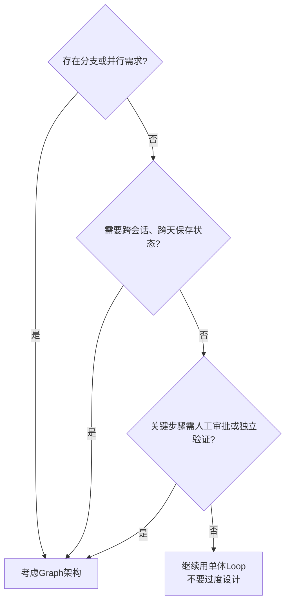

# Loop与Graph选型对比

## 三问判断流程图

## 核心结论

- Loop 与 Graph 的**适用边界不同**，没有谁更先进，只有谁更匹配任务特征。
- 判断顺序：先跑**三问判断法**（都不需要就继续用 Loop），再算**四笔成本账**，最后对照**适用边界**确认。
- Graph 不是银弹：+90.2% 的表现提升伴随约15× 的 Token 消耗，**很多性能提升来自更多搜索、更多推理和更多验证**。

## 要点拆解

### 六维核心对比

| 比较维度 | 单体 Loop | Graph 架构 |
|----------|-----------|------------|
| 上下文 | 集中，容易累积噪声 | 节点之间可以隔离，上下文干净 |
| 验证方式 | 同一节点自查，自写自审 | 配置独立验证节点，生产与审核分离 |
| 执行效率 | 单线串行，无并行能力 | 支持分支判断和多节点并行 |
| 失败恢复 | 可能大范围重跑，成本高 | 从检查点精准恢复，保留已有产物 |
| 开发成本 | 起步快、结构简单 | 状态管理和治理成本更高 |
| 生产治理 | 几乎不可控，黑盒运行 | 支持暂停、审批、审计、追溯 |

### 成本账本

行业实测数据三数字：

- **+90.2%**：部分公开检索评测中的表现提升案例
- **约15×**：多智能体相对普通对话的 Token 消耗案例
- **约80%**：特定评测中，Token 用量解释的性能方差

升级前算清四笔账：

1. **值｜结果价值**：成功完成任务能创造多少实际收益，是否覆盖额外成本
2. **钱｜运行成本**：模型调用、搜索、存储、基础设施的直接开销
3. **时｜时间成本**：调度、等待、独立验证引入的延迟，是否在可接受范围
4. **维｜维护成本**：状态管理、路由配置、权限控制、异常治理的长期运维成本

### 三问判断法

1. **执行结构**：任务是否存在明显的分支或并行需求？
2. **生命周期**：任务是否需要跨会话、跨天保存状态？
3. **治理要求**：关键步骤是否需要人工审批或独立验证？

> 都不需要：继续用单体 Loop，不要过度设计；存在明确需求：再考虑 Graph 架构。

### 适用边界

✅ **保留 Loop 的场景**
- 目标单一且完成条件清楚
- 路径简单，没有明显分支
- 一次会话内可以完成
- 工具较少且边界清楚

✅ **考虑 Graph 的场景**
- 不同阶段的上下文会互相污染
- 搜索空间大，需要并行探索
- 不同步骤需要不同工具和模型能力
- 需要审批、检查点或独立质量校验

### 案例对比：同一个简报任务的两种方案

**方案A：所有工作装进一个 Loop**
流程：搜索网页 → 整理资料 → 撰写简报 → 自我审核
缺点：网页噪声累积、全流程串行、自己审核自己、失败可能整体重跑。

**方案B：拆成一个微型 Graph**

1. **研究员**：并行采集多个信源，输出结构化笔记（**上下文隔离**）
2. **写作者**：使用隔离的干净上下文，输出简报草稿（**资料并行采集**）
3. **审稿人**：按独立标准检查结果，判定 通过 / 返回（**生产验证分离**）

## 相关页面

- [[单体Loop结构性瓶颈]]：Loop 侧的五个天花板
- [[Graph图编排架构]]：Graph 侧的能力来源
- [[Agent生产落地实践]]：选定 Graph 之后怎么做
- [[独立验证机制]]：方案B 审稿人节点的机制本体
- [[上下文污染]]：方案A 网页噪声累积的理论形态

## 参考来源

- [[raw/articles/Loop之后为什么是Graph.md]]
