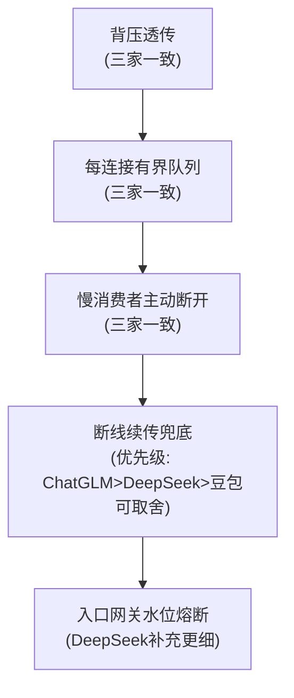

# SSE背压方案三源对比

## 三源横向对比

| 维度 | 豆包 | DeepSeek | ChatGLM |
|------|------|----------|---------|
| 背压透传 | 强调不打破，队列满暂停/取消上游 | 同步转发最稳，写阻塞即不读上游 | 背压必须透传不打破，Node/Python/Netty多语言示例 |
| 有界队列 | 每连接独立队列，分级水位治理 | 每连接有界缓冲 + 禁止无界channel | 有界队列256KB溢出丢弃/合并压缩 |
| 慢消费者处置 | 高水位通知降速，硬上限暂停 | 暂停上游/取消+error/合并token/落盘/Kafka | 慢连接识别、主动断开+断线续传 Last-Event-ID |
| 断线续传 | 列为超大流量下"慎用"选项 | 提及但不强调 | 作为"敢断开"的核心前提，落盘+偏移续传 |
| 部署层细节 | 单进程拆SSE网关与LLM集群 | 网关关闭buffering、cgroup隔离、全局内存配额、连接上限 | 入口层proxy_buffering off、全局水位70%熔断/85%踢最慢 |

## 结论一致性

- **三家一致**：背压必须透传、禁止无界缓冲、慢连接必须主动处置。
- **分歧点1**：落盘续传优先级——ChatGLM更强调（作为敢断开的前提），豆包列为超大流量慎用选项，按业务确定性要求取舍。
- **分歧点2**：DeepSeek补充网关buffer关闭与cgroup隔离等部署层细节，与其他两家互补而非冲突。

## 合并后的统一框架

→ 五层纵深防御：[[SSE背压与内存治理总览]]

## 相关页面
- [[SSE背压与内存治理总览]]：合并后的统一五层框架
- [[背压透传]] [[SSE有界队列]] [[慢消费者处置]] [[断线续传]] [[入口网关水位熔断]]：各层细节
- [[SSE流式容错]]：SSE重试容错策略（同属SSE治理）

## 参考来源
- [[raw/papers/面向SSE流式转发的背压与内存治理研究.md]]