# 上下文爆炸治理方案对比

## 核心结论

上下文爆炸的根源是**把不该进上下文的内容塞进了窗口**。治理方案三大类：**路由/裁剪**（源头少进）、**压缩/出窗**（存量瘦身）、**结构化/架构**（根本解）。2026 年共识：**把窗口当预算分配，而不是当天花板撞**。能否在冲突时找回原始历史验证，取决于是否遵循「存储与呈现分离」——压缩只允许发生在可恢复的内容上。

## 总体框架

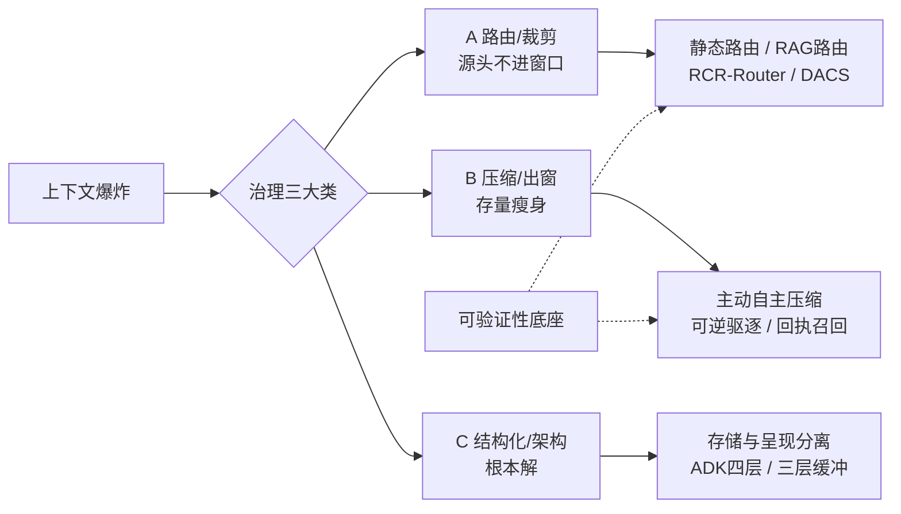

## 汇总对比矩阵

| # | 方法 | 类别 | 能否加载回上下文 | 冲突时找回原始历史 | 可逆性 |
|---|------|------|----------------|------------------|--------|
| 1 | 静态路由 | 路由/裁剪 | 本就常驻窗口 | 直接对比模板 | 不涉及 |
| 2 | 全上下文广播 | 路由/裁剪 | 本就常驻窗口 | 完整可查 | 不涉及（爆炸源） |
| 3 | RCR-Router | 路由/裁剪 | 按角色召回子集 | 可找回（外部存储） | 可逆 |
| 4 | DACS | 路由/裁剪 | Focus 物化完整上下文 | 可找回（确定性重载） | 可逆 |
| 5 | Agent-Radar | 路由/裁剪 | 注意力回升时重注入 | 部分（时间戳回放） | 部分 |
| 6 | 动态路由 RAG | 路由/裁剪 | 检索即加载 | 可找回（原始 chunk） | 可逆 |
| 7 | 滑动窗口 | 路由/裁剪 | 无（已删除） | 不可找回 | **不可逆** |
| 8 | 被动摘要 | 压缩/出窗 | 摘要占位 | 存原文则可、否则丢失 | 部分 |
| 9 | Focus 主动压缩 | 压缩/出窗 | Knowledge 块召回 | 可找回（外部存档） | 可逆 |
| 10 | 递归/分层摘要 | 压缩/出窗 | 逐层下钻 | 保底层则可、否则部分 | 部分 |
| 11 | ACE 编排器 | 压缩/出窗 | 按需 swap 段 | 可找回（undo 链） | **强可逆** |
| 12 | TokenPilot 驱逐 | 压缩/出窗 | 时间戳/key 召回 | 可找回（驱逐清单） | 可逆 |
| 13 | TokenPilot 入口压缩 | 压缩/出窗 | 前缀稳定即命中缓存 | 查 ingestion 日志 | 可逆 |
| 14 | 代码执行模式 | 压缩/出窗 | 沙箱查询按需取 | 可找回（沙箱重算） | 可逆 |
| 15 | 可逆驱逐（回执） | 压缩/出窗 | recall_result(id) 拉回 | 可找回（默认判据） | **可逆** |
| 16 | 截断策略 | 压缩/出窗 | 无 | 不可找回 | **不可逆** |
| 17 | LLMLingua | 压缩/出窗 | 压缩版进窗 | 自备原文则可 | 部分 |
| 18 | ADK 四层 | 结构化/架构 | 重编译视图 | 可找回（Session 唯一事实源） | 可逆 |
| 19 | 三层缓冲 | 结构化/架构 | retrieval 调用即加载 | 可找回（摘要时间线下钻） | 可逆 |
| 20 | 输出过滤门卫 | 结构化/架构 | 过滤结果进窗 | 可找回（完整响应旁路） | 可逆 |
| 21 | 上下文变量 | 结构化/架构 | 变量每轮注入 | 部分（版本化可回滚） | 部分 |
| 22 | KV-Cache 复用 | 结构化/架构 | 缓存命中 | 不涉及内容 | 与内容无关 |
| 23 | 工具渐进披露 | 结构化/架构 | 用到时注入 | 可找回（schema 静态文件） | 可逆 |
| 24 | 提前阈值压缩 | 结构化/架构 | 由底层方法决定 | 由底层方法决定 | 触发策略 |

---

# A 组：路由/裁剪（7 种）

## A1. 静态路由

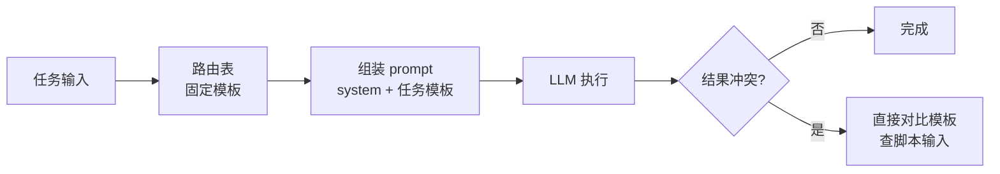

**实现**：启动时按固定模板拼 prompt。**加载回**：无加载，内容常驻。**冲突验证**：模板即原始，直接对比。

## A2. 全上下文广播

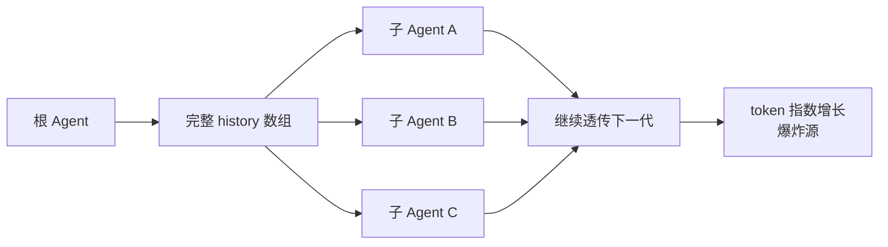

**实现**：完整 message 原样传给所有子 Agent 并逐层透传。**加载回**：无删除故无需加载（也正是代价）。**冲突验证**：历史天然完整，验证最容易、成本最高。**不推荐**。

## A3. RCR-Router


**实现**：路由层按角色+阶段从外部存储选相关子集，被剪内容留在外部。**加载回**：每次调用按相关度重新召回子集（可累积可回滚）。**冲突验证**：外部存储保留全部原始，重放完整历史比对是路由剪枝丢信息还是模型误判。

## A4. DACS 非对称隔离

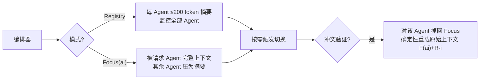

**实现**：Registry（摘要监控）+ Focus（完整上下文，子线性与 N 无关）。**加载回**：Focus 切换 = 从原始存储按需物化完整上下文。**冲突验证**：原始上下文确定性构造留存，单 Agent 掉回 Focus 复查，隔离验证不污染其他 Agent。

## A5. Agent-Radar 注意力引导

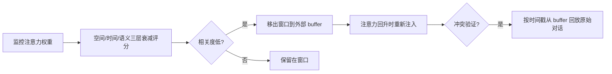

**实现**：按三层衰减打分，低相关 token 软移出。**加载回**：注意力信号回升再注入。**冲突验证**：外部 buffer 按时间线保存，可回放；但无显式索引，定位依赖时间戳。

## A6. 动态路由 RAG

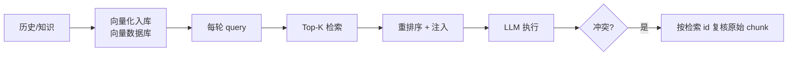

**实现**：历史向量化，query 检索 Top-K 注入，不检索不进窗口。**加载回**：检索即加载。**冲突验证**：原始全量在向量库，任意冲突可检索原始 chunk 复核；注意记录检索 id，防缺失召回无法追溯。

## A7. 滑动窗口

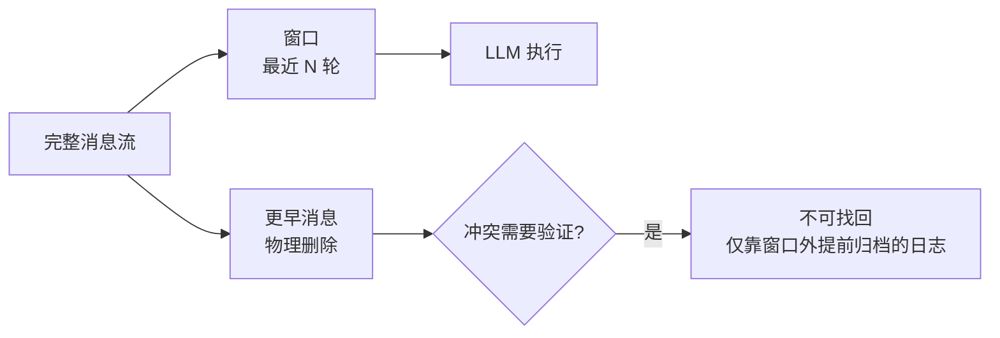

**实现**：只保最近 N 轮，更早删除。**加载回**：无。**冲突验证**：不可找回；若要验证需在截断前把旧历史导出到日志/DB 做窗口外审计。

---
---

# B 组：压缩/出窗（10 种）

## B1. 被动摘要

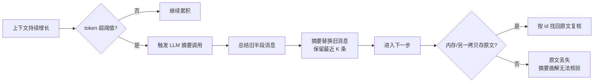

**实现**：溢出 → 一条 LLM 调用总结旧片段替换（如 summary_ratio=0.3、preserve_recent=10）。**加载回**：摘要直接占位。**冲突验证**：摘要本身不可逆；若实现时原文归档到旁路存储（STM/DB）可按消息 id 找回；多数开源实现只留摘要 → **丢失**。

## B2. Focus 主动自主压缩

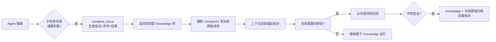

**实现**：Agent 自主决定 consolidate（并入 Knowledge 块）+ withdraw（删除原始历史）；配合"每 10-15 次工具调用压缩"激进提示，SWE-bench token -22.7% 准确率持平。**加载回**：Knowledge 常驻顶部；需旧经验可从外部存档召回。**冲突验证**：有召回路径；但删除是真实的（pylint-7080 曾因误删有效上下文重探索），须 Knowledge+外部原始双重核对。

## B3. 递归/分层摘要

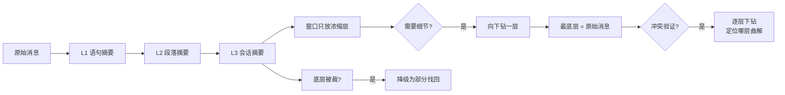

**实现**：多级金字塔，窗口只放顶端浓缩层。**加载回**：按层级下钻。**冲突验证**：底层原文在则可逐层定位"哪层曲解"；底层被裁则降级部分找回。

## B4. ACE 上下文编排器

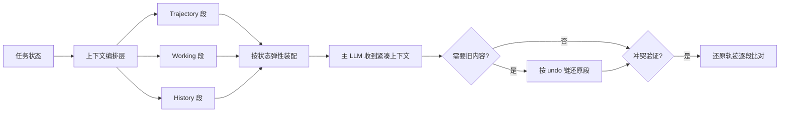

**实现**：三段式按任务状态装配，压缩记录 undo 信息，**可逆**。**加载回**：编排器按需 swap 段。**冲突验证**：压缩生成还原轨迹，按 undo 链恢复原始上下文逐段比对（不依赖截断/一次性摘要）。

## B5. TokenPilot 生命周期驱逐

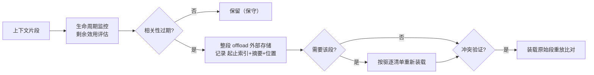

**实现**：乘务相关性剩余效用，过期才整段 offload；batch 粒度保证可恢复完整性。**加载回**：按时间戳/key 召回。**冲突验证**：驱逐清单记录位置，按清单重新装载原始段重放。可找回。

## B6. TokenPilot 入口压缩

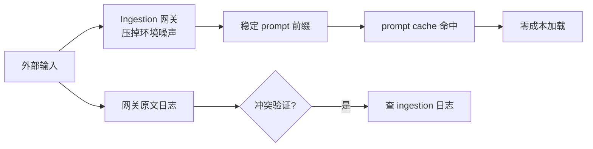

**实现**：ingestion 网关压掉开放环境噪声，保证前缀稳定 → prompt cache 命中。**加载回**：前缀稳定即缓存命中，加载近零成本。**冲突验证**：被压噪声不进历史，网关留原文日志可查。可找回。

## B7. 代码执行模式

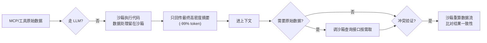

**实现**：中间数据用代码在沙箱处理，agent 只收最终摘要（~75k→600 token）。**加载回**：结果进窗；原始数据沙箱按需查询。**冲突验证**：原始全程在沙箱/DB，重算相同数据流比对一致性，沙箱=单点事实源。可找回。

## B8. 可逆驱逐（回执 + recall）

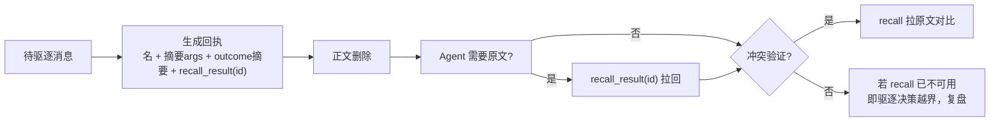

**实现**：删正文留回执（call/outcome 摘要+召回句柄）。**加载回**：需要时 `recall_result(id)` 重新拉取。**冲突验证**："仅删除可恢复内容"是驱逐正确性判据；拉原文对比，recall 失败=驱逐越界需复盘。**可逆**。

## B9. 截断策略

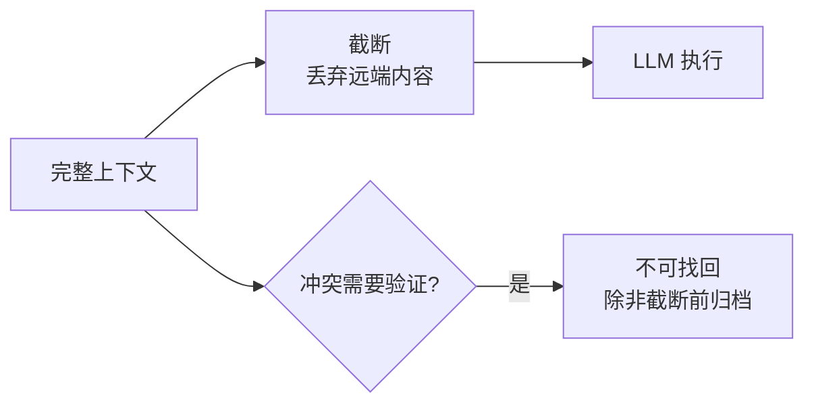

**实现**：最粗暴，直接丢弃。**加载回**：无。**冲突验证**：不可找回，除非截断前有归档。**不可逆**。

## B10. 外部压缩模型（LLMLingua）

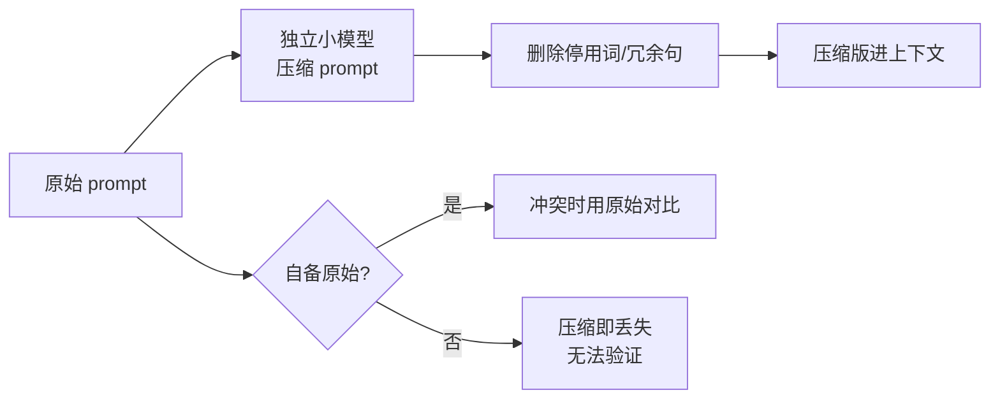

**实现**：独立小模型压 prompt，不占主推理。**加载回**：压缩结果进窗。**冲突验证**：LLMLingua 输出即压缩版；验证需自行附存原始 prompt。部分。

---
---

# C 组：结构化/架构（7 种）

## C1. 存储与呈现分离（ADK 四层）

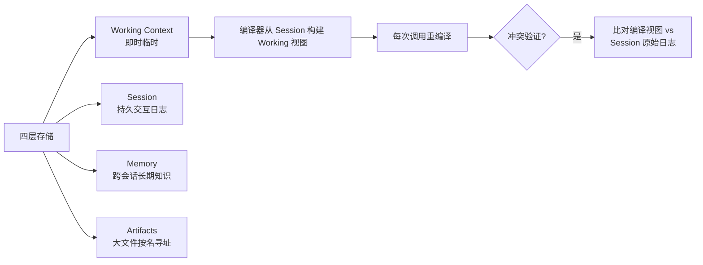

**实现**：Working（临时视图）/Session（持久日志）/Memory（长期）/Artifacts（按名寻址）；Working 是 Session 编译的临时视图。**加载回**：每次调用由编译器从 Session 重建 Working；大文件点名 Artifacts。**冲突验证**：Session 唯一事实源，重编译视图即得，比对产物即可。**架构级可找回**。

## C2. 三层缓冲

```mermaid
graph LR
    A["active<br/>即时任务 + 最近工具输出"] --> D["LLM"]
    B["滚动会话摘要<br/>追加式更新"] --> D
    C["retrieval 层<br/>按需查询"] --> D
    E["memory<br/>跨会话"] --> A
    C --> F["记录检索的 chunk id"]
    F --> G{"冲突验证?"}
    D --> G
    G -->|"是"| H["摘要时间线<br/>逐 turn 下钻原始"]
```

**实现**：active + 滚动会话摘要 + 按需 retrieval + 跨会话 memory。**加载回**：retrieval 调用即加载；摘要追加式更新。**冲突验证**：滚动摘要与来源会话并存，冲突按时间线下钻原始 turn；检索层记录 chunk id 便于复核。可找回。

## C3. 输出过滤门卫

```mermaid
graph LR
    A["工具/API 原始响应<br/>(可达65k字符)"] --> B["过滤门卫<br/>Transform/Apex filter"]
    B --> C["只保留高价值字段"]
    C --> D["进上下文"]
    A --> E["完整响应旁路留存"]
    E --> F{"冲突验证?"}
    F -->|"是"| G["全量比对<br/>定位漏字段"]
```

**实现**：工具返回先整形再进窗，阻断洪水。**加载回**：过滤结果进窗，完整响应留旁路。**冲突验证**：门卫不改原始，全量比对找"漏了哪字段致模型误解"。可找回。

## C4. 上下文变量（durable state）

```mermaid
graph LR
    A["易变意图/状态"] --> B["显式上下文变量"]
    B --> C["AgentScript 声明式定义"]
    C --> D["每轮注入变量"]
    D --> E{"意图变化?"}
    E -->|"是"| F["覆写变量"]
    F --> G["变量版本记录"]
    G --> H{"冲突验证?"}
    H -->|"是"| I["变量当前值 vs<br/>原始轮次对话"]
```

**实现**：意图/状态放显式可覆写变量，不依赖历史隐含。**加载回**：每轮注入，覆写即更新。**冲突验证**：变量版本可回滚（若 versioning）；原始对话仍在历史，对照当前值和原始轮次判断旧信号残留。部分。

## C5. KV-Cache 复用（KVCOMM）

```mermaid
graph LR
    A["跨 Agent 相似前缀"] --> B["复用注意力 KV"]
    B --> C["命中缓存<br/>跳过重复计算"]
    C --> D["7.8x 提速"]
    D --> E{"冲突验证?"}
    E -->|"是"| F["与内容无关<br/>走原始消息验证"]
```

**实现**：前缀级 KV 复用（计算复用而非内容裁剪）。**加载回**：前缀不变即命中缓存。**冲突验证**：只影响速度不影响正确性，验证走原始消息即可，无历史丢失。

## C6. 工具渐进披露

```mermaid
graph LR
    A["工具目录/文件名"] --> B["Agent 浏览"]
    B --> C{"用到哪个工具?"}
    C --> D["加载该工具完整定义"]
    D --> E["注入上下文"]
    E --> F{"冲突验证?"}
    F -->|"是"| G["重读静态 schema 文件<br/>核对参数使用"]
```

**实现**：工具 schema 按需加载，代替全量预载 200 个定义。**加载回**：用到时注入该工具定义。**冲突验证**：schema 是静态文件，随时重读验证 agent 是否误用参数。可找回。

## C7. 提前阈值压缩

```mermaid
graph LR
    A["estimatedTokens 估算"] --> B{"超过阈值<br/>(默认窗口 65%)?"}
    B -->|"否"| C["继续运行"]
    B -->|"是"| D["主动触发底层压缩<br/>（摘要/驱逐/编排）"]
    D --> E["避免 API 拒绝"]
    E --> F{"冲突验证?"}
    F -->|"是"| G["由底层方法决定<br/>阈值本身可调校准"]
```

**实现**：`estimatedTokens > LIMIT * 0.65` 提前触发，防被动溢出失败。**加载回/验证**：由被调用的底层压缩方法（8/9/12/15 等）决定；阈值可调（50/80%）观察冲突点分布。

## 相关页面

- [[上下文污染]]：上下文爆炸的定义与三种严重形式
- [[多Agent上下文管理总览]]：多Agent上下文路由/一致性/异常处理全景
- [[多Agent上下文管理·素材摘要]]：26 篇论文方案索引
- [[向量数据库]]：动态路由 RAG 的存储底座
- [[AI-Agent上下文管理总览]]：七环闭环（预算→组织→压缩→结构化→工具→路由→监控）
- [[上下文压缩与摘要策略]]：压缩/出窗一组的 P0-P4 保留金字塔与渐进式摘要
- [[工具结果上下文治理]]：工具结果的分类截断、链折叠与 context editing

## 参考来源

- [[raw/articles/上下文爆炸治理方案24式·联网整理.md]]（含全部网络链接索引）
- [[raw/articles/multi-agent-context-management.md]]（wiki 侧方案原始素材）