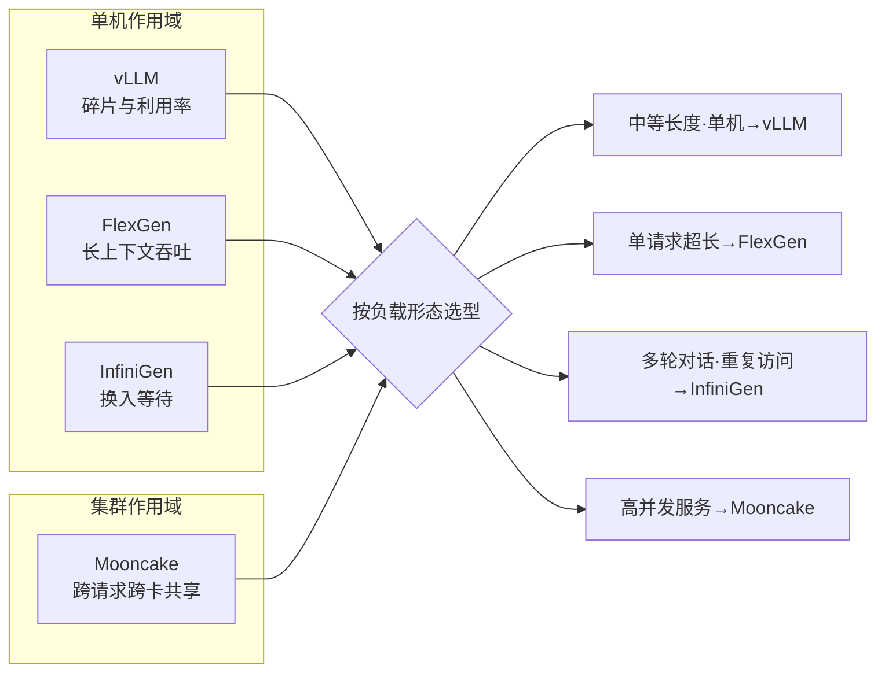

# 代表项目对比

## 核心结论

四个代表项目解的是同一个问题（KV 放不下），但**作用域与优化目标不同**：vLLM 优化单机利用率、FlexGen 优化单机长上下文吞吐、InfiniGen 优化换入等待、Mooncake 优化集群高并发共享。选型先看负载形态，再看机制。

## 五维对比

下表从核心机制、存储层级、驱逐策略、预取能力与适用场景五个维度对代表性项目进行对比。

| 项目 | 核心机制 | 层级 | 驱逐策略 | 预取 | 适用场景 |
|------|----------|------|----------|------|----------|
| [[vLLM]] | PagedAttention 按页管理，消除显存碎片 | 2 级 | 页级换出 | 无 | 中等长度序列 |
| [[FlexGen]] | 线性规划求解最优换入换出调度 | 3 级 | LP 调度 | 无 | 单请求长上下文 |
| [[InfiniGen]] | 学习注意力模式，预测未来访问 | 2 级 | 注意力驱动 | 有 | 多轮对话 |
| [[Mooncake]] | KV 中心分离架构，跨请求/跨卡共享 | 多级 | 全局调度 | 有 | 高并发与长上下文 |

## 作用域与定位

## 选型判据

| 负载特征 | 首选 | 理由 |
|----------|------|------|
| 中等长度、单请求 | [[vLLM]] | 两级已够，实现最简，碎片治理收益最大 |
| 单请求超长上下文 | [[FlexGen]] | 三级 + 线性规划，单卡吞吐最优 |
| 多轮对话、历史反复回看 | [[InfiniGen]] | 注意力模式可学习，预取命中率高 |
| 高并发、多请求并存 | [[Mooncake]] | 跨请求跨卡共享，避免重复存储 |

## 共识与分歧

**共识**：所有方案都承认并非全部 KV 等价，都需要某种「哪些该留在快介质」的判据。

**分歧**：
- **粒度**：页级（vLLM）vs 规划级（FlexGen）vs 注意力 token 级（InfiniGen）vs 全局（Mooncake）。
- **是否预取**：vLLM/FlexGen 依赖调度规划而非预测；InfiniGen/Mooncake 显式建模访问模式。
- **作用域**：单机三层 vs 集群共享。

## 相关页面

- [[KV Cache分级存储]]：四个项目共同的方案框架
- [[三级存储金字塔]]：层级参数的统一口径
- [[驱逐策略]]、[[预取机制]]：对比表中两列的机制展开
- [[显存墙]]：它们共同要突破的瓶颈

## 参考来源

- [[raw/papers/KV Cache分级存储.md]]