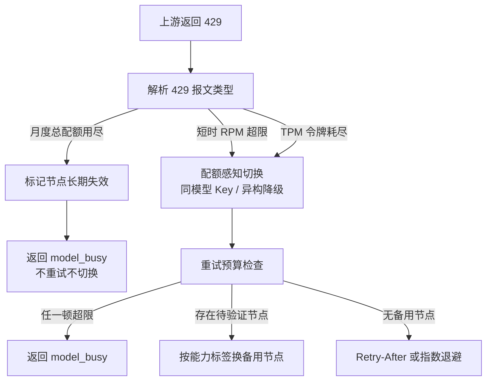

# 429流量治理

## 分类决策流程

## 核心结论
- **429 是配额信号而非故障**，处理策略 = 配额感知切换，不纳入熔断器 5xx 错误率统计；对节点做独立 429 滑动窗口计数。
- **三类 429 必须解析细分**：
  - 短时 RPM 超限 → 配额窗口紧张，走 [[能力标签驱动降级]] 切换路径；
  - TPM 令牌耗尽 → 同上，按 [[RPM与TPM联合令牌桶]] 预扣/退款修正；
  - **月度总配额用尽 → 标记节点长期失效、直接返回 `model_busy`，不重试不切换**，等下月配额重置。
- 避免惊群：不做原地阻塞等待，动态路由让请求去其它节点；仅当**无备用节点**时才用 Retry-After / 指数退避 + 随机抖动再试。

## 要点拆解

### 为什么传统的"简单重试"是反模式
拿 429 当普通错误立即重试，一来解决不了配额已经被吃完的本原问题，二来多个并发同时醒来再试会造成二次流量尖峰（惊群），把刚刚缓解的上游再打崩。

### 为什么把 429 与 5xx 分开
429 常伴随「换个 Key 就通了」，5xx 是「这个节点坏了」。若 429 并入熔断统计，会频繁误触 Open 把本可用的节点误隔离；若不分离、只在同一计数器上叠 429 与 5xx，恢复/降级决策会失真。所以熔断器只认 5xx，429 走自己的配额通道。

### 月度配额的特殊性
RPM/TPM 是周期性窗口，暂停片刻可恢复；月度预算是总量，打满后本配置周期不可能放量。继续打 = 纯浪费，必须提前识别并让请求快速失败。

## 相关页面
- [[熔断器状态机]]：429 与 5xx 双通道的姊妹篇
- [[RPM与TPM联合令牌桶]]：配额耗尽发生地
- [[能力标签驱动降级]]：429 后的切换工具
- [[重试预算与幂等保护]]：重试额度约束

## 参考来源
- [[raw/papers/面向大模型服务的动态路由与流量治理架构研究.md]]