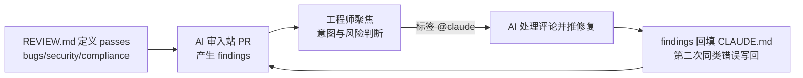

# AI代码评审

## 评审循环

## 核心结论
- Claude **既给出也接受评审**：按组织的复审策略审入站 PR，并对自家 PR 的评审意见（`@claude`）响应并推送修复——工程师的 PR review 聚焦到行为判断：**意图与风险** [[The AI-Native SDLC playbook]]。
- **职责分离被保留**：写代码的 agent 无法批准自己产出；findings 本身不自动批准/阻断 PR，branch protection 仍要求 code owner 人类批准。
- 评审策略由 tech lead 写入 `REVIEW.md`，应用到所有 PR；findings/修复/评级/审批全部留在 PR 历史，**PR 即审计记录**。

## 要点拆解
- **REVIEW.md 内容**：拆分 pass（bugs 与逻辑错误；安全与漏洞；对照 spec.md/plan.md/设计原则的合规），定义"Important vs Nit 微瑕"、"跳过什么"（生成路径、CI 已强制项）、单次最多 5 条 nit。
- **运行方式**：托管式 Code Review 服务（最快起步，管理员开启选仓库）；要掌控流水线/自有 API 条款时用 claude-code-action 在自己的 CI 跑。
- **@claude 回路**：评审或作者在评论打 `@claude` 即处理该评论并推送修复，PR 线程同时记录请求与变更；托管服务用 `@claude review` 请求全新复审。Claude 开的新 PR 可让它"保姆式"盯到合并（扫未解决评论与失败检查、推到绿）。[[The AI-Native SDLC playbook]]
- **双反馈**：findings 第二次出现同类错误→修正写回 CLAUDE.md，自此后续 PR 被预防；评审也标记 CLAUDE.md 过期的情形。
- **月度调优**：tech lead 按月依照评级让评审器改进、在 REVIEW.md 里限制 nit 量、排除生成路径与 CI 已强制的项。

## 相关页面
- [[CLAUDE记忆文件]]：findings 双反馈的落地
- [[Hooks护栏与审批门]]：findings 与强制门禁的组成
- [[committed-artifact]]：PR+findings 是审计链的一环
- [[传统SDLC与AI-native-SDLC对比]]：评审职责对比的参考

## 参考来源
- [[The AI-Native SDLC playbook]]