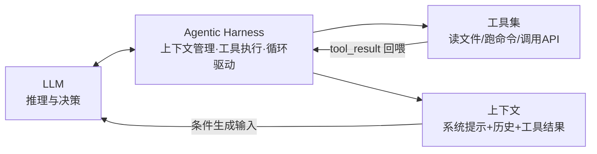

# Agentic Harness

## 核心结论

Harness 是 Agent Loop 的"运行时外壳"：它把一次次的工具执行结果追加回 messages 上下文并再次调用模型，从而让模型在完整历史上做条件生成。**模型负责推理（想下一步怎么做），harness 负责行动（执行工具）与递送（回喂结果）**——没有 harness，模型只是一次性问答器。

## 架构示意

## 职责分解

| 角色 | 负责 |
|---|---|
| 模型（LLM） | 行动选择、路径修正、终止判断、上下文取舍（四类自主决策） |
| Harness | 工具执行、结果回喂、max_turns/预算/超时护栏、hooks 触发、自动 compaction |
| 上下文 | 每轮追加历史，让下一轮决策视野更宽 |

## 相关页面

- [[Agent循环]]：循环本身如何转
- [[Turn与消息生命周期]]：harness 与模型间的往返协议
- [[Agent循环终止与护栏]]：harness 侧的护栏与 hooks
- [[AI-Agent上下文管理总览]]：harness 上下文管理能力的全景

## 参考来源

- [[raw/papers/Agent Loop.md]]