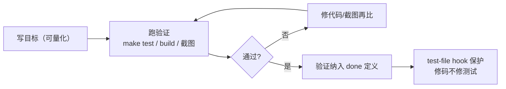

# Agent反馈闭环

## 闭环示意

## 核心结论
- **始终给 agent 验证自己工作的回路**（测试 / build / 截图 diff）；会话先自查、自修错，工程师看到时错误已被解决 [[The AI-Native SDLC playbook]]。
- 与 [[并行会话与子代理|verifier 子代理]] 区别：反馈循环贯穿整个任务尽可能多次；verifier 是任务"以为完成"后用全新上下文窗口做最后一次核对，避免被生成时的假设染色。
- 闭合的最后一步是保护回路本身：**agent 修码时不许弱化对自己的检查**（hook 阻断测试文件编辑，或 review 时拒收任何动测试改动）。

## 要点拆解
- **把检查包装成一条命令**：多次命令+环境知识包装为 `make test` 这类单一目标，退出非零即失败。
- **目标可量化**：写进 CLAUDE.md（Commands/Verifying 段），如"所有 test_status.py 通过""截图与附 mock 一致""endpoint 返回 200 带新字段"——让 agent 不用问人就能自查。
- **bug 修复用测试先行**：先让 agent 把 bug 复现成失败测试并提交，再用不可改测试的 hook 让它修到通过；**修复前就存在且 agent 无法改写的测试 = bug 已消失的证据** [[The AI-Native SDLC playbook]]。
- **UI 用视觉闭环**：给浏览器/截图工具 + mock，实现→截图→对比→调整，2~3 轮为常态且应逐轮变好。
- **纳入 done 定义**：指令留在 CLAUDE.md，报告完成前必须跑验证并贴输出。

## 相关页面
- [[CLAUDE记忆文件]]：验证指令与输出样例的落地位置
- [[Hooks护栏与审批门]]：test-file hook 保护测试不被弱化
- [[持续评估]]：配置级回归（对"agent 是否按标准干活"的评估）
- [[并行会话与子代理]]：verifier 子代理是反馈循环的最终关卡
- [[Agent循环]]：反馈闭环即 Agent Loop「Verify Results」阶段在 AI-native SDLC 的具体落地

## 参考来源
- [[The AI-Native SDLC playbook]]