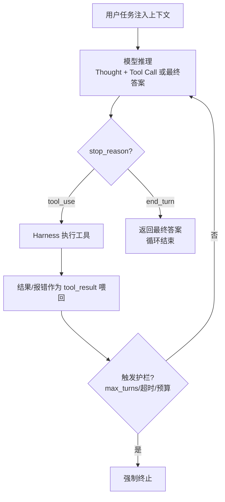

# Agent循环

## 核心结论

- **本质定义**：在循环中基于环境真实反馈（ground truth）自主决策，直到任务完成或触发终止条件。
- Anthropic 官方一句话定义：「LLMs autonomously using tools in a loop」；Agent 不是更聪明的模型，而是"模型 + 工具 + 循环"构成的运行时。
- 架构区分：**Workflows**（步骤写死、行为可预期）vs **Agents**（LLM 动态决定流程与工具使用，自主掌控完成方式）；开放式、步骤不可预知的任务才上 Agent。

## 三阶段模型

Claude Code 将循环拆为三个相互融合（blend together）、非线性的阶段 [[raw/papers/Agent Loop.md]]：

| 阶段 | 内容 |
|---|---|
| Gather Context | 搜索文件、读取代码、调用检索，建立理解 |
| Take Action | 编辑文件、执行命令、调用外部工具，改变状态 |
| Verify Results | 运行测试、查看报错、对比预期，获得 ground truth |

修 Bug 反复走三阶段、回答代码库问题可能只需第一阶段；每轮工具结果回喂上下文驱动下一步决策。

## 决策闭环

## 相关页面

- [[Agent循环总览]]：全景与四支柱
- [[Agentic Harness]]：驱动循环的运行时外壳
- [[Turn与消息生命周期]]：循环的技术单元
- [[Agent循环终止与护栏]]：stop_reason 与双保险
- [[Function Calling三阶段模型]]：单轮工具调用的受控间接执行
- [[上下文压缩与摘要策略]]：长循环的 Compaction 手段

## 参考来源

- [[raw/papers/Agent Loop.md]]