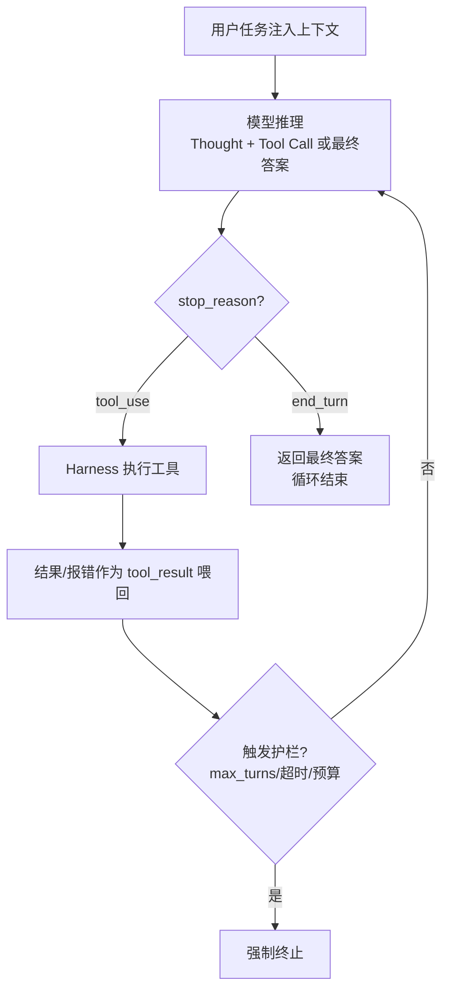

# Agent循环

## 核心结论

- **本质定义**：在循环中基于环境真实反馈（ground truth）自主决策，直到任务完成或触发终止条件。
- Anthropic 官方一句话定义：「LLMs autonomously using tools in a loop」；Agent 不是更聪明的模型，而是"模型 + 工具 + 循环"构成的运行时。
- 架构区分：**Workflows**（步骤写死、行为可预期）vs **Agents**（LLM 动态决定流程与工具使用，自主掌控完成方式）；开放式、步骤不可预知的任务才上 Agent。

## 三阶段模型

Claude Code 将循环拆为三个相互融合（blend together）、非线性的阶段 [[raw/papers/Agent Loop.md]]：

| 阶段 | 内容 |
|---|---|
| Gather Context | 搜索文件、读取代码、调用检索，建立理解 |
| Take Action | 编辑文件、执行命令、调用外部工具，改变状态 |
| Verify Results | 运行测试、查看报错、对比预期，获得 ground truth |

修 Bug 反复走三阶段、回答代码库问题可能只需第一阶段；每轮工具结果回喂上下文驱动下一步决策。

## 决策闭环

```mermaid
flowchart TD
    A[用户任务注入上下文] --> B[模型推理<br>Thought + Tool Call 或最终答案]
    B --> C{stop_reason?}
    C -->|tool_use| D[Harness 执行工具]
    D --> E[结果/报错作为 tool_result 喂回]
    E --> F{触发护栏?<br>max_turns/超时/预算}
    F -->|否| B
    F -->|是| G[强制终止]
    C -->|end_turn| H[返回最终答案<br>循环结束]
```

## 能力边界与演进方向

Loop 把执行权交给模型是决定性突破，但单体 Loop 在复杂任务上存在**五大结构性瓶颈**（上下文稀释、错误级联、工具过载、控制太粗、定位困难），且生产环境要求的暂停、审批、断点恢复、审计追溯天然不支持——**能运行不等于能上线**[[1]](#ref-1)。当任务出现分支并行、跨会话状态、治理要求时，演进方向是把循环封装为 **Graph 图编排**中的节点，用结构化骨架承载模型的灵活判断[[2]](#ref-2)。

## 相关页面

- [[Agent循环总览]]：全景与四支柱
- [[Agentic Harness]]：驱动循环的运行时外壳
- [[Turn与消息生命周期]]：循环的技术单元
- [[Agent循环终止与护栏]]：stop_reason 与双保险
- [[Function Calling三阶段模型]]：单轮工具调用的受控间接执行
- [[上下文压缩与摘要策略]]：长循环的 Compaction 手段
- [[单体Loop结构性瓶颈]]：Loop 的五大天花板与失控放大机制
- [[Loop与Graph控制流演进]]：Loop 之上的 L5 Graph 层
- [[Loop与Graph选型对比]]：什么时候该从 Loop 升级到 Graph

## 参考来源

- [[raw/papers/Agent Loop.md]]
- [[raw/articles/Loop之后为什么是Graph.md]]

---

[1] Loop 五大结构性瓶颈与生产四能力缺口，见 [[单体Loop结构性瓶颈]]
[2] 五层控制流演进与 Graph 定义，见 [[Loop与Graph控制流演进]]