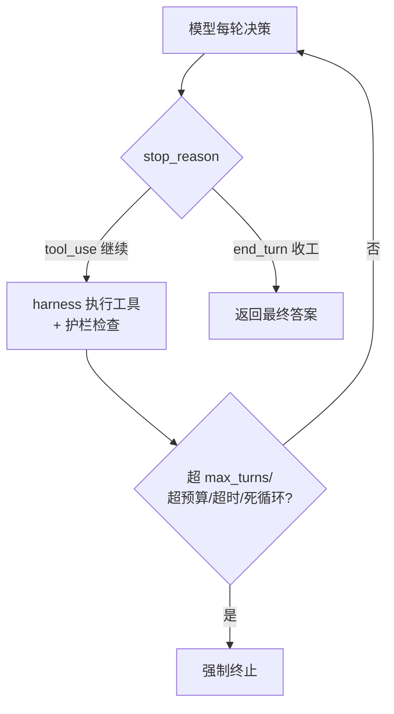

# Agent循环终止与护栏

## 核心结论

只靠模型"自觉"判断任务完成不可靠，须**终止双保险**：模型侧用 stop_reason 表达"继续或收工"，harness 侧再叠硬护栏——max_turns、token/成本预算、超时、循环检测（连续相同工具+参数即熔断）。hooks 在关键节点提供干预窗口。

## 终止双保险

## stop_reason 协议

| 取值 | 含义 | harness 动作 |
|---|---|---|
| tool_use | 模型要调用工具 | 执行工具，结果塞回，再次调用模型 |
| end_turn | 模型认为完成 | 退出循环，返回文本答案 |
| max_tokens | 触顶输出上限 | 按策略处理 |
| refusal | 拒绝请求 | 检测处理拒答 |

## 失败模式与护栏

| 失败模式 | 根因 | 护栏 |
|---|---|---|
| 死循环 | 未从反馈识别无效 | 循环检测 + 重复动作熔断 |
| 工具幻觉 | 把可推测内容当真实结果 | 工具结果仅由 harness 注入 |
| 过早终止 | 把"写了代码"当"代码能跑" | 完成判据 + 先验证再宣告 |
| 上下文溢出 | 长循环无节制累积 | 压缩、scratchpad、子代理 |
| 选错工具 | 工具描述模糊 | 打磨 schema 与 description |
| 错误不纠偏 | 报错被静默吞掉 | 异常显式写入 tool_result |

## hooks 控制点

| Hook | 触发时机 | 用途 |
|---|---|---|
| PreToolUse | 工具执行前 | 校验入参、阻断危险命令 |
| PostToolUse | 工具返回后 | 审计输出、触发副作用 |
| Stop | 循环结束时 | 校验结果、保存状态 |
| PreCompact | 上下文压缩前 | 归档完整会话 |
| SubagentStart/Stop | 子代理生成/完成 | 汇总并行结果 |

## 相关页面

- [[Agent循环]]：循环本体（本质定义与三阶段）
- [[Agent异常处理与循环检测]]：IAL 无限循环是缺终止条件的故障形态（69.1% 源于无界重试）
- [[Agentic Harness]]：护栏与 hooks 的宿主运行时
- [[Hooks护栏与审批门]]：SDLC 侧阶段化 hooks 治理
- [[上下文压缩与摘要策略]]：上下文溢出护栏的具体手段

## 参考来源

- [[raw/papers/Agent Loop.md]]