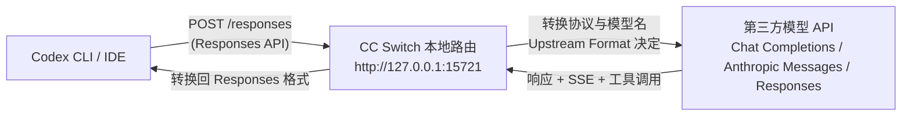

# CC Switch本地路由

## 核心结论

- 新版 Codex 只按 **Responses API** 发请求，而 DeepSeek / Kimi / Qwen / GLM / MiniMax / SiliconFlow 等绝大多数第三方只有 **Chat Completions**（少数是 Anthropic Messages）。两套协议在请求字段、SSE 流式事件、工具调用数据结构上完全不兼容，直接填地址会得到 404、参数解析失败、流式截断、模型列表加载异常。
- CC Switch 的 **Local Routing** 就是为这类协议差异服务的本地网关：Codex 看起来仍在访问 OpenAI 兼容接口，实际请求被转到选中的第三方 provider 并按上游协议转换。
- 默认监听地址 `http://127.0.0.1:15721`；**使用期间 CC Switch 必须持续运行**。
- 上游原生支持 Responses 时本地路由不做 Chat 协议转换，直接透传。

## 请求流转图



## 要点拆解

### 什么时候必须启用

| 上游格式 | 是否必须本地路由 |
|---|---|
| Responses (native) | 通常不需要协议转换 |
| Chat Completions | 需要 |
| Anthropic Messages | 需要 |

**判定口诀**：不要因为供应商宣传"兼容 OpenAI API"就默认选 Responses——很多 OpenAI 兼容接口只兼容 Chat Completions。

### 三开关配置

1. **Local Routing 总开关**：`Settings → Routing → Local Routing`；
2. **Routing Enabled 勾选 Codex**：只接管 Codex（不影响 Claude / Gemini）；
3. **该 provider 的 Needs Local Routing**：Chat/Messages 类预设通常自动开启，自定义配置要手动确认。

三方共同生效后，Codex 的实时配置（`~/.codex/config.toml`）会指向本地路由地址；再根据当前选中的 provider 决定转发到哪家、用什么协议。

### 实际转发过程（Chat Completions 上游）

```text
Codex POST /responses
  → CC Switch 转换为 POST /chat/completions
  → 第三方模型返回 JSON 或 SSE
  → CC Switch 转换回 Responses JSON 或 SSE
  → Codex 继续执行工具调用
```

转换不只是换路径：还涉及模型名映射（见 [[Codex模型映射与模型目录]]）、SSE 事件结构、工具调用 ID、reasoning 内容等。

### 与模型网关、MCP 的区别

- 本路由解决「协议不通」；
- MCP 给 Codex 增加的是工具/上下文（浏览器、GitHub、数据库），不是换模型；
- 企业模型网关 = 统一鉴权/审计/限流的独立层，可与自定义 provider 组合，不一定需要 CC Switch。

## 使用限制

- 持续运行依赖：Chat/Messages 协议转换时 CC Switch 掉线 = Codex 断服；
- 能力降级风险：Web Search、图片输入、WebSocket、响应存储等高级功能可能不兼容；
- 排障锚点：检查本地路由日志 / 统计，能区分是上下游问题还是转换问题。

## 相关页面

- [[cc-switch]]：提供本机制的宿主工具
- [[Codex自定义模型Provider]]：不依赖本地路由的原生方式（Responses 上游）
- [[Codex模型映射与模型目录]]：路由转换时的模型名对照
- [[Codex接入第三方模型总览]]：为什么第三方接入普遍需要它
- [[SSE流式容错]]：流式中断问题也可参考网关侧经验
- [[MCP协议架构]]：MCP 与协议网关的本质区别

## 参考来源

- [[raw/articles/cc-switch-codex-第三方模型接入.md]]
- [[raw/articles/cc-switch安装与使用教程.md]]