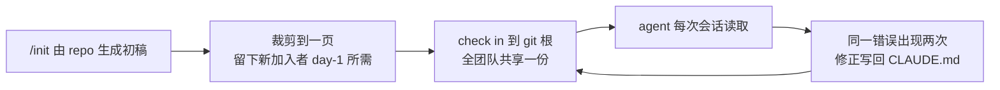

# CLAUDE记忆文件

## 维护循环

## 核心结论
- `CLAUDE.md` 存放在 repo 根目录，给 agent 提供**新加入者入职第一天需要的全部上下文**：构建/测试/lint 命令、团队约定、架构、Claude 最容易搞错的事 [[The AI-Native SDLC playbook]]。
- 原本存在于人脑和 wiki 里的知识，变成 agent 每个会话开始就读的文件；由整个团队维护、一旦犯错就迭代。
- 工作规则：**同一错误出现两次，修正就写回 `CLAUDE.md`**，因此错误从下一个会话起被预防。

## 要点拆解
- **初始化**：用 `/init` 让 Claude 从当前仓库自动生成初稿，再人工裁剪到一页以内（agent 每次全量读入，过期内容纯占上下文）。
- **必留内容**：build/test/lint 命令 + 值得遵守的约定 + Claude 易错清单（如"不升级依赖版本，平台团队负责""legacy v1 冻结，改动进 v2"）[[The AI-Native SDLC playbook]]。
- **版本化**：check in git 根，全团队一个版本；变更像代码一样走 review，审计可追溯。
- **与 Skills 分工**：CLAUDE.md 承载**团队上下文**；需要被**一致执行**的制度知识应写为 [[Skills技能]]；需要"必然成立"的约束再由 [[Hooks护栏与审批门]] 兜底。

## 相关页面
- [[Skills技能]]：一致的制度知识从 CLAUDE.md 升级为 skill
- [[Hooks护栏与审批门]]：CLAUDE.md 表达约定、hooks 执行强制
- [[Agent反馈闭环]]：验证指令也写进 CLAUDE.md 的 Commands/Verifying 段
- [[LLM-Wiki框架]]：本项目 AGENTS.md/SCHEMA.md 与 CLAUDE.md 同属"agent 记忆文件"范式

## 参考来源
- [[The AI-Native SDLC playbook]]