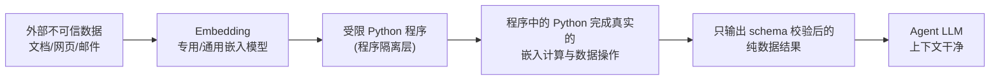

# CaMeL能力沙箱

## 核心结论

- 二选一：传统防御（WASP）要么在可信上下文中不提供安全保证，要么严格输出校验（SPMP）导致可用性断崖。CaMeL 采取第三条路——**在 Agent 动作与攻击指令之间建立形式化安全边界**[[1]](#ref-1)。
- 核心思想：把外部不可信数据（文档/网页）处理限定进**受限 Python 程序**，程序输入、代码、输出全部受约束，即使程序被注入，也只能接受"可形式化、不可利用"的降级（输出保持 schema 约束）[[1]](#ref-1)。
- 效果（AgentDojo-benchmark 域）：CaMeL 在 **77% 的任务提供可证明的安全保证**（无防御基线为 84% 任务不安全）；对外部注入（Surrogate-agent 攻击 949 条）**0 成功**，同时任务可用性保持在合理区间[[1]](#ref-1)。

<b>CaMeL 核心数字</b> 
可证明安全任务占比 77% ｜ 无防御不安全任务 84% 
外部攻击 949 条 → 0 成功

## 受限 Python 程序约束

<b>图1 CaMeL 受限程序边界</b>

程序强制约束[[1]](#ref-1)：

| 维度 | 约束 |
|---|---|
| 输入 | 外部不可信数据不直接作为 Agent 上下文；程序输入为**预计算好的 Embedding 向量** |
| 输出 | 程序输出必须通过严格 Schema 校验（只允许预定义数据结构，如值列表）；**构造函数受限**（无字符串构造/无下划线属性），防止绕过 schema 拼出攻击文本 |
| 代码 | 单步可检查的受限 Python 子集；无网络/IO 副作用 |
| 作用域 | Data Agent 域：文档处理 → 无权限工具可用；Web Search 域：外部网页提取 → Embedding“纯数据”格式 |

## 理论保证

- 在系统提示词未被泄露的前提下，注入程序的攻击 → 执行受限子集 → 输出受 schema 与构造函数约束 → **任何文本层面注入都不可到达 Agent 上下文**。
- No-strings 防御：程序内部无法构造任意字符串，攻击文本无法逃逸 schema，实现"可形式化证明"的安全降级而非概率防住。

## 局限

- 被定义域绑死：仅覆盖"从外部不可信数据提取信息"这一步，Agent 其他环节（多步推理、动态指令、可信上下文内攻击、提示词泄露）需其他机制[[1]](#ref-1)。
- 实现复杂度高 / 性能损耗：受限解释器开销、嵌入预计算；契合数据密集但任务结构化的场景。

## 相关页面

- [[双LLM模式]]：同为架构隔离思路
- [[LLM-Agent安全防护总览]]：作为第②层架构隔离核心方案
- [[LLM权限最小化]]：权限层兜底
- [[工具调用零信任管控]]：策略执行层配套

## 参考来源

- [[raw/papers/LLM-Agent安全防护-提示词注入防御与权限最小化综合研究.md]]
- [[raw/articles/deepseek-agent防提示词注入.md]]

---

[1] E. Debenedetti et al. ["Defeating Prompt Injections by Design (CaMeL)."](https://arxiv.org/abs/2503.18813) *arXiv*, 2025.（Google/DeepMind + ETH Zurich）