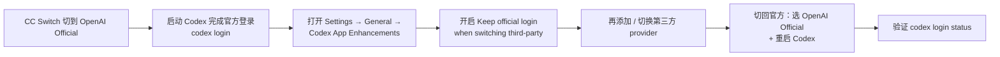

# Codex官方登录保留机制

## 核心结论

- Codex 官方账号登录态存在 `~/.codex/auth.json`（含 Access Token，**敏感，勿分享、勿提交版本库**）。
- CC Switch 的可选开关 **Keep official login when switching third-party providers**（`Settings → General → Codex App Enhancements`）保证切到第三方 provider 时：
  - `~/.codex/auth.json` 继续保存官方登录状态；
  - `~/.codex/config.toml` 才保存当前第三方 provider、模型、地址和认证配置。
- 这样切断第三方后能无损回官方，桌面功能 / IDE 插件 / 远程控制等依赖官方登录的能力不受影响。

## 推荐操作顺序



## 要点拆解

### 登录命令

```bash
codex login status      # 检查登录状态
codex login             # 账号登录
codex login --device-auth   # 设备码登录
```

### 触发"官方登录丢了"的典型场景

- **顺序倒置**：还没先完成一次官方登录，就直接切第三方——此时无登录态可保留；
- **auth.json 被旧配置覆盖**：早期版本 / 手动操作把登录文件当 provider 配置覆盖掉了；
- **切回官方后未重启**：Codex 仍在读第三方 provider 的会话（见 [[Codex接入第三方模型总览]] 的"重启 Codex"纪律）。

### 排障分支

切到第三方后官方功能异常，按序检查：

1. 是否先切回 **OpenAI Official**；
2. **Keep official login** 是否开启；
3. `~/.codex/auth.json` 是否被旧配置覆盖；
4. `codex login status` 是否正常。

必要时重新 `codex login`。**不要手动分享或编辑含 Access Token 的 auth.json**。

### 适用范围

- 只使用 CLI 且不依赖官方登录 → 可跳过此机制；
- 同时使用 Codex 桌面功能、官方插件、远程控制 → 强烈建议开启；
- 第三方 Key 计费独立：使用第三方 API Key 时费用由第三方/中转平台单独结算，不共享 ChatGPT Plus / Pro / Codex 订阅额度。

## 相关页面

- [[cc-switch]]：该开关的宿主工具
- [[Codex自定义模型Provider]]：Provider 认证字段与 env_key（两者互斥的认证方式）
- [[Codex接第三方模型排障清单]]：官方登录/功能异常排障条目
- [[LLM权限最小化]]：登录态即权限凭证，最小化暴露面

## 参考来源

- [[raw/articles/cc-switch-codex-第三方模型接入.md]]
- CC Switch 官方指南：https://github.com/farion1231/cc-switch/blob/main/docs/guides/codex-official-auth-preservation-guide-en.md（摘引）