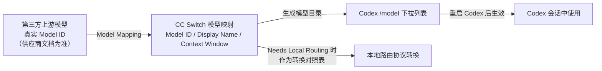

# Codex模型映射与模型目录

## 核心结论

- Codex 的 `/model` 下拉列表来自「模型目录」：描述了上下文窗口、支持的推理等级、输入模态、工具调用能力、截断策略、客户端最低版本。
- CC Switch 端通过 **Model Mapping** 生成这套目录：把第三方真实模型 ID 映射为 Codex 菜单里可选择的模型（Display Name + Context Window）。
- **模型列表变更后必须重启 Codex**——`/model` 菜单通常在启动时加载模型目录，运行中切 provider 不会刷新。
- 不要复制另一模型的元数据来消除 `Unknown model` 警告：错误的上下文窗口或工具能力声明，会导致提前截断、超出限额或工具调用异常。

## 映射关系图



## 要点拆解

### Model Mapping 三个字段

| 字段 | 说明 | 要点 |
|---|---|---|
| Model ID | 第三方 API 接收的真实模型名称 | 必须与供应商文档**完全一致**，别名/下线/改名都会失败 |
| Display Name | Codex `/model` 菜单显示名 | 给人看，可自定义 |
| Context Window | 模型真实上下文窗口 | 不要凭感觉填，填错导致提前截断或超限 |

### CC Switch 预设 vs 自定义

- 选择内置预设（DeepSeek、Kimi、Qwen、GLM、MiniMax 等）时映射通常**自动配好**：Base URL、默认模型、上游协议、是否本地路由、模型映射、部分推理参数一键就位；
- 没有预设时走自定义：Mapping 里的真实 Model ID 必须手工核对供应商文档；如果中转平台修改了模型名称或域名，自动推理识别可能不准，需在高级设置检查。

### 手动配置时的模型目录

没有 CC Switch、直接自定义 provider 时：

```toml
# 供应商提供模型目录文件
model_catalog_json = "~/.codex/provider-models.json"

# 或确认真实值后只声明上下文窗口
model_context_window = 131072
```

判断标准：模型目录 JSON 必须有效、能力声明必须真实，否则会出现"能聊天但不能读写文件/运行命令"（模型目录错误声明能力）或 `Unknown model`。

### 验证命令

- `/status`：当前模型、provider、权限、上下文信息；
- `/model`：查看模型列表是否出现映射的 Display Name；
- `/debug-config`：检查配置来源层级；
- 模型目录 / 映射变更后：**完全退出并重启 Codex**。

## 相关页面

- [[CC Switch本地路由]]：映射在路由转换中的角色
- [[Codex自定义模型Provider]]：手动侧 `model_catalog_json` / `model_context_window`
- [[Codex接第三方模型排障清单]]：模型不上菜单、能聊天不能落盘两个排障分支
- [[cc-switch]]：预设与映射的宿主

## 参考来源

- [[raw/articles/cc-switch-codex-第三方模型接入.md]]