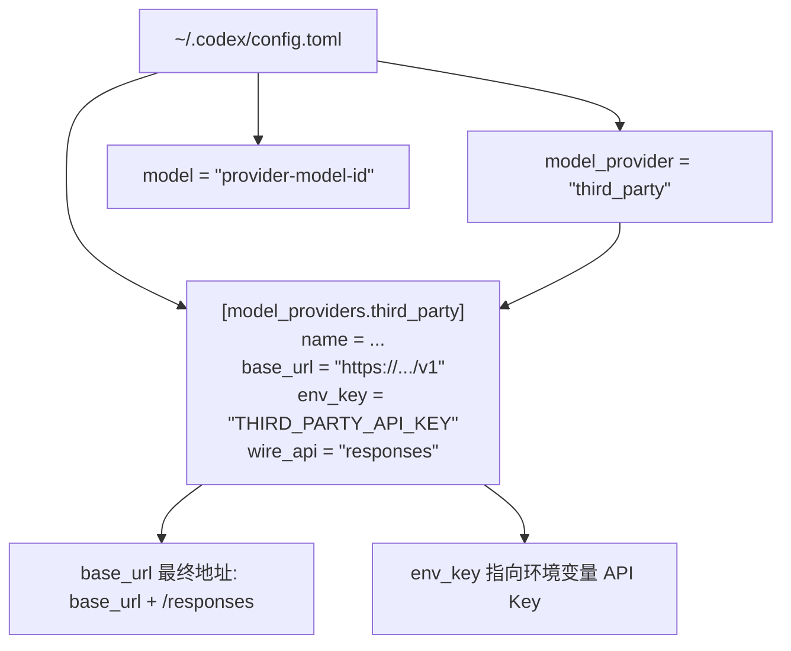

# Codex自定义模型Provider

## 核心结论

- Codex 通过 `~/.codex/config.toml` 的 `[model_providers.<id>]` 表定义「模型请求发往哪里」，再用 `model_provider = "<id>"` + `model = "模型ID"` 选中它。
- **当前 `wire_api` 唯一支持的值是 `responses`**。第三方服务只有 `/v1/chat/completions` 或 Anthropic Messages 时，不能只改地址直接使用，必须走 [[CC Switch本地路由]] 或协议转换网关。
- 保留的内置 provider ID 不可覆盖：`openai`、`ollama`、`lmstudio`。
- provider / 认证字段必须放**用户级** `~/.codex/config.toml`；项目内 `<project>/.codex/config.toml` 会**忽略**重定向请求和认证字段，防止克隆不可信仓库后被偷转流量。

## 配置结构图



## 要点拆解

### 最小可用的自定义 provider

```toml
model_provider = "third_party"
model = "provider-model-id"
model_reasoning_effort = "high"   # 仅模型明确支持时

[model_providers.third_party]
name = "My Responses-compatible Provider"
base_url = "https://provider.example.com/v1"
env_key = "THIRD_PARTY_API_KEY"
wire_api = "responses"
request_max_retries = 4
stream_max_retries = 5
stream_idle_timeout_ms = 300000
```

API Key 用环境变量提供：`env_key` 指定变量名（如 `THIRD_PARTY_API_KEY`），Codex 从环境读取并做 Bearer 认证。GUI 应用不继承终端临时环境变量，需持久化到系统用户环境或改用 CC Switch 管理。

### 关键字段

| 字段 | 作用 |
|---|---|
| `model_provider` | 选中 `[model_providers.<id>]` 中的 provider |
| `model` | 上游真实模型 ID |
| `base_url` | Responses API 根地址（是否含 /v1 以供应商文档为准，Codex 在其后拼 `/responses`） |
| `env_key` | 保存 API Key 的环境变量名 |
| `wire_api` | 仅 `responses`（省略也默认 responses） |
| `request_max_retries` / `stream_max_retries` | 普通请求 / 流式中断的重试次数 |
| `stream_idle_timeout_ms` | SSE 无事件判定空闲超时 |
| `model_context_window` / `model_reasoning_effort` | 可选：真实上下文窗口与推理强度 |
| `env_http_headers` / `http_headers` / `query_params` | 自定义认证 Header、固定 Header、查询参数 |

### Provider 直接可用的前提

第三方至少支持：`POST /responses`、Responses JSON + SSE、function/tool calling、JSON Schema 工具参数、工具结果回传后的继续推理、多轮（`previous_response_id`）机制、足够上下文与稳定长请求。仅支持普通文本生成不足以稳定运行 Codex 智能体（见 [[Codex接第三方模型排障清单]] 的"只能聊天不能落盘"）。

### 模型目录与 Unknown model

- 供应商提供模型目录文件时：`model_catalog_json = "~/.codex/provider-models.json"`，可描述上下文窗口、推理等级、输入模态、工具能力、截断策略；
- 没有时确认真实值后设置 `model_context_window`；
- 严禁复制另一模型的元数据消除警告——错误的上下文窗口/能力声明会导致提前截断、超限或工具调用异常。

### 严格模式与临时覆盖

- `codex --strict-config`：把不认识的配置项当错误，发现旧教程中的废弃字段；
- 临时覆盖不动默认配置：`codex -c 'model_provider="third_party"' -m 'provider-model-id'`。

## 与 CC Switch 的分工

- 上游原生完整支持 Responses API（网关/厂商/自建）→ 首选**自定义 provider**，尤其服务器 / CI / 无图形界面环境；
- 上游只有 Chat Completions / Anthropic Messages，或经常切换多家 → 用 [[cc-switch]] 图形界面 + 本地路由，不必手写 config.toml。

## 相关页面

- [[CC Switch本地路由]]：Chat/Messages 上游的唯一正路
- [[Codex配置档案Profile]]：多 provider 组织的进阶形态
- [[Codex模型映射与模型目录]]：/model 列表与模型声明
- [[Codex接入第三方模型总览]]：三路线选型
- [[双层网关架构]]：企业网关 + 自定义 provider 的组合

## 参考来源

- [[raw/articles/cc-switch-codex-第三方模型接入.md]]
- https://developers.openai.com/codex/config-advanced（摘引）