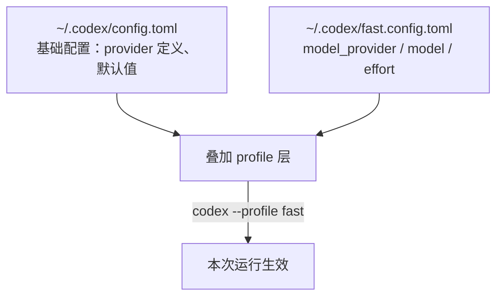

# Codex配置档案Profile

## 核心结论

- Codex **Profile（配置档案）**是一套具名的独立配置层，把"模型 + 推理强度 + 审批策略"等打包，`codex --profile <name>` 一键切换，不用每次编辑 `config.toml`。
- 较新版本实现改为**独立配置文件**：`$CODEX_HOME/<profile-name>.config.toml`（默认 `CODEX_HOME` 为 `~/.codex`），加载顺序为「基础 `~/.codex/config.toml` → 叠加 profile 文件」，profile 里只需写与基础配置不同的值。
- **旧式 `[profiles.<name>]` 表已废弃**：从旧配置迁移时应把每个档案拆成独立 `<name>.config.toml` 文件。
- 用 [[cc-switch]] 图形界面切换时通常不需要自己配 Profile（GUI 已覆盖多 provider 切换）。

## 配置层叠加图



## 要点拆解

### 基础配置：先定义多个 provider

```toml
[model_providers.provider_a]
name = "Provider A"
base_url = "https://api.provider-a.example/v1"
env_key = "PROVIDER_A_API_KEY"
wire_api = "responses"

[model_providers.provider_b]
name = "Provider B"
base_url = "https://api.provider-b.example/v1"
env_key = "PROVIDER_B_API_KEY"
wire_api = "responses"
```

### 每个 Profile 一个文件

`~/.codex/fast.config.toml`：

```toml
model_provider = "provider_a"
model = "provider-a-fast-model"
model_reasoning_effort = "medium"
```

`~/.codex/quality.config.toml`：

```toml
model_provider = "provider_b"
model = "provider-b-quality-model"
model_reasoning_effort = "high"
```

### 启动与使用

```bash
codex --profile fast
codex --profile quality
codex exec --profile quality "Review the current changes"   # 非交互模式
```

也可以让某个 profile 成为默认。Profile 名称可含字母、数字、连字符、下划线。

### 与其他机制的关系

- **与 CC Switch 的关系**：CC Switch 直接改写 `~/.codex/config.toml` 做 provider 切换，日常图形界面场景不必手配 Profile；Profile 更契合"手动管理多个原生 Responses provider + 按任务切换档位"；
- **与单次 CLI 覆盖的关系**：`codex --model`（专用 flag）与 `codex -c 'model_provider=...'`（通用键值覆盖，值按 TOML 解析）都在运行前覆盖，优先级高于 config.toml 与 profile；
- **可用 profile 覆盖的常见键**：model、model_provider、model_reasoning_effort、approval_policy、model_catalog_json 等。

## 相关页面

- [[Codex自定义模型Provider]]：Profile 文件里选中的对象（provider 定义）
- [[Codex模型映射与模型目录]]：profile 可覆盖的 model_catalog_json
- [[Codex接入第三方模型总览]]：三路线中的"手动档"
- [[CLAUDE记忆文件]] / [[LLM-Wiki框架]]：另一类 agent 配置层的设计思想

## 参考来源

- [[raw/articles/cc-switch-codex-第三方模型接入.md]]
- https://developers.openai.com/codex/config-advanced（摘引）