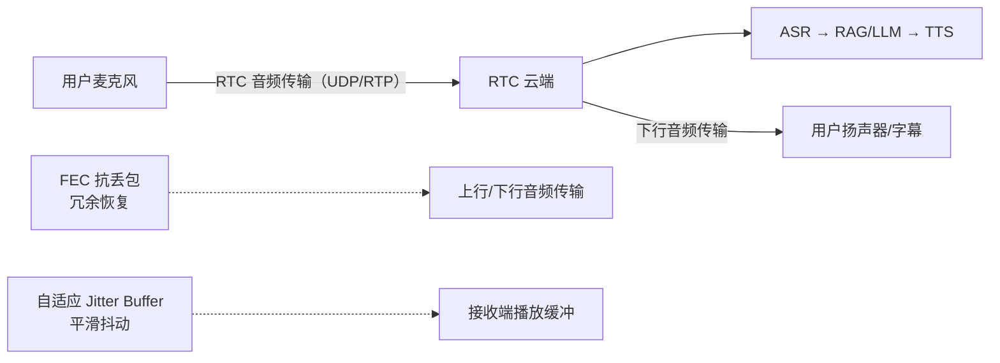

# FEC与自适应JitterBuffer

## 作用位置

## 核心结论
- 作用在 **RTC 音频传输层**（用户 ↔ RTC 云端），**不是 RAG/LLM**——RAG/TTFT 优化「智能」，FEC/Jitter Buffer 优化「通话体验」。
- **FEC 抗丢包**（包丢了用冗余恢复，不等待重传）；**自适应 Jitter Buffer 平滑抖动**（网络差时加大缓冲换稳定）。
- 接口管理：SDK 启用 + 弱网压测（~50% 丢包仍可通话）；**算法在 RTC 引擎，我方负责集成、参数选型、联调验证**——别说"从零实现 FEC"。

## 要点拆解

### FEC 前向纠错
- 实时语音走 UDP 类传输丢包常见；FEC 发送端除原始包外再发**冗余校验/恢复数据**，接收端丢了包**不用等重传**（重传对实时语音太晚），直接恢复。
- 类比：不只寄一封信，还寄「备份片段」，某一页丢了能拼回。
- 双向受益：用户上行（丢包少 ASR 更准）、AI 下行（TTS 更连贯）。

### 自适应 Jitter Buffer
- 网络抖动 = 包迟到、乱序；接收端先**攒一小段按顺序平滑播放**（像水箱：进水忽大忽小，出水稳定）。
- 自适应：网络好 → 缓冲开小（低延迟）；网络差 → 缓冲开大（多等几包换稳定，略增播放延迟）。

### FEC vs Jitter Buffer 分工
| | FEC | Jitter Buffer |
|--|-----|---------------|
| 主要解决 | 丢包（数据没了） | 抖动（数据晚了、乱了） |
| 手段 | 冗余恢复 | 缓冲 + 自适应播放 |

### 与 ARQ 重传区别
ARQ 等重传对实时语音太晚；FEC **前向恢复**更适合。缓冲开大会略增延迟，自适应在延迟与流畅间权衡。

### 联调职责口径
- 配置启用：火山 RTC SDK / 进房参数 / 音频场景（如 `RoomProfileType.chat`）开启弱网策略。
- 监控：`onNetworkQuality`、`onRemoteStreamStats` 看丢包率（`NetworkIndicator`）。
- 联调：弱网模拟（限速/丢包工具）压测验证听感；50% 丢包数据来自弱网损伤环境 + 主观听感 + 丢包率埋点。

## 相关页面
- [[TTFT首字延迟优化]]：答得快，与 FEC/Jitter 分属不同层级（传输层 vs 推理层）
- [[灵购AI]]：FEC/Jitter 在语音客服链路的定位（听得稳）
- [[RAG检索优化五层]]：答得准（检索层）
- [[商城AI业务矩阵]]：同属「听得稳」优化主线

## 参考来源
- [[贸易AI业务]]