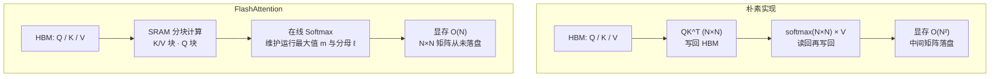

# FlashAttention算子优化

## 朴素实现与分块数据流

## 核心结论

FlashAttention 是 **IO 感知**的注意力计算优化：它**不直接减少 KV 缓存总量**，而是大幅降低注意力计算的**中间显存占用**并提升长序列计算效率。

核心思想是将 Q/K/V **分块计算**，利用 GPU 片上 **SRAM** 做中间结果累加，避免 $N \times N$ 的注意力分数矩阵写入 HBM；配合**在线 Softmax**（逐步维护运行最大值与分母），注意力显存从 $O(N^2)$ 降至 $O(N)$，且结果与朴素实现**精确等价**。

## 版本演进

| 版本 | 核心创新 | 相对基线加速 | 显存复杂度 |
|---|---|---|---|
| FlashAttention-1 | 分块计算 + 在线 Softmax | 2–4× | $O(N)$ |
| FlashAttention-2 | 优化并行与工作划分 | 约 2× over v1 | $O(N)$ |
| FlashAttention-3 | Hopper 架构适配 + FP8 | 1.5–2× over v2 | $O(N)$ |

衍生方案包括 **FlashDecoding**（优化解码阶段并行）、**FlashMLA**（适配低秩注意力架构）、块稀疏 FlashAttention 等，针对不同场景进一步提升计算效率。

## 边界

FlashAttention 已成为长上下文推理的**必开选项**，与 KV 缓存的所有优化技术**完全正交**——它治的是「算得慢、读得累」，不解决「存得多」。

## 相关页面

- [[KV Cache优化技术栈总览]]：算子计算层在五级栈中的位置
- [[自注意力机制]]：FlashAttention 所优化的注意力计算本体
- [[MLA低秩潜在注意力]]：FlashMLA 所适配的低秩架构
- [[Prefill与Decode两阶段]]：算子加速在两阶段中各自的着力点

## 参考来源

- [[raw/papers/KV Cache.md]]
