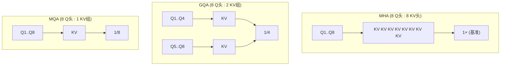

# GQA与MQA多头变体

## Q头与KV头共享结构

## 三类架构对比

| 架构 | KV 头数 | 压缩比例 | 核心思想 | 代表模型 | 质量损失 |
|---|---|---|---|---|---|
| MHA（多头注意力） | $H$（与 Q 头数相同） | $1\times$（基准） | 每个 Q 头对应独立 KV 头 | LLaMA-1 | 无 |
| GQA（分组查询注意力） | $G$（分组数） | $(H/G)\times$ | Q 头分组共享 KV 头 | LLaMA-2/3、Mistral、Qwen2 | 极小 |
| MQA（多查询注意力） | $1$ | $H\times$ | 所有 Q 头共享同一组 KV | PaLM、Falcon、Gemma 1 | 较明显 |

## 核心结论

改注意力结构减少 KV 头数，是从**模型层面降低 KV 缓存基数**（即显存式中的 $H_{\text{kv}}$ 因子），是长上下文模型的主流设计方向。

**GQA 具备完整的谱系连续性**：分组数 $G$ 等于 Q 头数 $H$ 时退化为标准 MHA，$G=1$ 时退化为 MQA。调 $G$ 即可在显存与模型质量之间做**连续平滑的权衡**，这是它比 MQA 更受欢迎的原因。

**GQA 是当前工业界主流折中**：以 LLaMA-2 70B 为例，采用 8 组 GQA 后 KV 缓存缩减为原 MHA 的 **1/8**，在几乎不损失效果的前提下大幅降低显存；LLaMA-3 8B 的 8 组 GQA 在 32K 上下文下 KV 仅约 4.3GB，为同规模 MHA 的 1/4。

> 与 [[KVCache低比特量化]] 不同：架构层优化需要重训练、但收益最大且与量化完全正交，二者可叠加。

## 相关页面

- [[多头注意力]]：MHA 的原始形态与头划分
- [[MLA低秩潜在注意力]]：架构层的另一条低秩压缩路线
- [[KV Cache]]：$H_{\text{kv}}$ 所决定的显存基数
- [[KVCache低比特量化]]：与结构优化正交的数据层方案
- [[KV Cache优化技术栈总览]]：模型架构层在五级栈中的位置

## 参考来源

- [[raw/papers/KV Cache.md]]
