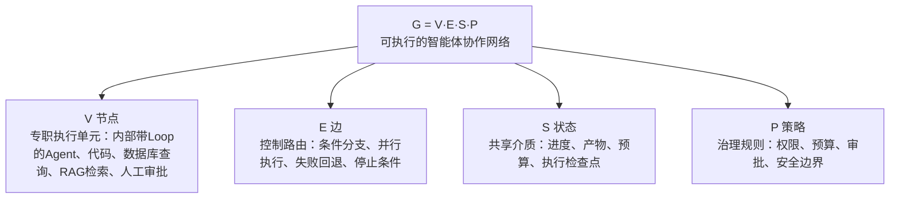
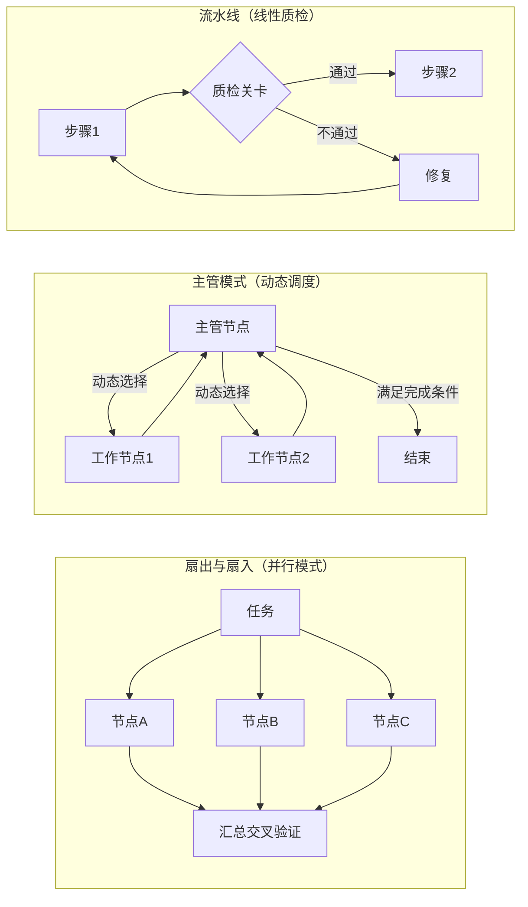

# Graph图编排架构

## 四要素结构图

## 核心结论

- 这里的 Graph **不是知识图谱**（重点不在实体和语义关系，而在系统怎样执行），**不是静态流程图**（不是只能观看的示意图，而是能够真实运行）。
- 它是**可执行协作网络**：组织智能体、工具、代码、状态和人工节点，做到**可观测 · 可恢复 · 可扩展**。
- 核心公式 $G = V \cdot E \cdot S \cdot P$；一句话：**用结构化的系统骨架，承载模型的灵活判断**。

## 要点拆解

### 四要素

| 要素 | 含义 | 内容 |
|------|------|------|
| **V 节点** | 专职执行单元 | 内部带 Loop 的 Agent、普通代码、数据库查询、RAG 检索，甚至人工审批节点 |
| **E 边** | 控制路由 | 任务流转规则：条件分支、并行执行、失败回退、停止条件 |
| **S 状态** | 共享介质 | 保存进度、产物、预算和执行检查点 |
| **P 策略** | 治理规则 | 定义权限、预算、审批和安全边界 |

### 三种常见拓扑

1. **扇出与扇入（并）**：多个节点并行搜索/执行，最后汇总交叉验证——任务可解耦、需扩大搜索范围
2. **主管模式（管）**：主管节点根据当前状态动态选择下一个执行节点——路线无法提前固定
3. **流水线（线）**：按固定步骤执行，关键位置设置质量关卡——步骤稳定、有明确质量标准

### 架构选型：根据任务特征选结构

> 核心原则：**先看任务长什么样，再决定使用什么结构。**

| 任务特征 | 适合方式 | 主要作用 |
|----------|----------|----------|
| 边界清晰、步骤固定 | 提示链 | 按照预设顺序稳定执行 |
| 输入类型差异明显 | 路由 | 先分类，再分发给专职节点 |
| 子任务能够解耦 | 并行化 | 扩大搜索和验证范围 |
| 任务路线无法预测 | 主管—工作者 | 运行时动态规划和调度 |
| 存在明确质量标准 | 评估—优化 | 根据独立反馈反复改进 |

## 相关页面

- [[Loop与Graph控制流演进]]：Graph 在五层演进中的位置
- [[LangGraph与Checkpointer工作流]]：四要素在 LangGraph 中的具体落地
- [[状态持久化四能力]]：S 状态要素的生产级能力展开
- [[共享状态驱动协作]]：节点间通过 S 协作的方式
- [[Loop与Graph选型对比]]：是否需要 Graph 的判断方法
- [[Agent生产落地实践]]：Graph 建成后的工程原则

## 参考来源

- [[raw/articles/Loop之后为什么是Graph.md]]
