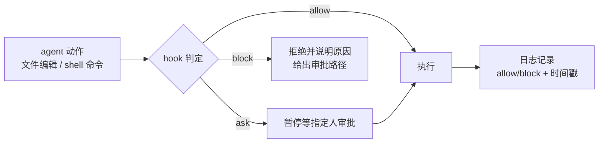

# Hooks护栏与审批门

## 控制的两种角色

## 核心结论
- Hook 在 agent 动作**之前**运行的确定性脚本，结果三选一：`allow`（放行）、`ask`（暂停等审批）、`block`（拒绝） [[The AI-Native SDLC playbook]]。
- 一个 [[Skills技能]] 是**建议性**控制，hook 是它背后的**确定性**层——政策必须必然成立（如禁止编辑受保护文件、生产部署需授权），用 hook 而非 skill 实现。
- build 阶段 hooks 做护栏，deploy 阶段 hooks 做审批门（approval gates）；hook 执行范围不限于部署，凡 agent 动作都按 matcher 触发。

## 要点拆解
- **build 护栏**：拦截对受保护路径的编辑（生成类、冻结包）；编辑后自动跑 formatter/linter 防漂移；阻止密钥进 diff。要求**快**、作用域限定在变更文件；重检查（完整测试）放到 commit/PR 层。
- **deploy 审批门**：把必须存活的人工审批 gate（变更管理签字、release 授权、受保护路径编辑）表达为 hook；审批 prompt 不放 build，避免把人员放回全部并行会话的关键路径上。
- **配置归属**：团队 hook 放 `.claude/settings.json`（入 git）；"不可商量"的 hook 放 platform/IT 管理的 **managed settings**，单个工程师无法关闭。
- **block 自解释**：拒绝时给出原因与合规路径，出现在 agent 输出里（示例 `exit 2` + 明确错误消息）。
- **门槛语义**：ask = 直到指定人批准才继续；allow/block 决策带时间戳记录；gate 同时定义"什么算批准"（批准的 change ticket 或 release manager 签核）。

## 相关页面
- [[Skills技能]]：建议性控制与确定性 hook 的分工
- [[AI代码评审]]：评审 findings 与 hook 门禁的组成
- [[并行会话与子代理]]：并行会话下 hook 从配置强制所有会话
- [[AI-native-SDLC]]：脚手架在六阶段中的位置

## 参考来源
- [[The AI-Native SDLC playbook]]