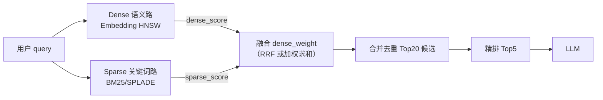

# Hybrid混合检索

## 融合流程



## 核心结论
- 商城检索的加法：纯 Dense 语义相近易混（Mavic/Mini、Care 条款 vs 售前文案），纯 Sparse 口语改写易漏（ASR 语音问法）；**两路并行 + 融合**互补。
- **`dense_weight` 是召回融合或轻量 rerank 时"稠密分 vs 稀疏分"的权重系数**，发生在**粗召回之后、精排之前**。
- 精排阶段**一般不再算向量**：Cross-Encoder 对原文打分，轻量 rerank 复用召回的 dense/sparse 分数调权——**不是** Top5 反馈后再重新召回。

## 要点拆解

### 稠密 vs 稀疏
| 类型 | 来源 | 擅长 | 商城例子 |
|------|------|------|----------|
| 稠密 Dense | text-embedding-v3 | 口语、同义改写 | 「御3随心换怎么搞」≈ Mavic 3 Care |
| 稀疏 Sparse | BM25 / SPLADE | 精确词匹配 | 「Mavic 3」「SN码」「BV001」 |

### dense_weight 调参
```
融合分 = dense_weight × 稠密归一化分 + (1 - dense_weight) × 稀疏归一化分
```
| dense_weight | 场景 |
|--------------|------|
| 0.7~0.8 | 口语选购、泛咨询（偏语义） |
| 0.4~0.5 | 查 SN、配件型号、Care 条款编号（偏关键词） |

### 在线 vs 离线（防说错）
- **在线**（每一通电话）：ASR 文本 → 判断 query 类型 → **选预设 weight，只召回一次** → Rerank Top5 → LLM；**不循环重召回**。
- **离线**（项目迭代）：标注 query 集 → 试 0.5/0.6/0.7/0.8 → 看 Hit@5、MRR、检索 P95 → 固化「query 类型 → weight」映射表上线。
- 面试一句话：在线是「召回前按 query 类型选 weight、只召回一次」；「反复调」是**离线评测调参**。

### 精排为什么不用向量
| 阶段 | 是否计算稠密/稀疏向量 | 做什么 |
|------|-----------------------|--------|
| 粗召回 Hybrid | ✅ | Dense 路 + Sparse 路各自检索 |
| 召回融合 | ❌ | 用 dense_weight 合并两路**分数** |
| Cross-Encoder 精排 | ❌ | 输入 `(query, doc)` 原文联合编码打分 |
| 轻量 base-rerank | ❌ 一般不重新算 | 对召回已有分数加权融合 |

## 相关页面
- [[RAG检索优化五层]]：Hybrid 叠加在五层主路径上，不替代 HNSW/Int8/元数据
- [[灵购AI]]：在线 dense_weight 选择落地到语音客服回调
- [[ModelForge-AI]]：dense_weight 离线调参与检索服务共建

## 参考来源
- [[贸易AI业务]]