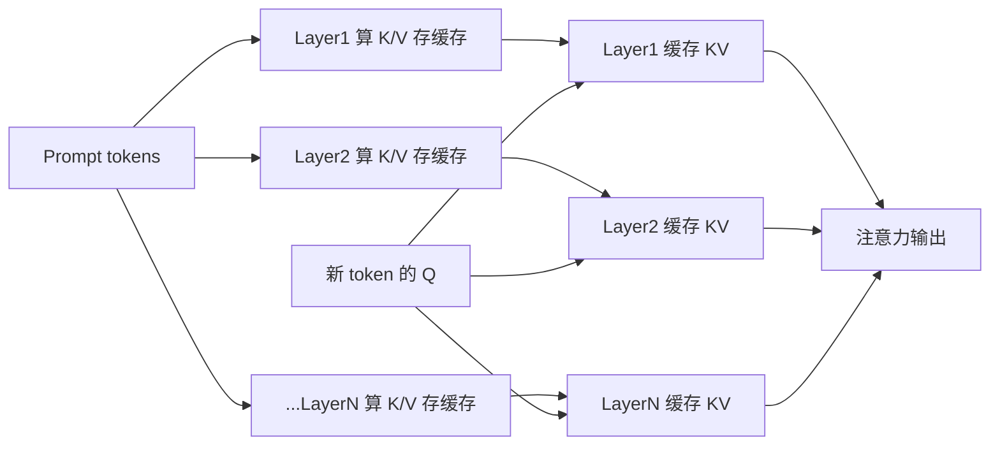

# KV Cache

## 核心结论

自回归生成过程中，每产生一个新 token 都要与全部历史 token 执行注意力运算；为避免对历史 Key/Value 的重复计算，系统将历史 token 的 Key 与 Value 缓存起来，此即 KV Cache。它是**流式 decode 的标配**，但显存占用随序列长度**线性增长**，构成 [[显存墙]] 的直接成因。

## 工作机制

每层各缓存一份 K 与 V，解码第 t 步只需把新 token 的 Q 与缓存中的全部 K/V 做注意力，历史 K/V 不再重算。

## 显存占用

$$\text{KV 大小} \approx 2 \times \text{层数} \times \text{序列长度} \times \text{隐藏维度} \times \text{精度字节数}$$

以 LLaMA-2 70B（80 层、隐藏维度 8192、FP16）为例：32k 上下文约 80GB，128k 约 320GB，已超出单卡 HBM 容量。

## 与相邻缓存机制区分

| 机制 | 复用范围 | 主要收益 |
|------|----------|----------|
| KV Cache | **单请求内** | 省去历史 K/V 重算，支撑流式解码 |
| 前缀缓存 | **跨请求** | 复用相同前缀的 KV，降低 prefill 开销 |
| PagedAttention | 单请求内 | 分页管理消除显存碎片，提升利用率 |

三者正交：前缀缓存与 PagedAttention 均不扩展显存总容量，只有 [[KV Cache分级存储]] 直接扩容。

## 相关页面

- [[显存墙]]：KV Cache 线性增长撞上的容量上限
- [[KV Cache分级存储]]：把 KV 摊到多级存储的解法
- [[前缀缓存与PagedAttention]]：相邻机制的能力边界
- [[TTFT首字延迟优化]]：KV Cache 在延迟优化主线中的位置
- [[自注意力机制]]：KV Cache 所加速的注意力计算

## 参考来源

- [[raw/papers/KV Cache分级存储.md]]